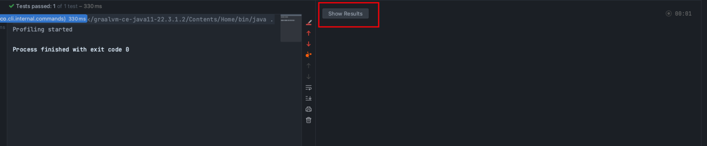

# Idea编辑器内性能提示

IntelliJ IDEA已经出了最新版的2023.2，最耀眼的功能无法两个

- AI Assistant
- 编辑器内性能提示

AI Assistant 已经尝试过了是限定功能，因为是基于open ai,所以限定的意思是国内无法使用，今天我们主要介绍是编辑器内性能提示

IntelliJ Profiler功能很早就已经有了，他的主要功能是分析代码性能，不需要安装插件，是IntelliJ的内置功能，但是一般人用的比较少，因为结果不是特别方便看（如下图），但是有了编辑器内性能提示后，相信大家一定会用起来，它支持单测和服务，能让我们快速定位语句性能，在自测阶段发现问题。

# 使用

在运行的后面有三个点，点开会有一个IntellJ Profiler的按钮，点击运行，它就会在运行期间采集我们程序运行期间的cpu内存等，运行结果如下：

因为是单测，所需采集会自动开始和停止，如果是服务运行，则需要我们手动停止采集

有了上面的结果后，我们就能非常方便的使用编辑器内性能提示了

我们可以多个维度的去看代码的性能问题

如上图所示，我们一个对象需要一百多兆，数据量还是比较庞大

我们再看看cpu,如下图所示，超过100ms，idea会给我们打个标签

耗时分为cpu耗时和总耗时，有了这样的神器，我们就能将性能问题扼杀在摇篮，小伙伴们赶紧使用起来吧。

# 来源
- [intellij 编辑器内性能提示](https://blog.csdn.net/tushuping/article/details/131979028)
- [轻松分析Java 应用程序](https://www.jetbrains.com/zh-cn/pages/intellij-idea-profiler/)