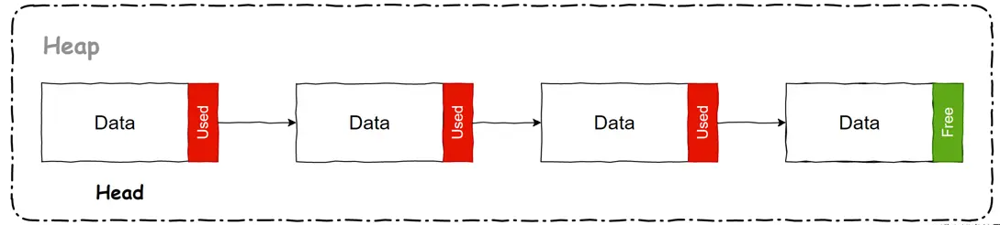

# JAVA服务内存占用太高且只增不减

## 场景

某天，运维老哥突然找我

> 运维：“你们的某 JAVA 服务内存占用太高，告警了！GC 后也没释放，内存只增不减，是不是内存泄漏了！”

然后我赶紧看了下监控，一切正常，距离上次发版好几天了，FULL GC 一次没有，YoungGC，十分钟一次，堆空闲也很充足。

> 运维：“你们这个服务现在堆内存 used 才 800M，但这个 JAVA 进程已经占了 6G 内存了，是不是你们程序出啥内存泄露的 bug 了！”
我想都没想，直接回了一句：“不可能，我们服务非常稳定，不会有这种问题！”

不过说完之后，内心还是自我质疑了一下：会不会真有什么bug？难道是堆外泄露？线程没销毁？导致内存泄露了？？？

然后我很“镇定”的补了一句：“我先上服务器看看啥情况”，被打脸可就不好了，还是不要装太满的好。然后迅速上登上服务器又仔细的查看了各种指标，Heap/GC/Thread/Process 之类的，发现一切正常，并没有什么“泄漏”的迹象。

> 我：“我们这个服务很正常啊，各个指标都ok，什么内存只增不减，在哪呢？”

> 运维：你看你们这个 JAVA 服务，堆现在 used 才 400MB，但这个进程现在内存占用都 6G 了，还说没问题？肯定是内存泄露了，锅接好，赶紧回去查问题吧

然后我指着监控信息，让运维看：“大哥你看这监控历史，堆内存是达到过 6G 的，只是后面 GC 了，没问题啊！”

> 运维：“回收了你这内存也没释放啊，你看这个进程 Res 还是 6G，肯定有问题啊”

我心想这运维怕不是个der，JVM GC 回收和进程内存又不是一回事，不过还是和得他解释一下，不然一直baba个没完

> 我：“JVM 的垃圾回收，只是一个逻辑上的回收，回收的只是 JVM 申请的那一块逻辑堆区域，将数据标记为空闲之类的操作，不是调用 free 将内存归还给操作系统”

运维顿了两秒后，突然脸色一转，开始笑起来：“咳咳，我可能没注意这个。你再给我讲讲 JVM 的这个内存管理/回收和进程上内存的关系呗”

虽然我内心是拒绝的，但得罪谁也不能得罪运维啊，想想还是给大哥解释解释，“增进下感情”

## 操作系统与JVM的内存分配

JVM 的自动内存管理，其实只是先向操作系统申请了一大块内存，然后自己在这块已申请的内存区域中进行“自动内存管理”。JAVA 中的对象在创建前，会先从这块申请的一大块内存中划分出一部分来给这个对象使用，`在 GC 时也只是这个对象所处的内存区域数据清空，标记为空闲而已`。
- JVM会多次向系统申请内存，直到达到JVM配置的最大内存限制。JVM的内存管理是通过堆内存和非堆内存来进行的，堆内存用于存储对象实例，非堆内存用于存储类元数据、JIT编译后的代码等。
- JVM启动时会根据配置的初始堆内存大小（-Xms）和最大堆内存大小（-Xmx）来分配内存。随着应用程序的运行，JVM会根据需要动态地增加堆内存，直到达到配置的最大堆内存限制。
- 以下是一些常用的JVM内存参数： 
  - -Xms：设置初始堆内存大小。
  - -Xmx：设置最大堆内存大小。
  - -XX:MetaspaceSize：设置初始元空间大小（用于存储类元数据）。
  - -XX:MaxMetaspaceSize：设置最大元空间大小。

那么，`JVM 会不会将 GC 回收后的空闲内存还给操作系统呢？`----根据垃圾回收器的不同，既有可能归还，也有可能不归还。而且`不同垃圾回收器的内存分配算法不同，归还内存的代价也不同`

### 为什么不把内存归还给操作系统？

JVM 还是会归还内存给操作系统的，只是因为这个代价比较大，所以不会轻易进行。

比如在清除算法（sweep）中，是通过空闲链表（free-list）算法来分配内存的。简单的说就是将已申请的大块内存区域分为 N 个小区域，将这些区域同链表的结构组织起来，就像这样：



每个 data 区域可以容纳 N 个对象，那么当一次 GC 后，某些对象会被回收，可是此时这个 data 区域中还有其他存活的对象，如果想将整个 data 区域释放那是肯定不行的。

所以这个归还内存给操作系统的操作并没有那么简单，执行起来代价过高，JVM 自然不会在每次 GC 后都进行内存的归还。

### 怎么归还？

虽然代价高，但 JVM 还是提供了这个归还内存的功能。JVM 提供了`-XX:MinHeapFreeRatio`和`-XX:MaxHeapFreeRatio` 两个参数，用于配置这个归还策略。

- MinHeapFreeRatio 代表当空闲区域大小下降到该值时，会进行扩容，扩容的上限为 Xmx
- MaxHeapFreeRatio 代表当空闲区域超过该值时，会进行“缩容”，缩容的下限为Xms

不过虽然有这个归还的功能，不过因为这个代价比较昂贵，所以 JVM 在归还的时候，是线性递增归还的，并不是一次全部归还。

`但是但是但是，经过实测，这个归还内存的机制，在不同的垃圾回收器，甚至不同的 JDK 版本中还不一样`！

### 不同版本&垃圾回收器下的表现不同

下面是我之前跑过的测试结果：

```java
public static void main(String[] args) throws IOException, InterruptedException {
    List<Object> dataList = new ArrayList<>();
    for (int i = 0; i < 25; i++) {
        byte[] data = createData(1024 * 1024 * 40);// 40 MB
        dataList.add(data);
    }
    Thread.sleep(10000);
    dataList = null; // 待会 GC 直接回收
    for (int i = 0; i < 100; i++) {
        // 测试多次 GC
        System.gc();
        Thread.sleep(1000);
    }
    System.in.read();
}
public static byte[] createData(int size){
    byte[] data = new byte[size];
    for (int i = 0; i < size; i++) {
        data[i] = Byte.MAX_VALUE;
    }
    return data;
}
```

| JAVA 版本 | 垃圾回收器                              | VM Options                                                                       | 是否可以“归还” |
| --------- | --------------------------------------- | -------------------------------------------------------------------------------- | -------------- |
| JAVA 8    | UseParallelGC(ParallerGC + ParallerOld) | -Xms100M -Xmx2G -XX:MaxHeapFreeRatio=40                                          | 否             |
| JAVA 8    | CMS+ParNew                              | -Xms100M -Xmx2G -XX:MaxHeapFreeRatio=40 -XX:+UseConcMarkSweepGC -XX:+UseParNewGC | 是             |
| JAVA 8    | UseG1GC(G1)                             | -Xms100M -Xmx2G -XX:MaxHeapFreeRatio=40 -XX:+UseG1GC                             | 是             |
| JAVA 11   | UseG1GC(G1)                             | -Xms100M -Xmx2G -XX:MaxHeapFreeRatio=40                                          | 是             |
| JAVA 16   | UseZGC(ZGC)                             | -Xms100M -Xmx2G -XX:MaxHeapFreeRatio=40 -XX:+UseZGC                              | 否             |

测试结果刷新了我的认知。，MaxHeapFreeRatio 这个参数好像并没有什么用，无论我是配置40，还是配置90，回收的比例都有和实际的结果都有很大差距。

但是文档中，可不是这么说的……

而且 ZGC 的结果也是挺意外的，JEP 351 提到了 ZGC 会将未使用的内存释放，但测试结果里并没有。

除了以上测试结果，[stackoverflow 上还有一些其他的说法](https://stackoverflow.com/questions/30458195/does-gc-release-back-memory-to-os)，我就没有再一一测试了

- JAVA 9 后-XX:-ShrinkHeapInSteps参数，可以让 JVM 已非线性递增的方式归还内存
- JAVA 12 后的 G1，再应用空闲时，可以自动的归还内存

所以，官方文档的说法，也只能当作一个参考，JVM 并没有过多的透露这个实现细节。

不过这个是否归还的机制，除了这位“热情”的运维老哥，一般人也不太会去关心，巴不得 JVM 多用点内存，少 GC 几回……

而且`别说空闲自动归还了，我们希望的是一启动就分配个最大内存，避免它运行中扩容影响服务；所以一般 JAVA 程序还会将 Xms和Xmx配置为相等的大小，避免这个扩容的操作`。

听到这里，运维老哥若有所思的说到：“那是不是只要我把 Xms 和 Xmx 配置成一样的大小，这个 JAVA 进程一启动就会占用这个大小的内存呢？”
我接着答到：“不会的，哪怕你 Xms6G，启动也只会占用实际写入的内存，大概率达不到 6G，这里还涉及一个操作系统内存分配的小知识”

### Xms6G，为什么启动之后 used 才 200M？

进程在申请内存时，并不是直接分配物理内存的，而是分配一块虚拟空间，到真正堆这块虚拟空间写入数据时才会通过缺页异常（Page Fault）处理机制分配物理内存，也就是我们看到的进程 Res 指标。

可以简单的认为`操作系统的内存分配是“惰性”的，分配并不会发生实际的占用，有数据写入时才会发生内存占用，影响 Res`。

所以，哪怕配置了Xms6G，启动后也不会直接占用 6G 内存，只是 JVM 在启动后会 malloc 6G 而已，但实际占用的内存取决于你有没有往这 6G 内存区域中写数据的。


# 来源

- [Does GC release back memory to OS?](https://stackoverflow.com/questions/30458195/does-gc-release-back-memory-to-os)
- [Java Platform, Standard Edition HotSpot Virtual Machine Garbage Collection Tuning Guide](https://docs.oracle.com/javase/10/gctuning/factors-affecting-garbage-collection-performance.htm#JSGCT-GUID-189AD425-F9A0-444A-AC89-C967E742B25C)
- 《深入理解Java虚拟机：JVM高级特性与最佳实践（第2版）》 - 周志明 著
- [运维：你们 JAVA 服务内存占用太高，还只增不减！告警了，快来接锅](https://segmentfault.com/a/1190000040050819)