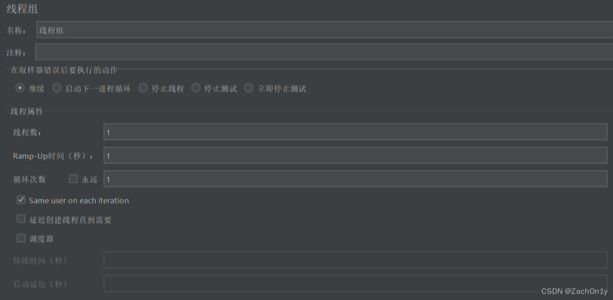
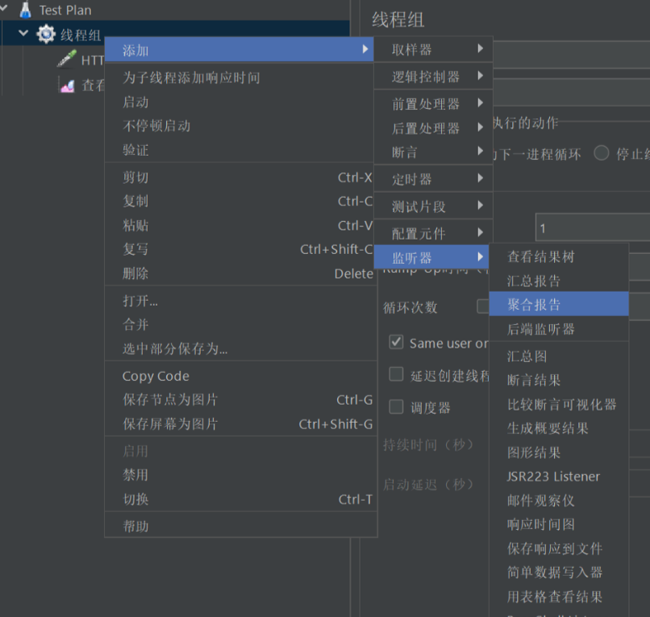
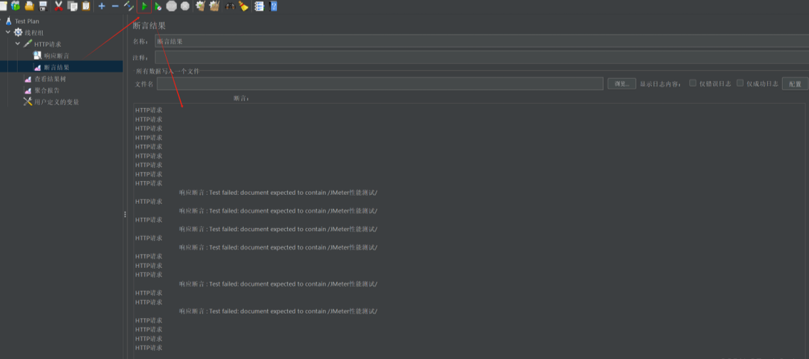

# JMeter的基本使用与性能测试

# Jmeter 的简介

JMeter是一个纯Java编写的开源软件，主要用于进行性能测试和功能测试。它支持测试的应用/服务/协议包括Web (HTTP, HTTPS)、SOAP/REST Webservices、FTP、Database via JDBC等。我们最常使用的是HTTP和HTTPS协议。

# Jmeter主要组件

- 线程组（Thread Group）：
  - 线程数（Number of Threads）：模拟的用户数量。
  - Ramp-Up时间（Ramp-Up Period）：达到指定线程数所需要的时间。例如，线程数为100，Ramp-Up时间为5秒，则每秒启动20个线程。
  - 循环次数（Loop Count）：测试循环的次数。

- 取样器（Sampler）：
  - 用于向服务器发送请求，如HTTP请求、JDBC请求等。
  - 在线程组下添加取样器，配置请求的URL、方法、参数等。

- 逻辑控制器（Logical Controller）：
  - 用于控制测试的执行逻辑，如循环、条件判断等。
  - 常见的逻辑控制器有If控制器、循环控制器等。

- 前置处理器（PreProcessor）和后置处理器（PostProcessor）：
  - 前置处理器在请求发送前执行操作，如设置请求头、生成数据等。
  - 后置处理器在请求发送后执行操作，如处理响应数据、提取需要的值等。

- 断言（Assertion）：
  - 用于验证响应是否符合预期。
  - 可以使用正则表达式、XPath、JSON Path等方式进行断言。

- 监听器（Listener）：
  - 用于展示测试结果，如查看结果树、聚合报告等。
  - 在测试计划或线程组下添加监听器，以查看和分析测试结果。

# Jmeter高级功能

- 参数化：
  - 使用CSV Data Set Config等方式实现参数化，方便进行批量测试。
  - 在测试计划中配置CSV文件路径和变量名，然后在取样器中使用这些变量。

- 定时器（Timer）：
  - 用于控制请求的发送频率。
  - 在线程组或取样器下添加定时器，配置延迟时间和执行时间等参数。

- 分布式测试：
  - 通过配置多个Jmeter实例，实现分布式测试，提高测试效率。
  - 需要设置主节点和从节点，以及配置相关的测试计划和数据文件等。

# 使用

## Jemter 切换中文环境

在上方导航栏，选择 Options -> Choose Language -> Chinese(Simplified)，将语言切换为中文

## Jmeter 常用按钮

## JMeter脚本编写

首先介绍Jemter基本使用，这里以一个 www.baidu.com 为例，来进行基本脚本编写。

### 添加线程组

右键点击“Test Plan” -> 添加 -> 线程（用户） -> 线程组，可添加测试需要的线程组

线程组可配置线程组名称、注释、线程数、Ramp-up时间、循环次数、调度器等参数

参数解释：

- 线程数：虚拟用户数。一个虚拟用户占用一个进程或线程。设置多少虚拟用户数就是设置多少个线程数。
- Ramp-Up Period(in seconds)准备时长：设置的虚拟用户数需要多长时间全部启动。如果线程数为5，准备时长为1，那么需要1秒钟启动5个线程，也就是每秒钟启动5个线程。
- 循环次数：每个线程发送请求的次数。如果线程数为100，循环次数为10，那么每个线程发送10次请求。总请求数为100*10=1000 。若勾选“永远”，则所有线程会一直发送请求，直到选择停止运行脚本。
- Same user on each iteration：用于控制每次迭代是否使用相同的线程（即用户）。当该参数被勾选时，JMeter在每次迭代时都会使用相同的线程来模拟用户行为。在连续的请求中，会保持相同的用户身份（如会话、Cookie等）。
- 调度器：设置线程组启动的开始时间和结束时间(配置调度器时，需勾选循环次数为永远)
  - 启动延迟（秒）：测试延迟的启动时间
  - 持续时间（秒）：测试持续的时间

### 添加 HTTP 请求

JMeter的HTTP请求是性能测试中常用的功能，用于模拟用户向服务器发送HTTP请求并获取响应。

右键点击线程组 -> 添加 -> 取样器 -> HTTP请求，添加一个HTTP请求

对网址 http://www.baidu.com/s?ie=utf-8&wd=jmeter 进行性能测试，参考下图进行配置

参数解释：

- Web服务器
  - 协议：向目标服务器发送HTTP请求协议，可以是HTTP或HTTPS，默认为HTTP
  - 服务器名称或IP ：HTTP请求发送的目标服务器名称或IP
  - 端口号：目标服务器的端口号，默认值为80

- Http请求
  - 方法：发送HTTP请求的方法，可用方法包括GET、POST、HEAD、PUT、DELETE等。
  - 路径：目标URL路径（URL中去掉服务器地址、端口及参数后剩余部分）
  - 内容编码：编码方式，默认为ISO-8859-1编码，这里配置为utf-8

- 同请求一起发送参数 ：在请求中发送的URL参数，可以将URL中所有参数设置在本表中，表中每行为一个参数（对应URL中的 name=value），参数传入中文时需要勾选“编码”

### 添加查看结果树

JMeter 的结果查看树用于查看和分析HTTP请求的响应结果。

右键点击线程组 -> 添加 -> 监听器 -> 查看结果树，添加一个查看结果树

将查找下方的响应数据格式改为 HTML Source Formatted，点击上方的绿色三角按钮，运行http请求

运行结果如下：

取样器结果

本次搜索返回结果页面标题为“JMeter性能测试_百度搜索”，与之前设置的发送参数相吻合。

### 添加聚合报告

聚合报告是JMeter中用于汇总和分析测试结果的工具。它提供了关于测试运行的各种性能指标，如响应时间、吞吐量、错误率等。

右键点击 线程组 -> 添加 -> 监听器 -> 聚合报告，用以存放性能测试报告

### 添加用户自定义变量

用户自定义变量作为存储和管理测试期间需要的值，这些变量可以在测试计划中的任何地方引用。

右键点击 线程组 -> 添加 -> 配置元件 -> 用户定义的变量，以添加用户自定义变量

添加一个参数 wd，用于存放搜索词

在HTTP请求中使用该参数，格式为 `${变量名称}`，即 `${wd}`

### 添加断言

JMeter中，断言用于验证测试结果是否符合预期。

在HTTP请求中添加响应断言：右键点击 HTTP请求 -> 添加 -> 断言 -> 响应断言

需要校验返回的文本中是否包含搜索词，添加参数 ${wd} 到要测试的模式中

### 添加断言结果

为查看断言的结果，在HTTP请求中添加断言结果：右键点击 HTTP请求 -> 添加 -> 监听器 -> 断言结果

点击上方的绿色三角形按钮，即可运行并查看断言运行结果。

## 执行性能测试

### 配置线程组

点击线程组，配置本次性能测试相关参数：线程数，Ramp-Up时间，循环次数等参数。

这里我们配置线程数为20，Ramp-Up时间为5秒，循环次数为1次。

### 执行测试

进入聚合报告，进行测试。测试之前需要点击上方的扫把按钮清楚之前的调试结果。

点击上方的绿色按钮，即可运行测试，性能测试执行完成后，可通过聚合报告看到测试结果。

一般情况下，性能测试中需要重点关注的数据有请求数、平均响应时间、最小响应时间、最大响应时间、吞吐量和错误率

- 参数说明：
  - Label：每个 JMeter 的元素（如 HTTP请求）都有一个 Name 属性，Label显示的就是 Name 属性的值
  - #样本：请求数，表示这次测试中一共发出了多少个请求。如模拟100个线程数（即100个用户），每个线程迭代10次，这里就显示100*10 = 1000
  - 平均值：平均响应时间，默认情况下是单个请求的平均响应时间。
  - 中位数：50％ 用户的响应时间
  - 90%/ 95%/ 99% 百分位：90%/ 95%/ 99% 用户的响应时间
  - 最小值：最小响应时间
  - 最大值：最大响应时间
  - 异常%：请求错误率，即错误请求数/请求总数
  - 吞吐量：——默认情况下表示每秒完成的请求数（Request per Second）
  - 接收KB/Sec：每秒从服务器端接收到的数据量
  - 发送KB/Sec：每秒发送到服务器端的数据量

以上，就是使用测试工具JMeter对Web应用程序进行性能测试的流程。

# 注意事项

- 关闭不必要的监听器：在测试过程中，如果不需要实时查看结果，可以关闭不必要的监听器，以减少资源消耗。
- 合理使用断言：过多的断言会增加测试的复杂性，应根据实际需求合理使用断言。
- 优化测试计划：在测试过程中，应不断优化测试计划，如调整线程数、循环次数等参数，以达到最佳的测试效果。
- 注意测试结果的分析：通过聚合报告等结果分析工具，对测试结果进行深入分析，找出潜在的性能问题。

# 来源

- [JMeter的基本使用与性能测试，完整入门篇保姆式教程](https://blog.csdn.net/Zachyy/article/details/139717444)