# VisualVM使用

## VisualVM是什么

VisualVM 是一款集成了 JDK 命令行工具和轻量级剖析功能的可视化工具。 设计用于开发和生产。

## 官网

https://visualvm.github.io/

（jdk1.8及之前的放在jdk的bin目录下，11以后需要自己去官网下载!!!,如果你要观测的linux上的jdk是11及以上，请您自己去官网下载，否则就算能连上也会出现很多问题）

## 我们看看有哪些监控指标

### 监控本地java项目

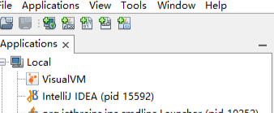

### 安装gc插件

为了我们方便我们观察gc的一些监控指标，我们安装一个gc插件

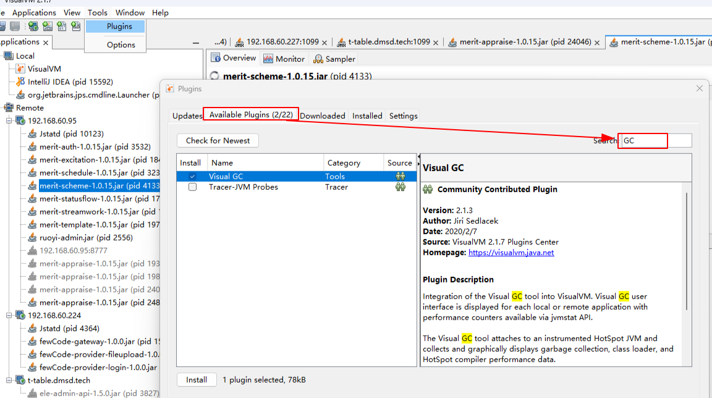

安装完后，可以实时监控堆内存使用情况


- eden区内存占用逐渐增多
- eden区垃圾回收
- eden区对象复制到幸存区
- 幸存区对象复制到老年代
- full gc
- ygc的统计数据
- fgc的统计数据

### 监控器

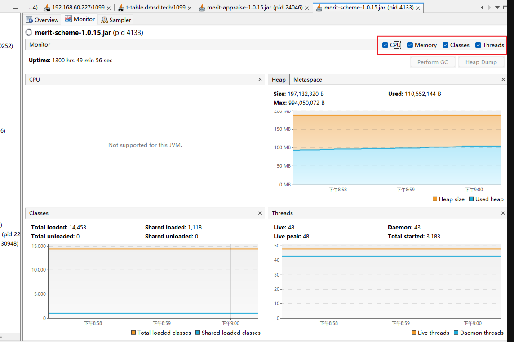

一键生成堆转储文件并解析并图形化展示

生成dump文件

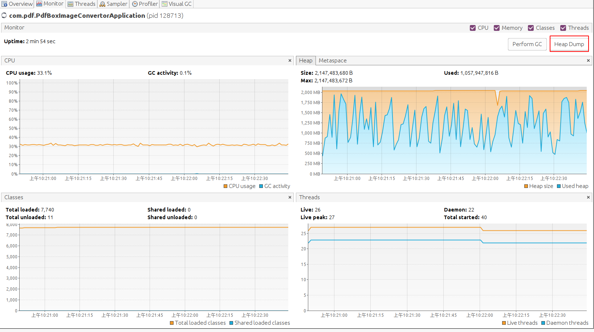

### 抽样器

抽样器和profiler，这两个差不多，用其中一个即可

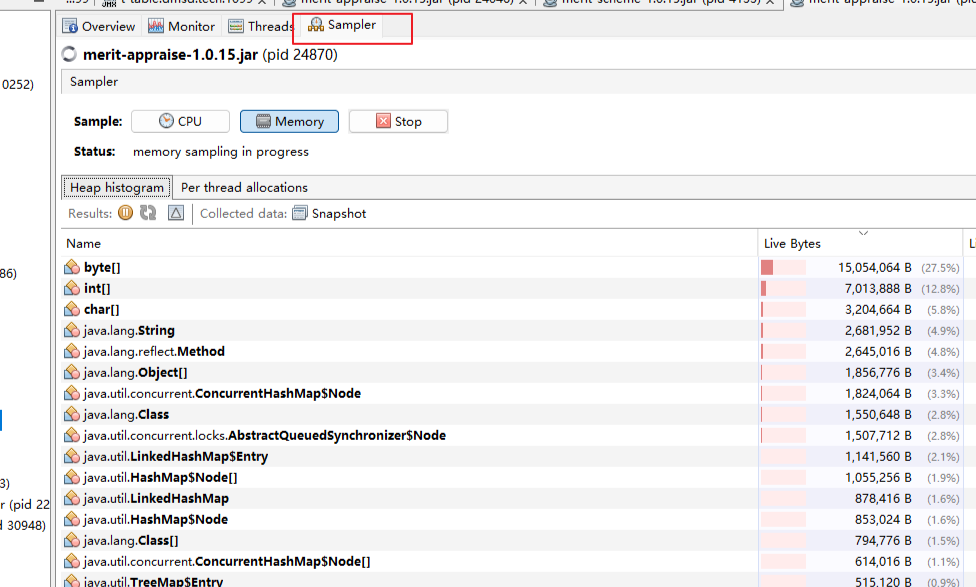

点击CPU，就可以看到各个类以及方法执行的时间，可以监控哪个类的方法执行时间较长，一眼就能定位到具体的异常方法。

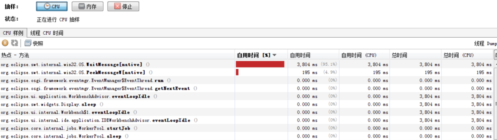

点击内存，也一样，很直观的就能找到哪个位置可能存在内存泄漏的情况。

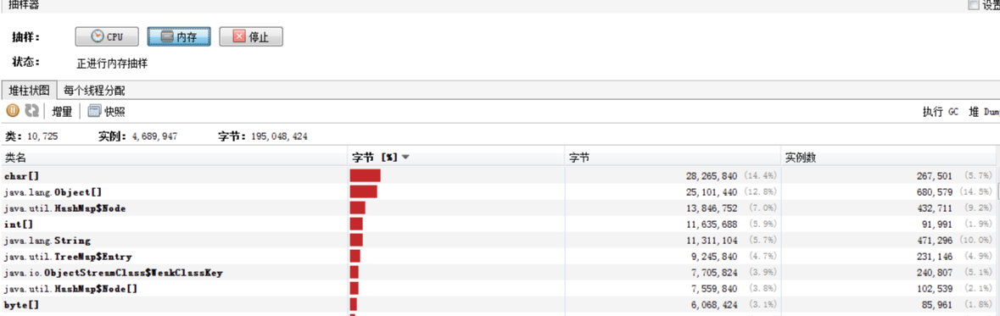

## Btrace动态跟踪

安装插件BTrace Workbench

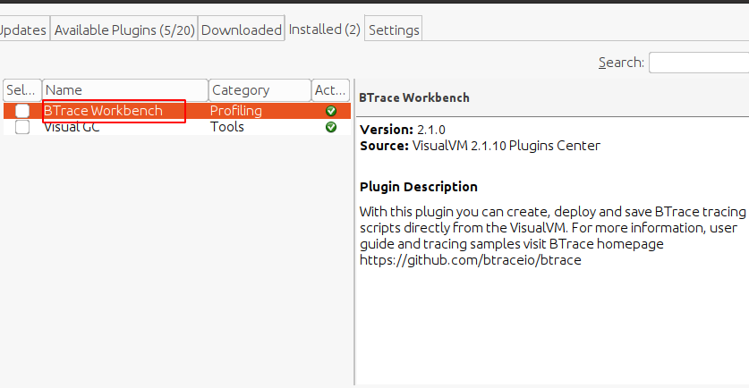

Btrace的作用是使在不停机的情况下，通过Hotspot虚拟机的Instrument功能动态的加入调试代码。可以跟踪指定的方法调用，构造函数以及系统内存等信息，我感觉主要的意义在于当程序出现问题时，排查错误的一些必要信息时 (譬如方法参数、返回值等)，在开发时并没有打印到日志之中以至于不得不停掉服务时，都可以通过调试增量来加入日志代码以解决问题。

可以说Btrace是检查和解决线上问题的大招，不用重启服务，通过脚本命令执行。

安装Btrace插件之后在对应的应用右键选择 Trace Application 就会进入对应的操作面板，一个代码输入的控制页面。

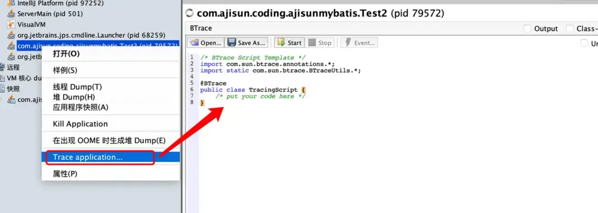

这个举个例子：已经上线的代码出现空指针，但是对应直接看不出具体原因，需要输出一些额外信息辅助判断，或者需要在日志中输出一些额外信息。

线上代码如下

```java
public class Test2 {
    public static int add(int a, int b) {
        return a + b;
    }
    public static void main(String[] args) throws InterruptedException {
        while (true){
            int a = (int) Math.round(Math.random() * 100);
            int b = (int) Math.round(Math.random() * 100);
            add(a,b);
            Thread.sleep(2000);
        }
    }
}
```

现在上面的代码已经在线上运行了，但是我现在需要知道a,b两个随机参数的具体值是什么，可以打开Btrace的代码界面，然后填充TracingScript即可，代码如下

```java
/* BTrace Script Template */
import com.sun.btrace.annotations.*;
import static com.sun.btrace.BTraceUtils.*;
​
@BTrace
public class TracingScript {
  /* put your code here */
@OnMethod(clazz="/.*Test2", // 监控以Test2结尾的类
           method="add",
           location=@Location(Kind.RETURN))
 public static void func(int a,int b, @Return int result){
   println("开始===============");
   jstack();
   println(strcat("方法参数A:",str(a)));
   println(strcat("方法参数B:",str(b)));
   println(strcat("方法结果:",str(result)));
  }
}
```

@OnMethod中参数的clazz需要控制的类，method是类中的方法，location中的Kind.RETURN是指方法结束后输出信息以及堆栈信息。想深入了解这三种参数的具体使用方法请自行百度：“Btrace Java”

然后点击Start按钮就会开始执行，看到控制台输出的信息，如图

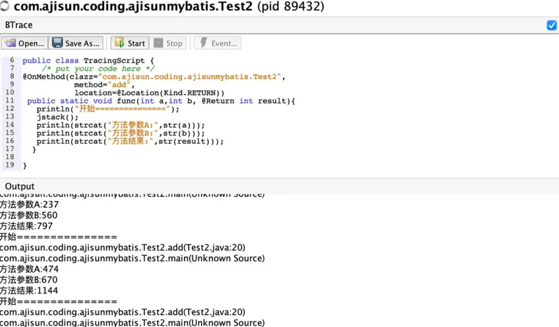

BTrace的用途很广泛，打印调用堆栈、参数、返回值只是它最基础的使用形式。还可以实现的功能包括监控指定函数的耗时，获取任意行代码信息，脚本定时，获取类的属性等。

在官网上有使用BTrace进行性能监视、定位连接泄漏、内存泄漏、解决多线程竞争问题等的使用案例，具体可以去网上了解相关信息。

## 远程java应用监控

（！！！！一定要记得开放端口号，注意防火墙哦，jstatd 的端口要求比较多）

大多时候我们需要监控的是线上的java应用，进行排查问题。所以了远程接入点

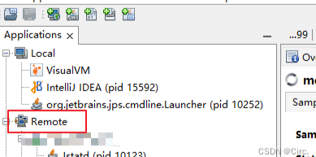

### 远程接入方式有两种

JMX（Java Management Extensions）和jstatd都是用于监控Java虚拟机（JVM）的工具，但它们在实现方式、功能特性和使用场景上存在一些显著的区别。

- JMX是一个为应用程序、设备、系统等植入管理功能的框架。它提供了丰富的API和工具，允许开发人员和运维人员轻松地监控和管理JVM的状态和资源使用情况。JMX可以跨越一系列异构操作系统平台、系统体系结构和网络传输协议，因此具有很高的灵活性和可扩展性。JMX的主要优势在于其强大的功能和良好的扩展性，能够满足各种复杂的监控需求。
- 相比之下，jstatd是一个RMI（Remote Method Invocation）服务器程序，主要用于监控本地所有JVM从创建开始直到销毁整个过程中的资源使用情况。jstatd提供了一个接口，使得监控工具（如VisualVM）能够远程连接到本机的JVM并获取相关信息。jstatd的主要特点是简单易用，只需在主机上运行一个jstatd进程，就可以监控该主机上的所有Java应用程序。然而，由于jstatd是通过RMI进行通信的，因此在某些情况下可能会受到网络防火墙或安全策略的限制。

总结来说，JMX和jstatd在监控Java虚拟机方面各有优势。JMX功能强大且灵活，适用于复杂的监控场景；而jstatd简单易用，适用于快速部署和监控的场景。在选择使用哪个工具时，需要根据具体的监控需求和环境进行权衡。

### JMX

这种方式的必须在应用启动的时候添加启动参数提供远程连接

```bash
java -Dcom.sun.management.jmxremote \
-Dcom.sun.management.jmxremote.port=8777 \
-Dcom.sun.management.jmxremote.local.only=true \
-Dcom.sun.management.jmxremote.authenticate=false \
-Dcom.sun.management.jmxremote.ssl=false \
-Dcom.sun.management.jmxremote.rmi.port=8777 \
-Djava.rmi.server.hostname=192.168.60.227   -jar  ele-admin-api-1.5.0.jar&
```

这样就可以通过远程ip+8777端口进行连接了（这个端口号可以任意指定，不冲突就好）

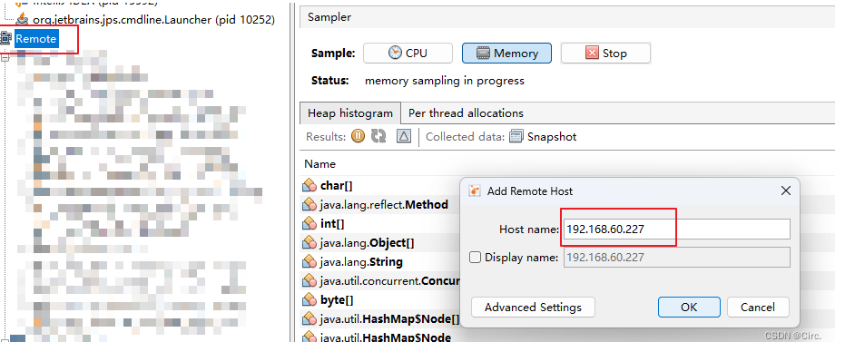

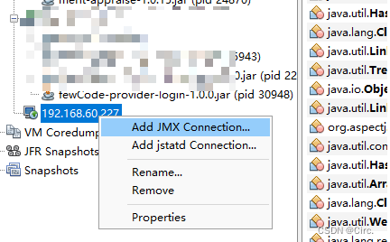

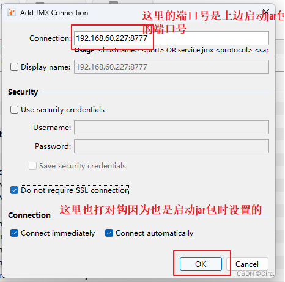

有的时候可能会反应慢些，效果如下，是不是你想要的。

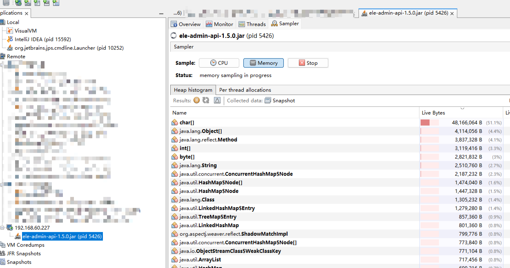

### jstatd

找到java安装home路径

```bash
echo $JAVA_HOME
```

在服务器{JAVA_HOME}/bin目录建立文件：jstatd.all.policy（名字随便，符合*.policy即可），键入文件内容为：

```
grant codebase "file:${java.home}/../lib/tools.jar" {
   permission java.security.AllPermission;
};
```

如果jdk版本大于1.8，文件内容为

```
grant codebase "jrt:/jdk.jstatd" {
   permission java.security.AllPermission;
};

grant codebase "jrt:/jdk.internal.jvmstat" {
   permission java.security.AllPermission;
};
```

启动jstatd

```bash
nohup jstatd -J-Djava.rmi.server.hostname=192.168.60.227 -J-Djava.security.policy=/home/admin/jstatd.all.policy -p 1099
```

查看jstatd端口

```
netstat -luntp|grep jstatd
```

这里会出现两个端口，一个默认的1099，还有一个随机端口。 如果是机器有限制，需要向运维身申请开通这两个端口的权限

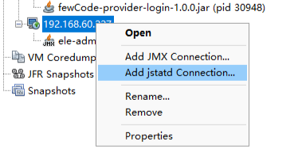

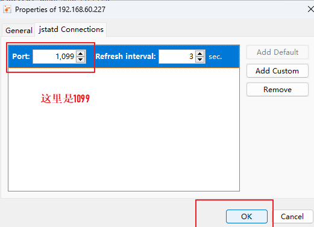

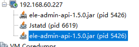

也可以观察到我们想要的东西。

# 参考

- [jvisualVM调优案例](https://blog.csdn.net/epitomizelu/article/details/118309286)
- [JVM虚拟机专题之图形化监控工具-VisualVM](https://segmentfault.com/a/1190000041802755)
- [jvisualvm保姆级教程](https://blog.csdn.net/weixin_45706856/article/details/136634971)

