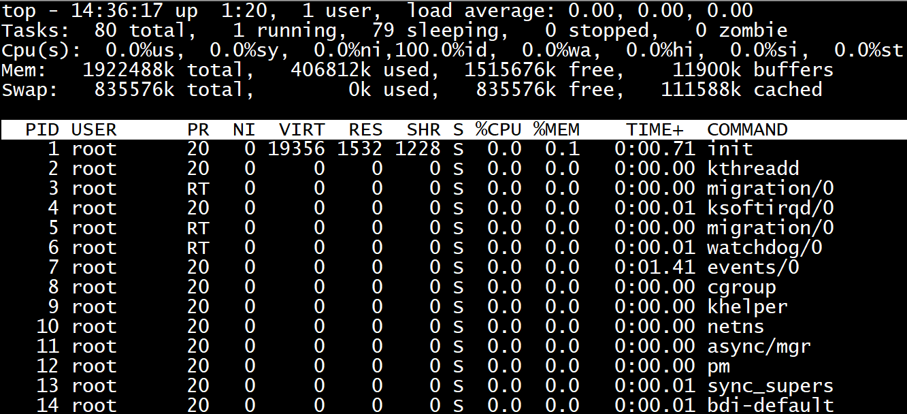

# linux top命令详解

top命令经常用来监控linux的系统状况，是常用的性能分析工具，能够实时（默认是3s刷新一次）显示系统中各个进程的资源占用情况。

## 常用命令组合

### 显示某个进程的信息

```bash
# -p 指定特定的pid进程号进行观察
top -p 223344
```

## 常用参数

top的使用方式 `top [-d number] | top [-bnp]`

| 参数      | 含义                                                             |
| --------- | ---------------------------------------------------------------- |
| -d number | number代表秒数，表示top命令显示的页面更新一次的间隔 (default=5s) |
| -b        | 以批次的方式执行top                                              |
| -n        | 与-b配合使用，表示需要进行几次top命令的输出结果                  |
| -p        | 指定特定的pid进程号进行观察                                      |

top命令显示的页面还可以输入以下按键执行相应的功能（注意大小写区分的）

| 参数 | 含义                                    |
| ---- | --------------------------------------- |
| ？   | 显示在top当中可以输入的命令             |
| P    | 以CPU的使用资源排序显示                 |
| M    | 以内存的使用资源排序显示                |
| N    | 以pid排序显示                           |
| T    | 由进程使用的时间累计排序显示            |
| k    | 给某一个pid一个信号,可以用来杀死进程(9) |
| r    | 给某个pid重新定制一个nice值（即优先级）  |
| q    | 退出top（用ctrl+c也可以退出top）        |

## top各输出参数含义



### 一、top前五条信息解释

top - 14:49:28 up 1:33, 1 user, load average: 0.00, 0.00, 0.00

| 内容                           | 含义                                                                                 |
| ------------------------------ | ------------------------------------------------------------------------------------ |
| 14:49:28                       | 表示当前时间                                                                         |
| up 1:33                        | 系统远行时间，格式为时：分                                                           |
| 1 user                         | 当前登陆用户数                                                                       |
| load average: 0.00, 0.00, 0.00 | 系统负载，即任务队列的平均长度。 三个数值分别为 1分钟、5分钟、15分钟前到现在的平均值 |


Tasks: 80 total, 2 running, 78 sleeping, 0 stopped, 0 zombie

| 内容            | 含义             |
| --------------- | ---------------- |
| Tasks: 80 total | 进程总数         |
| 2 running       | 正在运行的进程数 |
| 78 sleeping     | 睡眠的进程数     |
| 0 stopped       | 停止的进程数     |
| 0 zombie        | 僵尸进程数       |

Cpu(s): 0.0%us, 0.0%sy, 0.0%ni,100.0%id, 0.0%wa, 0.0%hi, 0.0%si, 0.0%st

| 内容     | 含义                                               |
| -------- | -------------------------------------------------- |
| 0.0%us   | 用户空间占用CPU百分比                              |
| 0.0%sy   | 内核空间占用CPU百分比                              |
| 0.0%ni   | 用户进程空间内改变过优先级的进程占用CPU百分比      |
| 100.0%id | 空闲CPU百分比                                      |
| 0.0%wa   | 等待输入输出的CPU时间百分比                        |
| 0.0%hi   | 硬中断（Hardware IRQ）占用CPU的百分比              |
| 0.0%si   | 软中断（Software Interrupts）占用CPU的百分比       |
| 0.0 st   | 用于有虚拟cpu的情况，用来指示被虚拟机偷掉的cpu时间 |

Mem: 1922488k total, 406936k used, 1515552k free, 11940k buffers

| 内容           | 含义                 |
| -------------- | -------------------- |
| 1922488k total | 物理内存总量         |
| 406936k used   | 使用的物理内存总量   |
| 1515552k free  | 空闲内存总量         |
| 11940k buffers | 用作内核缓存的内存量 |

Swap: 835576k total, 0k used, 835576k free, 111596k cached

| 内容           | 含义             |
| -------------- | ---------------- |
| 835576k total  | 交换区总量       |
| 0k used        | 使用的交换区总量 |
| 835576k free   | 空闲交换区总量   |
| 111596k cached | 缓冲的交换区总量 |

### 二、进程信息

| 列名    | 含义                                                                |
| ------- | ------------------------------------------------------------------- |
| PID     | 进程id                                                              |
| USER    | 进程所有者的用户名                                                  |
| PR      | 优先级                                                              |
| NI      | nice值。负值表示高优先级，正值表示低优先级                          |
| VIRT    | 进程使用的虚拟内存总量，单位kb。VIRT=SWAP+RES                       |
| RES     | 进程使用的、未被换出的物理内存大小（懒内存），单位kb。RES=CODE+DATA |
| SHR     | 共享内存大小，单位kb                                                |
| S       | 进程状态。D=不可中断的睡眠状态 R=运行 S=睡眠 T=跟踪/停止 Z=僵尸进程 |
| %CPU    | 上次更新到现在的CPU时间占用百分比                                   |
| %MEM    | 进程使用的物理内存百分比                                            |
| TIME+   | 进程使用的CPU时间总计，单位1/100秒                                  |
| COMMAND | 命令名/命令行                                                       |

## 实例

演示环境

```bash
# uname -a
Linux VM_1_11_centos 3.10.0-693.el7.x86_64 #1 SMP Tue Aug 22 21:09:27 UTC 2017 x86_64 x86_64 x86_64 GNU/Linux
```

```bash
top - 11:00:54 up 54 days, 23:35,  6 users,  load average: 16.32, 18.75, 21.04
Tasks: 209 total,   3 running, 205 sleeping,   0 stopped,   1 zombie
%Cpu(s): 29.7 us, 18.9 sy,  0.0 ni, 49.3 id,  1.7 wa,  0.0 hi,  0.4 si,  0.0 st
KiB Mem : 32781216 total,  1506220 free,  6525496 used, 24749500 buff/cache
KiB Swap:        0 total,        0 free,        0 used. 25607592 avail Mem 

  PID USER      PR  NI    VIRT    RES    SHR S  %CPU %MEM     TIME+ COMMAND                                                                                                                                                                  
23444 root      20   0   15.6g 461676   4704 R 198.0  1.4  11:15.26 python                                                                                                                                                                   
16729 root      20   0 9725596 240028   4672 R 113.0  0.7   7:48.49 python                                                                                                                                                                   
 3388 root      20   0 6878028 143196   4720 S  82.4  0.4   1:35.03 python
```

### 第一行

```bash
## 比如，top输出如下，若是一台8核的centos机器，证明系统是长期处于过载状态在运行
top - 11:00:54 up 54 days, 23:35,  6 users,  load average: 16.32, 18.75, 21.04
```
- 第一行数据相当于uptime命令输出。
- 11:00:54是当前时间
- up 54 days,23:55 是系统已经运行的时间
- 6 users表示当前有6个用户在登录
- load average：16.32，18.75，21.04分别表示系统一分钟平均负载，5分钟平均负载，15分钟平均负载
  - 平均负载表示的平均活跃进程数，包括正在running的进程数，准备running（就绪态）的进程数，和处于不可中断睡眠状态的进程数。
  - 如果平均负载数刚好等于CPU核数，那证明每个核都能得到很好的利用
  - 如果平均负载数大于核数证明系统处于过载的状态，通常认为是超过核数的70%认为是严重过载，需要关注。还需结合1分钟平均负载，5分钟平均负载，15分钟平均负载看负载的趋势，如果1分钟负载比较高，5分钟和15分钟的平均负载都比较低，则说明是瞬间升高，需要观察。如果三个值都很高则需要关注下是否某个进程在疯狂消耗CPU或者有频繁的IO操作，也有可能是系统运行的进程太多，频繁的进程切换导致。


查看CPU核数

```
总核数 = 物理CPU个数 X 每颗物理CPU的核数
总逻辑CPU数 = 物理CPU个数 X 每颗物理CPU的核数 X 超线程数

查看物理CPU个数
cat /proc/cpuinfo| grep "physical id"| sort| uniq| wc -l

查看每个物理CPU中core的个数(即核数)
cat /proc/cpuinfo| grep "cpu cores"| uniq

查看逻辑CPU的个数
cat /proc/cpuinfo| grep "processor"| wc -l

查看线程数
grep 'processor' /proc/cpuinfo | sort -u | wc -l    
注意，此处查看的线程数是总的线程数，可以理解为逻辑cpu的数量
```

### 第二行

```bash
Tasks: 214 total,   4 running, 209 sleeping,   0 stopped,   1 zombie
```

- 第二行的Tasks信息展示的系统运行的整体进程数量和状态信息。
- 214 total 表示系统现在一共有214个用户进程
- 4 running 表示4个进程正在处于running状态
- 209 sleeping表示209个进程正处于sleeping状态
- 0 stopped 表示 0 个进程正处于stopped状态
- 1 zombie表示 有1个僵尸进程
  - 僵尸进程：`子进程结束时父进程没有调用wait()/waitpid()等待子进程结束，那么就会产生僵尸进程`。
    - 原因是子进程结束时并没有真正退出，而是留下一个僵尸进程的数据结构在系统进程表中，等待父进程清理，如果父进程已经退出则会由init进程接替父进程进行处理（收尸）。
    - 由此可见，如果父进程不作为并且又不退出，就会有大量的僵尸进程，`每个僵尸进程会占用进程表的一个位置（slot），如果僵尸进程太多会导致系统无法创建新的进程，因为进程表的容量是有限的`。所以当zombie这个指标太大时需要引起我们的注意。下面的进程详细信息中的S列就代表进程的运行状态，Z表示该进程是僵尸进程。
  - 消灭僵尸进程的方法
    - 一、找到僵尸进程的父进程pid（pstress可以显示进程父子关系），kill -9 pid，父进程退出后init自动会清理僵尸进程。（需要注意的是kill -9并不能杀死僵尸进程）
    - 二、重启系统

### 第三行

```bash
%Cpu(s): 31.9 us, 30.3 sy,  0.0 ni, 37.0 id,  0.0 wa,  0.0 hi,  0.8 si,  0.0 st
```

- 第三行的%Cpu(s)表示的是总体CPU使用情况。
  - us user 表示用户态的CPU时间比例
  - sy system 表示内核态的CPU时间比例
  - ni nice 表示运行低优先级进程的CPU时间比例
  - id idle 表示空闲CPU时间比例
  - wa iowait 表示处于IO等待的CPU时间比例
  - hi hard interrupt 表示处理硬中断的CPU时间比例
  - si soft interrupt 表示处理软中断的CPU时间比例
  - st steal 表示当前系统运行在虚拟机中的时候，被其他虚拟机占用的CPU时间比例。
- 所以`整体的CPU使用率=1-id`
  - us很高时，证明CPU时间主要消耗在用户代码，需要优化用户代码
  - sy很高时，说明CPU时间都消耗在内核，要么是频繁的系统调用，要么是频繁的CPU切换（进程切换/线程切换）
  - wa很高时，说明有进程在进程频繁的IO操作，有可能是磁盘IO，也有可能是网络IO
  - si很高时，说明CPU时间消耗在处理软中断，网络收发包会触发系统软中断，所以大量的网络小包会导致软中断的频繁触发，典型的SYN Floor会导致si很高

### 第四行和第五行

```bash
KiB Mem : 32781216 total,   663440 free,  7354900 used, 24762876 buff/cache
KiB Swap:        0 total,        0 free,        0 used. 24771700 avail Mem
```

- 第4，5行显示的是系统内存使用情况
  - 单位是KiB
  - totol 表示总内存
  - free 表示没使用过的内容
  - used是已经使用的内存
  - buff表示用于读写磁盘缓存的内存
  - cache表示用于读写文件缓存的内存
  - avail表示可用的应用内存
- Swap原理是把一块磁盘空间或者一个本地文件当成内存来使用。
  - Swap total表示能用的swap总量
  - swap free表示剩余
  - used表示已经使用的
  - 这三个值都为0表示系统关闭了swap功能，由于演示环境是一台虚拟机，虚拟机一般都关闭swap功能。

### 第六行开始往后

表示的是具体的每个进程状态

```bash
PID USER      PR  NI    VIRT    RES    SHR S  %CPU %MEM     TIME+ COMMAND 
```

- PID 进程ID
- USER 进程所有者的用户名，例如root
- PR 进程调度优先级
- NI 进程nice值（优先级），越小的值代表越高的优先级
- VIRT 进程使用的虚拟内存
- RES 进程使用的物理内存（不包括共享内存）
- SHR 进程使用的共享内存
- CPU 进程使用的CPU占比
- MEM 进程使用的内存占比
- TIME 进程启动后到现在所用的全部CPU时间
- COMMAND 进程的启动命令（默认只显示二进制，top -c能够显示命令行和启动参数）

## top命令里的数据怎么来的

在介绍top命令的各项指标计算原理之前，有必要先介绍下Linux下的proc文件系统，因为`top命令的各项数据来源于proc文件系统`。
- proc文件系统是一个虚拟的文件系统，是Linux内核和用户的一种通信方式，Linux内核会通过proc文件系统告诉用户现在内核的状态信息，用户也可以通过写proc的方式设置内核的一些行为。
- 与普通文件不同的是，这些proc文件是动态创建的，也是动态修改的，因为内核的状态时刻都在变化。

top显示的CPU指标都是来源于/proc/stat文件信息：

```
# cat /proc/stat 
cpu  1151829380 20277 540128095 1909004524 21051740 0 10957596 0 0 0
cpu0 143829475 3918 67658924 235696976 5168514 0 1475030 0 0 0
cpu1 144407338 1966 67616825 236756510 3969110 0 1392212 0 0 0
cpu2 144531920 2287 67567520 238021699 2713175 0 1363460 0 0 0
cpu3 143288938 2366 67474485 239715220 2223739 0 1356698 0 0 0
cpu4 143975390 3159 67394206 239494900 1948424 0 1343261 0 0 0
cpu5 144130685 2212 67538520 239431294 1780756 0 1349882 0 0 0
cpu6 144009592 2175 67536945 239683876 1668203 0 1340087 0 0 0
cpu7 143656038 2193 67340668 240204045 1579816 0 1336963 0 0 0
```
第一行代表的总的CPU信息，后面的是一个CPU的详细信息。


但是这些具体的后面的列都是什么信息呢，我们可以通过man proc找到答案：

```
user   (1) Time spent in user mode.

nice   (2) Time spent in user mode with low priority (nice).

system (3) Time spent in system mode.

idle   (4) Time spent in the idle task.  This value should be USER_HZ times the second  entry  in  the
            /proc/uptime pseudo-file.
iowait (since Linux 2.5.41)         (5) Time waiting for I/O to complete.

irq (since Linux 2.6.0-test4)
         (6) Time servicing interrupts.

softirq (since Linux 2.6.0-test4)
         (7) Time servicing softirqs.

steal (since Linux 2.6.11)
          (8)  Stolen time, which is the time spent in other operating systems when running in a virtual‐
                  ized environment

guest (since Linux 2.6.24)
          (9) Time spent running a virtual CPU for guest operating systems under the control of the Linux kernel.

guest_nice (since Linux 2.6.33)
           (10)  Time  spent running a niced guest (virtual CPU for guest operating systems under the con‐
                  trol of the Linux kernel).
```

也就是说从第二列开始往后分别是user，nice，system，idle，iowait，irq（硬中断），softirq（软中断），steal，guest，guest_nice的CPU时间，单位通常是10ms。那么top里面的比例又是怎么算出的呢？

由于CPU时间是一个累加值，所以我们要求一个时间段差值来反映当前的CPU情况，top默认是3s。例如现在取一个user值user1，和当前的一个总量的CPU时间total1

其中total等于上面各项相加，也就是`total=user+nice+system+idle+iowait+irq+softirq+steal+guest+guest_nice`。3秒后再取一个user值user2和一个总量total2。

那么这3秒钟的user平均cpu占比就等于`（（user2-user1）/ (total2-total1)）/ 3 * 100%`。另外每个具体的CPU计算方式同理。

top内存相关的指标直接读取/proc/meminfo文件的对应字段：

```
# cat /proc/meminfo 
MemTotal:       32781216 kB
MemFree:         1043556 kB
MemAvailable:   25108920 kB
Buffers:          427516 kB
Cached:         22084612 kB
SwapCached:            0 kB
Active:         18640888 kB
Inactive:       10534920 kB
Active(anon):    6664480 kB
Inactive(anon):      412 kB
Active(file):   11976408 kB
Inactive(file): 10534508 kB
Unevictable:           4 kB
Mlocked:               4 kB
SwapTotal:             0 kB
SwapFree:              0 kB
Dirty:              1092 kB
Writeback:             0 kB
AnonPages:       6663764 kB
Mapped:           347808 kB
Shmem:              1212 kB
Slab:            2201292 kB
SReclaimable:    1957344 kB
SUnreclaim:       243948 kB
KernelStack:       73392 kB
PageTables:        57300 kB
NFS_Unstable:          0 kB
Bounce:                0 kB
WritebackTmp:          0 kB
CommitLimit:    16390608 kB
Committed_AS:   42170784 kB
VmallocTotal:   34359738367 kB
VmallocUsed:       61924 kB
VmallocChunk:   34359625048 kB
HardwareCorrupted:     0 kB
AnonHugePages:    364544 kB
HugePages_Total:       0
HugePages_Free:        0
HugePages_Rsvd:        0
HugePages_Surp:        0
Hugepagesize:       2048 kB
DirectMap4k:      376680 kB
DirectMap2M:    26886144 kB
DirectMap1G:     8388608 kB
```

其中total对应于MemTotal，free 对应于MemFree，avail 对应于MemAailable。

# 参考

- [linux top命令详解](https://blog.csdn.net/weixin_45465395/article/details/115728520)
- [top命令输出详解](https://www.cnblogs.com/makelu/p/11169270.html)
- [Ubuntu 查看cpu个数及核心数](https://blog.csdn.net/maizousidemao/article/details/103595846)
