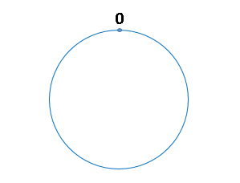

# 一致性哈希算法原理详解

## 普通 hash 算法 (取模算法)

在了解一致性哈希算法之前，我们先了解一下缓存中的一个应用场景，了解了这个应用场景之后，再来理解一致性哈希算法，就容易多了，也更能体现出一致性哈希算法的优点，那么，我们先来描述一下这个经典的分布式缓存的应用场景。

### 普通 hash算法与使用场景描述

假设我们有三台缓存服务器，用于缓存图片，我们为这三台缓存服务器编号为 0号、1号、2号，现在有3万张图片需要缓存，我们希望这些图片被均匀的缓存到这3台服务器上，以便它们能够分摊缓存的压力。也就是说，我们希望每台服务器能够缓存1万张左右的图片，那么我们应该怎样做呢？常见的做法是对缓存项的键进行哈希，将hash后的结果对缓存服务器的数量进行取模操作，通过取模后的结果，决定缓存项将会缓存在哪一台服务器上

我们举例说明，以刚才描述的场景为例，假设图片名称是不重复的，那我们就可以使用图片名称作为访问图片的key，使用如下公式，计算出图片应该存放在哪台服务器上。

```
hash（图片名称）% N
```

当我们对同一个图片名称做相同的哈希计算时，得出的结果应该是不变的，如果我们有3台服务器，使用哈希后的结果对3求余，那么余数一定是0、1或者2；如果求余的结果为0， 就把当前图片缓存在0号服务器上，如果余数为1，就缓存在1号服务器上，以此类推；同理，当我们访问任意图片时，只要再次对图片名称进行上述运算，即可得出图片应该存放在哪一台缓存服务器上，我们只要在这一台服务器上查找图片即可，如果图片在对应的服务器上不存在，则证明对应的图片没有被缓存，也不用再去遍历其他缓存服务器了，通过这样的方法，即可将3万张图片随机的分布到3台缓存服务器上了，而且下次访问某张图片时，直接能够判断出该图片应该存在于哪台缓存服务器上，我们暂时称上述算法为 HASH 算法或者取模算法，取模算法的过程可以用下图表示：


### 普通 hash 算法的缺陷

上述HASH算法时，会出现一些缺陷：如果服务器已经不能满足缓存需求，就需要增加服务器数量，假设我们增加了一台缓存服务器，此时如果仍然使用上述方法对同一张图片进行缓存，那么这张图片所在的服务器编号必定与原来3台服务器时所在的服务器编号不同，因为除数由3变为了4，最终导致所有缓存的位置都要发生改变，也就是说，`当服务器数量发生改变时，所有缓存在一定时间内是失效的，当应用无法从缓存中获取数据时，则会向后端服务器请求数据`；同理，假设突然有一台缓存服务器出现了故障，那么我们则需要将故障机器移除，那么缓存服务器数量从3台变为2台，同样会导致大量缓存在同一时间失效，造成了缓存的雪崩，`后端服务器将会承受巨大的压力，整个系统很有可能被压垮`。为了解决这种情况，就有了一致性哈希算法。

## 一致性哈希算法

### 什么是一致性 hash 算法

一致性哈希算法也是使用取模的方法，但是取模算法是对服务器的数量进行取模，而一致性哈希算法是对 2^32 取模，具体步骤如下：

- 步骤一：一致性哈希算法将整个哈希值空间按照顺时针方向组织成一个虚拟的圆环，称为 Hash 环；
- 步骤二：接着将各个服务器使用 Hash 函数进行哈希，具体可以选择服务器的IP或主机名作为关键字进行哈希，从而确定每台机器在哈希环上的位置
- 步骤三：最后使用算法定位数据访问到相应服务器：将数据key使用相同的函数Hash计算出哈希值，并确定此数据在环上的位置，从此位置沿环顺时针寻找，第一台遇到的服务器就是其应该定位到的服务器

下面我们使用具体案例说明一下一致性哈希算法的具体流程：

（1）步骤一：哈希环的组织：

我们将 2^32 想象成一个圆，像钟表一样，钟表的圆可以理解成由60个点组成的圆，而此处我们把这个圆想象成由2^32个点组成的圆，示意图如下：



圆环的正上方的点代表0，0点右侧的第一个点代表1，以此类推，2、3、4、5、6……直到2^32-1,也就是说0点左侧的第一个点代表2^32-1，我们把这个由 2^32 个点组成的圆环称为hash环

（2）步骤二：确定服务器在哈希环的位置：

哈希算法：hash（服务器的IP） % 2^32

上述公式的计算结果一定是 0 到 2^32-1 之间的整数，那么上图中的 hash 环上必定有一个点与这个整数对应，所以我们可以使用这个整数代表服务器，也就是服务器就可以映射到这个环上，假设我们有 ABC 三台服务器，那么它们在哈希环上的示意图如下：


（3）步骤三：将数据映射到哈希环上：

我们还是使用图片的名称作为 key，所以我们使用下面算法将图片映射在哈希环上：hash（图片名称） % 2^32，假设我们有4张图片，映射后的示意图如下，其中橘黄色的点表示图片：


那么，怎么算出上图中的图片应该被缓存到哪一台服务上面呢？我们只要从图片的位置开始，沿顺时针方向遇到的第一个服务器就是图片存放的服务器了。最终，1号、2号图片将会被缓存到服务器A上，3号图片将会被缓存到服务器B上，4号图片将会被缓存到服务器C上。

### 一致性 hash 算法的优点

前面提到，如果简单对服务器数量进行取模，那么当服务器数量发生变化时，会产生缓存的雪崩，从而很有可能导致系统崩溃，而使用一致性哈希算法就可以很好的解决这个问题，因为一致性Hash算法对于节点的增减都只需重定位环空间中的一小部分数据，只有部分缓存会失效，不至于将所有压力都在同一时间集中到后端服务器上，具有较好的容错性和可扩展性。

假设服务器B出现了故障，需要将服务器B移除，那么移除前后的示意图如下图所示：


在服务器B未移除时，图片3应该被缓存到服务器B中，可是当服务器B移除以后，按照之前描述的一致性哈希算法的规则，图片3应该被缓存到服务器C中，因为从图片3的位置出发，沿顺时针方向遇到的第一个缓存服务器节点就是服务器C，也就是说，如果服务器B出现故障被移除时，图片3的缓存位置会发生改变，但是，图片4仍然会被缓存到服务器C中，图片1与图片2仍然会被缓存到服务器A中，这与服务器B移除之前并没有任何区别，这就是一致性哈希算法的优点。

### hash 环的倾斜与虚拟节点

一致性哈希算法在服务节点太少的情况下，容易因为节点分部不均匀而造成数据倾斜问题，也就是被缓存的对象大部分集中缓存在某一台服务器上，从而出现数据分布不均匀的情况，这种情况就称为 hash 环的倾斜。如下图所示：


hash 环的倾斜在极端情况下，仍然有可能引起系统的崩溃，为了解决这种数据倾斜问题，一致性哈希算法引入了虚拟节点机制，即对每一个服务节点计算多个哈希，每个计算结果位置都放置一个此服务节点，称为虚拟节点，一个实际物理节点可以对应多个虚拟节点，虚拟节点越多，hash环上的节点就越多，缓存被均匀分布的概率就越大，hash环倾斜所带来的影响就越小，同时数据定位算法不变，只是多了一步虚拟节点到实际节点的映射。具体做法可以在服务器ip或主机名的后面增加编号来实现，加入虚拟节点以后的hash环如下：


# 来源

- [白话解析：一致性哈希算法 consistent hashing](https://www.zsythink.net/archives/1182)