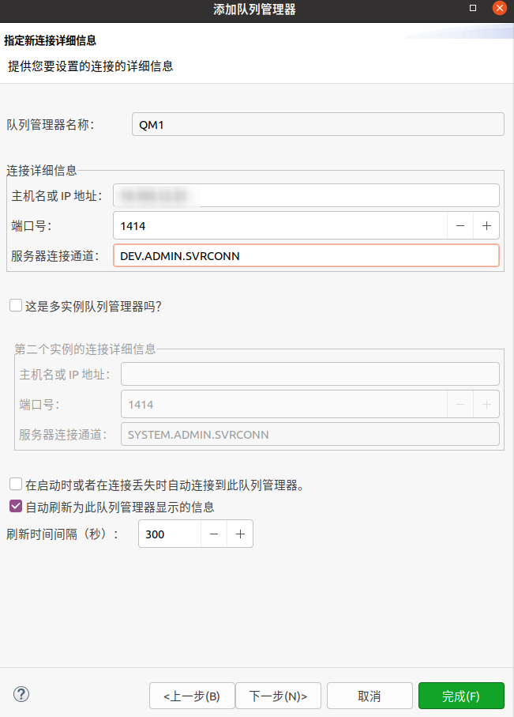

# Docker安装IBMMQ并使用Explorer连接

# Docker安装IBMMQ

- [Docker镜像地址](https://hub.docker.com/r/ibmcom/mq/)
- [Docker镜像Usage用法](https://github.com/ibm-messaging/mq-container/blob/master/docs/usage.md)

## 下载ibmmq镜像

> 这段引用来自AI: github copilot
> 
> Docker 安装的 IBM MQ 有时间限制，具体取决于你使用的版本。
> - IBM MQ Developer Edition：这是一个免费的版本，适用于开发和测试用途。它没有时间限制，但不能用于生产环境。
> - IBM MQ Advanced for Developers：这个版本也是免费的，适用于开发和测试用途，同样没有时间限制，但不能用于生产环境。
> - IBM MQ Trial：这是一个试用版，通常有 90 天的时间限制，用于评估和测试。
> - IBM MQ Enterprise：这是一个付费版本，没有时间限制，可以用于生产环境。
> 
> 你可以通过以下命令在 Docker 中安装 IBM MQ Developer Edition：
> - docker pull ibmcom/mq
> - docker run --env LICENSE=accept --env MQ_QMGR_NAME=QM1 --publish 1414:1414 --publish 9443:9443 --detach --name ibmmq ibmcom/mq

docker仓库地址：https://hub.docker.com/r/ibmcom/mq/

该镜像的默认用户是admin，密码是passw0rd

```bash
docker pull ibmcom/mq
```


## 启动IBM MQ服务端

```bash
docker run \
  --env LICENSE=accept \
  --env MQ_QMGR_NAME=QM1 \
  --publish 1414:1414 \
  --publish 9443:9443 \
  --detach \
  ibmcom/mq
```


## docker-compose.yml形式

上述内容可以简化成如下docker-compose.yml

```yaml
version: '2.1'
services:
  websphereMq:
    image: ibmcom/mq:9.2.0.0-r2-amd64
    container_name: websphereMq
    ports:
      - "1414:1414"
      - "9443:9443"
    restart: always
    environment:
      LICENSE: accept
      MQ_QMGR_NAME: QM1
    volumes:
      - ./mqm:/mnt/mqm
```

# IBM MQ Explorer

## 下载和安装

- [在 Windows 上安装独立 IBM MQ Explorer](https://www.ibm.com/docs/zh/ibm-mq/9.2?topic=windows-installing-stand-alone-mq-explorer)
- [在 Linux 上安装独立 IBM MQ Explorer](https://www.ibm.com/docs/zh/ibm-mq/9.3?topic=windows-installing-stand-alone-mq-explorer-linux)

这里只说明一下如何下载包，后续安装步骤都在上述两个文档

去IBM提供的下载中心，[Fix Central](https://www.ibm.com/links?url=https%3A%2F%2Fibm.biz%2Fmqexplorer)


## 连接

### 配置信息说明

#### 队列管理器名称

队列管理器 -> 右键 -> 添加远程队列管理器


队列管理器名称为：`QM1`,是我们前面启动容器的时候决定好的


#### 端口

端口是：`1414`

#### 通道

通道是：`DEV.ADMIN.SVRCONN`，通道可以进入容器，进入QM1查看，如下


#### 用户名密码

该镜像的默认用户是：`admin`，密码是：`passw0rd`


### 最后各个界面的配置信息如下




最后点击完成，此时可以看到默认镜像中的队列如下：


# 参考

- [Docker安装IBM MQ](https://www.cnblogs.com/rmxd/p/12521450.html)

