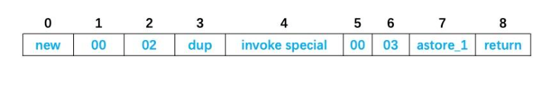
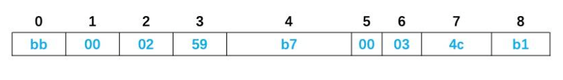
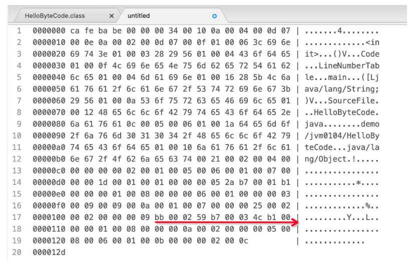
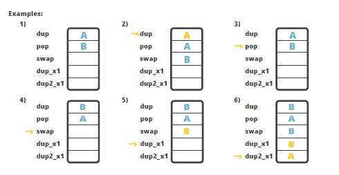
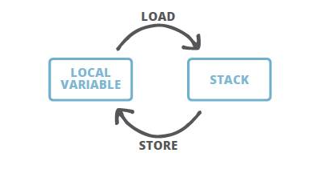

# Java字节码解析

Java 中的字节码，英文名为 bytecode, 是 Java 代码编译后的中间代码格式。JVM 需要读取并解析字节码才能执行相应的任务。

从技术人员的角度看，`Java 字节码是 JVM 的指令集`。JVM 加载字节码格式的 class 文件，校验之后通过 JIT 编译器转换为本地机器代码执行。 简单说字节码就是我们编写的 Java 应用程序大厦的每一块砖，如果没有字节码的支撑，大家编写的代码也就没有了用武之地，无法运行。也可以说，Java 字节码就是 JVM 执行的指令格式。

不管用什么编程语言，对于卓越而有追求的程序员，都能深入去探索一些技术细节，在需要的时候，可以在代码被执行前解读和理解中间形式的代码。对于 Java 来说，中间代码格式就是 Java 字节码。 了解字节码及其工作原理，对于编写高性能代码至关重要，对于深入分析和排查问题也有一定作用，所以我们要想深入了解 JVM 来说，了解字节码也是夯实基础的一项基本功。

## Java 字节码简介

有一件有趣的事情，就如名称所示, Java bytecode 由单字节(byte)的指令组成，理论上最多支持 256 个操作码(opcode)。实际上 Java 只使用了 200 左右的操作码， 还有一些操作码则保留给调试操作。

操作码， 下面称为 指令, 主要由类型前缀和操作名称两部分组成。

例如，’i’ 前缀代表 ‘integer’，所以，’iadd’ 很容易理解, 表示对整数执行加法运算。

根据指令的性质，主要分为四个大类：

- 栈操作指令，包括与局部变量交互的指令
- 程序流程控制指令
- 对象操作指令，包括方法调用指令
- 算术运算以及类型转换指令

此外还有一些执行专门任务的指令，比如同步(synchronization)指令，以及抛出异常相关的指令等等。下文会对这些指令进行详细的讲解。

## 获取字节码清单

可以用 javap 工具来获取 class 文件中的指令清单。 javap 是标准 JDK 内置的一款工具, 专门用于反编译 class 文件。

让我们从头开始, 先创建一个简单的类，后面再慢慢扩充。

```java
package demo.jvm0104;

public class HelloByteCode {
    public static void main(String[] args) {
        HelloByteCode obj = new HelloByteCode();
    }
}
```

代码很简单, main 方法中 new 了一个对象而已。然后我们编译这个类:

```bash
javac demo/jvm0104/HelloByteCode.java
```

注意：
- 使用 javac 编译 ，或者在 IDEA 或者 Eclipse 等集成开发工具自动编译，基本上是等效的。只要能找到对应的 class 即可。
- javac 不指定 -d 参数编译后生成的 .class 文件默认和源代码在同一个目录。
- javac 工具默认开启了优化功能, `生成的字节码中没有局部变量表(LocalVariableTable)`，相当于局部变量名称被擦除。如果需要这些调试信息, 在编译时请加上 -g 选项。有兴趣的同学可以试试两种方式的区别，并对比结果。
- JDK 自带工具的详细用法, 请使用: javac -help 或者 javap -help 来查看; 其他类似。

然后使用 javap 工具来执行反编译, 获取字节码清单：

```
javap -c demo.jvm0104.HelloByteCode
# 或者: 
javap -c demo/jvm0104/HelloByteCode
javap -c demo/jvm0104/HelloByteCode.class
```

javap 还是比较聪明的, 使用包名或者相对路径都可以反编译成功, 反编译后的结果如下所示：

```java
Compiled from "HelloByteCode.java"
public class demo.jvm0104.HelloByteCode {
  public demo.jvm0104.HelloByteCode();
    Code:
       0: aload_0
       1: invokespecial #1                  // Method java/lang/Object."<init>":()V
       4: return

  public static void main(java.lang.String[]);
    Code:
       0: new           #2                  // class demo/jvm0104/HelloByteCode
       3: dup
       4: invokespecial #3                  // Method "<init>":()V
       7: astore_1
       8: return
}
```

OK，我们成功获取到了字节码清单, 下面进行简单的解读。

## 解读字节码清单

可以看到，反编译后的代码清单中, 有一个默认的构造函数 public demo.jvm0104.HelloByteCode(), 以及 main 方法。

刚学 Java 时我们就知道， 如果不定义任何构造函数，就会有一个默认的无参构造函数，这里再次验证了这个知识点。好吧，这比较容易理解！我们通过查看编译后的 class 文件证实了其中存在默认构造函数，所以这是 Java 编译器生成的， 而不是运行时JVM自动生成的。

自动生成的构造函数，其方法体应该是空的，但这里看到里面有一些指令。为什么呢？

再次回顾 Java 知识, 每个构造函数中都会先调用 super 类的构造函数对吧？ 但这不是 JVM 自动执行的, 而是由程序指令控制，所以默认构造函数中也就有一些字节码指令来干这个事情。

基本上，这几条指令就是执行 super() 调用；

```java
  public demo.jvm0104.HelloByteCode();
    Code:
       0: aload_0
       1: invokespecial #1                  // Method java/lang/Object."<init>":()V
       4: return
```

继续往下看

```java
  public static void main(java.lang.String[]);
    Code:
       0: new           #2                  // class demo/jvm0104/HelloByteCode
       3: dup
       4: invokespecial #3                  // Method "<init>":()V
       7: astore_1
       8: return
```

main 方法中创建了该类的一个实例， 然后就 return 了， 关于里面的几个指令， 稍后讲解。

## 查看 class 文件中的常量池信息

常量池 大家应该都听说过, 英文是 Constant pool。这里做一个强调: 大多数时候指的是 运行时常量池。但运行时常量池里面的常量是从哪里来的呢? 主要就是由 class 文件中的 常量池结构体 组成的。

要查看常量池信息, 我们得加一点魔法参数:

```java
javap -c -verbose demo.jvm0104.HelloByteCode
```

在反编译 class 时，指定 -verbose 选项, 则会 输出附加信息。

结果如下所示:

```java
Classfile /XXXXXXX/demo/jvm0104/HelloByteCode.class
  Last modified 2019-11-28; size 301 bytes
  MD5 checksum 542cb70faf8b2b512a023e1a8e6c1308
  Compiled from "HelloByteCode.java"
public class demo.jvm0104.HelloByteCode
  minor version: 0
  major version: 52
  flags: ACC_PUBLIC, ACC_SUPER
Constant pool:
   #1 = Methodref #4.#13 // java/lang/Object."<init>":()V
   #2 = Class #14 // demo/jvm0104/HelloByteCode
   #3 = Methodref #2.#13 // demo/jvm0104/HelloByteCode."<init>":()V
   #4 = Class #15 // java/lang/Object
   #5 = Utf8 <init>
   #6 = Utf8 ()V
   #7 = Utf8 Code
   #8 = Utf8 LineNumberTable
   #9 = Utf8 main
  #10 = Utf8 ([Ljava/lang/String;)V
  #11 = Utf8 SourceFile
  #12 = Utf8 HelloByteCode.java
  #13 = NameAndType #5:#6 // "<init>":()V
  #14 = Utf8 demo/jvm0104/HelloByteCode
  #15 = Utf8 java/lang/Object
{
  public demo.jvm0104.HelloByteCode();
    descriptor: ()V
    flags: ACC_PUBLIC
    Code:
      stack=1, locals=1, args_size=1
         0: aload_0
         1: invokespecial #1 // Method java/lang/Object."<init>":()V
         4: return
      LineNumberTable:
        line 3: 0

  public static void main(java.lang.String[]);
    descriptor: ([Ljava/lang/String;)V
    flags: ACC_PUBLIC, ACC_STATIC
    Code:
      stack=2, locals=2, args_size=1
         0: new #2 // class demo/jvm0104/HelloByteCode
         3: dup
         4: invokespecial #3 // Method "<init>":()V
         7: astore_1
         8: return
      LineNumberTable:
        line 5: 0
        line 6: 8
}
SourceFile: "HelloByteCode.java"
```

其中显示了很多关于 class 文件信息： 编译时间， MD5 校验和， 从哪个 .java 源文件编译得来，符合哪个版本的 Java 语言规范等等。

还可以看到 ACC_PUBLIC 和 ACC_SUPER 访问标志符。 ACC_PUBLIC 标志很容易理解：这个类是 public 类，因此用这个标志来表示。

但 ACC_SUPER 标志是怎么回事呢？ 这就是历史原因, JDK 1.0 的 BUG 修正中引入 ACC_SUPER 标志来修正 invokespecial 指令调用 super 类方法的问题，从 Java 1.1 开始， 编译器一般都会自动生成ACC_SUPER 标志。

有些同学可能注意到了， 好多指令后面使用了 #1, #2, #3 这样的编号。

这就是对常量池的引用。 那常量池里面有些什么呢?

```java
Constant pool:
   #1 = Methodref #4.#13 // java/lang/Object."<init>":()V
   #2 = Class #14 // demo/jvm0104/HelloByteCode
   #3 = Methodref #2.#13 // demo/jvm0104/HelloByteCode."<init>":()V
   #4 = Class #15 // java/lang/Object
   #5 = Utf8 <init>
......
```

这是摘取的一部分内容, 可以看到常量池中的常量定义。还可以进行组合, 一个常量的定义中可以引用其他常量。

比如第一行: #1 = Methodref #4.#13 // java/lang/Object."<init>":()V, 解读如下:

- #1 常量编号, 该文件中其他地方可以引用。
- = 等号就是分隔符.
- Methodref 表明这个常量指向的是一个方法；具体是哪个类的哪个方法呢? 类指向的 #4, 方法签名指向的 #13; 当然双斜线注释后面已经解析出来可读性比较好的说明了。

同学们可以试着解析其他的常量定义。 自己实践加上知识回顾，能有效增加个人的记忆和理解。

总结一下，常量池就是一个常量的大字典，使用编号的方式把程序里用到的各类常量统一管理起来，这样在字节码操作里，只需要引用编号即可。

## 查看方法信息

在 javap 命令中使用 -verbose 选项时， 还显示了其他的一些信息。 例如， 关于 main 方法的更多信息被打印出来：

```java
  public static void main(java.lang.String[]);
    descriptor: ([Ljava/lang/String;)V
    flags: ACC_PUBLIC, ACC_STATIC
    Code:
      stack=2, locals=2, args_size=1

```
一行一行看

- 方法描述为: `([Ljava/lang/String;)V`，具体解释如下
  - 其中小括号内是入参信息/形参信息；
  - 左方括号表述数组；
  - L 表示对象；
  - 后面的java/lang/String就是类名称；
  - 小括号后面的 V 则表示这个方法的返回值是 void；
- 方法的访问标志也很容易理解 flags: ACC_PUBLIC, ACC_STATIC，表示 public 和 static。
- 还可以看到执行该方法时需要的栈(stack)深度是多少，需要在局部变量表中保留多少个槽位，还有方法的参数个数: stack=2, locals=2, args_size=1。

把上面这些整合起来其实就是一个方法：

```
public static void main(java.lang.String[]);

注：实际上我们一般把一个方法的修饰符+名称+参数类型清单+返回值类型，合在一起叫“方法签名”，即这些信息可以完整的表示一个方法。
```

稍微往回一点点，看编译器自动生成的无参构造函数字节码:

```java
  public demo.jvm0104.HelloByteCode();
    descriptor: ()V
    flags: ACC_PUBLIC
    Code:
      stack=1, locals=1, args_size=1
         0: aload_0
         1: invokespecial #1 // Method java/lang/Object."<init>":()V
         4: return
```

你会发现一个奇怪的地方, 无参构造函数的参数个数居然不是 0: stack=1, locals=1, args_size=1。 这是因为在 Java 中, 如果是静态方法则没有 this 引用。 对于非静态方法， this 将被分配到局部变量表的第 0 号槽位中, 关于局部变量表的细节,下面再进行介绍。

> 有反射编程经验的同学可能比较容易理解: Method#invoke(Object obj, Object... args); 有JavaScript编程经验的同学也可以类比: fn.apply(obj, args) && fn.call(obj, arg1, arg2);

## 线程栈与字节码执行模型

想要深入了解字节码技术，我们需要先对字节码的执行模型有所了解。

JVM 是一台基于栈的计算机器。每个线程都有一个独属于自己的线程栈(JVM stack)，用于存储栈帧(Frame)。每一次方法调用，JVM都会自动创建一个栈帧。栈帧 由 操作数栈， 局部变量数组 以及一个class 引用组成。class 引用 指向当前方法在运行时常量池中对应的 class。

我们在前面反编译的代码中已经看到过这些内容。


局部变量数组 也称为 局部变量表(LocalVariableTable), 其中包含了方法的参数，以及局部变量。 局部变量数组的大小在编译时就已经确定: 和局部变量+形参的个数有关，还要看每个变量/参数占用多少个字节。操作数栈是一个 LIFO 结构的栈， 用于压入和弹出值。 它的大小也在编译时确定。

有一些操作码/指令可以将值压入“操作数栈”； 还有一些操作码/指令则是从栈中获取操作数，并进行处理，再将结果压入栈。操作数栈还用于接收调用其他方法时返回的结果值。

## 方法体中的字节码解读

看过前面的示例，细心的同学可能会猜测，方法体中那些字节码指令前面的数字是什么意思，说是序号吧但又不太像，因为他们之间的间隔不相等。看看 main 方法体对应的字节码：

```java
0: new #2 // class demo/jvm0104/HelloByteCode
3: dup
4: invokespecial #3 // Method "<init>":()V
7: astore_1
8: return
```

间隔不相等的原因是, 有一部分操作码会附带有操作数, 也会占用字节码数组中的空间。

例如， new 就会占用三个槽位: 一个用于存放操作码指令自身，两个用于存放操作数。
- [附录：操作码和操作数说明](#操作码和操作数说明)
- [附录：完整的解析](#完整的解析)

因此，下一条指令 dup 的索引从 3 开始。



每个操作码/指令都有对应的十六进制(HEX)表示形式， 如果换成十六进制来表示，则方法体可表示为HEX字符串。例如上面的方法体百世成十六进制如下所示：



甚至我们还可以在支持十六进制的编辑器中打开 class 文件，可以在其中找到对应的字符串：


（此图由开源文本编辑软件Atom的hex-view插件生成）

粗暴一点，我们可以通过 HEX 编辑器直接修改字节码，尽管这样做会有风险， 但如果只修改一个数值的话应该会很有趣。

其实要使用编程的方式，方便和安全地实现字节码编辑和修改还有更好的办法，那就是使用 ASM 和 Javassist 之类的字节码操作工具，也可以在类加载器和 Agent 上面做文章，下一节课程会讨论 类加载器，其他主题则留待以后探讨。

## 对象初始化指令：new 指令, init 以及 clinit 简介

我们都知道 new是 Java 编程语言中的一个关键字， 但其实在字节码中，也有一个指令叫做 new。 当我们创建类的实例时, 编译器会生成类似下面这样的操作码：

```java
0: new #2 // class demo/jvm0104/HelloByteCode
3: dup
4: invokespecial #3 // Method "<init>":()V
```

当你同时看到 new, dup 和 invokespecial 指令在一起时，那么一定是在创建类的实例对象！

为什么是三条指令而不是一条呢？这是因为：

- new 指令只是创建对象，但没有调用构造函数。
- invokespecial 指令用来调用某些特殊方法的, 当然这里调用的是构造函数。
- dup 指令用于复制栈顶的值。
- [附录：创建类的实例时为什么是三条指令而不是一条](#创建类的实例时为什么是三条指令而不是一条)

由于构造函数调用不会返回值，所以如果没有 dup 指令, 在对象上调用方法并初始化之后，操作数栈就会是空的，在初始化之后就会出问题, 接下来的代码就无法对其进行处理。

这就是为什么要事先复制引用的原因，为的是在构造函数返回之后，可以将对象实例赋值给局部变量或某个字段。因此，接下来的那条指令一般是以下几种：

因此，接下来的那条指令一般是以下几种：

- astore {N} or astore_{N} – 赋值给局部变量，其中 {N} 是局部变量表中的位置。
- putfield – 将值赋给实例字段
- putstatic – 将值赋给静态字段

在调用构造函数的时候，其实还会执行另一个类似的方法 `<init>` ，甚至在执行构造函数之前就执行了。

还有一个可能执行的方法是该类的静态初始化方法 `<clinit>`， 但 `<clinit>` 并不能被直接调用，而是由这些指令触发的： new, getstatic, putstatic or invokestatic。

也就是说，如果创建某个类的新实例， 访问静态字段或者调用静态方法，就会触发该类的静态初始化方法【如果尚未初始化】。

实际上，还有一些情况会触发静态初始化， 详情请参考 [JVM 规范]([http://docs.oracle.com/javase/specs/jvms/se8/html/])

## 栈内存操作指令

有很多指令可以操作方法栈。 前面也提到过一些基本的栈操作指令： 他们将值压入栈，或者从栈中获取值。 除了这些基础操作之外也还有一些指令可以操作栈内存； 比如 swap 指令用来交换栈顶两个元素的值。下面是一些示例：

最基础的是 dup 和 pop 指令。[参考：操作数栈管理指令](https://segmentfault.com/a/1190000039911004)

- dup 指令复制栈顶元素的值。
  - 一般包括两个指令：dup、dup2，系数代表要复制的slot个数
  - dup开头的指令用于复制1个Slot的数据。例：1个int 或者 1个reference
  - dup2开头的指令用于复制2个Slot的数据。例：1个long，或2个int，或1个int + 1个float
- pop 指令则从栈中删除最顶部的值。
  - pop:将栈顶的1个s1ot数值出栈。例如1个short类型数值
  - pop2:将栈顶的2个Slot数值出栈。例如1个double类型数值，或者2个int类型数值

还有复杂一点的指令：比如，swap, dup_x1 和 dup2_x1。

- 顾名思义，swap 指令可交换栈顶两个元素的值，例如A和B交换位置(图中示例4)；
- dup_x是复制栈顶数据并插入栈顶以下的某个位置，共有四个指令：dup_x1，dup2_x1，dup_x2，dup2_x2
  - dup_x1插入位置:1+1=2，即栈顶2个Slot下面(图中示例5)
  - dup_x2插入位置:1+2=3，即栈顶3个Slot下面
  - dup2_x1插入位置:2+1=3，即栈顶3个Slot下面(图中示例6)
  - dup2_x2插入位置:2+2=4，即栈顶4个slot下面



dup_x1 和 dup2_x1 指令看起来稍微有点复杂。而且为什么要设置这种指令呢? 在栈中复制最顶部的值？

请看一个实际案例：怎样交换 2 个 double 类型的值？

需要注意的是，一个 double 值占两个槽位，也就是说如果栈中有两个 double 值，它们将占用 4 个槽位。

要执行交换，你可能想到了 swap 指令，但问题是 swap 只适用于单字(one-word, 单字一般指 32 位 4 个字节，64 位则是双字)，所以不能处理 double 类型，但 Java 中又没有 swap2 指令。

怎么办呢? 解决方法就是使用 dup2_x2 指令，将操作数栈顶部的 double 值，复制到栈底 double 值的下方， 然后再使用 pop2 指令弹出栈顶的 double 值。结果就是交换了两个 double 值。 示意图如下图所示:


dup、dup_x1、dup2_x1 指令补充说明

指令的详细说明可参考 [JVM 规范](https://docs.oracle.com/javase/specs/jvms/se8/html/jvms-6.html)：

### dup 指令

官方说明是：复制栈顶的值，并将复制的值压入栈。

操作数栈的值变化情况（方括号标识新插入的值）：

```
..., value →
..., value [,value]
```

### dup_x1 指令

官方说明是：复制栈顶的值，并将复制的值插入到最上面 2 个值的下方。

操作数栈的值变化情况（方括号标识新插入的值）：

```
..., value2, value1 →
..., [value1,] value2, value1
```

### dup2_x1 指令

官方说明是：复制栈顶 1 个 64 位/或 2 个 32 位的值, 并将复制的值按照原始顺序，插入原始值下面一个 32 位值的下方。

操作数栈的值变化情况（方括号标识新插入的值）：

```
# 情景 1: value1, value2, and value3 都是分组 1 的值(32 位元素)
..., value3, value2, value1 →
..., [value2, value1,] value3, value2, value1

# 情景 2: value1 是分组 2 的值(64 位,long 或double), value2 是分组 1 的值(32 位元素)
..., value2, value1 →
..., [value1,] value2, value1
```

[Table 2.11.1-B 实际类型与 JVM 计算类型映射和分组](https://docs.oracle.com/javase/specs/jvms/se8/html/jvms-2.html#jvms-2.11.1)


| 实际类型      | JVM 计算类型  | 类型分组 |
| ------------- | ------------- | -------- |
| boolean       | int           | 1        |
| byte          | int           | 1        |
| char          | int           | 1        |
| short         | int           | 1        |
| int           | int           | 1        |
| float         | float         | 1        |
| reference     | reference     | 1        |
| returnAddress | returnAddress | 1        |
| long          | long          | 2        |
| double        | double        | 2        |

## 局部变量表

stack 主要用于执行指令，而局部变量则用来保存中间结果，两者之间可以直接交互。

让我们编写一个复杂点的示例：

第一步，先编写一个计算移动平均数的类:

```java
package demo.jvm0104;
//移动平均数
public class MovingAverage {
    private int count = 0;
    private double sum = 0.0D;
    public void submit(double value){
        this.count ++;
        this.sum += value;
    }
    public double getAvg(){
        if(0 == this.count){ return sum;}
        return this.sum/this.count;
    }
}
```

第二步，然后写一个类来调用:

```java
package demo.jvm0104;
public class LocalVariableTest {
    public static void main(String[] args) {
        MovingAverage ma = new MovingAverage();
        int num1 = 1;
        int num2 = 2;
        ma.submit(num1);
        ma.submit(num2);
        double avg = ma.getAvg();
    }
}
```

其中 main 方法中向 MovingAverage 类的实例提交了两个数值，并要求其计算当前的平均值。

然后我们需要编译（还记得前面提到, 生成调试信息的 -g 参数吗）。

```bash
javac -g demo/jvm0104/*.java
```

然后使用 javap 反编译:

```bash
javap -c -verbose demo/jvm0104/LocalVariableTest
```

看 main 方法对应的字节码：

```java
  public static void main(java.lang.String[]);
    descriptor: ([Ljava/lang/String;)V
    flags: ACC_PUBLIC, ACC_STATIC
    Code:
      stack=3, locals=6, args_size=1
         0: new           #2                  // class demo/jvm0104/MovingAverage
         3: dup
         4: invokespecial #3                  // Method demo/jvm0104/MovingAverage."<init>":()V
         7: astore_1
         8: iconst_1
         9: istore_2
        10: iconst_2
        11: istore_3
        12: aload_1
        13: iload_2
        14: i2d
        15: invokevirtual #4                  // Method demo/jvm0104/MovingAverage.submit:(D)V
        18: aload_1
        19: iload_3
        20: i2d
        21: invokevirtual #4                  // Method demo/jvm0104/MovingAverage.submit:(D)V
        24: aload_1
        25: invokevirtual #5                  // Method demo/jvm0104/MovingAverage.getAvg:()D
        28: dstore        4
        30: return
      LineNumberTable:
        line 5: 0
        line 6: 8
        line 7: 10
        line 8: 12
        line 9: 18
        line 10: 24
        line 11: 30
      LocalVariableTable:
        Start  Length  Slot  Name   Signature
            0      31     0  args   [Ljava/lang/String;
            8      23     1    ma   Ldemo/jvm0104/MovingAverage;
           10      21     2  num1   I
           12      19     3  num2   I
           30       1     4   avg   D
```

- 编号 0 的字节码 new, 创建 MovingAverage 类的对象;
- 编号 3 的字节码 dup 复制栈顶引用值。
- 编号 4 的字节码 invokespecial 执行对象初始化。
- 编号 7 开始, 使用 astore_1 指令将引用地址值(addr.)存储(store)到编号为1的局部变量中： astore_1 中的 1 指代 LocalVariableTable 中ma对应的槽位编号，
- 编号8开始的指令： iconst_1 和 iconst_2 用来将常量值1和2加载到栈里面， 并分别由指令 istore_2 和 istore_3 将它们存储到在 LocalVariableTable 的槽位 2 和槽位 3 中。

```java
         8: iconst_1
         9: istore_2
        10: iconst_2
        11: istore_3
```

请注意，store 之类的指令调用实际上从栈顶删除了一个值。 这就是为什么再次使用相同值时，必须再加载(load)一次的原因。

例如在上面的字节码中，调用 submit 方法之前， 必须再次将参数值加载到栈中：

```java
        12: aload_1
        13: iload_2
        14: i2d
        15: invokevirtual #4                  // Method demo/jvm0104/MovingAverage.submit:(D)V
```

调用 getAvg() 方法后，返回的结果位于栈顶，然后使用 dstore 将 double 值保存到本地变量4号槽位，这里的d表示目标变量的类型为double。

```java
        24: aload_1
        25: invokevirtual #5                  // Method demo/jvm0104/MovingAverage.getAvg:()D
        28: dstore        4
```

关于 LocalVariableTable 有个有意思的事情，就是最前面的槽位会被方法参数占用。

在这里，因为 main 是静态方法，所以槽位0中并没有设置为 this 引用的地址。 但是对于非静态方法来说， this 会将分配到第 0 号槽位中。

> 再次提醒: 有过反射编程经验的同学可能比较容易理解: Method#invoke(Object obj, Object... args); 有JavaScript编程经验的同学也可以类比: fn.apply(obj, args) && fn.call(obj, arg1, arg2);
>
> 


# 来源

- [05 Java 字节码技术：不积细流，无以成江河](https://learn.lianglianglee.com/%e4%b8%93%e6%a0%8f/JVM%20%e6%a0%b8%e5%bf%83%e6%8a%80%e6%9c%af%2032%20%e8%ae%b2%ef%bc%88%e5%ae%8c%ef%bc%89/05%20Java%20%e5%ad%97%e8%8a%82%e7%a0%81%e6%8a%80%e6%9c%af%ef%bc%9a%e4%b8%8d%e7%a7%af%e7%bb%86%e6%b5%81%ef%bc%8c%e6%97%a0%e4%bb%a5%e6%88%90%e6%b1%9f%e6%b2%b3.md)

# 附录

## 操作码和操作数说明

来源：https://blog.csdn.net/qq_21484461/article/details/113770559

- 操作码 (Opcode)
  - 操作码是指令的一部分，它告诉处理器应该要做什么。它包含表示 CPU 要执行的实际操作的说明。
- 操作数 (Operand)
  - 操作数同样是指令的一部分，其中包含要操作的数据在寄存器中的内存位置。
  - 操作数是由寄存器地址、内存地址或立即数来指定的。
    - 立即操作数：指令要操作的数据以常量的形式出现在指令中，称为立即数，它只能作为源操作数 。
    - 寄存器操作数：指令要操作的数据存放在CPU中的寄存器里，指令中给出寄存器名即可。
    - 内存操作数：指令要操作的数据存放在内存某些单元中，指令中给出内存单元物理地址（实际上指令只给出了偏移地址，段地址采用隐含方式给出，也可以使用跨段方式指出当前段地址）

## 完整的解析

在Java字节码中，每个操作码（opcode）可能附带操作数（operand），这些操作数通常以字节形式存储，且具体含义取决于操作码的上下文。你提到的 `00, 02` 和 `00, 03` 是操作数，它们的意义需要结合具体的操作码来解释。以下是详细分析：

---

### **1. `new` 指令的操作数**
- **操作码new**：对应字节码 `0xBB`，用于创建一个新的对象实例。
- **操作数00, 02**：
  - `new` 指令的操作数是一个 **2字节的无符号整数**，表示常量池（Constant Pool）中的索引。
  - 字节码中的 `00, 02` 是 **大端序（Big-Endian）** 的表示方式，对应十进制值为 `0x0002`，即 **常量池索引 #2**。
  - 在常量池中，索引 #2 处通常存储一个 `CONSTANT_Class_info` 结构，指向类 `demo/jvm0104/HelloByteCode`（如注释所示）。

---

### **2. `invokespecial` 指令的操作数**
- **操作码invokespecial**：对应字节码 `0xB7`，用于调用实例构造方法、私有方法或父类方法。
- **操作数00, 03**：
  - `invokespecial` 的操作数也是一个 **2字节的无符号整数**，表示常量池中的索引。
  - 字节码中的 `00, 03` 对应十进制值为 `0x0003`，即 **常量池索引 #3**。
  - 在常量池中，索引 #3 处通常存储一个 `CONSTANT_Methodref_info` 结构，指向方法 `<init>`（构造方法）。

---

### **3. 常量池索引的验证**
根据你提供的注释：
```java
new #2          // class demo/jvm0104/HelloByteCode
invokespecial #3 // Method "<init>":()V
```
- **索引 #2** 对应类 `demo/jvm0104/HelloByteCode`。
- **索引 #3** 对应该类的构造方法 `<init>`，方法描述符为 `()V`（无参数，返回类型为 `void`）。

---

### **4. 操作数的字节表示**
- **操作数为什么是 `00, 02` 或 `00, 03`？**
  - Java字节码使用 **大端序（Big-Endian）** 存储多字节数值。对于 `new` 和 `invokespecial` 指令，操作数是 **2字节的无符号整数**。
  - 例如：
    - `00 02`（十六进制） → 十进制值为 `2`。
    - `00 03`（十六进制） → 十进制值为 `3`。

---

### **5. 完整的字节码解析**
以下是你提供的字节码片段的完整解析：
```java
0: new #2                  // 操作码: 0xBB, 操作数: 00 02 → 创建 demo/jvm0104/HelloByteCode 实例
3: dup                     // 操作码: 0x59, 无操作数 → 复制栈顶值
4: invokespecial #3        // 操作码: 0xB7, 操作数: 00 03 → 调用构造方法 <init>()
7: astore_1                // 操作码: 0x4C, 无操作数 → 将对象引用存储到局部变量表索引 1
8: return                  // 操作码: 0xB1, 无操作数 → 方法返回
```

---

### **总结**
- `00, 02` 和 `00, 03` 是 **大端序的 2 字节常量池索引**，分别指向类和方法符号引用。
- 常量池索引是字节码中引用类、方法、字段等符号信息的关键机制。
- 字节码的可读性依赖于反编译工具的注释（如 `javap -v`），实际存储为二进制字节。

## 创建类的实例时为什么是三条指令而不是一条

我们可以用一个 **「工厂生产玩具」** 的类比来理解这个过程

---

### **情景设定：**
假设你是一个玩具厂老板，要生产一个玩具熊（对象实例），步骤如下：

1. **new 指令**：**造一个空壳玩具熊**（分配内存，但未组装）。
   - 工厂先生产出一个玩具熊的 **空壳**（没有填充棉花、没有眼睛和鼻子）。
   - 此时这个空壳玩具熊的 **地址标签**（对象引用）会被贴到你的订单本（**操作数栈**）上。

2. **dup 指令**：**复制订单标签**（复制栈顶的引用）。
   - 你发现需要同时做两件事：
     - **组装这个玩具**（调用构造函数初始化）。
     - **把组装好的玩具卖给客户**（后续使用对象）。
   - 于是你 **复制了订单标签**（复制栈顶的引用），现在订单本上有 **两个相同的地址标签**。

3. **invokespecial 指令**：**组装玩具**（调用构造函数）。
   - 你把 **第一个标签** 交给工人（构造函数），工人根据标签找到空壳玩具熊，给它填充棉花、缝上眼睛和鼻子（初始化对象）。
   - **注意**：工人组装完玩具后，会把 **第一个标签从订单本上撕掉**（构造函数没有返回值，操作数栈弹出第一个引用）。

4. **最终结果**：
   - 订单本上还剩下 **第二个标签**（dup 复制的那个），指向 **已经组装好的玩具熊**。
   - 你可以用这个标签把玩具熊卖给客户（赋值给变量，或调用其他方法）。

---

### **关键问题解答：**
#### **Q1：为什么需要三条指令？直接用一条指令创建并初始化对象不行吗？**
- **A**：JVM 的设计是分步的，就像工厂不能一步生产出组装好的玩具一样：
  1. **new** 只负责生产空壳（分配内存）。
  2. **invokespecial** 负责组装（构造函数初始化）。
  3. **dup** 是为了在组装后还能保留一个引用（否则组装完标签就被销毁了）。

#### **Q2：如果没有 dup 会发生什么？**
- 假设只有 `new` 和 `invokespecial`：
  1. `new` 后栈顶有一个引用（标签）。
  2. `invokespecial` 消耗这个引用去组装玩具。
  3. 组装完成后，栈顶空了，后续代码无法操作这个对象（相当于玩具组装好了，但订单本上没标签了，你不知道该卖哪个玩具）。

---

### **字节码执行流程（带操作数栈变化）：**
```java
// 初始状态：操作数栈为空
0: new #2                  
   → 操作数栈：[对象引用1]（指向未初始化的对象）
3: dup                     
   → 操作数栈：[对象引用1, 对象引用1]（复制一份）
4: invokespecial #3        
   → 操作数栈：[对象引用1]（消耗一个引用，调用构造函数初始化对象）
7: astore_1               
   → 操作数栈：[]（将剩余的对象引用1 存储到局部变量表）
```

---

### **总结：**
- **new**：造空壳 → 栈顶有引用。
- **dup**：复制引用 → 栈顶有两个相同的引用。
- **invokespecial**：用第一个引用初始化对象 → 栈顶还剩一个引用。
- **astore_1**：把剩下的引用存起来 → 后续代码可以操作对象。

**就像工厂生产玩具一样，先造空壳、复制标签、组装、保留标签，缺一不可！** 