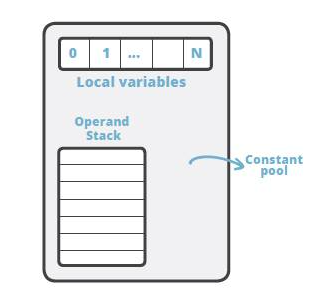

# Java字节码解析

Java 中的字节码，英文名为 bytecode, 是 Java 代码编译后的中间代码格式。JVM 需要读取并解析字节码才能执行相应的任务。

从技术人员的角度看，`Java 字节码是 JVM 的指令集`。JVM 加载字节码格式的 class 文件，校验之后通过 JIT 编译器转换为本地机器代码执行。 简单说字节码就是我们编写的 Java 应用程序大厦的每一块砖，如果没有字节码的支撑，大家编写的代码也就没有了用武之地，无法运行。也可以说，Java 字节码就是 JVM 执行的指令格式。

不管用什么编程语言，对于卓越而有追求的程序员，都能深入去探索一些技术细节，在需要的时候，可以在代码被执行前解读和理解中间形式的代码。对于 Java 来说，中间代码格式就是 Java 字节码。 了解字节码及其工作原理，对于编写高性能代码至关重要，对于深入分析和排查问题也有一定作用，所以我们要想深入了解 JVM 来说，了解字节码也是夯实基础的一项基本功。

## Java 字节码简介

有一件有趣的事情，就如名称所示, Java bytecode 由单字节(byte)的指令组成，理论上最多支持 256 个操作码(opcode)。实际上 Java 只使用了 200 左右的操作码， 还有一些操作码则保留给调试操作。

操作码， 下面称为 指令, 主要由类型前缀和操作名称两部分组成。

例如，’i’ 前缀代表 ‘integer’，所以，’iadd’ 很容易理解, 表示对整数执行加法运算。

根据指令的性质，主要分为四个大类：

- 栈操作指令，包括与局部变量交互的指令
- 程序流程控制指令
- 对象操作指令，包括方法调用指令
- 算术运算以及类型转换指令

此外还有一些执行专门任务的指令，比如同步(synchronization)指令，以及抛出异常相关的指令等等。下文会对这些指令进行详细的讲解。

## 获取字节码清单

可以用 javap 工具来获取 class 文件中的指令清单。 javap 是标准 JDK 内置的一款工具, 专门用于反编译 class 文件。

让我们从头开始, 先创建一个简单的类，后面再慢慢扩充。

```java
package demo.jvm0104;

public class HelloByteCode {
    public static void main(String[] args) {
        HelloByteCode obj = new HelloByteCode();
    }
}
```

代码很简单, main 方法中 new 了一个对象而已。然后我们编译这个类:

```bash
javac demo/jvm0104/HelloByteCode.java
```

注意：
- 使用 javac 编译 ，或者在 IDEA 或者 Eclipse 等集成开发工具自动编译，基本上是等效的。只要能找到对应的 class 即可。
- javac 不指定 -d 参数编译后生成的 .class 文件默认和源代码在同一个目录。
- javac 工具默认开启了优化功能, `生成的字节码中没有局部变量表(LocalVariableTable)`，相当于局部变量名称被擦除。如果需要这些调试信息, 在编译时请加上 -g 选项。有兴趣的同学可以试试两种方式的区别，并对比结果。
- JDK 自带工具的详细用法, 请使用: javac -help 或者 javap -help 来查看; 其他类似。

然后使用 javap 工具来执行反编译, 获取字节码清单：

```
javap -c demo.jvm0104.HelloByteCode
# 或者: 
javap -c demo/jvm0104/HelloByteCode
javap -c demo/jvm0104/HelloByteCode.class
```

javap 还是比较聪明的, 使用包名或者相对路径都可以反编译成功, 反编译后的结果如下所示：

```java
Compiled from "HelloByteCode.java"
public class demo.jvm0104.HelloByteCode {
  public demo.jvm0104.HelloByteCode();
    Code:
       0: aload_0
       1: invokespecial #1                  // Method java/lang/Object."<init>":()V
       4: return

  public static void main(java.lang.String[]);
    Code:
       0: new           #2                  // class demo/jvm0104/HelloByteCode
       3: dup
       4: invokespecial #3                  // Method "<init>":()V
       7: astore_1
       8: return
}
```

OK，我们成功获取到了字节码清单, 下面进行简单的解读。

## 解读字节码清单

可以看到，反编译后的代码清单中, 有一个默认的构造函数 public demo.jvm0104.HelloByteCode(), 以及 main 方法。

刚学 Java 时我们就知道， 如果不定义任何构造函数，就会有一个默认的无参构造函数，这里再次验证了这个知识点。好吧，这比较容易理解！我们通过查看编译后的 class 文件证实了其中存在默认构造函数，所以这是 Java 编译器生成的， 而不是运行时JVM自动生成的。

自动生成的构造函数，其方法体应该是空的，但这里看到里面有一些指令。为什么呢？

再次回顾 Java 知识, 每个构造函数中都会先调用 super 类的构造函数对吧？ 但这不是 JVM 自动执行的, 而是由程序指令控制，所以默认构造函数中也就有一些字节码指令来干这个事情。

基本上，这几条指令就是执行 super() 调用；

```java
  public demo.jvm0104.HelloByteCode();
    Code:
       0: aload_0
       1: invokespecial #1                  // Method java/lang/Object."<init>":()V
       4: return
```

继续往下看

```java
  public static void main(java.lang.String[]);
    Code:
       0: new           #2                  // class demo/jvm0104/HelloByteCode
       3: dup
       4: invokespecial #3                  // Method "<init>":()V
       7: astore_1
       8: return
```

main 方法中创建了该类的一个实例， 然后就 return 了， 关于里面的几个指令， 稍后讲解。

## 查看 class 文件中的常量池信息

常量池 大家应该都听说过, 英文是 Constant pool。这里做一个强调: 大多数时候指的是 运行时常量池。但运行时常量池里面的常量是从哪里来的呢? 主要就是由 class 文件中的 常量池结构体 组成的。

要查看常量池信息, 我们得加一点魔法参数:

```java
javap -c -verbose demo.jvm0104.HelloByteCode
```

在反编译 class 时，指定 -verbose 选项, 则会 输出附加信息。

结果如下所示:

```java
Classfile /XXXXXXX/demo/jvm0104/HelloByteCode.class
  Last modified 2019-11-28; size 301 bytes
  MD5 checksum 542cb70faf8b2b512a023e1a8e6c1308
  Compiled from "HelloByteCode.java"
public class demo.jvm0104.HelloByteCode
  minor version: 0
  major version: 52
  flags: ACC_PUBLIC, ACC_SUPER
Constant pool:
   #1 = Methodref #4.#13 // java/lang/Object."<init>":()V
   #2 = Class #14 // demo/jvm0104/HelloByteCode
   #3 = Methodref #2.#13 // demo/jvm0104/HelloByteCode."<init>":()V
   #4 = Class #15 // java/lang/Object
   #5 = Utf8 <init>
   #6 = Utf8 ()V
   #7 = Utf8 Code
   #8 = Utf8 LineNumberTable
   #9 = Utf8 main
  #10 = Utf8 ([Ljava/lang/String;)V
  #11 = Utf8 SourceFile
  #12 = Utf8 HelloByteCode.java
  #13 = NameAndType #5:#6 // "<init>":()V
  #14 = Utf8 demo/jvm0104/HelloByteCode
  #15 = Utf8 java/lang/Object
{
  public demo.jvm0104.HelloByteCode();
    descriptor: ()V
    flags: ACC_PUBLIC
    Code:
      stack=1, locals=1, args_size=1
         0: aload_0
         1: invokespecial #1 // Method java/lang/Object."<init>":()V
         4: return
      LineNumberTable:
        line 3: 0

  public static void main(java.lang.String[]);
    descriptor: ([Ljava/lang/String;)V
    flags: ACC_PUBLIC, ACC_STATIC
    Code:
      stack=2, locals=2, args_size=1
         0: new #2 // class demo/jvm0104/HelloByteCode
         3: dup
         4: invokespecial #3 // Method "<init>":()V
         7: astore_1
         8: return
      LineNumberTable:
        line 5: 0
        line 6: 8
}
SourceFile: "HelloByteCode.java"
```

其中显示了很多关于 class 文件信息： 编译时间， MD5 校验和， 从哪个 .java 源文件编译得来，符合哪个版本的 Java 语言规范等等。

还可以看到 ACC_PUBLIC 和 ACC_SUPER 访问标志符。 ACC_PUBLIC 标志很容易理解：这个类是 public 类，因此用这个标志来表示。

但 ACC_SUPER 标志是怎么回事呢？ 这就是历史原因, JDK 1.0 的 BUG 修正中引入 ACC_SUPER 标志来修正 invokespecial 指令调用 super 类方法的问题，从 Java 1.1 开始， 编译器一般都会自动生成ACC_SUPER 标志。

有些同学可能注意到了， 好多指令后面使用了 #1, #2, #3 这样的编号。

这就是对常量池的引用。 那常量池里面有些什么呢?

```java
Constant pool:
   #1 = Methodref #4.#13 // java/lang/Object."<init>":()V
   #2 = Class #14 // demo/jvm0104/HelloByteCode
   #3 = Methodref #2.#13 // demo/jvm0104/HelloByteCode."<init>":()V
   #4 = Class #15 // java/lang/Object
   #5 = Utf8 <init>
......
```

这是摘取的一部分内容, 可以看到常量池中的常量定义。还可以进行组合, 一个常量的定义中可以引用其他常量。

比如第一行: #1 = Methodref #4.#13 // java/lang/Object."<init>":()V, 解读如下:

- #1 常量编号, 该文件中其他地方可以引用。
- = 等号就是分隔符.
- Methodref 表明这个常量指向的是一个方法；具体是哪个类的哪个方法呢? 类指向的 #4, 方法签名指向的 #13; 当然双斜线注释后面已经解析出来可读性比较好的说明了。

同学们可以试着解析其他的常量定义。 自己实践加上知识回顾，能有效增加个人的记忆和理解。

总结一下，常量池就是一个常量的大字典，使用编号的方式把程序里用到的各类常量统一管理起来，这样在字节码操作里，只需要引用编号即可。

## 查看方法信息

在 javap 命令中使用 -verbose 选项时， 还显示了其他的一些信息。 例如， 关于 main 方法的更多信息被打印出来：

```java
  public static void main(java.lang.String[]);
    descriptor: ([Ljava/lang/String;)V
    flags: ACC_PUBLIC, ACC_STATIC
    Code:
      stack=2, locals=2, args_size=1

```
一行一行看

- 方法描述为: `([Ljava/lang/String;)V`，具体解释如下
  - 其中小括号内是入参信息/形参信息；
  - 左方括号表述数组；
  - L 表示对象；
  - 后面的java/lang/String就是类名称；
  - 小括号后面的 V 则表示这个方法的返回值是 void；
- 方法的访问标志也很容易理解 flags: ACC_PUBLIC, ACC_STATIC，表示 public 和 static。
- 还可以看到执行该方法时需要的栈(stack)深度是多少，需要在局部变量表中保留多少个槽位，还有方法的参数个数: stack=2, locals=2, args_size=1。

把上面这些整合起来其实就是一个方法：

```
public static void main(java.lang.String[]);

注：实际上我们一般把一个方法的修饰符+名称+参数类型清单+返回值类型，合在一起叫“方法签名”，即这些信息可以完整的表示一个方法。
```

稍微往回一点点，看编译器自动生成的无参构造函数字节码:

```java
  public demo.jvm0104.HelloByteCode();
    descriptor: ()V
    flags: ACC_PUBLIC
    Code:
      stack=1, locals=1, args_size=1
         0: aload_0
         1: invokespecial #1 // Method java/lang/Object."<init>":()V
         4: return
```

你会发现一个奇怪的地方, 无参构造函数的参数个数居然不是 0: stack=1, locals=1, args_size=1。 这是因为在 Java 中, 如果是静态方法则没有 this 引用。 对于非静态方法， this 将被分配到局部变量表的第 0 号槽位中, 关于局部变量表的细节,下面再进行介绍。

> 有反射编程经验的同学可能比较容易理解: Method#invoke(Object obj, Object... args); 有JavaScript编程经验的同学也可以类比: fn.apply(obj, args) && fn.call(obj, arg1, arg2);

## 线程栈与字节码执行模型

想要深入了解字节码技术，我们需要先对字节码的执行模型有所了解。

JVM 是一台基于栈的计算机器。每个线程都有一个独属于自己的线程栈(JVM stack)，用于存储栈帧(Frame)。每一次方法调用，JVM都会自动创建一个栈帧。栈帧 由 操作数栈， 局部变量数组 以及一个class 引用组成。class 引用 指向当前方法在运行时常量池中对应的 class。

我们在前面反编译的代码中已经看到过这些内容。



局部变量数组 也称为 局部变量表(LocalVariableTable), 其中包含了方法的参数，以及局部变量。 局部变量数组的大小在编译时就已经确定: 和局部变量+形参的个数有关，还要看每个变量/参数占用多少个字节。操作数栈是一个 LIFO 结构的栈， 用于压入和弹出值。 它的大小也在编译时确定。

有一些操作码/指令可以将值压入“操作数栈”； 还有一些操作码/指令则是从栈中获取操作数，并进行处理，再将结果压入栈。操作数栈还用于接收调用其他方法时返回的结果值。

## 方法体中的字节码解读

看过前面的示例，细心的同学可能会猜测，方法体中那些字节码指令前面的数字是什么意思，说是序号吧但又不太像，因为他们之间的间隔不相等。看看 main 方法体对应的字节码：

```java
0: new #2 // class demo/jvm0104/HelloByteCode
3: dup
4: invokespecial #3 // Method "<init>":()V
7: astore_1
8: return
```

间隔不相等的原因是, 有一部分操作码会附带有操作数, 也会占用字节码数组中的空间。

例如， new 就会占用三个槽位: 一个用于存放操作码指令自身，两个用于存放操作数。
- [附录：操作码和操作数说明](#操作码和操作数说明)
- [附录：完整的解析](#完整的解析)

因此，下一条指令 dup 的索引从 3 开始。


每个操作码/指令都有对应的十六进制(HEX)表示形式， 如果换成十六进制来表示，则方法体可表示为HEX字符串。例如上面的方法体百世成十六进制如下所示：


甚至我们还可以在支持十六进制的编辑器中打开 class 文件，可以在其中找到对应的字符串：


（此图由开源文本编辑软件Atom的hex-view插件生成）

粗暴一点，我们可以通过 HEX 编辑器直接修改字节码，尽管这样做会有风险， 但如果只修改一个数值的话应该会很有趣。

其实要使用编程的方式，方便和安全地实现字节码编辑和修改还有更好的办法，那就是使用 ASM 和 Javassist 之类的字节码操作工具，也可以在类加载器和 Agent 上面做文章，下一节课程会讨论 类加载器，其他主题则留待以后探讨。

# 来源

- [05 Java 字节码技术：不积细流，无以成江河](https://learn.lianglianglee.com/%e4%b8%93%e6%a0%8f/JVM%20%e6%a0%b8%e5%bf%83%e6%8a%80%e6%9c%af%2032%20%e8%ae%b2%ef%bc%88%e5%ae%8c%ef%bc%89/05%20Java%20%e5%ad%97%e8%8a%82%e7%a0%81%e6%8a%80%e6%9c%af%ef%bc%9a%e4%b8%8d%e7%a7%af%e7%bb%86%e6%b5%81%ef%bc%8c%e6%97%a0%e4%bb%a5%e6%88%90%e6%b1%9f%e6%b2%b3.md)

# 附录

## 操作码和操作数说明

来源：https://blog.csdn.net/qq_21484461/article/details/113770559

- 操作码 (Opcode)
  - 操作码是指令的一部分，它告诉处理器应该要做什么。它包含表示 CPU 要执行的实际操作的说明。
- 操作数 (Operand)
  - 操作数同样是指令的一部分，其中包含要操作的数据在寄存器中的内存位置。
  - 操作数是由寄存器地址、内存地址或立即数来指定的。
    - 立即操作数：指令要操作的数据以常量的形式出现在指令中，称为立即数，它只能作为源操作数 。
    - 寄存器操作数：指令要操作的数据存放在CPU中的寄存器里，指令中给出寄存器名即可。
    - 内存操作数：指令要操作的数据存放在内存某些单元中，指令中给出内存单元物理地址（实际上指令只给出了偏移地址，段地址采用隐含方式给出，也可以使用跨段方式指出当前段地址）

## 完整的解析

在Java字节码中，每个操作码（opcode）可能附带操作数（operand），这些操作数通常以字节形式存储，且具体含义取决于操作码的上下文。你提到的 `00, 02` 和 `00, 03` 是操作数，它们的意义需要结合具体的操作码来解释。以下是详细分析：

---

### **1. `new` 指令的操作数**
- **操作码 `new`**：对应字节码 `0xBB`，用于创建一个新的对象实例。
- **操作数 `00, 02`**：
  - `new` 指令的操作数是一个 **2字节的无符号整数**，表示常量池（Constant Pool）中的索引。
  - 字节码中的 `00, 02` 是 **大端序（Big-Endian）** 的表示方式，对应十进制值为 `0x0002`，即 **常量池索引 #2**。
  - 在常量池中，索引 #2 处通常存储一个 `CONSTANT_Class_info` 结构，指向类 `demo/jvm0104/HelloByteCode`（如注释所示）。

---

### **2. `invokespecial` 指令的操作数**
- **操作码 `invokespecial`**：对应字节码 `0xB7`，用于调用实例构造方法、私有方法或父类方法。
- **操作数 `00, 03`**：
  - `invokespecial` 的操作数也是一个 **2字节的无符号整数**，表示常量池中的索引。
  - 字节码中的 `00, 03` 对应十进制值为 `0x0003`，即 **常量池索引 #3**。
  - 在常量池中，索引 #3 处通常存储一个 `CONSTANT_Methodref_info` 结构，指向方法 `<init>`（构造方法）。

---

### **3. 常量池索引的验证**
根据你提供的注释：
```java
new #2          // class demo/jvm0104/HelloByteCode
invokespecial #3 // Method "<init>":()V
```
- **索引 #2** 对应类 `demo/jvm0104/HelloByteCode`。
- **索引 #3** 对应该类的构造方法 `<init>`，方法描述符为 `()V`（无参数，返回类型为 `void`）。

---

### **4. 操作数的字节表示**
- **操作数为什么是 `00, 02` 或 `00, 03`？**
  - Java字节码使用 **大端序（Big-Endian）** 存储多字节数值。对于 `new` 和 `invokespecial` 指令，操作数是 **2字节的无符号整数**。
  - 例如：
    - `00 02`（十六进制） → 十进制值为 `2`。
    - `00 03`（十六进制） → 十进制值为 `3`。

---

### **5. 完整的字节码解析**
以下是你提供的字节码片段的完整解析：
```java
0: new #2                  // 操作码: 0xBB, 操作数: 00 02 → 创建 demo/jvm0104/HelloByteCode 实例
3: dup                     // 操作码: 0x59, 无操作数 → 复制栈顶值
4: invokespecial #3        // 操作码: 0xB7, 操作数: 00 03 → 调用构造方法 <init>()
7: astore_1                // 操作码: 0x4C, 无操作数 → 将对象引用存储到局部变量表索引 1
8: return                  // 操作码: 0xB1, 无操作数 → 方法返回
```

---

### **总结**
- `00, 02` 和 `00, 03` 是 **大端序的 2 字节常量池索引**，分别指向类和方法符号引用。
- 常量池索引是字节码中引用类、方法、字段等符号信息的关键机制。
- 字节码的可读性依赖于反编译工具的注释（如 `javap -v`），实际存储为二进制字节。