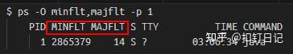

# JVM内存常见疑问

## 为什么我设置了-Xmx为10G，top中看到的rss却大于10G？

根据上面的介绍，JVM内存占用分布大概如下：


可以发现，JVM内存占用主要包含如下部分：

- Java堆，-Xmx选项限制的就是Java堆的大小，可通过jcmd命令观测。
- Java非堆，包含Metaspace、Code Cache、直接内存(DirectByteBuffer、MappedByteBuffer)、Thread、GC，它可通过arthas memory命令或NMT原生内存追踪观测。
- native分配内存，即直接调用malloc分配的，如JNI调用、磁盘与网络io操作等，可通过pmap命令、malloc_stats函数观测，或使用tcmalloc检测泄露点。
- glibc缓存的内存，即JVM调用free后，glibc库缓存下来未归还给操作系统的部分，可通过pmap命令、malloc_stats函数观测。

所以-Xmx的值，一定要小于容器/物理机的内存限制，根据经验，一般设置为容器/物理机内存的65%左右较为安全，可考虑使用比例的方式代替-Xms与-Xmx，如下：

```bash
-XX:MaxRAMPercentage=65.0 -XX:InitialRAMPercentage=65.0 -XX:MinRAMPercentage=65.0
```

## top中VIRT与RES是什么区别？


- VIRT：进程申请的虚拟内存总大小。
- RES：进程在读写它申请的虚拟内存页面后，会触发Linux的内存缺页中断，进而导致Linux为该页分配实际内存，即RSS，在top中叫RES。
- SHR：进程间共享的内存，如libc.so这个C动态库，几乎会被所有进程加载到各自的虚拟内存空间并使用，但Linux实际只分配了一份内存，各个进程只是通过内存页表关联到此内存而已，注意，RSS指标一般也包含SHR。

通过top、ps或pidstat可查询进程的缺页中断次数，如下：
top中可以通过f交互指令，将mMin、mMaj列显示出来。





## 为什么top中JVM进程的VIRT列(虚拟内存)那么大？


可以看到，我们一Java服务，申请了约30G的虚拟内存，比RES实际内存5.6G大很多。

这是因为glibc为了解决多线程内存申请时的锁竞争问题，创建了多个内存分配区Arena，然后每个Arena都有一把锁，特定的线程会hash到特定的Arena中去竞争锁并申请内存，从而减少锁开销。

但在64位系统里，每个Arena去系统申请虚拟内存的单位是64M，然后按需拆分为小块分配给申请方，所以哪怕线程在此Arena中只申请了1K内存，glibc也会为此Arena申请64M。

64位系统里glibc创建Arena数量的默认值为CPU核心数的8倍，而我们容器运行在32核的机器，故glibc会创建`32*8=256`个Arena，如果每个Arena最少申请64M虚拟内存的话，总共申请的虚拟内存为`256*64M=16G`。


然后JVM是直接通过mmap申请的堆、MetaSpace等内存区域，不走glibc的内存分配器，这些加起来大约14G，与走glibc申请的16G虚拟内存加起来，总共申请虚拟内存30G！

当然，不必惊慌，这些只是虚拟内存而已，它们多一些并没有什么影响，毕竟64位进程的虚拟内存空间有2^48字节那么大！

## 为什么jvm启动后一段时间内内存占用越来越多，存在内存泄露吗？

如下，是我们一服务重启后运行快2天的内存占用情况，可以发现内存一直从45%涨到了62%，8G的容器，上涨内存大小为1.36G！


但我们这个服务其实没有内存泄露问题，因为JVM为堆申请的内存是虚拟内存，如4.8G，但在启动后JVM一开始可能实际只使用了3G内存，导致Linux实际只分配了3G。

然后在gc时，由于会复制存活对象到堆的空闲部分，如果正好复制到了以前未使用过的区域，就又会触发Linux进行内存分配，故一段时间内内存占用会越来越多，直到堆的所有区域都被touch到。


而通过添加JVM参数-XX:+AlwaysPreTouch，可以让JVM为堆申请虚拟内存后，立即把堆全部touch一遍，使得堆区域全都被分配物理内存，而由于Java进程主要活动在堆内，故后续内存就不会有很大变化了，我们另一服务添加了此参数，内存表现如下：


可以看到，内存上涨幅度不到2%，无此参数可以提高内存利用度，加此参数则会使应用运行得更稳定。

如我们之前一服务一周内会有1到2次GC耗时超过2s，当我添加此参数后，再未出现过此情况。这是因为当无此参数时，若GC访问到了未读写区域，会触发Linux分配内存，大多数情况下此过程很快，但有极少数情况下会较慢，在GC日志中则表现为sys耗时较高。


# 参考

- [Understanding glibc malloc](https://sploitfun.wordpress.com/2015/02/10/understanding-glibc-malloc/)
- [一次大量 JVM Native 内存泄露的排查分析（64M 问题）](https://juejin.cn/post/7078624931826794503)
- [内存问题探微](https://juejin.cn/post/6903363887496691719)