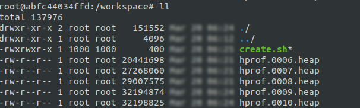
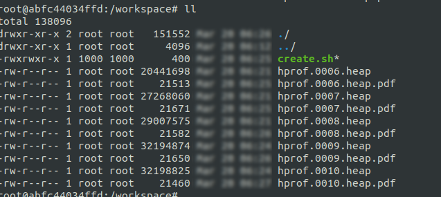

# 分析内存工具

## 使用tcmalloc分析内存

工具：gperftools

### 安装

```bash
# 按需安装，底下./autogen.sh要用到
apt install -y autoconf automake libtool
```

```bash
# 克隆 gperftools 仓库
git clone https://github.com/gperftools/gperftools.git
cd gperftools

# 配置并编译
./autogen.sh
./configure
make
```

编译完成后，在这个位置可以找到需要的so：`gperftools/.libs/libtcmalloc_and_profiler.so`

### 使用

#### 在要监视的应用启动前添加系统变量

> 注意：不要加入系统变量文件中，如果加入就会导致所有使用内存的程序都会分析，导致后续操作无法进行。

```bash
export LD_PRELOAD=/app/gperftools/.libs/libtcmalloc_and_profiler.so
# hprof是前缀，文件名为：hprof.0001.heap  hprof.0002.heap
export HEAPPROFILE=/workspace/hprof
```

#### 执行要分析的程序

```
[root@master ~]# java -jar spring-boot-base-2.x-1.0-SNAPSHOT.jar --server.port=9090
Starting tracking the heap

 .   ____         _           __ _ _
 /\\ / ___'_ __ _ _(_)_ __ __ _ \ \ \ \
( ( )\___ | '_ | '_| | '_ \/ _` | \ \ \ \
 \\/ ___)| |_)| | | | | || (_| | ) ) ) )
  ' |____| .__|_| |_|_| |_\__, | / / / /
 =========|_|==============|___/=/_/_/_/
 :: Spring Boot ::       (v2.1.3.RELEASE)

4312 [main] INFO c.z.s.b.b.SpringBootBaseApplication  - Starting SpringBootBaseApplication on master with PID 54825 (/root/spring-boot-base-2.x-1.0-SNAPSHOT.jar started by root in /root) 
4338 [main] INFO c.z.s.b.b.SpringBootBaseApplication  - The following profiles are active: dev 
13786 [main] INFO o.s.b.w.e.tomcat.TomcatWebServer  - Tomcat initialized with port(s): 9090 (http) 
13892 [main] INFO o.a.coyote.http11.Http11NioProtocol  - Initializing ProtocolHandler ["http-nio-9090"] 
13937 [main] INFO o.a.catalina.core.StandardService  - Starting service [Tomcat] 
13938 [main] INFO o.a.catalina.core.StandardEngine  - Starting Servlet engine: [Apache Tomcat/9.0.16] 
13994 [main] INFO o.a.c.core.AprLifecycleListener  - The APR based Apache Tomcat Native library which allows optimal performance in production environments was not found on the java.library.path: [/usr/java/packages/lib/amd64:/usr/lib64:/lib64:/lib:/usr/lib] 
14350 [main] INFO o.a.c.c.C.[Tomcat].[localhost].[/]  - Initializing Spring embedded WebApplicationContext 
14351 [main] INFO o.s.web.context.ContextLoader  - Root WebApplicationContext: initialization completed in 9554 ms 
Dumping heap profile to /data/google-perftools/heap/hprof.0001.heap (1024 MB allocated cumulatively, 76 MB currently in use)
17685 [main] INFO o.s.s.c.ThreadPoolTaskExecutor  - Initializing ExecutorService 'applicationTaskExecutor' 
```

启动日志中出现 `Starting tracking the heap、Dumping heap profile to /data/google-perftools/heap/hprof.0001.heap (1024 MB allocated cumulatively, 76 MB currently in use)`等字样代表监测成功

结果会在前面设置的/workspace中出现



此时已经可以分析结果了

#### 生成pdf

安装pprof

pprof 是 TCMalloc（Google Performance Tools）中的一个性能分析工具，用于分析 heap profile 文件。它的位置取决于你如何安装 TCMalloc 或 gperftools

```bash
# 对于ubuntu，安装的工具叫做：安装google-perftools
sudo apt install google-perftools
```

这个工具安装完后，工具名为：google-pprof

然后生成pdf，写好的脚本如下

```bash
#!/bin/bash

# 定义文件名列表
heap_files=(
  "hprof.0006.heap"
  "hprof.0007.heap"
  "hprof.0008.heap"
  "hprof.0009.heap"
  "hprof.0010.heap"
)

# 遍历文件名列表并生成 PDF 报告
for heap_file in "${heap_files[@]}"; do
  pdf_file="${heap_file}.pdf"
  google-pprof --pdf /usr/bin/java "/workspace/$heap_file" > "/workspace/$pdf_file"
  echo "Generated PDF report for $heap_file"
done
```




## 使用jemalloc分析内存

### 安装

```bash
wget https://github.com/jemalloc/jemalloc/releases/tag/5.2.1
tar -jxvf jemalloc-5.2.1.tar.bz2 \
cd jemalloc-5.2.1 \
./configure --enable-prof \
make \
make install
export 
```

### 使用

```
jeprof --show_bytes --pdf `which w` /workspace/bigdata/$heap_file > /workspace/bigdata/$pdf_file
```

# 参考

- [已安装 autoconf 还是提示 ./autogen.sh: autoreconf: not found](https://blog.csdn.net/h799710/article/details/113101458)
- [Java直接内存泄漏排查工具gperftools使用方法](https://blog.csdn.net/zw547779770/article/details/104085133)
- [使用 gperftools 分析程序性能](https://luyuhuang.tech/2022/04/10/gperftools.html)