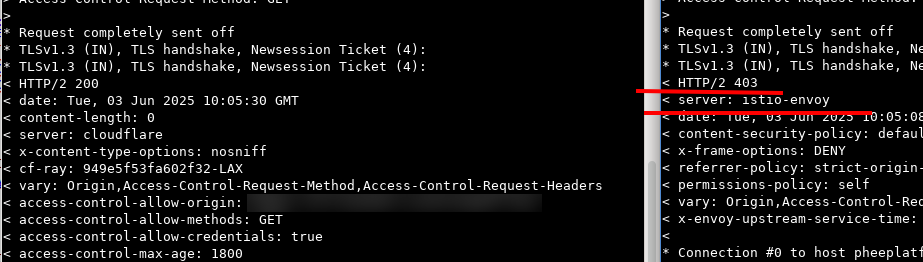

# 常用命令

## 查找目录下所有文件的具体内容

```bash
grep -r "搜索字符串" /your/directory
```

## 跨域

```bash
curl -X OPTIONS -H "Origin: https://aaa.com/" -H "Access-Control-Request-Method: GET" -v "https://bbb.com"
```

用于测试跨域资源共享（CORS）配置，向目标服务器发起 预检请求（Preflight Request）。通过发送 OPTIONS 方法的请求，查询目标服务器是否允许来自指定源（Origin）的 GET 请求，以验证跨域访问的权限

