# 内存问题探微

# 虚拟内存与物理内存

首先我们来先看看虚拟内存与物理内存，虚拟内存和物理内存的关系印证了一句名言，「操作系统中的任何问题都可以通过一个抽象的中间层来解决」，虚拟内存正是如此。

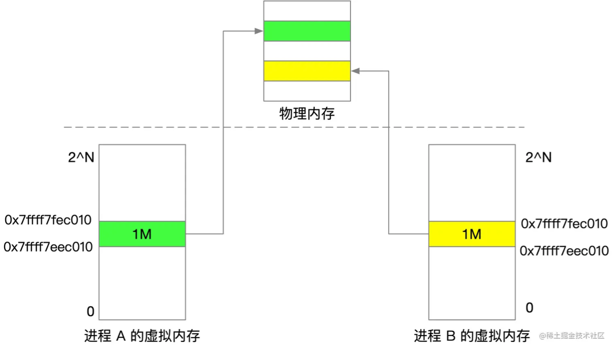

没有虚拟内存，进程直接就可能修改其它进程的内存数据，虚拟内存的出现对内存使用做好了隔离，每个进程拥有独立的、连续的、统一的虚拟地址空间（好一个错觉）。像极了一个恋爱中的男人，拥有了她，仿佛拥有了全世界。

应用程序看到的都是虚拟内存，通过 MMU 进行虚拟内存到物理内存的映射，我们知道 linux 内存是按 4k 对齐，4k = 2^12 ，虚拟地址中的低 12 位其实是一个偏移量。

现在我们把页表想象为一个一维数组，对于虚拟地址中的每一页，都分配数组的一个槽位，这个槽位指向物理地址中的真正地址。那么有这么一个虚拟内存地址 0x1234010，那 0x010 就是页内偏移量，0x1234 是虚拟页号，CPU 通过 MMU 找到 0x1234 映射的物理内存页地址，假定为 0x2b601000，然后加上页内偏移 0x010，就找到了真正的物理内存地址 0x2b601010。如下图所示。

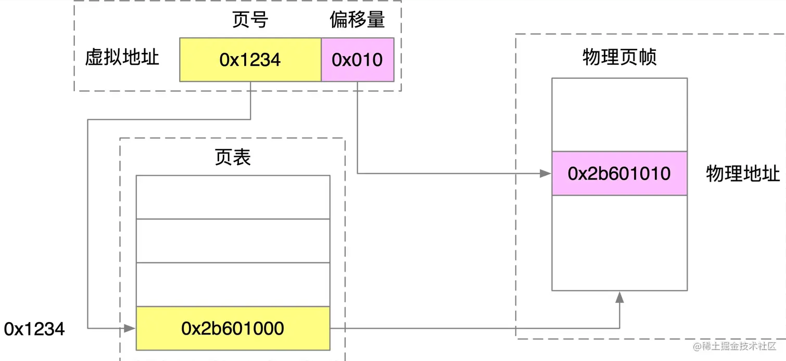

## 比喻说明这个问题

假设你住在一个超大的小区里，每家每户都有一个**虚拟门牌号**（比如`0x1234010`），但实际上这个门牌号不是真实的物理位置。小区物业（**操作系统**）为了管理方便，把所有房子分成了很多**固定大小的单元楼**（每栋楼的大小是4KB，也就是4096个房间），然后做了一个**总目录表**（**页表**）来记录虚拟门牌号和真实位置的对应关系。

### 具体过程

1. **拆解虚拟门牌号**：  
   - 比如你的虚拟门牌号是`0x1234010`，物业规定：  
     - **前几位（`0x1234`）是“单元楼号”**（虚拟页号）。  
     - **最后三位（`0x010`）是“房间号”**（页内偏移量），表示你在这栋楼里的具体位置。

2. **查总目录表**：  
   - 物业的MMU（**地址翻译员**）拿着你的“单元楼号”（`0x1234`）去查**总目录表**（页表），发现这栋楼在物理世界的真实位置是`0x2b601000`这栋楼。

3. **找到真实地址**：  
   - 翻译员把真实单元楼的位置（`0x2b601000`）和你的房间号（`0x010`）拼在一起，得到真实的物理地址：`0x2b601010`。  
   - 这就是你实际住的房子！

### 为什么要这么麻烦？
- **灵活管理**：物业（操作系统）可以动态调整单元楼的分配，比如有些楼暂时没人住，可以标记为“未分配”，省下物理空间。  
- **隐私保护**：每个住户（进程）看到的都是虚拟门牌号，不知道别人的真实位置，互相隔离。  
- **扩展空间**：即使物理小区只有100栋楼，物业可以假装说有1000栋楼（虚拟地址空间），不够用时再慢慢协调（比如把不常用的楼数据暂时存到硬盘里）。

### 总结
- **虚拟地址**就像你看到的门牌号，是“假的”。  
- **物理地址**是实际位置，藏在背后。  
- **MMU**就是那个查表拼地址的翻译员。  
- **4KB对齐**相当于规定每栋楼必须刚好有4096个房间，方便管理。  
- **页表**就是那个总目录，记录哪栋虚拟楼对应哪栋真实楼。  

整个过程就像快递员根据你的快递单号（虚拟地址），先查仓库分区（页表），再找到具体的货架位置（物理地址）一样！

# Linux 四级页表

但是这种方式有一个很明显的问题，虚拟地址空间可能会非常大，就算拿 32 位的系统为例，虚拟地址空间为 4GB，用户空间内存大小为 3GB，每页大小为 4kB，数组的大小为 786432(1024 * 1024)。每个页表项用 4 个字节来存储，这样 4GB 的空间映射就需要 3MB 的内存来存储映射表。（备注：这里很多资料说的是 4M，也没有太大的问题，我这里的考虑是内核空间是共用的，不用太过于纠结。）

对于单个进程来说，占用 3M 看起来没有什么，但是页表是进程独占的，每个进程都需要自己的页表，如果有一百个进程，就会占用 300MB 的内存，这还仅仅是做地址映射所花的内存。如果考虑 64 位系统超大虚拟地址空间的情况，这种一维的数组实现的方式更加不切实际。

为了解决这个问题，人们使用了 level 的概念，页表的结构分为多级，页表项的大小只与虚拟内存空间中真正使用的多少有关。之前一维数组表示的方式页表项的多少与虚拟地址空间的大小成正比，这种多级结构的方式使得没有使用的内存不用分配页表项。

于是人们想出了多级页表的形式，这种方式非常适合，因为大部分区域的虚拟地址空间实际上是没有使用的，使用多级页表可以显著的减少页表本身的内存占用。在 64 位系统上，Linux 采用了四级页表，

PGD：Page Global Directory，页全局目录，是顶级页表。
PUD：Page Upper Directory，页上级目录，是第二级页表
PMD：Page Middle Derectory，页中间目录，是第三级页表。
PTE：Page Table Entry，页面表，最后一级页表，指向物理页面。
如下图所示。

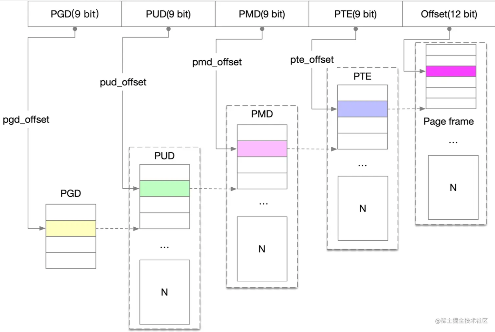


## 比喻说明这个问题

用一个「图书馆找书」的比喻来解释这个问题

### 问题背景：单级页表太占内存

假设你是一个图书管理员，负责管理一个超级大的图书馆（**虚拟地址空间**，比如 4GB 或更大）。图书馆里的每本书（**内存页**）都有一个唯一的编号（**虚拟地址**）。为了快速找到每本书的实际位置（**物理地址**），你需要一个**总目录**（**页表**）。

#### 单级目录的困境

- **笨重的总目录**：  
  如果图书馆有 100 万本书（4GB 虚拟内存，每页 4KB），总目录需要记录每本书对应的实际位置。  
  每本书的记录占 4 字节，总目录大小 = 100 万 × 4B = 4MB。  
  - **问题 1**：如果同时有 100 个读者（**进程**），每个读者都复制一份总目录，总内存占用 = 100 × 4MB = 400MB！  
  - **问题 2**：如果是更大的图书馆（比如 64 位系统的虚拟地址空间），总目录会大到无法存储。

### 解决方案：多级目录（多级页表）

为了解决这个问题，图书管理员发明了**多级目录**，把总目录拆分成多级小目录，按需分配。

#### 举个四级目录的例子

假设图书馆用四级目录管理书籍（类似 Linux 的四级页表）：
1. **PGD（顶级目录）**：  
   类似图书馆的「区域划分」，比如把图书馆分成 A、B、C、D 几个大区。
2. **PUD（二级目录）**：  
   每个大区（比如 A 区）再分成几个楼层（如 A1、A2、A3）。
3. **PMD（三级目录）**：  
   每个楼层（如 A1）再分成几个书架（如 A1-1、A1-2）。
4. **PTE（末级目录）**：  
   每个书架（如 A1-1）记录具体某本书的位置。

#### 关键优势：按需分配
- **未使用的区域不建目录**：  
  比如图书馆的 B 区暂时没有书籍，管理员就不会为 B 区创建楼层和书架的目录，节省了大量空间。  
  - **单级目录**：不管有没有书，都要记录所有 100 万本书的位置。  
  - **多级目录**：只记录实际有书的区域，其他区域直接忽略。

#### 实际效果
- **内存占用大幅减少**：  
  如果大部分区域是空的，多级目录可能只需要记录几千本书的位置，而不是 100 万本。  
- **灵活扩展**：  
  64 位系统的虚拟地址空间极大（比如 128TB），但通过多级目录，只需按需分配实际使用的部分。

### 回到计算机的比喻
1. **虚拟地址**：相当于书的编号（如 `0x1234010`）。  
2. **多级页表**：  
   - **PGD**：先根据地址的高位找到大区（比如 `0x12`）。  
   - **PUD**：在大区里找到楼层（比如 `0x34`）。  
   - **PMD**：在楼层里找到书架（比如 `0x01`）。  
   - **PTE**：在书架上找到具体的书（物理地址的页号），加上偏移量（`0x010`）得到最终位置。  
3. **节省内存**：  
   如果某块大区（如 `0x12`）完全未使用，对应的 PUD、PMD、PTE 目录根本不会被创建！

### 总结

- **单级页表**：像一本超厚的电话黄页，不管有没有人用，所有号码都印上去。  
- **多级页表**：像智能分层的快递分拣系统，只有实际存在的包裹才分配分拣格。  
- **核心思想**：  
  通过分级管理，只记录实际使用的内存区域，大幅减少页表的内存占用，尤其适合 64 位系统的超大地址空间。

这样一来，即使系统中有成百上千个进程，每个进程的页表也不会占用太多内存，就像图书馆即使有大量读者，每人只需拿自己需要的目录册，而不是扛着整个总目录！

# 进程的内存布局

前面提到了虚拟内核和物理内存的关系，我们知道 linux 上的可执行文件的格式是 elf，elf 是一个静态文件，这个静态文件由不同的分节组成，我们这里叫它 section，在运行时，部分跟运行时相关的 Section 会被映射到进程的虚拟地址空间中，比如图中的代码段和数据段。除了这部分静态的区域，进程启动以后还有大量动态内存消耗区，比如栈、堆、mmap 区。

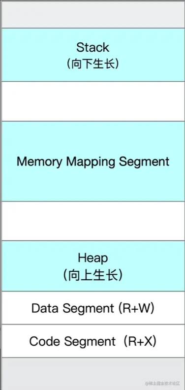

下面这个图是我们线上 java 服务使用 pmap 输出的内存布局的一部分，如下图所示。

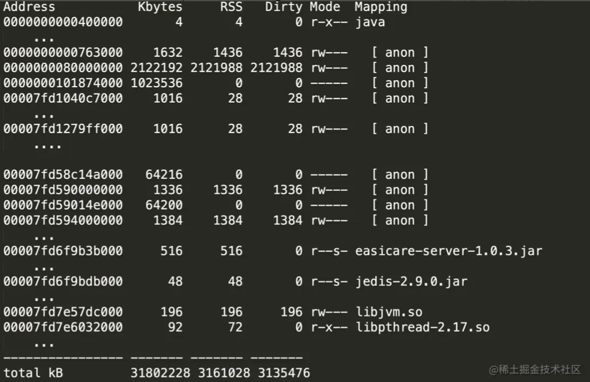

## 比喻说明这个问题

举个「建房子」的比喻来解释这段话：

### 1. 可执行文件（ELF）就像一份建房图纸

- **ELF 文件**：想象它是一个详细的建房图纸，里面规定了房子的结构，比如哪里是厨房（代码段）、哪里是储物间（数据段）、哪里是装修说明（其他信息）。
- **Section（节）**：图纸被分成了不同的“模块”（比如厨房设计模块、电路图模块、水管图模块），这些模块在图纸里是**静态固定**的，就像书里的章节一样。

### 2. 进程启动：按图纸盖房子
当程序运行（相当于开始盖房子）时，操作系统会：

**加载必要的模块到内存**：  
- 比如厨房（代码段）和水管图（初始化数据）这些关键部分会被“搬到工地”（**映射到虚拟地址空间**），工人（CPU）可以直接按图纸施工。
- 其他不重要的模块（比如装修说明的注释）可能暂时不搬，省工地空间。

### 3. 内存区域分两种类型

#### (1) 静态区域（图纸里固定的部分）

- **代码段（Text Segment）**：  
  相当于厨房的位置和结构，盖好后不能乱改（程序运行时代码不可修改）。
- **数据段（Data Segment）**：  
  比如储物间的货架位置，盖房时已经摆好了（全局变量、静态变量等初始化数据）。

#### (2) 动态区域（盖房时临时发挥的部分）
- **栈（Stack）**：  
  像工地的临时工具箱，工人（函数）随手放工具（局部变量），用完就清空（自动回收）。  
  - 特点：**后进先出**，快速但空间小。
- **堆（Heap）**：  
  像工地上的自由仓库，可以随时扩建或缩小（`malloc`申请内存，`free`释放）。  
  - 特点：**手动管理**，空间大但容易浪费（内存泄漏）。
- **mmap 区**：  
  像租用外部仓库，可以直接把大型设备（文件或共享内存）映射到工地旁，随用随取。  
  - 比如加载一个超大文件（如视频），不用一次性全搬进工地。

### 总结
- **ELF 文件**：是静态图纸，规定了房子的基础结构。  
- **进程内存**：  
  - **静态区域**：按图纸直接盖好的部分（代码、数据）。  
  - **动态区域**：盖房过程中灵活调整的部分（栈、堆、mmap区），用于应对临时需求。  

就像盖房子时，既要有固定设计（静态），也要有临时仓库和工具箱（动态），两者结合才能高效施工（程序运行）！

那怎么来看这些部分呢？这就需要我们深入去理解 Linux 中进程的内存是如何被瓜分的。

# libc 内存管理原理探究

Linux 内存管理有三个层面，第一层是我们的用户管理层，比如我们自己程序的内存池，mysql 的 bufferpool，第二层是 C 的运行时库，这部分代码是对内核的一个包装，方便上层应用更方便的开发，再下一层就是我们的内核层了。

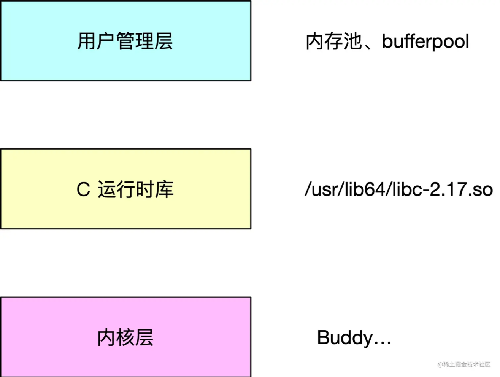

我们今天要重点介绍的就是中间那一层，这一层是由一个 libc 的库来实现的，接下来详细看看看 libc 内存管理是如何做的。

Linux 内存管理的核心思想就是分层管理、批发零售、隐藏内部细节。我们还需要铭记在心的是 libc 中堆的管理是针对小内存分配释放来设计的，为了编程接口上的统一，大内存也是支持的。

我们先来看内存申请释放的两个函数，malloc 和 free，这两个函数的定义如下。

```c
#include <stdlib.h>

void *malloc(size_t size);
void free(void *ptr);
```

这两个函数压根不是系统调用，它们只是对 brk、mmap、munmap 系统调用的封装，那为什么有了这些系统调用，还需要 libc 再封装一层呢？

一个主要原因是因为系统调用很昂贵，而内存的申请释放又特别频繁，所以 libc 采取的的方式就是批量申请，然后作为内存的黄牛二道贩子，慢慢零售给后面的应用程序。

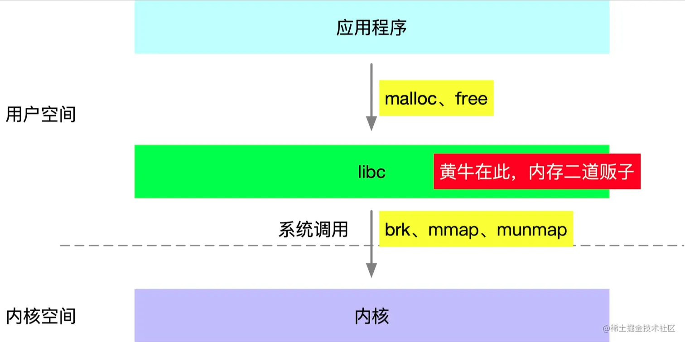

第二个原因是为了编程上的统一，比如有些时候用 brk，有些时候用 mmap，不太友好，brk 在多线程下还需要进行加锁，用一个 malloc 就很香。

## Linux 内存分配器

Linux 的内存分配器有很多种，一开始是 Doug Lea 大神开发的 dlmalloc，这个分配器对多线程支持不友好，多线程下会竞争全局锁，随后有人基于 dmalloc 开发了 ptmalloc，增加了多线程的支持，除了 linux 官方的 ptmalloc，各个大厂有开发不同的 malloc 算法，比如 facebook 出品的 jemalloc，google 出品的 tcmalloc。


这些内存分配器致力于解决两个问题：多线程下锁的粒度问题，是全局锁，还是局部锁还是无锁。第二个问题是小内存回收和内存碎片问题，比如 jemalloc 在内存碎片上有显著的优势。

## ptmalloc 的核心概念

接下来我们来看 Linux 默认的内存分配器 ptmalloc，我总结了一下它有关的四个核心概念：Arena、Heap、Chunk、Bins。

### Arena

先来看 Arena，Arena 的中文翻译的意思是主战场、舞台，对应在内存分配这里，指的是内存分配的主战场。

Arena 的出现首先用来解决多线程下全局锁的问题，它的思路是尽可能的让一个线程独占一个 Arena，同时一个线程会申请一个或多个堆，释放的内存又会进入回收站，Arena 就是用来管理这些堆和回收站的。

Arena 的数据结构长啥样？它是一个结构体，可以用下面的图来表示。

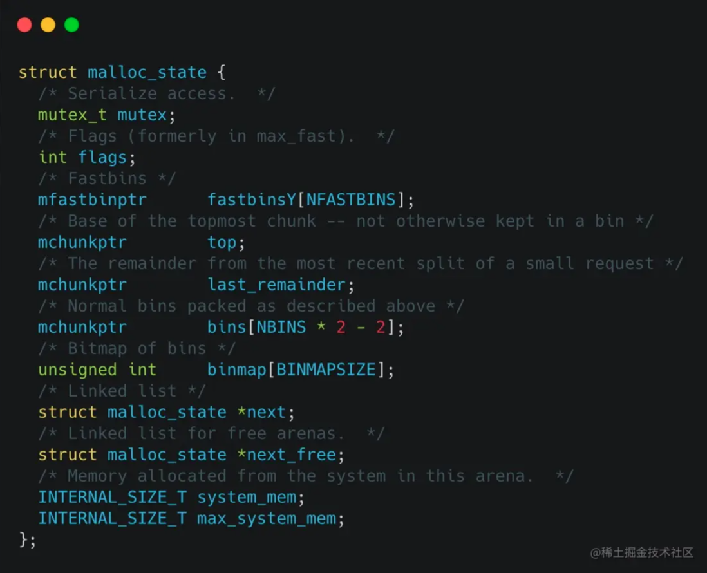

它是一个单向循环链表，使用 mutex 锁来处理多线程竞争，释放的小块内存会放在 bins 的结构中。

前面提到，Arena 会尽量让一个线程独占一个锁，那如果我有几千个线程，会生成几千个 Arena 吗？显然是不会的，所有跟线程有关的瓶颈问题，最后都会走到 CPU 核数的限制这里来，分配区的个数也是有上限的，64 位系统下，分配区的个数大小是 cpu 核数的八倍，多个 Arena 组成单向循环链表。

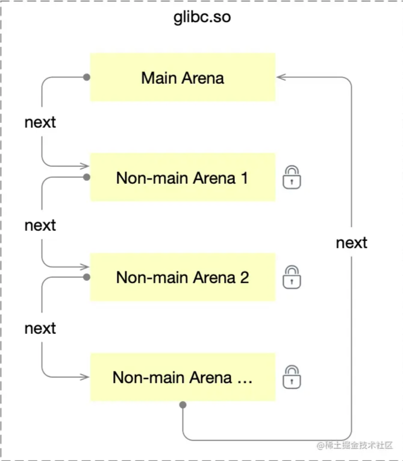

我们可以写个代码来打印 Arena 的信息。它的原理是对于一个确定的程序，main_arena 的地址是一个位于 glibc 库的确定的地址，我们在 gdb 调试工具中可以打印这个地址。也可以使用 ptype 命令来查看这个地址对应的结构信息，如下图所示。

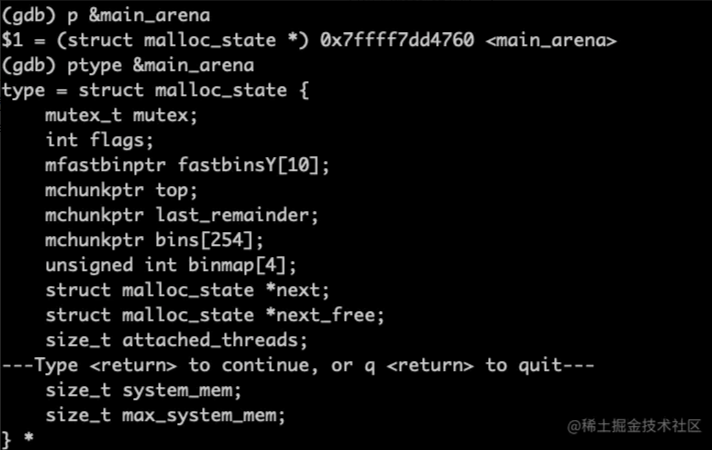

有了这个基础，我们就可以写一个 do while 来遍历这个循环链表了。我们把 main_arena 的地址转为 malloc_state 的指针，然后 do while 遍历，直到遍历到链表头。

```c
struct malloc_state {
    int mutex;
    int flags;

    void *fastbinsY[NFASTBINS];
    struct malloc_chunk *top;
    struct malloc_chunk *last_remainder;
    struct malloc_chunk *bins[NBINS * 2 - 2];
    unsigned int binmap[4];
    struct malloc_state *next;
    struct malloc_state *next_free;

    size_t system_mem;
    size_t max_system_mem;
};

void print_arenas(struct malloc_state *main_arena) {
    struct malloc_state *ar_ptr = main_arena;
    int i = 0;
    do {
        printf("arena[%02d] %p\n", i++, ar_ptr);
        ar_ptr = ar_ptr->next;
    } while (ar_ptr != main_arena);
}

#define MAIN_ARENA_ADDR 0x7ffff7bb8760

int main() {
    ...
    print_arenas((void*)MAIN_ARENA_ADDR);
    return 0;
}
```

输出结果如下

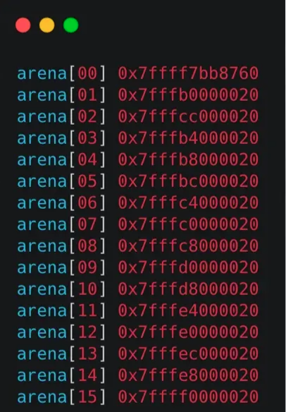

那为什么还要区分一个主分配，一个非主分配区呢？

这有点像皇上和王爷的关系， 主分配区只有一个，它还有一个特权，可以使用靠近 DATA 段的 Heap 区，它通过调整 brk 指针来申请释放内存。

从某种意义上来讲，Heap 区不过是 DATA 段的扩展而已。

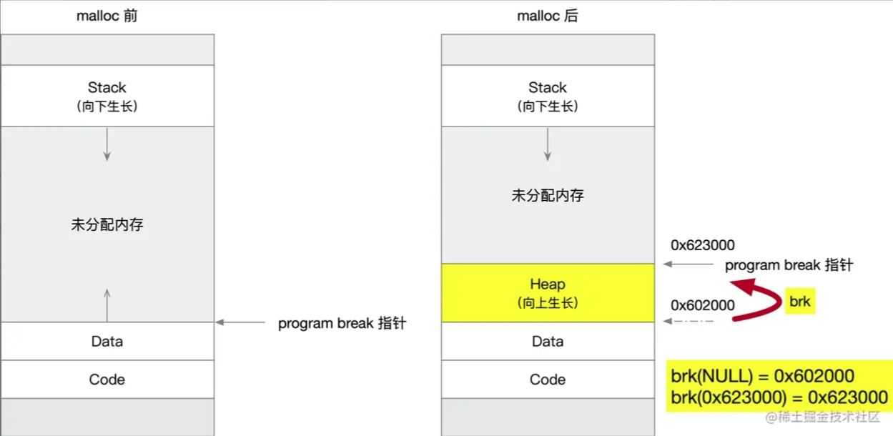

非主分配区呢？它更像是一个分封在外地，自主创业的王爷，它想要内存时就使用 mmap 批发大块内存（64M）作为子堆（Sub Heap），然后在慢慢零售给上层应用。

一个 64M 用完，再开辟一个新的，多个子堆之间也是使用链表相连，一个 Arena 可以有多个子堆。在接下的内容中，我们还会继续详细介绍。

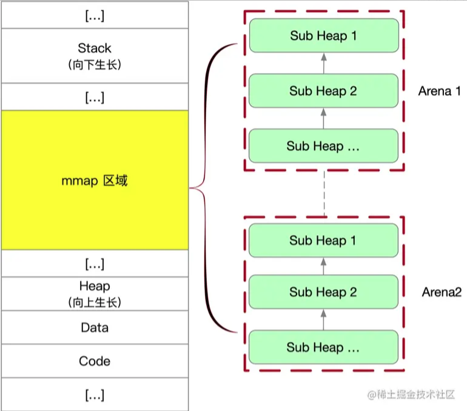


#### 比喻说明这个问题

用一个「中央与地方分权管理」的比喻来解释 ptmalloc 的核心机制：

##### 1. Arena（主战场）：中央与地方的分权

想象一个国家（**进程**）需要管理土地（**内存**），但全国有成千上万的百姓（**线程**）要申请土地。如果只有一个中央衙门（**全局锁**）处理所有申请，百姓会排队排到天荒地老。

###### 解决方案：分设多个地方衙门（Arena）

- **每个 Arena 像一个小诸侯国**：  
  - 每个衙门（Arena）可以独立处理一部分百姓（线程）的土地申请，避免全国挤一个窗口。  
  - 默认规则：一个百姓尽量固定在一个衙门办事（**线程独占 Arena**），减少冲突。  
- **衙门数量有限**：  
  - 全国衙门数量上限是 CPU 核心数的 8 倍（比如 8 核 CPU 最多 64 个衙门）。  
  - 衙门之间组成环形联络网（**单向循环链表**），必要时可以协作。

##### 2. 主分配区 vs 非主分配区：皇帝与王爷

###### (1) 主分配区（皇帝）
- **特权**：  
  - 独享京城核心地块（**靠近 DATA 段的 Heap 区**），通过调整边界（`brk`指针）扩张领土。  
  - 相当于皇帝直接控制京郊土地，灵活小规模扩张。  
- **特点**：  
  - 全国只有一个主分配区（皇帝唯一）。  
  - 适合处理小内存请求（如 `malloc(100)`）。

###### (2) 非主分配区（分封的王爷）

- **自主创业**：  
  - 王爷不能动京城土地，但可以自己开疆拓土——通过 `mmap` 向国家申请大片荒地（**64MB 的 Sub Heap**）。  
  - 荒地用完后，再申请新荒地，多个荒地连成链表管理。  
- **适合场景**：  
  - 处理大内存需求（如 `malloc(1GB)`），或线程太多时分担主分配区的压力。

##### 3. Heap 与 Sub Heap：土地管理模式

- **Heap（京城土地）**：  
  - 主分配区的专属地块，通过 `brk` 慢慢扩张（像京郊开发新区）。  
  - 适合小规模、频繁的申请（如百姓盖小平房）。  
- **Sub Heap（王爷的封地）**：  
  - 非主分配区一次性批发 64MB 荒地，内部再分割零售（如开发商建小区）。  
  - 用完后可再申请新封地，旧封地可能回收（`munmap`）或保留复用。

##### 4. Chunk 与 Bins：土地块与回收站

- **Chunk（土地块）**：  
  - 内存分配的最小单位，像划分好的宅基地（如 16B、32B、... 不同尺寸）。  
  - 百姓申请土地时，衙门按需求分配一块合适的 Chunk。  
- **Bins（回收站分类箱）**：  
  - 百姓归还土地（`free`）后，衙门把 Chunk 按大小分类丢进不同的回收箱（Bins）。  
  - 下次有人申请时，优先从回收箱找合适的地块，减少开垦新地的开销。  
  - 比如：小号箱放 16B 地块，中号箱放 128B 地块，大号箱放 1KB 地块。

##### 总结

- **Arena**：分权衙门，解决多线程排队问题。  
- **主分配区**：皇帝直属，管京郊小地块（Heap）。  
- **非主分配区**：王爷封地，管外部大地块（Sub Heap）。  
- **Chunk**：划分好的宅基地。  
- **Bins**：回收站，分类存放二手地块。  

就像国家通过分封制管理土地：
- 小需求找京城衙门（主分配区 + Heap），灵活高效。  
- 大需求找王爷封地（非主分配区 + Sub Heap），批量处理。  
- 回收的土地进分类箱（Bins），环保复用！

### Heap

接下来我们来看 ptmalloc2 的第二个核心概念 ，heap 用来表示大块连续的内存区域。

主分配区的 heap 没有什么好讲的，我们这里重点看「非主分配」的子堆（也称为模拟堆），前面提到过，非主分配批发大块内存进行切割零售的。

那如何理解切割零售这句话呢？它的实现也非常简单，先申请一块 64M 大小的不可读不可写不可执行（PROT_NONE）的内存区域，需要内存时使用 mprotect 把一块内存区域的权限改为可读可写（R+W）即可，这块内存区域就可以分配给上层应用了。

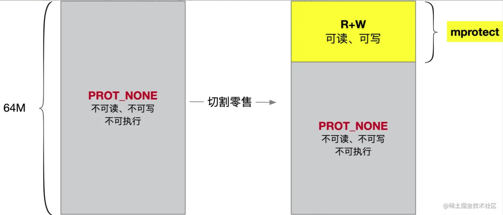

以我们前面 java 进程的内存布局为例

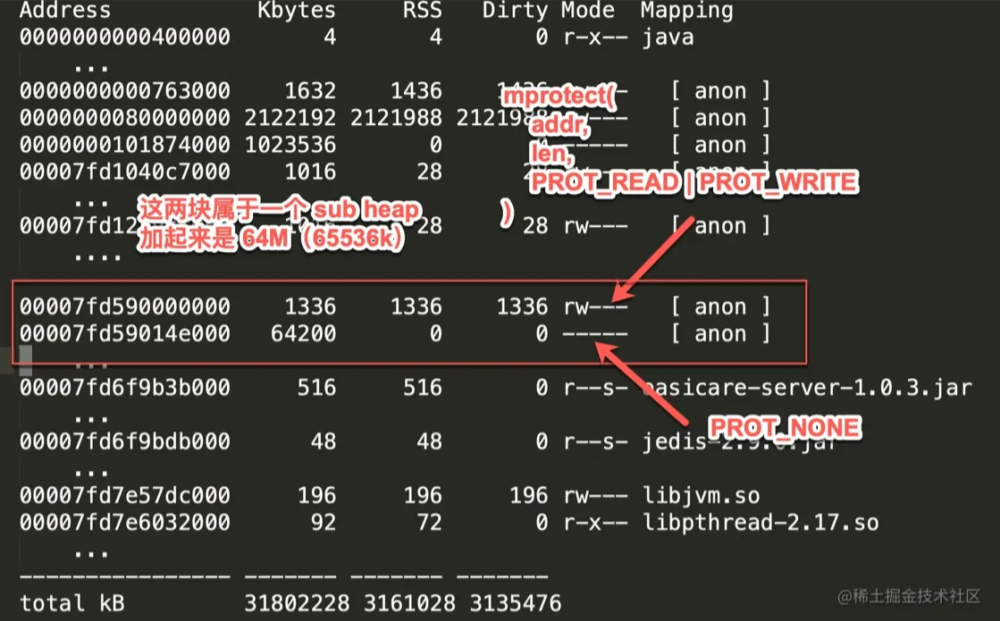

这中间的两块内存区域是属于一个子堆，它们加起来的大小是 64M，然后其中有一块 1.3M 大小的内存区域就是使用 mprotrect 分配出去的，剩下的 63M 左右的区域，是不可读不可写不可执行的待分配区域。

知道这个有什么用呢？太有用了，你在 google 里所有 Java 堆外内存等问题，有很大可能性会搜到 Linux 神奇的 64M 内存问题。有了这里的知识，你就比较清楚到底这 64M 内存问题是什么了。


与前面的 Arena 一样，我们同样可以在代码中，遍历所有 Arena 的所有的 heap 列表，代码如下所示。

```c
struct heap_info {
    struct malloc_state *ar_ptr;
    struct heap_info *prev;
    size_t size;
    size_t mprotect_size;
    char pad[0];
};

void dump_non_main_subheaps(struct malloc_state *main_arena) {
    struct malloc_state *ar_ptr = main_arena->next;
    int i = 0;
    while (ar_ptr != main_arena) {
        printf("arena[%d]\n", ++i);
        struct heap_info *heap = heap_for_ptr(ar_ptr->top);
        do {
            printf("arena:%p, heap: %p, size: %d\n", heap->ar_ptr, heap, heap->size);
            heap = heap->prev;
        } while (heap != NULL);
        ar_ptr = ar_ptr->next;
    }
}

#define MAIN_ARENA_ADDR 0x7ffff7bb8760
dump_non_main_subheaps((void*)MAIN_ARENA_ADDR);
```

### Chunk

接下来我们来看分配的基本单元 chunk，chunk 的字面意思是「厚块; 厚片」，chunk 是 glibc 中内存分配的基础单元。以一个简单的例子来开头。

```c
#include <stdio.h>
#include <stdlib.h>
#include <unistd.h>

int main(void) {
    void *p;

    p = malloc(1024);
    printf("%p\n", p);

    p = malloc(1024);
    printf("%p\n", p);

    p = malloc(1024);
    printf("%p\n", p);

    getchar();
    return (EXIT_SUCCESS);
}
```

这段代码逻辑是连续调用三次 malloc，每次分配 1k 内存，然后我们来观察它的内存地址。

```
./malloc_test

0x602010
0x602420
0x602830
```

可以看到内存地址之间差了 0x410，1024 是等于 0x400，那多出来的 0x10 字节是什么？我们先按下不表。

再来回看 malloc 和 free，那我们不禁问自己一个问题，free 函数的参数只有一个指针，它是怎么知道要释放多少内存的呢？

```c
#include <stdlib.h>

void *malloc(size_t size);
void free(void *ptr);
```

为了存储 1k 的数据，实际上还需要一些数据来记录这块内存的元数据。这块额外的数据被称为 chunk header，长度为 16 字节。这就是我们前面看到的多出来 0x10 字节（十六进制的10,就是十进制的16）。


这种通过在实际数据前面添加 head 方式使用的非常普遍，比如 java 中 new Integer(1024)，虽然看过去，存储`1024`这个数只需要 4 字节，但是实际存储的数据大小远不止 4 字节，它有一个巨大无比的对象头，里面存储了对象的 hashcode，经过了几次 GC，有没有被当做锁同步。

以 new Integer(1024) 为例，其在堆内存中的实际结构如下（以 64 位 JVM 默认开启指针压缩为例）：

| 内存区域            | 大小     | 用途                                          |
| ------------------- | -------- | --------------------------------------------- |
| 对象头（Header）    | 12 字节  | Mark Word（8 字节） + Klass Pointer（4 字节） |
| 实际数据（Data）    | 4 字节   | 存储 int 值（即 1024）                        |
| 对齐填充（Padding） | 0~4 字节 | 确保对象总大小为 8 字节的倍数（内存对齐）     |

总占用：对象头（12 字节） + 数据（4 字节） = 16 字节（无需填充，已对齐）。

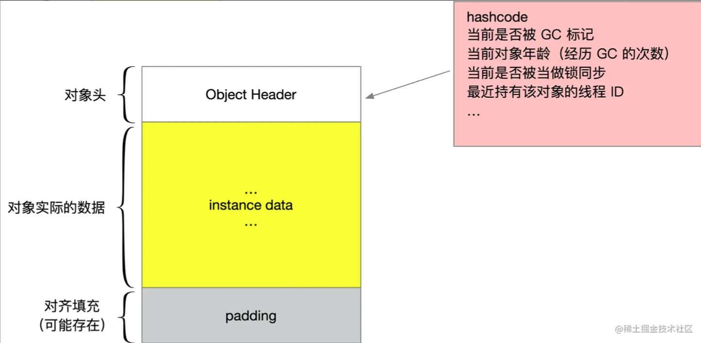

所以，说 java 臃肿并不是没有道理。

我们继续来看这个 16 字节的 header 里面到底存储了什么，它的结构示意图如下所示。

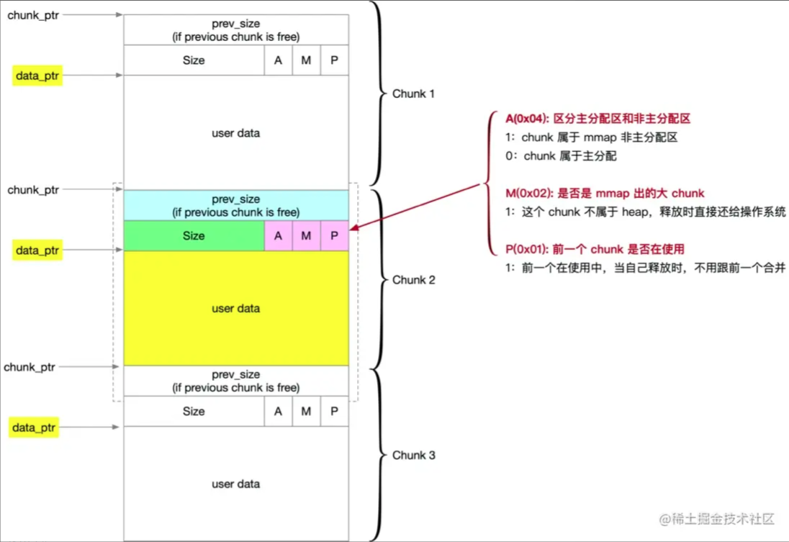

它分为两部分
- prev_size：chunk的头部的前 8 字节表示前一个 chunk 块的大小
- size：chunk的头部的接下来的 8 字节表示当前 chunk 块的大小
  
由于chunk块要按16字节对齐，也就是说size在表示chunk大小的时候，一定是16B的倍数。比如16B，32B，64B。转换成二进制看一下（64位计算机）：

```
16B = 16 × 8：0000 0000 0000 0000 0000 0000 0000 0000 0000 0000 0000 0000 0000 0000 1000 0000
32B = 32 × 8：0000 0000 0000 0000 0000 0000 0000 0000 0000 0000 0000 0000 0000 0001 0000 0000
64B = 64 × 8：0000 0000 0000 0000 0000 0000 0000 0000 0000 0000 0000 0000 0000 0010 0000 0000
```

也就是说，最后4位一定是`0000`，所以低 4 位是没用的，其中三个被用来当做标记位来使用，这三个分别是 AMP，其中 A 表示是否是主分配区，M 表示是否是 mmap 分配的大 chunk 块，P 表示前一个 chunk 是否在使用中。

类比理解：想象你住在一个酒店里：
- 内存块：每个房间（内存块）的门上贴着一张表格（头部），记录房间大小和状态。
- prev_size：如果前一个房间空着，表格会记录它的大小；如果前一个房间有人住（P=1），表格的这部分空间可以放行李（数据）。
- size：表格还记录当前房间的大小，并用小字备注（标记位）说明房间类型（是否主楼层、是否特殊房间等）。

以前面的例子为例，我们可以用 gdb 来查看这部分的内存。

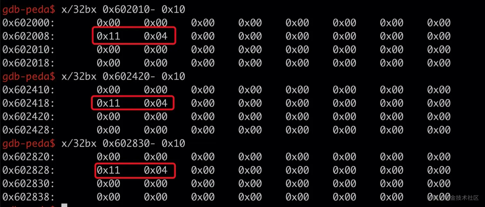

可以看到对应 size 的 8 个字节是 0x0411，这个值是怎么来的呢？其实是按 size + 8 对齐到 16B 再加上低三位的 B001。

```
0x0400 + 0x10 + 0x01 = 0x0411
```

因为当一个 chunk 正在被使用时，它的下一个 chunk 的 prev_size 是没有意义的，这 8 个字节可以被这个当前 chunk 使用。别奇怪，就是这么抠。接下来我们来看看 chunk 中 prev_size 的复用。测试的代码如下。

```c
#include <stdlib.h>
#include <string.h>
void main() {
    char *p1, *p2;
    p1 = (char *)malloc(sizeof(char) * 18); // 0x602010
    p2 = (char *)malloc(sizeof(char) * 1);  // 0x602030
    memcpy(p1, "111111111111111111", 18);
}
```

编译这个源文件，然后使用 gdb 调试单步运行，查看 p1、p2 的地址。

```
p/x p1
$2 = 0x602010

(gdb) p/x p2
$3 = 0x602030
```

然后输出 p1、p2 附近的内存区域。

```
(gdb) x/64bx p1-0x10
0x602000:       0x00    0x00    0x00    0x00    0x00    0x00    0x00    0x00
0x602008:       0x21    0x00    0x00    0x00    0x00    0x00    0x00    0x00
0x602010:       0x31    0x31    0x31    0x31    0x31    0x31    0x31    0x31
0x602018:       0x31    0x31    0x31    0x31    0x31    0x31    0x31    0x31
0x602020:       0x31    0x31    0x00    0x00    0x00    0x00    0x00    0x00
0x602028:       0x21    0x00    0x00    0x00    0x00    0x00    0x00    0x00
0x602030:       0x00    0x00    0x00    0x00    0x00    0x00    0x00    0x00
0x602038:       0x00    0x00    0x00    0x00    0x00    0x00    0x00    0x00
```

布局如下图所示。

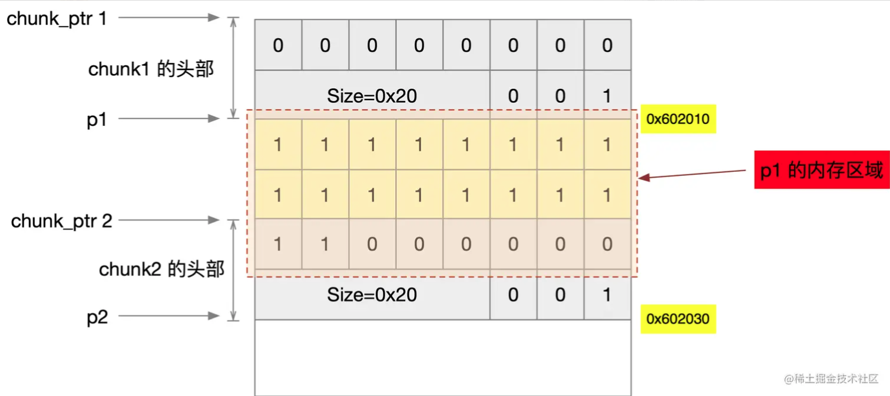

这里只展示了 malloc chunk 的结构，还有 Free chunk、Top chunk、Last Remainder chunk 没有展开，可以参考其它的资料

### Bins

我们接下来看最后一个概念，小块内存的回收站 Bins。

内存的回收站分为两大类，第一类是普通的 bin，一类是 fastbin。当程序释放内存（free）时，glibc 不会立即将内存归还操作系统，而是将内存块（chunk）放入 Bins（回收站），以便后续快速复用
- fastbin
  - 快速处理小块内存（单向链表，固定大小）
  - 采用单向链表，每条链表的中空闲 chunk 大小是确定的，插入删除都在队尾进行。
- 普通 bin
  - 处理较大内存
  - 采用双向链表存储
  - 根据回收的内存大小又分为了 small、large 和 unsorted 三种，它们之间最大的区别就是它们存储的 chunk 块的大小范围不一样。


#### Fastbins：快餐式回收

- 结构：单向链表（类似栈，后进先出）。
- 特点：
  - 每条链表只存 固定大小 的 chunk（如 16B、24B、32B...）。
  - 插入和删除只在链表头部操作，速度极快。
- 适用场景：高频分配的小对象（例如 malloc(16)）。

FastBin 专门用来提高小内存的分配效率，它的结构如下

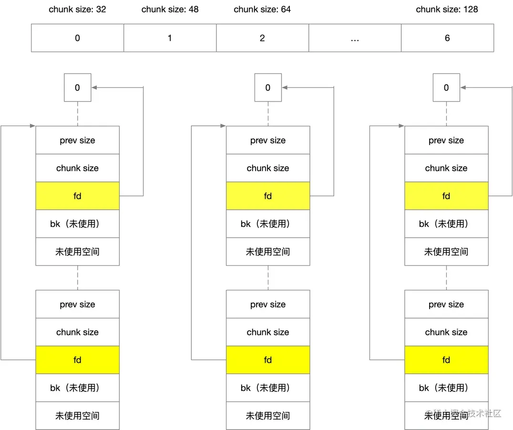

它有下面这些特性。

- 小于 128B 的内存分配会先在 Fast Bin 中查找
- 单向链表，每条链表中的 chunk 大小相同，有 7 个 chunk 空闲链表，每个 bin 的 chunk 大小依次为 32B，48B，64B，80B，96B，112B，128B
- 因为是单向链表，fastbin 中的 bk 指针没有用到，第一个 chunk 的 fd 指针指向特殊的 0 地址
- P 标记始终为 1，一般情况下不合并
- FIFO，添加和删除都从队尾进行
- Fast bins 可以看着是 small bins 的一小部分 cache。

#### 普通 Bins：精细化管理

普通 Bins 分为三类，通过双向链表管理，支持不同大小的内存块：

(1) Unsorted Bin（杂物间）
- 唯一性：只有 1 个 unsorted bin。
- 作用：临时存放刚释放的 chunk，后续再将其分类到 small/large bin。
- 类比：快递分拣中心的中转区，包裹先暂存，再按大小分到不同区域。

(2) Small Bins（小件区）
- 数量：62 个。
- 管理范围：每个 bin 对应固定大小的 chunk（如 16B、32B、48B...）。
- 分配策略：精确匹配大小，若找不到则去 large bin。

(3) Large Bins（大件区）
- 数量：63 个。
- 管理范围：每个 bin 管理一个 区间范围 的 chunk（如 1024B–2048B）。
- 分配策略：在区间内寻找最接近需求大小的 chunk。


接下来我们看这三种 bin 的细节。

普通 bin 采用双向链表存储，以数组形式定义，共 254 个元素，两个数组元素组成一个 bin，通过 fd、bk 组成双向循环链表。所以普通 bin 的总个数是 254/2 = 127 个。其中 unsorted bin 只有 1 个，small 有 62 个，large bin 有 63 个，还有一个暂未使用，如下图所示。

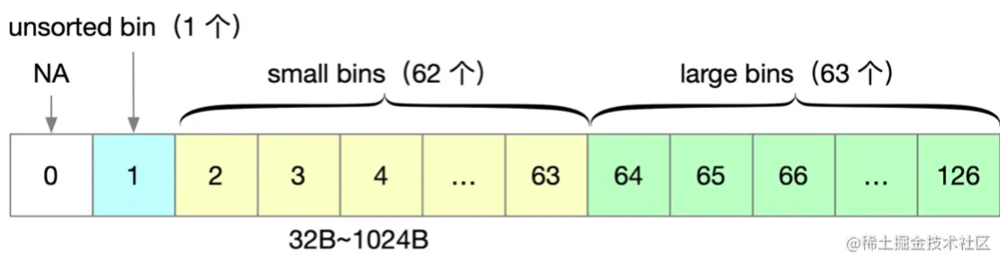

smallbin

其中 smallbin 用于维护 <= 1024B 的 chunk 内存块。同一条 small bin 链中的 chunk 具有相同的大小，都为 index * 16，结构如下图所示。

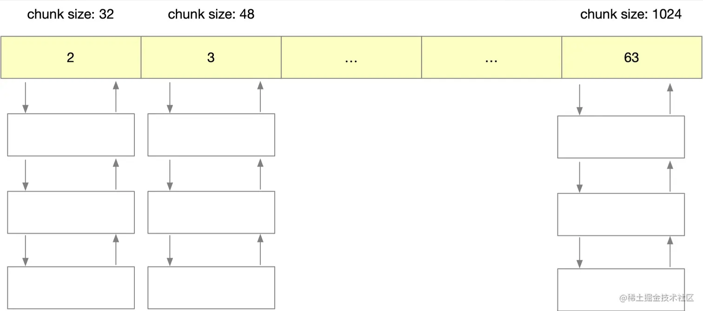

largebin

largebin 中同一条链中的 chunk 具有「不同」的大小
- 分为 6 组
- 每组的 bin 数量依次为 33、15、8、4、2、1，每条链表中的最大 chunk 大小公差依次为 64B、 512B、4096B、32768B、262144B 等

结构如下图所示。

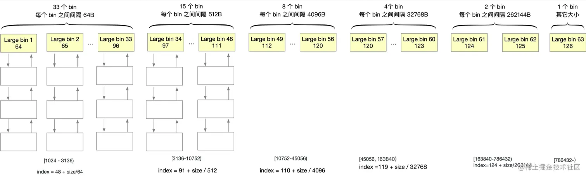

unsorted bin

unsorted bin 只有一条双向链表，它的特点如下。
- 空闲 chunk 不排序
- 大于 128B 的内存 chunk 回收时先放到 unsorted bin

它的结构如下图所示。

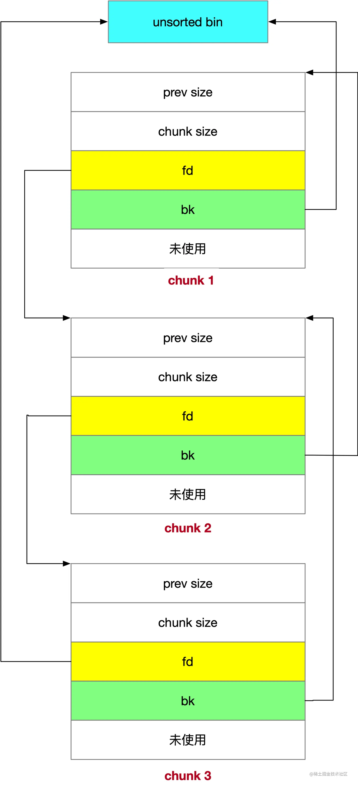

下面是所有普通 bin 的概览图。

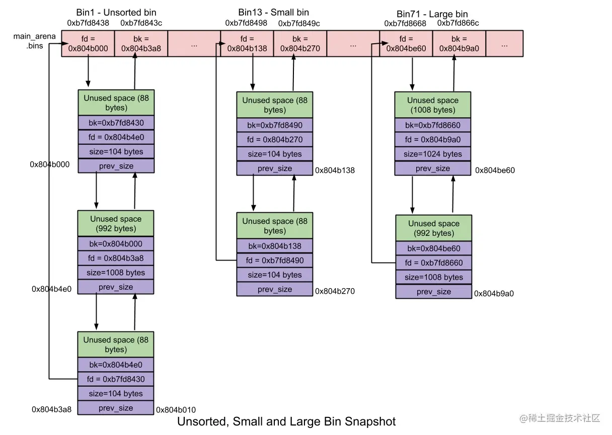

## 内存的申请与释放

有了前面的知识，我们就可以来回答分享一开头的问题，内存从哪里来。大块内存申请没有特别多可以讲的，直接 mmap 系统调用申请一块，释放的时候也直接还给操作系统。

小块内存的申请就复杂很多了，原则就是先在 chunk 回收站中找，找到了是最好，就直接返回了，不用再去向内核申请。它是怎么做的呢？

首先会根据传入的大小计算真正 chunk 的大小，根据这个大小看看在不在 fastbin 的区间里，如果有的话，从 fastbin 直接返回，如果不在则尝试 smallbin，然后如果 smallbin 里没有则会触发一次合并，然后从 unsorted bin 里查找，还没有则会从 Large Bin 查找，如果没有再去切割 top 块，top 块也没有了，则会重新申请 heap 或者调整 heap 的大小，如下图所示。


接下来我们来回答最后一个问题，内存 free 以后去了哪里，根据不同的大小，有不同的处理策略。

- 符合 fastbin 的超小块内存直接放入 fastbin 单链表，快速释放，画外音就是这么点空间，值得我处理半天吗？
- 超大块内存，直接还给内核不进入 bin 的管理逻辑。画外音就是大客户要特殊处理，毕竟大客户是少数情况。
- 大部分是介于中间的，释放的时候首先会被放入 unsorted bin。根据情况合并、迁移空闲块，靠近 top 则更新 top chunk。这才是人生常态啊。

# 栈内存

前面我们介绍的大部分都是堆内存，其实还有一个非常重要的东西是栈内存，LInux 中默认的栈内存大小是 8M，然后外加 4K 的保护区，这 4k 的保护区不可读不可写不可执行，当真有栈越界时可以更早的发现，尽快 fast fail。

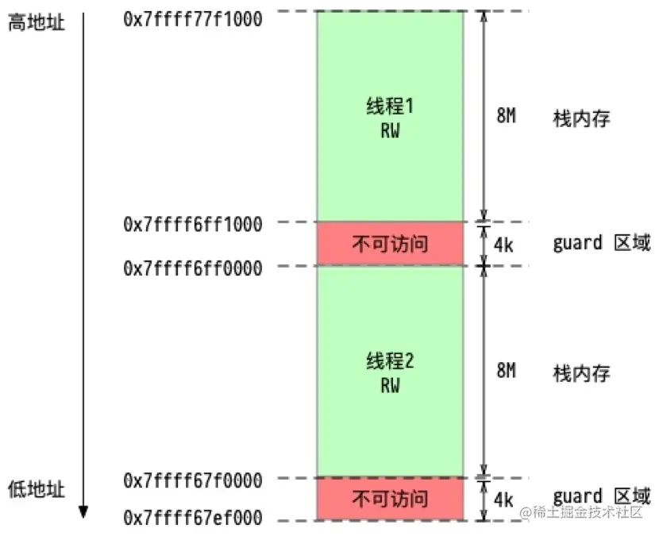

这个图就是一个典型的 linux 原生线程的栈内存布局，可以看到 8M 的栈空间和 4k 的 guard 区域的情况。

对于 Java 来说，它做了一些细微的调整，默认的栈大小空间为 1M，然后有 4k 的 RED 区域和 8K 的 yellow 区域，以便做更细粒度的栈溢出控制。

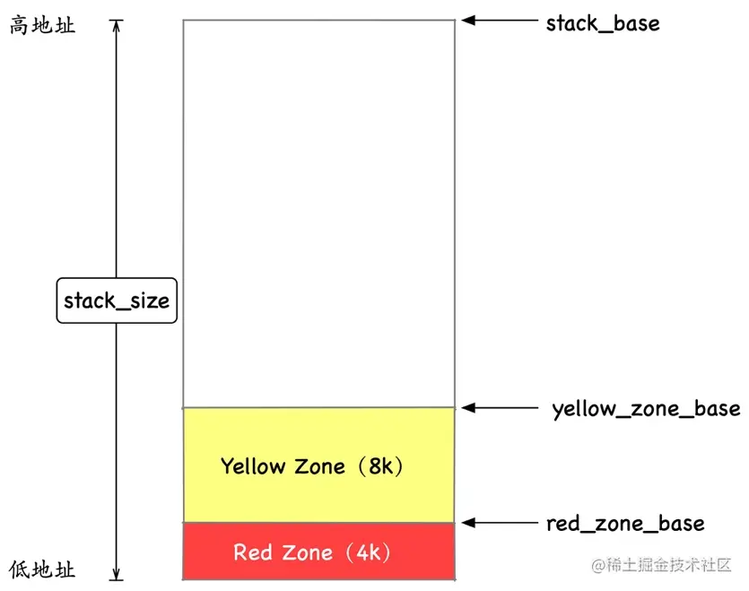

这里的 yellow 区域和 red 区域到底有什么作用，看[附录:java的red区域和yellow区域](#java的red区域和yellow区域)


# 开发相关的内存问题说明

接下来进入我们的最后一个部分，开发相关的内存问题。

## Xmx 与内存消耗

首先要说的是一个问的比较多的问题，为什么我 Java 应用的内存消耗远大于 Xmx，这也是 Stack Overflow 上问的非常多的一个问题。


其实我们要搞清楚，一个进程除了堆消耗内存，还有大量的其他的开销，如下所示。

- Heap
- Code Cache
- GC 开销
- Metaspace
- Thread Stack
- Direct Buffers
- Mapped files
- C/C++ Native 内存消耗
- malloc 本身的开销
- ...

内存大户不是开玩笑的，根据多年实践 Xmx 设置为容器内存的 65% 左右比较合理

## RES 占用

第二个问题是 top 命令中 RES 占用很高，是不是代表程序真正有大量消耗呢？

其实不是的，我们以一个最简单的 java 程序为例，在使用 -Xms1G -Xmx1G 来运行程序时。

```bash
java -Xms1G -Xmx1G MyTest
```

它的内存占用如下。


我们把启动命令稍作改动，加上 AlwaysPreTouch，如下所示。

```bash
# -XX:+AlwaysPreTouch 的作用是 在 JVM 启动时，将 Java 堆内存（Heap）的所有页面预先提交到物理内存，并进行初始化（通常填充为 0）
java -XX:+AlwaysPreTouch -Xms1G -Xmx1G MyTest
```

这个时候 RES 占用如下所示。

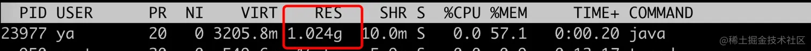

这里的 1G 业务程序其实没有使用，只是 JVM 把内存做了写入，以便后面真正使用时，不用发起缺页中断去真正申请物理内存。

内存占用不是越少越好，还要兼顾 GC 次数、GC 停顿时间。

## 替换默认的内存分配器

默认的 Linux 内存分配器在性能和内存碎片方面表现不是很好，可以尝试替换默认的内存分配器为 jemalloc 或者 tcmalloc，只用新增一个 LD_PRELOAD 环境变量即可。

```bash
LD_PRELOAD=/usr/local/lib/libjemalloc.so
```

在实际的服务中，有一个服务内存占用从 7G 变为了 3G，效果还是非常明显的。

## native 内存分析

Java 的堆内存分析非常容易，jmap 命令 dump 出内存，然后使用 jprofile、mat、perfma 等平台都可以很快的进行分析了。然而对于 native 的内存占用过大，还是比较麻烦的。这里可以使用 jemalloc 和 tcmalloc 强大的 profile 功能。以 jemalloc 为例，可以将内存的申请关系生成 svg。

```bash
export MALLOC_CONF=prof:true,lg_prof_sample:1,lg_prof_interval:30,prof_prefix:jeprof.out

jeprof –svg /path/to/svg jeprof.out.* > out.svg
```

生成的 svg 示意图如下所示。

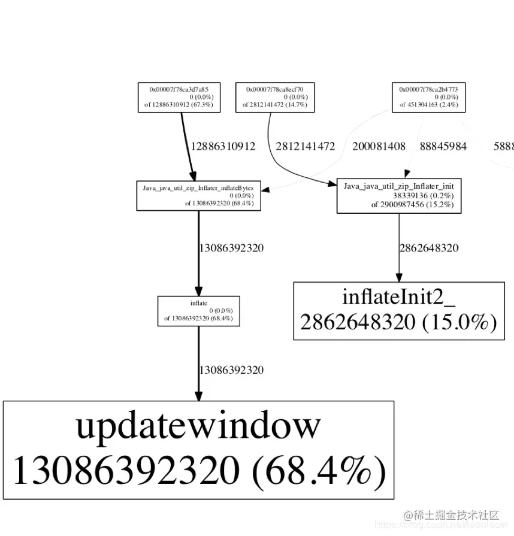

# 参考

- [内存问题探微](https://juejin.cn/post/6903363887496691719)

# 附录

## Java的RED区域和YELLOW区域

Java 虚拟机（JVM）对线程栈内存的管理中引入的 **RED 区域（红色禁区）** 和 **YELLOW 区域（黄色保护区）**，本质上是一种 **防御性设计**，目的是在栈溢出（Stack Overflow）发生时，通过内存空间的隔离和检测机制，尽可能避免程序崩溃或内存损坏，同时提供更细粒度的控制能力。以下是详细解释：

---

### **1. Java 线程栈的默认内存布局**
以 HotSpot JVM 默认配置为例，一个线程的栈内存结构如下（假设默认栈大小为 1MB）：
```
|----------------------------- 1MB -------------------------|
| 正常栈空间（~1016KB） | YELLOW 保护区（8KB） | RED 禁区（4KB） |
```
- **正常栈空间**：用于存储方法调用的栈帧（局部变量、操作数栈、返回地址等）。
- **YELLOW 保护区**：紧邻正常栈空间的 **“缓冲地带”**，用于检测栈溢出。
- **RED 禁区**：位于栈内存末尾的 **“禁区”**，禁止任何读写操作。

---

### **2. YELLOW 和 RED 区域的作用**
#### **(1) YELLOW 保护区（8KB）**
- **功能**：
  - **软性溢出检测**：当线程的栈指针（Stack Pointer）进入 YELLOW 区域时，JVM 会触发栈溢出检查。
  - **抛出 StackOverflowError**：JVM 检测到栈指针进入 YELLOW 区域后，会抛出异常，终止当前线程的执行，但避免直接崩溃。
- **设计意义**：
  - 提供 **“缓冲机会”**，让程序有机会在栈溢出时优雅处理（例如通过 `try-catch` 捕获异常）。
  - 防止栈溢出直接破坏其他内存区域（如堆或相邻线程的栈）。

#### **(2) RED 禁区（4KB）**
- **功能**：
  - **硬性保护**：操作系统将 RED 区域标记为不可访问（通过内存页权限，如 `PROT_NONE`）。
  - **内存安全屏障**：若栈指针越过 YELLOW 区域进入 RED 禁区，会触发操作系统的 **段错误（Segmentation Fault）**，直接终止进程。
- **设计意义**：
  - 作为最后的防线，防止栈溢出导致内存越界（例如覆盖其他线程栈或堆内存）。
  - 避免因栈溢出引发的不可预测行为（如数据损坏、安全漏洞）。

---

### **3. 栈溢出检测机制**
#### **(1) 检测逻辑**
1. **编译时插入检查**：
   - JVM 在编译字节码时，会在 **方法调用前** 插入栈溢出检查代码。
   - 例如，调用方法前检查当前栈指针是否接近 YELLOW 区域。
2. **运行时检测**：
   - 若栈指针进入 YELLOW 区域，JVM 抛出 `StackOverflowError`。
   - 若栈指针进入 RED 区域，操作系统触发段错误（程序崩溃）。

#### **(2) 示例代码分析**
以下递归调用会导致栈溢出：
```java
public class StackOverflowDemo {
    public static void recursiveCall() {
        recursiveCall(); // 无限递归
    }
    public static void main(String[] args) {
        recursiveCall();
    }
}
```
- **执行过程**：
  1. 每次递归调用会消耗栈空间，直到栈指针进入 YELLOW 区域。
  2. JVM 检测到栈溢出，抛出 `StackOverflowError`。
  3. 若未处理异常，进程可能被终止（若栈指针进入 RED 区域）。

---

### **4. 设计原理**
#### **(1) 分层的保护机制**
- **YELLOW 保护区**：提供应用层级的软性保护（抛出异常）。
- **RED 禁区**：提供系统层级的硬性保护（内存隔离）。

#### **(2) 性能与安全的平衡**
- **YELLOW 区域的大小**（8KB）决定了栈溢出检测的灵敏度。较大的 YELLOW 区域会减少误报，但占用更多内存。
- **RED 区域的存在**牺牲了少量内存（4KB），但换取了内存安全性。

---

### **5. 实际应用中的意义**
- **调试帮助**：通过 `StackOverflowError` 的堆栈信息，快速定位递归或深调用链问题。
- **安全加固**：避免栈溢出导致的内存越界攻击（如覆盖返回地址）。
- **资源控制**：通过 `-Xss` 参数调整栈大小（例如 `-Xss2m` 设置栈为 2MB）。

---

### **总结**
- **YELLOW 区域**是 JVM 的“预警区”，用于触发 `StackOverflowError`。
- **RED 区域**是操作系统的“禁区”，用于强制终止内存越界访问。
- 两者共同作用，既允许程序优雅处理栈溢出，又防止内存损坏，体现了 Java 在安全性和健壮性上的设计理念。


