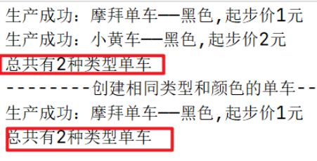

# 享元模式

## 什么是享元模式

享元模式是一种结构型的设计模式。它的主要目的是通过共享对象来减少系统种对象的数量，其本质就是缓存共享对象，降低内存消耗。

享元模式将需要重复使用的对象分为两个部分：内部状态和外部状态。

内部状态是不会变化的，可以被多个对象共享，而外部状态会随着对象的使用而改变。

比如，连接池中的连接对象
- 保存在连接对象中的用户名、密码、连接URL等信息，在创建对象的时候就设置好了，不会随环境的改变而改变，这些为内部状态。
- 而当每个连接要被回收利用时，我们需要将它标记为可用状态，这些为外部状态。

## 角色组成

- 抽象享元角色(FlyWeight)：享元对象抽象基类或者接口,同时定义出对象的外部状态和内部状态的接口或实现;
- 具体享元角色(ConcreteFlyWeight)：实现抽象享元类中的方法，是需要共享的对象类
- 享元工厂(FlyWeightFactory)：维护一个享元对象的池，内部使用一个 Map 存储已经创建的享元对象

## 优缺点

优点：
- 共享大量相似对象，可以避免大量无谓的内存分配和释放操作，缓解垃圾回收器的压力，提高吞吐量。
- 避免对象的重复创建，尤其是在创建大量具有相同属性的对象时，使用享元模式可以大大提高系统的性能和效率，避免出现大量的重复对象占用内存空间，降低系统开销。
- 享元模式的内部状态和外部状态是分离的，内部状态存储在内存中，外部状态可以根据需要进行传递，这样可以有效地降低对象间的耦合度。
- 共享的对象能够在多个线程中安全地共享并发访问，不会有线程安全问题。

缺点：
- 实现比较复杂。在实际开发中，需要对内部状态和外部状态进行较为繁琐的区分。
- 过度共享。如果对象的内部和外部状态没有分清，或者没有合理地设计，可能会导致系统过度共享，导致共享的对象过多。
- 增加代码的复杂度。程序员必须时刻根据系统的实际情况以及内部状态和外部状态的不同选择使用对象池或享元工厂来管理内存和共享对象，进一步增加了系统的复杂度。

## 应用场景

### 生活场景

- 共享单车：在共享单车系统中，每辆车可以看做是一个享元对象。共享的部分是单车的基本属性，比如颜色、价格、型号等。相同型号、价格、颜色的单车可以共享同一个对象，不需要每次创建新的对象。
- 车票预订：在一个车站的车票预订系统中，有许多订票窗口，每个窗口可以处理多个订票请求。每个订票请求都可以看作一个享元对象，而订票窗口可以看作是“享元工厂”。订票窗口根据请求的参数来创建或共享对象，避免创建过多的重复对象，提高了系统的性能。
- 汉字输入法：在汉字输入法中，由于汉字数量很多，为了避免重复创建，使用享元模式，即相同的汉字只需要在内存中创建一次，这样就大大减少了内存的消耗，也加快了输入法的执行速度。

### Java场景

- String 类型：内部维护了一个字符串对象池（即字符串常量池），相同的字符串只会在池中创建一次，之后它们会被多个对象共享，这样可以减少字符串对象的数量，降低内存的使用，并提升系统的效率。
- Integer 类型：对常用的整数值（-127~128）进行了缓存，避免了每次创建新的 Integer 对象，提高了系统的性能。
- 数据库连接池：数据库连接是非常消耗资源的，通过享元模式将连接池内部的连接对象进行复用，减少连接对象的创建和销毁，提高系统的效率和性能。
- 线程池：通过享元模式将线程池中创建的线程对象进行复用，减少了线程的创建和销毁，从而提高系统的性能。

## 代码实现

下面以共享单车为例，解释一下享元模式。每一辆车可以看做是一个享元对象，共享的部分为颜色和价格。

- 抽象享元角色：Bike
- 具体享元角色：Mobike、MTBike
- 享元工厂：BikeFactory

Bike——抽象享元类（FlyWeight）

```java
/**
 * @author Created by njy on 2023/6/21
 * 1.抽象享元类（FlyWeight）：单车
 * 单车有很多共同的信息比如：价格、颜色
 */
public abstract class Bike {
 
    protected String color;
 
    protected int price;
 
    public Bike(String color,int price){
        this.color=color;
        this.price=price;
    }
 
    //展示单车信息
    public abstract void show();
 
}
```

具体享元类（ConcreteFlyWeight）

```java
/**
 * @author Created by njy on 2023/6/21
 * 2.具体享元类（ConcreteFlyWeight）：摩拜单车
 */
public class Mobike extends Bike{
 
    public Mobike(String color,int price){
        super(color,price);
    }
 
    @Override
    public void show() {
        System.out.println("生产成功：摩拜单车——"+color+","+"起步价"+price+"元");
    }
}
```

```java
/**
 * @author Created by njy on 2023/6/21
 * 2.具体享元类（ConcreteFlyWeight）：美团单车
 */
public class MTBike extends Bike{
 
    public MTBike(String color,int price){
        super(color,price);
    }
 
    @Override
    public void show() {
        System.out.println("生产成功：小黄车——"+color+","+"起步价"+price+"元");
    }
}
```

BikeFactory——享元工厂（FlyWeightFactory）

```java
/**
 * @author Created by njy on 2023/6/21
 * 3.享元工厂类（FlyWeightFactory）：单车工厂
 */
public class BikeFactory {
    //map缓存
    public static Map<String,Bike> bikeMap=new HashMap<>();
    public static Bike getBike(String color,String type){
        String key=color+"_"+type;
        if(bikeMap.containsKey(key)){
            //如果已经有该颜色和类型的单车，直接返回
            return bikeMap.get(key);
        }else {
            Bike bike=null;
            //没有，创建并放入缓存
            if("mobike".equals(type)){
                bike=new Mobike(color,1);
            }else if ("MT".equals(type)){
                bike=new MTBike(color,2);
            }else {
                System.out.println("抛异常！没有该类型的单车");
            }
            //放入缓存
            bikeMap.put(key,bike);
            return bike;
        }
    }
}
```

testFlyWeight

```java
/**
 * @author Created by njy on 2023/6/21
 * 享元模式测试类
 */
@SpringBootTest
public class TestFlyweight {
    @Test
    void testFlyweight(){
        //摩拜单车
        Bike bike1 = BikeFactory.getBike("黑色", "mobike");
        //美团单车
        Bike bike2 = BikeFactory.getBike("黑色", "MT");
        bike1.show();
        bike2.show();
        System.out.println("总共有"+BikeFactory.bikeMap.size()+"种类型单车");
 
        System.out.println("--------创建相同类型和颜色的单车----------");
        Bike bike3 = BikeFactory.getBike("黑色", "mobike");
        bike3.show();
        //再次看有多少类型
        System.out.println("总共有"+BikeFactory.bikeMap.size()+"种类型单车");
    }
}
```



## 总结

享元模式其实就是工厂模式的一个改进机制，享元模式同样要求创建一个或一组对象，并且就是通过工厂方法生成对象的，不同的地方在于享元模式增加了缓存的功能。

主要的使用场景：

- 当程序中需要创建大量的相似对象时，可以使用享元模式来共享相同的内部状态，减少对象的重复创建，节省内存开销。
- 当系统运行效率较低，存在大量的内存开销时，可以采用享元模式来优化内存使用，加快程序的执行速度。
- 当系统中的对象访问比较频繁时，可以使用享元模式来优化系统性能，减少重复对象的创建和销毁，提高程序的运行效率。
- 当系统中需要共享一些公共对象或静态数据时，可以使用享元模式来降低系统的开销，提升系统的性能。
- 当系统需要考虑加强安全控制时，可以使用享元模式来保证对对象访问的控制，实现权限控制、缓存控制等功能。
- 从上述不难看出，享元模式适用于需要创建大量相似的对象以及共享公共信息的场景，同时也适用于需要考虑性能优化和共享控制的系统。但是使用之前一定要考虑清楚，还是那句话，不要为了使用设计模式而去使用设计模式。

