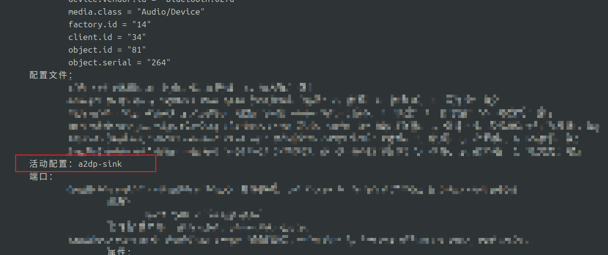

# Ubuntu 24.04 蓝牙耳机速查手册  
（GNOME 46 + PipeWire 0.3.48）

## 一、快速确认蓝牙状态
```bash
# 1. 蓝牙服务
systemctl status bluetooth

# 2. 适配器 & 已配对设备
bluetoothctl list
bluetoothctl paired-devices

# 3. 实时扫描
bluetoothctl scan on
```

## 二、连接耳机（一次性）

```bash
bluetoothctl
[bluetooth]# power on
[bluetooth]# agent on
[bluetooth]# default-agent
[bluetooth]# scan on
# 找到 MAC 后
[bluetooth]# pair C4:D7:38:14:5F:FA
[bluetooth]# trust C4:D7:38:14:5F:FA
[bluetooth]# connect C4:D7:38:14:5F:FA
```

成功后右上角会弹出 “HUAWEI FreeClip Connected”。

## 三、查看 PipeWire 生成的 bluez_card

```bash
# 短名
pactl list cards short | grep bluez
# 详情（100 行以内）
pactl list cards | grep -A100 'bluez_card.C4_D7_38_14_5F_FA'
```

重点看两行：  
- `Profiles:` 列出支持协议  
- `Active Profile:` 当前协议



## 四、命令行切换（100 % 成功）
```bash
# 音乐 / 电影：立体声，无麦
pactl set-card-profile bluez_card.C4_D7_38_14_5F_FA a2dp-sink

# 会议 / 通话：单声道，有麦
pactl set-card-profile bluez_card.C4_D7_38_14_5F_FA headset-head-unit-msbc
```

> 若提示 “无此实体”，先 `systemctl --user restart pipewire-pulse` 或用 `wpctl` 方案（见文末）。

## 五、GUI 切换为何失灵？

1. GNOME Settings → Sound 里选 profile 时，下拉框立即弹回  
2. 日志出现  
   ```
   mod.protocol-pulse: client [GNOME Settings]: ERROR command:-1 … I/O error
   ```

**原因**：GNOME 46 的 libgnome-volume-control 少填字段，PipeWire 0.3.48 校验失败回退。  
**状态**：上游已修，等待 Ubuntu SRU（预计 7 月）。  
**临时替代**：

```bash
sudo apt install pavucontrol
pavucontrol          # Configuration 页切换
```

## 六、一键脚本（放到 `~/bin/bt-profile`）
```bash
#!/usr/bin/env bash
CARD=$(pactl list cards short | awk '/bluez_card/ {print $2}')
case "$1" in
  music)  pactl set-card-profile "$CARD" a2dp-sink ;;
  call)   pactl set-card-profile "$CARD" headset-head-unit-msbc ;;
  *)      echo "Usage: $0 {music|call}" ;;
esac
```
赋权：
```bash
chmod +x ~/bin/bt-profile
```
以后直接 `bt-profile music` / `bt-profile call`。

## 七、常见副作用速查

| 现象               | 原因               | 解决                                                         |
| ------------------ | ------------------ | ------------------------------------------------------------ |
| 切换后无声音       | 音量被压到 0       | `pavucontrol` 把 *Built-in Audio* / *Handsfree* 条拉到 100 % |
| Handsfree 杂音大   | 强制 CVSD          | 用 `headset-head-unit-msbc` 代替默认 `headset-head-unit`     |
| 每次重启都回到 HFP | PulseWire 记忆 bug | 把 `a2dp-sink` 写进上面的自启脚本                            |