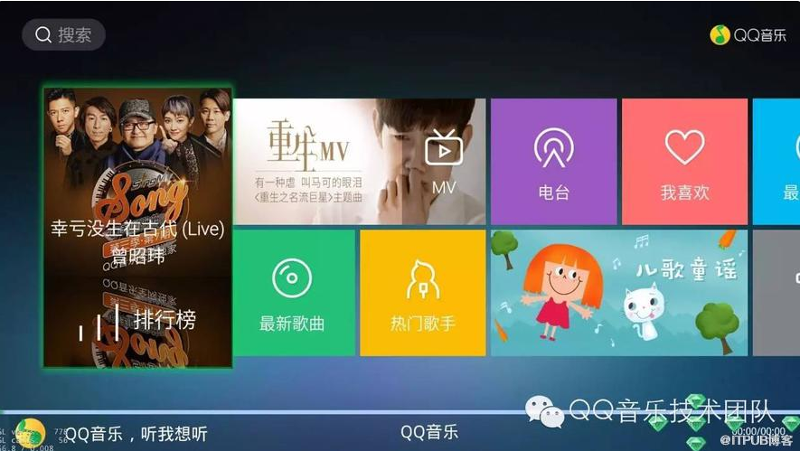

# 谁创建谁销毁，谁分配谁释放——JNI调用时的内存管理

文章来源：https://www.itpub.net/2020/01/02/4987/

在QQ音乐AndroidTV端的Cocos版本的开发过程中，我们希望尽量多的复用现有的业务逻辑，避免重复制造轮子。因此，我们使用了大量的JNI调用，来实现Java层和Native层（主要是C++）的代码通信。一个重要的问题是JVM不会帮我们管理Native Memory所分配的内存空间的，本文就主要介绍如何在JNI调用时，对于Java层和Native层映射对象的内存管理策略。

## 在Java层利用JNI调用Native层代码

如果有Java层尝试调用Native层的代码，我们通常用Java对象来封装C++的对象。

举个例子，在Java层的一个监听播放状态的类：MusicPlayListener，作用是将播放状态发送给位于Native层的Cocos，通知Cocos在界面上修改显示图标，例如“播放”，“暂停”等等。

第一种做法，是在Java类的构造函数中，调用Native层的构造函数，分配Native Heap的内存空间，之后，在Java类的finalize方法中调用Native层的析构函数，回收Native Heap的内存空间。

```java
public class MusicPlayListener {
    // 指向底层对象的指针，伪装成Java的long
    private final long ptr; 

    public MusicPlayListener() {
        ptr = ccCreate();
    }

    // 在finalize里释放
    public void finalize() { 
        ccFree(ptr);
    }

    // 是否正在播放
    public void setPlayState(boolean isPlaying){ 
        ccSetPlayState(ptr,isPlaying);
    }

    private static native long ccCreate();
    private static native void ccFree(long ptr);
    private native void ccSetPlayState(long ptr,boolean isPlaying);
}
```

```c
jlong Java_MusicPlayListener_ccCreate(JNIEnv* env, jclass unused) {
    // 调用构造函数分配内存空间
    CCMusicPlayListener* musicPlayListener = 
        new CCMusicPlayListener(); 
    return (jlong) musicPlayListener;
}

void Java_MusicPlayListener_ccFree(
    JNIEnv* env,
    jclass unused,
    jlong ptr) {
        // 释放内存空间   
        delete ptr; 
}

void Java_MusicPlayListener_ccSetPlayState(
    JNIEnv* env,
    jclass unused,
    jlong ptr,
    jboolean isPlaying) {
        //将播放状态通知给UI线程
        (reinterpret_cast<CCMusicPlayListener*>(ptr))->setPlayState(isPlaying);    
}
```

这种做法会让Java对象和Native对象的生命周期保持一致，当Java对象在Java Heap中，被GC判定为回收时，同时会将Native Heap中的对象回收。

不通过finalize的话，也可以用其他类似的机制适用于上述场景。比如Java标准库提供的DirectByteBuffer的实现，用基于PhantomReference的sun.misc.Cleaner来清理，本质上跟finalize方式一样，只是比finalize稍微安全一点，他可以避免”悬空指针“的问题。

这种方式的一个重要缺点，就是不管是finalize还是其他类似的方法，都依赖于JVM的GC来处理的。换句话说，如果不触发GC，那么finalize方法就不会及时调用，这可能会导致Native Heap资源耗尽，而导致程序出错。当Native层需要申请一个很大空间的内存时，有一定几率出现Native OutOfMemoryError的问题，然后找了半天也发现不了问题在哪里…

第二种方法是对Api的一些简单调整，以解决上述问题。不在JNI的包装类的构造函数中初始化Native层对象，尽量写成open/close的形式，在open的时候初始化Native资源，close的时候释放，finalize作为最后的保险再检查释放一次。

虽然没有本质上的变化，但open/close这种Api设计，一般来说，对90%的开发人员还是能够提醒他们使用close的，至于剩下的10%…好像除了开除也没啥好办法了…

## 在Native层利用JNI调用Java层代码

上一种情况，是以Java层为主导，Native层对象的生命周期受Java层对象的控制。下面要介绍的是另一种情况，即Native层对象为主导，由他控制Java层对象的生命周期。

### Native层操作Java层对象

想要在native层操作Java Heap中的对象，需要位于Native层的引用(Reference)以指向Java Heap中的内存空间。JNI中为我们提供了三种引用：本地引用(Local Reference)，全局引用(Global Reference)和弱全局引用(Weak Global Reference)。

Local Reference的生命周期持续到一个Native Method的结束，当Native Method返回时Java Heap中的对象不再被持有，等待GC回收。一定要注意不要在Native Method中申请过多的Local Reference，每个Local Reference都会占用一定的JVM资源，过多的Local Reference会导致JVM内存溢出而导致Native Method的Crash。但是有些情况下我们必然会创建多个LocalReference，比如在一个对列表进行遍历的循环体内，这时候开发人员有必要调用DeleteLocalRef手动清除不再使用的Local Reference。

```c++
class Coo{
public:
   void Foo(){
     //获得局部引用对象ret
     jobject ret = env->CallObjectMethod();  

    for(int i =0;i<10;i++){
        //获得局部引用对象cret
        jobject cret = env->CallObjectMethod();  

        //...

        //手动回收局部引用对象cret 
        env->DeleteLocalRef(cret);        
    }
  }  //native method 返回，局部引用对象ret被自动回收
};
```

Global Reference的生命周期完全由程序员控制，你可以调用NewGlobalRef方法将一个Local Reference转变为Global Reference，Global Reference的生命周期会一直持续到你显式的调用DeleteGlobalRef，这有点像C++的动态内存分配，你需要记住new/delete永远是成对出现的。

```c++
class Coo{
public:
    void Foo(){
     //获得局部引用对象ret
     jobject ret = env->CallObjectMethod(); 
     //获的全局引用对象gret 
     jobject gret = env->NewGlobalRef(ret);  
 }//native method 返回，局部引用对象ret被自动回收
 //gret不会回收，造成内存溢出
};
```

Weak Global Reference是一种特殊的Global Reference，它允许JVM在Java Heap运行GC时回收Native层所持有的Java对象，前提是这个对象除了Weak Reference以外，没有被其他引用持有。我们在使用Weak Global Reference之前，可以使用IsSameObject来判断位于Java Heap中的对象是否被释放。

### Native层释放的同时释放Java层对象

C++中的对象总会在其生命周期结束时，调用自身的析构函数，释放动态分配的内存空间，Cocos利用资源释放池（其本质是一种引用计数机制）来管理所有继承自cocos2d::CCObject（3.2版本之后变为cocos::Ref）的对象。换言之，对象的生命周期交给Cocos管理，我们需要关心对象的析构过程。

一种简单有效的做法，是在C++的构造函数中，实例化Java层的对象，在C++的析构函数中释放Java层对象。举个例子，主界面需要拉取Java层代码来解析后台协议，获取到主界面的几个图片的URL信息。

先来看显示效果：



再看代码：      

```c++
//C++代码
class CCMainDeskListener
{
public:
    CCMainDeskListener();
    ~CCMainDeskListener();
private:
    //Java层对象的全局引用
    jobject retGlobal;                   
};

CCMainDeskListener::CCMainDeskListener()
{
    //获得本地引用
    jobject ret = CallStaticObjectMethod();   
    //创建全局引用    
    retGlobal = NewGlobalRef(ret); 
    //清除本地引用  
    DeleteLocalRef(ret);             

}

CCMainDeskListener::~CCMainDeskListener()
{
    //清除全局引用
    DeleteGlobalRef(retGlobal);   
}
```

在C++的构造函数中，调用Java层的方法初始化了Java对象，这个引用分配的内存空间位于Java Heap。之后我们创建全局引用，避免Local Reference在Native Method结束之后被回收，而全局引用在析构函数中被删除，这样就保证了Java Heap中的对象被释放，保持Native层和Java层的释放做到同步。

上述方法中，Java层对象的生命周期是跟随Native层对象的生命周期的，Native层对象的生命周期结束时会释放对于Java层对象的持有，让GC去回收资源。我们想进一步了解Native层对象的什么时候被回收，接下来介绍一下Cocos的内存管理策略。

## Cocos的内存管理 

C++中，在堆上分配和释放动态内存的方法是new和delete，程序员要小心的使用它们，确保每次调用了new之后，都有delete与之对应。为了避免因为遗漏delete而造成的内存泄露，C++标准库（STL）提供了auto_ptr和shared_ptr，本质上都是用来确保当对象的生命周期结束时，堆上分配的内存被释放。

Cocos采用的是引用计数的内存管理方式，这已经是一种十分古老的管理方式了，不过这种方式简单易实现，当对象的引用次数减为0时，就调用delete方法将对象清除掉。具体实现上来说，Cocos会为每个进程创建一个全局的CCAutoreleasePool类，开发人员不能自己创建释放池，仅仅需要关注release和retain方法，不过前提是你的对象必须要继承自cocos2d::CCObject类（3.0版本之后变为cocos2d::Ref类），这个类是Cocos所有对象继承的基类，有点类似于Java的Object类。

当你调用object->autorelease()方法时，对象就被放到了自动释放池中，自动释放池会帮助你保持这个obejct的生命周期，直到当前消息循环的结束。在这个消息循环的最后，假如这个object没有被其他类或容器retain过，那么它将自动释放掉。例如，layer->addChild(sprite)，这个sprite增加到这个layer的子节点列表中，他的声明周期就会持续到这个layer释放的时候，而不会在当前消息循环的最后被释放掉。

跟内存管理有关的方法，一共有三个：release()，retain()和autorelease()。release和retain的作用分别是将当前引用次数减一和加一，autorelease的作用则是将当前对象的管理交给PoolManager。当对象的引用次数减为0时，PoolManager就会调用delete，回收内存空间。

release和retain的作用分别是将当前引用次数减一和加一，autorelease的作用则是将当前对象的管理交给PoolManager。当对象的引用次数减为0时，PoolManager就会调用delete，回收内存空间。

一般情况下，我们需要记住的就是继承自Ref的对象，使用create方法创建实例后，是不需要我们手动delete的，因为create方法会自己调用autorelease方法。

## 总结

JNI调用时，即可能造成Native Heap的溢出，也可能造成Java Heap的溢出，作为JNI软件开发人员，应该注意以下几点：

Native层（一般是C++）本身的内存管理。
不使用的Global Reference和Local Reference都要及时释放。
Java层调用JNI时尽量使用open/close的格式替代构造函数/finalize的方式。

