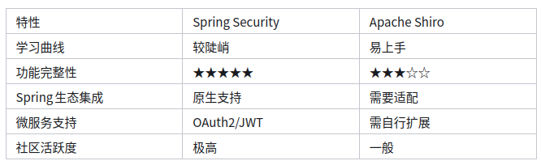
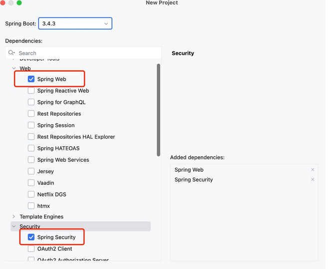
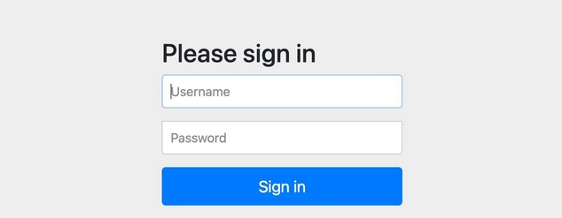
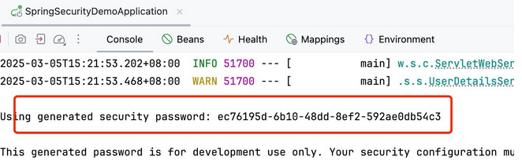

# 初识SpringSecurity安全框架

Spring Security 作为Spring 生态系统中的核心组件，通过提供认证（Authentication）与授权（Authorization）和针对常见攻击等一系列安全功能，为开发者构建安全稳定的应用提供了强有力的支持。

## 什么是Spring Security？

Spring Security是一个基于Spring框架的强大安全解决方案，它为应用提供了一整套安全服务，主要包括以下几个方面：

- 认证（Authentication）： 确定访问者身份的过程。Spring Security通过多种方式（如表单登录、Basic认证、OAuth2等）实现用户身份验证。
- 授权（Authorization）： 根据用户身份和权限确定资源访问级别。开发者可以通过配置或注解的方式，灵活地控制不同用户对不同资源的访问权限。
- 防护机制： 包括防止跨站请求伪造（CSRF）、点击劫持等攻击手段，保障应用在网络攻击面前的稳定性。

这种以拦截器和过滤器链为核心的设计，使得Spring Security能够在请求到达业务逻辑之前，先进行安全检查，从而构建出一层坚固的防护屏障。

## 同类框架对比

说到安全框架，我们就不得不提另外一个轻量级的安全管理框架 Apache Shiro ，它有三个核心组件：Subject, SecurityManager 和 Realms , Shiro 的相关内容大家可以自行学习，这里不做过多介绍了



通过上述的对比图，可以总结出：

- Spring Security是一个重量级的安全管理框架；Shiro则是一个轻量级的安全管理框架
- Spring Security 上手稍有难度，Shiro 的配置和使用比较简单
- Shiro 依赖性低，不需要任何框架和容器，可以独立运行
- 如果你的项目基于Spring容器，那么优先推荐Spring Security

## Spring Security典型应用场景

### 传统Web应用安全

通过配置实现URL级权限控制

```java
@Configuration
@EnableWebSecurity
public class WebSecurityConfig {
    @Bean
    public SecurityFilterChain securityFilterChain(HttpSecurity http) throws Exception {
        http
            .authorizeHttpRequests(auth -> auth
                .requestMatchers("/admin/**").hasRole("ADMIN")
                .anyRequest().authenticated()
            )
            .formLogin(form -> form
                .loginPage("/login")
                .permitAll()
            );
        return http.build();
    }
}
```

### 前后端分离架构

- JWT令牌自动校验
- 无状态会话管理
- 跨域安全配置(CORS)

### 微服务安全网关

资源服务器配置示例

```java
spring:
  security:
    oauth2:
      resourceserver:
        jwt:
          issuer-uri: http://auth-server:9000
```

## 快速搭建安全环境

### 搭建



```xml
<dependencies>
    <dependency>
        <groupId>org.springframework.boot</groupId>
        <artifactId>spring-boot-starter-web</artifactId>
    </dependency>
    <dependency>
        <groupId>org.springframework.boot</groupId>
        <artifactId>spring-boot-starter-security</artifactId>
    </dependency>
</dependencies>
```

### 测试安全访问

创建测试控制器，我们希望访问 /public 无需验证身份，访问 /private 需要用户登录

```java
@RestController
public class DemoController {

    @GetMapping("/public")
    public String publicApi() {
        return "无需认证的公开接口";
    }

    @GetMapping("/private")
    public String privateApi() {
        return "需要登录的私有接口";
    }
}
```

现在我们不管访问哪一个接口地址，均会跳出一个登陆页



账号默认user，密码由Spring Security自动帮我们生成，观察控制台



### 实现URL身份验证

通过上述测试要求，目前我们访问 /public 还是会出现登录要求，接下来我们创建一个配置类，以实现这个需求

```java
@Configuration
public class BasicSecurityConfig {
    // 配置安全策略
    @Bean
    public SecurityFilterChain filterChain(HttpSecurity http) throws Exception {
        http.
                authorizeHttpRequests(authorize -> authorize
                        .requestMatchers("/public/**").permitAll()
                        .anyRequest().authenticated()
                )
                .formLogin(withDefaults())
                .logout(withDefaults());
        return http.build();
    }
}
```

在我们继续访问/public发现已经不再需要身份验证了，可以直接访问测试


上述配置文件中

- requestMatchers("/public/**").permitAll() 表明放行public访问路径下所有接口
- formLogin(withDefaults()) 采用默认的登录处理
- logout(withDefaults()) 采用默认的登出处理

# 来源

- [最新Spring Security实战教程（一）初识Spring Security安全框架](https://zhuanlan.zhihu.com/p/1918386941327550063)