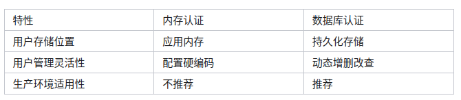
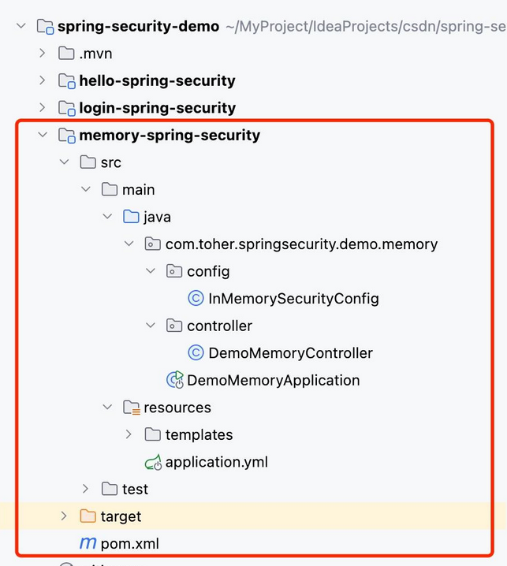
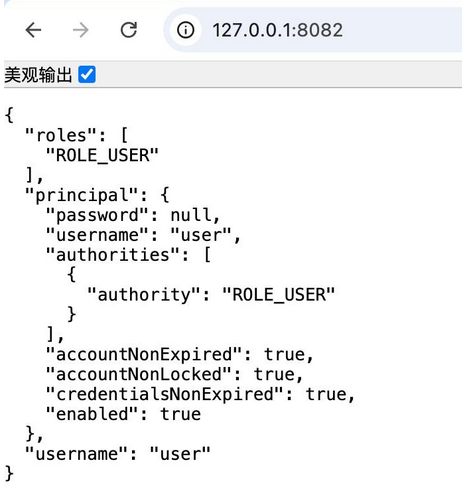

# SpringSecurity_基于内存的用户认证

虽然 Spring Security 基于内存的用户认证，实际开发来说相对来说用的比较少，但某些场景下（如：开发阶段、原型验证、演示环境搭建、单元测试/集成测试、或甚至不需要数据库的简单系统），基于内存的用户认证方式就足以满足需求，为了应对这样需求，必要聊一聊基于内存的用户认证。

## 因何选择内存认证？

就如前面说的场景，总结内存认证主要有以下几个优点：

- 简单快捷：配置简单，不需要依赖数据库或外部存储，适用于快速构建和测试。
- 易于调试：所有用户信息存储在代码中，方便开发过程中快速定位问题。
- 适用于小型应用：对于用户数量较少的应用或者临时验证原型，内存认证是个不错的选择

当然，内存认证也有局限性：用户数据不持久化、无法扩展到分布式系统等。因此，在生产环境中，通常会采用基于数据库或其他外部认证机制的方式。

与数据库认证对比



## 基础配置实战

接下来在之前的Maven项目中还是创建第三个子模块memory-spring-security，完整的maven项目结构如下：



### 创建Spring Security配置文件

现在我们来创建一个Spring Security 配置文件 InMemorySecurityConfig

```java
@Configuration
public class InMemorySecurityConfig {

    // 手动配置用户信息
    @Bean
    public UserDetailsService users() {
        UserDetails user = User.withUsername("user")
                .password("{noop}user") // {noop}表示不加密
                .roles("USER")
                .build();

        UserDetails admin = User.withUsername("admin")
                .password("{noop}admin")
                .roles("ADMIN")
                .build();
        //可以继续追加其它用户...
        UserDetails anonymous = User.withUsername("anonymous")
                .password("{noop}anonymous")
                .roles("ANONYMOUS")
                .build();

        return new InMemoryUserDetailsManager(user, admin, anonymous);
    }
    
    // 配置安全策略 并配置/admin/** 只允许ADMIN角色用户访问
    @Bean
    public SecurityFilterChain filterChain(HttpSecurity http) throws Exception {
        http.
                authorizeHttpRequests(authorize -> authorize
                        .requestMatchers("/admin/**").hasRole("ADMIN")
                        .anyRequest().authenticated()
                )
                .formLogin(withDefaults())
                .logout(withDefaults())
        ;
        return http.build();
    }
}
```

配置说明

- 构建UserDetailsService
  - 创建两个用户信息分别是：admin、user ，并由InMemoryUserDetailsManager进行在内存中保存用户数据
- SecurityFilterChain
  - 在SecurityFilterChain中，默认采用了Spring Security表单登陆登出方式，并配置/admin/**请求路径下需要管理员角色方可访问

### 创建Controller测试

接下来我们创建用以测试的Controller ：DemoMemoryController

```java
@Controller
public class DemoMemoryController {
    
    //返回用户信息及角色权限
    @GetMapping("/")
    public ResponseEntity<Map<String, Object>> index(Authentication authentication) {

        String username = authentication.getName();//用户名
        Object principal =authentication.getPrincipal();//身份
        // 获取用户拥有的权限列表
        List<String> roles = authentication.getAuthorities().stream()
                .map(GrantedAuthority::getAuthority)
                .collect(Collectors.toList());
        //返回用户信息
        return ResponseEntity.ok(Map.of(
                "username", username,
                "principal", principal,
                "roles", roles));
    }

    //测试管理员权限
    @GetMapping("/admin/view")
    public ResponseEntity<String> admin() {
        return ResponseEntity.ok("管理员ADMIN角色访问ok");
    }
}
```

代码说明

- 注入 Authentication 对象
  - 在 index 方法中，通过方法参数直接注入 Authentication 对象，Spring Security 会自动传入当前认证信息。
- 提取用户信息
  - 通过 authentication.getName() 获取当前登录用户的用户名；通过 authentication.getAuthorities() 获取用户的权限列表，并将每个权限的 getAuthority() 值收集成一个字符串列表。

### 运行测试

启动项目访问，登陆页中分别测试两个用户登陆查看信息，如user用户：



接下来尝试使用user用户访问 /admin/view 路径，会出现 403 访问错误提示：即您无权访问此地址

切换admin用户登陆，继续访问 /admin/view 路径，出现 管理员ADMIN角色访问ok 文字显示即代表管理员角色允许访问

### 追加密码编码器

在上述代码中，我们使用了 password("{noop}admin") 声明了密码明文存储，如果我们需要对密码加密，如何操作？ 实际上 Spring Security 为我们提供了非常方便的密码编码器

密码编码器配置：只需要创建 PasswordEncoder Bean，并返回加密类型，如下代码样例：

```java
@Bean
public PasswordEncoder passwordEncoder() {
    return new BCryptPasswordEncoder();
}

@Bean
public UserDetailsService users(PasswordEncoder encoder) {
    UserDetails user = User.builder()
            .username("user")
            .password(encoder.encode("secret"))
            .roles("USER")
            .build();
    
    return new InMemoryUserDetailsManager(user);
}
```

支持的编码格式：

```
# 不同前缀对应不同编码器
{noop} → NoOpPasswordEncoder (明文)
{bcrypt} → BCryptPasswordEncoder
{pbkdf2} → Pbkdf2PasswordEncoder
{scrypt} → SCryptPasswordEncoder
{sha256} → StandardPasswordEncoder
```

## 总结

通过本章节的配置示例，相信你已经可以使用 Spring Security 的基于内存认证方式来快速搭建安全认证体系。

注意章节中提到的基于内存的用户认证适用的场景，更多情况下还是建议使用更为健全的认证方式，如 基于数据库的认证、JWT 令牌认证或 OAuth2，在下一章节我们将重点讲述数据库的认证

# 来源

- [最新Spring Security实战教程（四）基于内存的用户认证](https://zhuanlan.zhihu.com/p/1920761024530879203)