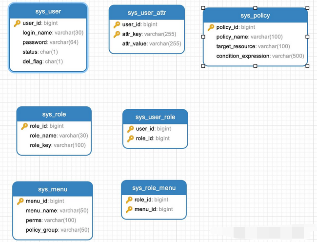
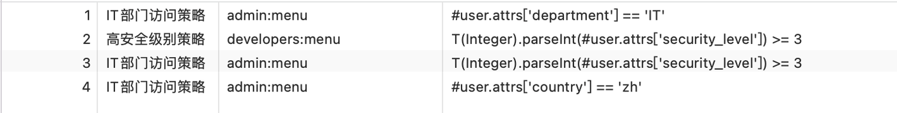

# SpringSecurity_基于数据库的ABAC属性权限模型实战开发

上个章节中我们讲解了如何通过数据库实现基于数据库的动态用户认证，大家可能发现了，项目中是基于RBAC角色模型的权限控制，虽然能满足大多数场景，但在面对复杂、细粒度的权限需求时可能会力不从心。基于属性的访问控制（ABAC）模型则通过评估用户、资源、环境等多种属性，实现更加灵活的权限控制。

例如，某个菜单的访问可能不仅取决于用户角色，还取决于用户的部门、时间或其他属性。因此，需要在权限验证时动态获取这些属性，并进行评估。那么本章节我们就来讲解基于数据库的ABAC属性权限模型实战开发

## 权限决策依据

既然谈到了 RBAC 和 ABAC 两个模型，就大家介绍下两者间的区别：

**RBAC**

- 核心思想：以角色作为权限管理的核心，每个用户被赋予一个或多个角色，而角色与权限之间存在固定的映射关系。
- 决策依据：当用户请求访问资源时，系统根据用户所属角色所拥有的权限进行校验。
- 粒度：粒度相对较粗，因为权限是绑定在角色上的，无法针对单个请求条件进行动态决策。

**ABAC**

- 核心思想：以属性（Attribute）为基础，利用用户属性、资源属性、环境属性等多个维度的条件进行权限判断。
- 决策依据：权限决策是基于各种属性之间的逻辑表达式和策略规则来动态确定是否允许访问。
- 粒度：支持非常细粒度的控制，可以针对具体属性制定规则，实现精准的权限控制。

**综合对比**

| 对比维度 | RBAC                               | ABAC                           |
| -------- | ---------------------------------- | ------------------------------ |
| 决策依据 | 用户所属角色与预定义权限映射关系   | 用户、资源及环境属性和策略规则 |
| 灵活性   | 固定、静态权限模型                 | 动态、可扩展的权限决策模型     |
| 管理难度 | 管理较简单，但角色关系复杂时易混乱 | 规则管理复杂，但扩展灵活       |
| 粒度     | 较粗，难以细化至个性化条件         | 非常细粒度，可实现精确权限控制 |
| 适用场景 | 企业内部、权限固定的系统           | 复杂、多变、动态决策的业务系统 |


## 数据库表结构说明

上一个章节RBAC角色模型我们使用了五张表，sys_user 、 sys_role、 sys_user_role 、sys_menu 、 sys_role_menu ，需要数据表结构的小伙伴可以查阅上一章内容！本章节不再赘述

现在我们在传统RBAC模型基础上，加入ABAC属性权限模型 ABAC（Attribute-Based Access Control）引入了更细粒度的动态控制维度：

为什么要增加ABAC属性权限模型？
- 需求1：请求某个方法除了要验证用户角色或菜单资源，我还要判断用户属性部门=IT，国家是ZH
- 需求2：请求某个方法除了要验证用户角色或菜单资源，我还要限制访问时间段

而如果使用ABAC属性权限模型动态策略就可以很轻松解决这样的问题！

基于上述的需求，我们来扩展我们的数据库表，sys_user_attr 为用户相关属性，sys_policy 为策略表（ABAC规则存储）

```sql
-- 扩展用户属性表（新增）
CREATE TABLE sys_user_attr (
    user_id BIGINT NOT NULL,
    attr_key VARCHAR(50) NOT NULL,
    attr_value VARCHAR(100) NOT NULL,
    PRIMARY KEY (user_id, attr_key)
);

-- 示例数据
INSERT INTO sys_user_attr VALUES 
(1, 'department', 'IT'),
(2, 'department', 'HR'),
(3, 'security_level', '3');
(1, 'country', 'zh'),
```

权限策略表设计：
存储 ABAC 策略，每条策略包含一个条件表达式（基于 SpEL 编写）

```sql
CREATE TABLE sys_policy (
    policy_id BIGINT AUTO_INCREMENT PRIMARY KEY,
    policy_name VARCHAR(50) NOT NULL,
    target_resource VARCHAR(64) NOT NULL,
    condition_expression VARCHAR(255) NOT NULL
);

INSERT INTO sys_policy VALUES
(1, 'IT部门访问策略', 'admin:menu', "#user.attrs['department'] == 'IT'"),
(2, '高安全级别策略', 'developers:menu', "T(Integer).parseInt(#user.attrs['security_level']) >= 3");
(3, 'IT部门访问策略', 'admin:menu', "#user.attrs['country'] == 'zh'");
```



## 实战开始

接下来在之前的 Maven 项目中，我们复用上个章节的子模块并命名 abac-spring-security

由于涉及数据库操作以及整合mybatis-plus，上一章节已经进行了配置的详解这里就简单贴出代码供大家参考：

```xml
<!--Lombok-->
<dependency>
    <groupId>org.projectlombok</groupId>
    <artifactId>lombok</artifactId>
    <scope>provided</scope>
</dependency>
<!--使用 HikariCP 连接池-->
<dependency>
    <groupId>org.springframework.boot</groupId>
    <artifactId>spring-boot-starter-data-jpa</artifactId>
</dependency>
<!-- mysql驱动 -->
<dependency>
    <groupId>mysql</groupId>
    <artifactId>mysql-connector-java</artifactId>
    <version>8.0.30</version>
</dependency>
<!-- mybatis-plus -->
<dependency>
    <groupId>com.baomidou</groupId>
    <artifactId>mybatis-plus-spring-boot3-starter</artifactId>
    <version>3.5.9</version>
</dependency>
```

配置yml文件，运行项目确保项目能正常链接数据库且启动成功

```yaml
server:
  port: 8084
  
spring:
  application:
    name: db-spring-security #最新Spring Security实战教程（六）基于数据库的ABAC属性权限模型实战开发
  datasource:
    url: jdbc:mysql://localhost:3306/slave_db?useSSL=false&serverTimezone=UTC
    username: root
    password: root
    driver-class-name: com.mysql.cj.jdbc.Driver
    hikari:
      maximum-pool-size: 5

mybatis-plus:
  configuration:
    map-underscore-to-camel-case: true # 开启驼峰转换
    log-impl: org.apache.ibatis.logging.stdout.StdOutImpl # 打印SQL
    cache-enabled: true # 开启二级缓存
  global-config:
    db-config:
      logic-delete-field: delFlag # 逻辑删除字段
      logic-delete-value: 1 # 删除值
      logic-not-delete-value: 0 # 未删除值
```

## MyBatis-Plus实体定义

接下来我们开始编写业务代码

用户实体（实现UserDetails）

```java
@Data
@TableName("sys_user")
public class SysUser implements UserDetails {

    @TableId(type = IdType.AUTO)
    private Long userId;

    @TableField("login_name")
    private String username; // Spring Security认证使用的字段

    private String password;

    private String status; // 状态（0正常 1锁定）

    private String delFlag; // 删除标志（0代表存在 1代表删除）

    @TableField(exist = false)
    private List<SysRole> roles;

    @TableField(exist = false)
    private Map<String, String> attrs; // 用户的属性集合，用于 ABAC 动态权限评估

    // 实现UserDetails接口
    @Override
    public Collection<? extends GrantedAuthority> getAuthorities() {
        // 组装 GrantedAuthority 集合，将角色和菜单权限都加入
        Set<GrantedAuthority> authorities = new HashSet<>();
        authorities.addAll(roles.stream()
                .map(role -> new SimpleGrantedAuthority("ROLE_" + role.getRoleKey()))
                .collect(Collectors.toList()));

        authorities.addAll(roles.stream()
                .flatMap(role -> role.getMenus().stream())
                .map(menu -> new SimpleGrantedAuthority(menu.getPerms()))
                .collect(Collectors.toList()));
        return authorities;
    }

    @Override
    public boolean isAccountNonExpired() { return true; }

    @Override
    public boolean isAccountNonLocked() {
        return "0".equals(status);
    }

    @Override
    public boolean isCredentialsNonExpired() { return true; }

    @Override
    public boolean isEnabled() {
        return "0".equals(delFlag);
    }
}
```

角色实体

```java
@Data
@TableName("sys_role")
public class SysRole {
    @TableId(type = IdType.AUTO)
    private Long roleId;
    private String roleName;
    private String roleKey;

    @TableField(exist = false)
    private List<SysMenu> menus;
}
```

菜单实体

```java
@Data
@TableName("sys_menu")
public class SysMenu {
    @TableId(type = IdType.AUTO)
    private Long menuId;
    private String menuName;
    private String perms;
}
```

用户属性实体

```java
@Data
public class SysUserAttr {

    private Long userId;
    private String attrKey;
    private String attrValue;
}
```

决策表实体

```
@Data
@TableName("sys_policy")
public class SysPolicy {

    @TableId(type = IdType.AUTO)
    private Long policyId;
    private String policyName;
    private String targetResource;
    private String conditionExpression;
}
```

## MyBatis-Plus Mapper配置

除了 UserMapper 增加 selectUserAttrByUserId 方法以及新增 SysPolicyMapper，其余代码与上个章节一致！

UserMapper接口 : 主要是通过用户角色中间表获取角色信息（角色信息中又包含了菜单信息）

```java
@Mapper
public interface UserMapper extends BaseMapper<SysUser> {

    @Select("SELECT r.* FROM sys_role r " +
            "JOIN sys_user_role ur ON r.role_id = ur.role_id " +
            "WHERE ur.user_id = #{userId}")
    @Results({
            @Result(property = "roleId", column = "role_id"),
            @Result(property = "menus", column = "role_id",
                    many = @Many(select = "com.toher.springsecurity.demo.abac.mapper.MenuMapper.selectByUserId"))
    })
    List<SysRole> selectRolesByUserId(Long userId);

    /**
     * 获取用户属性
     * @param userId
     * @return
     */
    @Select("SELECT * FROM sys_user_attr WHERE user_id = #{userId}")
    List<SysUserAttr> selectUserAttrByUserId(Long userId);
}
```

RoleMapper接口 : 主要是通过角色菜单中间表获取菜单信息

```java
@Mapper
public interface RoleMapper extends BaseMapper<SysRole> {

    @Select("SELECT m.* FROM sys_menu m " +
            "JOIN sys_role_menu rm ON m.menu_id = rm.menu_id " +
            "WHERE rm.role_id = #{roleId}")
    List<SysMenu> selectMenusByRoleId(Long roleId);
}
```

MenuMapper接口 : 主要是通过角色菜单中间表获取菜单信息

```java
@Mapper
public interface MenuMapper extends BaseMapper<SysMenu> {

 @Select("SELECT DISTINCT m.* FROM sys_menu m " +
         "JOIN sys_role_menu rm ON m.menu_id = rm.menu_id " +
         "JOIN sys_user_role ur ON rm.role_id = ur.role_id " +
         "WHERE ur.user_id = #{userId}")
 List<SysMenu> selectByUserId(Long userId);
}
```

SysPolicyMapper接口

```java
@Mapper
public interface SysPolicyMapper extends BaseMapper<SysPolicy> {
}
```

## 自定义UserDetailsService实现

自定义 UserDetailsService 继承 UserDetailsService，重写 loadUserByUsername 方法，注入 UserMapper 以及 roleMapper通过用户名查询数据库数据，同时将用户的角色、菜单资源集合、用户属性集合 一并赋值；

```java
@Service
@RequiredArgsConstructor
public class UserDetailsServiceImpl implements UserDetailsService {

    private final UserMapper userMapper;
    private final RoleMapper roleMapper;

    @Override
    public UserDetails loadUserByUsername(String username) throws UsernameNotFoundException {

        // 1. 查询基础用户信息
        LambdaQueryWrapper<SysUser> wrapper = new LambdaQueryWrapper<>();
        wrapper.eq(SysUser::getUsername, username);
        SysUser user = userMapper.selectOne(wrapper);

        if (user == null) {
            throw new UsernameNotFoundException("用户不存在");
        }

        // 2. 加载角色和权限
        List<SysRole> roles = userMapper.selectRolesByUserId(user.getUserId());
        roles.forEach(role ->
                role.setMenus(roleMapper.selectMenusByRoleId(role.getRoleId()))
        );
        user.setRoles(roles);

        // 3. 检查账户状态
        if (!user.isEnabled()) {
            throw new DisabledException("用户已被禁用");
        }

        // 4. 用户的属性集合，用于 ABAC 动态权限评估
        List<SysUserAttr> attrs = userMapper.selectUserAttrByUserId(user.getUserId());
        // 转成map集合
        user.setAttrs(attrs.stream()
                .collect(Collectors.toMap(s -> s.getAttrKey(), s -> s.getAttrValue())));
        return user;
    }
}
```

## 实现

### 实现方式一：自定义MethodSecurityExpressionHandler

编写策略决策引擎

```java
@Component
public class AbacDecisionEngine {
    private final SpelExpressionParser parser = new SpelExpressionParser();

    @Autowired
    private SysPolicyMapper sysPolicyMapper;

    public boolean check(Authentication authentication, String resource) {
        SysUser userDetails = (SysUser) authentication.getPrincipal();

        // 加载策略集
        LambdaQueryWrapper<SysPolicy> queryWrapper = new LambdaQueryWrapper<>();
        queryWrapper.eq(SysPolicy::getTargetResource, resource);
        List<SysPolicy> policies = sysPolicyMapper.selectList(queryWrapper);
        if (policies.isEmpty()) {
            return false;
        }

        // 构建评估上下文
        EvaluationContext context = new StandardEvaluationContext();
        // 将用户传入表达式上下文 如：#user.attrs['department'] == 'IT'
        // 其中user前缀就是我们传入的user
        context.setVariable("user", userDetails);
        return policies.stream().allMatch(policy ->
                parser.parseExpression(policy.getConditionExpression()).getValue(context, Boolean.class)
        );
    }
}
```

重写PermissionEvaluator

```java
@RequiredArgsConstructor
public class AbacPermissionEvaluator implements PermissionEvaluator {

    private final AbacDecisionEngine abacEngine;
    @Override
    public boolean hasPermission(Authentication auth, Object targetDomainObject, Object permission) {
        return abacEngine.check(auth, (String)permission);
    }

    @Override
    public boolean hasPermission(Authentication authentication, Serializable targetId, String targetType, Object permission) {
        // 本示例仅实现 hasPermission(Authentication, Object, Object)
        return false;
    }
}
```

### 实现方式二：自定义注解

使用自定义注解，Spring Security 将在每次方法调用时调用该 bean 上给定的方法

```java
@Component("authz")
@RequiredArgsConstructor
public class AuthorizationLogic {

    private final SpelExpressionParser parser = new SpelExpressionParser();
    private final SysPolicyMapper sysPolicyMapper;
    public boolean check(MethodSecurityExpressionOperations operations, String permission) {
        SysUser userDetails = (SysUser) operations.getAuthentication().getPrincipal();
        // 加载策略集
        LambdaQueryWrapper<SysPolicy> queryWrapper = new LambdaQueryWrapper<>();
        queryWrapper.eq(SysPolicy::getTargetResource, permission);
        List<SysPolicy> policies = sysPolicyMapper.selectList(queryWrapper);
        if (policies.isEmpty()) {
            return false;
        }
        // 构建评估上下文
        EvaluationContext context = new StandardEvaluationContext();
        // 将用户传入表达式上下文 如：#user.attrs['department'] == 'IT'
        // 其中user前缀就是我们传入的user
        context.setVariable("user", userDetails);
        return policies.stream().allMatch(policy ->
                parser.parseExpression(policy.getConditionExpression()).getValue(context, Boolean.class)
        );
    }
}
```

## Spring Security配置文件

```java
@Configuration
//开启方法级的安全控制
@EnableMethodSecurity
@RequiredArgsConstructor
public class AbacSecurityConfig {

    private final UserDetailsServiceImpl userDetailsService;
    private final AbacDecisionEngine abacEngine;

    @Bean
    public SecurityFilterChain filterChain(HttpSecurity http) throws Exception {
        http.
                authorizeHttpRequests(authorize -> authorize
                        .requestMatchers("/setPassword").permitAll()
                        //配置形式ADMIN角色可以访问/admin/view
                        .requestMatchers("/admin/view").hasRole("ADMIN")
                        .anyRequest().authenticated())
                        .userDetailsService(userDetailsService)
                        .formLogin(withDefaults())
                        .logout(withDefaults())
                ;
        return http.build();
    }

    @Bean
    public PasswordEncoder passwordEncoder() {
        return new BCryptPasswordEncoder();
    }

    /**
     * 配置 Method Security Expression Handler，使用自定义的 PermissionEvaluator
     */
    @Bean
    public MethodSecurityExpressionHandler methodSecurityExpressionHandler(AbacDecisionEngine abacEngine) {
        DefaultMethodSecurityExpressionHandler handler = new DefaultMethodSecurityExpressionHandler();
        handler.setPermissionEvaluator(new AbacPermissionEvaluator(abacEngine));
        return handler;
    }
```

## controller测试文件

新增一个 AdminController 作为ABAC属性权限模型的测试

```java
@RestController
@RequestMapping("/api")
public class AdminController {

    /**
     * MethodSecurityExpressionHandler方式
     *
     * @return
     */
    @PreAuthorize("hasPermission(null, 'admin:menu')")
    @GetMapping("/admin")
    public ResponseEntity<?> getAdminData() {
        return ResponseEntity.ok("MethodSecurityExpressionHandler方式");
    }


    /**
     * 自定义注解的方式
     * @return
     */
    @PreAuthorize("@authz.check(#root, 'admin:menu')")
    @GetMapping("/authz")
    public ResponseEntity<?> authz() {
        return ResponseEntity.ok("自定义注解的方式");
    }

    /**
     * 以下RBAC角色 + ABAC属性的混合校验 可以复制测试
     * @PreAuthorize("hasAuthority('admin:menu') and @abacDecisionEngine.check(authentication, 'admin:menu')")
     * 
     * @PreAuthorize("hasRole('ADMIN') and @authz.check(#root, 'admin:menu')")
     *
     * @return
     */
    @PreAuthorize("hasRole('ADMIN') and @abacDecisionEngine.check(authentication, 'admin:menu')")
    @GetMapping("/admin/test")
    public ResponseEntity<?> test() {
        return ResponseEntity.ok("RBAC角色 + ABAC属性的混合校验");
    }
}
```

小伙伴们可以根据博主的代码编写完成后，进行运行测试，新增用户属性并可以加入更多的策略来测试，如：



这里博主顺便整理一些常见的策略以供大家参考：

| 场景描述       | SpEL表达式                                                                              |
| -------------- | --------------------------------------------------------------------------------------- |
| 时间段访问控制 | T(java.time.LocalTime).now().isBetween('09:00', '17:00')                                |
| 安全等级验证   | attrs['securityLevel'] >= 3 && authentication.isAuthenticated()                         |
| 地理位置限制   | attrs['country'] == 'CN' && attrs['ipRegion'] == 'Shanghai'                             |
| 多因素认证验证 | attrs['mfaEnabled'] == true && authentication.getAuthorities().contains('MFA_VERIFIED') |

## 完整工作流程

- 请求到达：GET /api/admin
- 身份认证：通过 UserDetailsService 加载用户信息
- 属性加载：从sys_user_attr 表获取用户属性
- 策略匹配：查询sys_policy 表中 target_resource 为 admin:menu 的策略
- 表达式评估：使用SpEL评估 #user.attrs['department'] == 'IT'
- 访问决策：所有策略满足即允许访问

## 总结

通过本章节相信大家对ABAC属性权限模型的开发已经能掌握了，值得一提的是在实际开发中，我们为了避免数据库压力建议还要对用户信息、策略信息等采用缓存处理，相关用户属性、决策也可以按照自身需求进行拓展！

通过RBAC角色模型 + ABAC属性权限模型这种设计，你可以灵活地根据业务变化调整权限策略，实现更细粒度的安全控制。希望这篇实战文章能够为你的项目开发提供参考与启发！

# 来源

- [最新Spring Security实战教程（六）基于数据库的ABAC属性权限模型实战开发](https://zhuanlan.zhihu.com/p/1921642980000915676)


