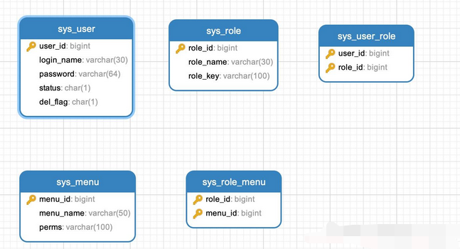
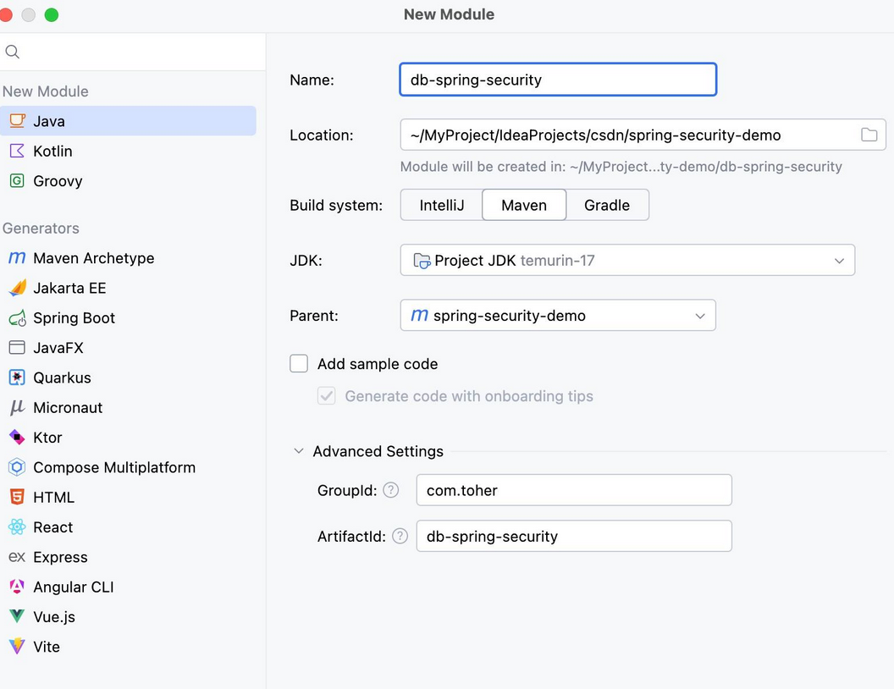
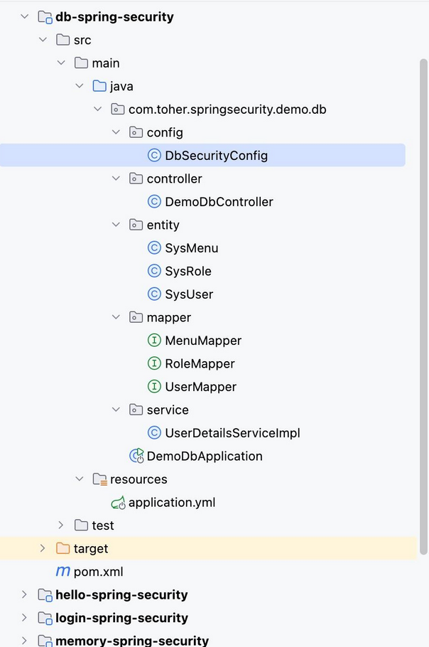
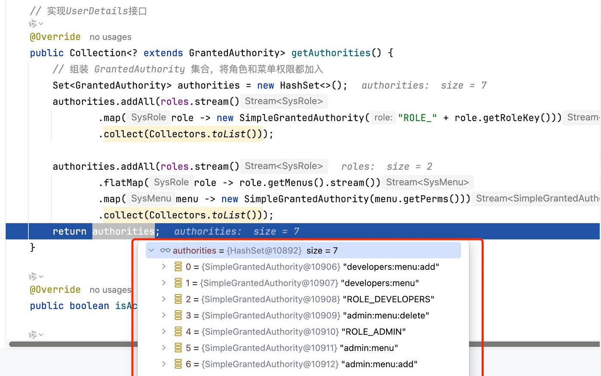
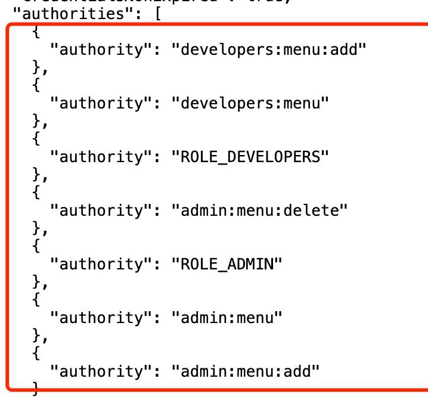

# 基于数据库的动态用户认证传统RBAC角色模型实战开发

以 MySQL 数据库为例，从用户（sys_user）、角色（sys_role）、用户角色（sys_user_role）、系统菜单资源（sys_menu）、角色菜单（sys_role_menu）表出发，演示如何使用 Spring Security 动态加载用户信息、角色，实现基于数据库的RBAC角色模型认证

## 数据库表结构说明

本文示例基于你整理的 MySQL 表结构，其中主要表结构如下：大家可以根据自己的业务需求进行扩展

- sys_user：存储用户信息，字段包括 user_id、login_name、password等
- sys_role：存储角色信息，字段包括 role_id、role_name（角色名称）、role_key（角色标识）等
- sys_user_role：关联用户和角色中间表
- sys_menu : 系统菜单资源表，字段包括 rmenu_id、 menu_name（菜单名称）、perms（权限标识）等
- sys_role_menu ：系统角色菜单资源中间表



以下是为大家整理好的建表语句， 数据库中的用户表：用户名和密码一致

```sql
SET NAMES utf8mb4;
SET FOREIGN_KEY_CHECKS = 0;

-- ----------------------------
-- Table structure for sys_menu
-- ----------------------------
DROP TABLE IF EXISTS `sys_menu`;
CREATE TABLE `sys_menu` (
  `menu_id` bigint NOT NULL AUTO_INCREMENT COMMENT '菜单ID',
  `menu_name` varchar(50) CHARACTER SET utf8mb4 COLLATE utf8mb4_0900_ai_ci NOT NULL COMMENT '菜单名称',
  `perms` varchar(100) CHARACTER SET utf8mb4 COLLATE utf8mb4_0900_ai_ci DEFAULT NULL COMMENT '权限标识',
  PRIMARY KEY (`menu_id`) USING BTREE
) ENGINE=InnoDB AUTO_INCREMENT=2045 DEFAULT CHARSET=utf8mb4 COLLATE=utf8mb4_0900_ai_ci COMMENT='菜单权限表';

-- ----------------------------
-- Records of sys_menu
-- ----------------------------
BEGIN;
INSERT INTO `sys_menu` (`menu_id`, `menu_name`, `perms`) VALUES (1, '管理员菜单', 'admin:menu');
INSERT INTO `sys_menu` (`menu_id`, `menu_name`, `perms`) VALUES (2, '管理员添加', 'admin:menu:add');
INSERT INTO `sys_menu` (`menu_id`, `menu_name`, `perms`) VALUES (3, '管理员删除', 'admin:menu:delete');
INSERT INTO `sys_menu` (`menu_id`, `menu_name`, `perms`) VALUES (4, '普通用户菜单', 'user:menu');
INSERT INTO `sys_menu` (`menu_id`, `menu_name`, `perms`) VALUES (5, '普通用户添加', 'user:menu:add');
INSERT INTO `sys_menu` (`menu_id`, `menu_name`, `perms`) VALUES (6, '普通用户删除', 'user:menu:delete');
INSERT INTO `sys_menu` (`menu_id`, `menu_name`, `perms`) VALUES (7, '开发者菜单', 'developers:menu');
INSERT INTO `sys_menu` (`menu_id`, `menu_name`, `perms`) VALUES (8, '开发者添加', 'developers:menu:add');
COMMIT;

-- ----------------------------
-- Table structure for sys_role
-- ----------------------------
DROP TABLE IF EXISTS `sys_role`;
CREATE TABLE `sys_role` (
  `role_id` bigint NOT NULL AUTO_INCREMENT COMMENT '角色ID',
  `role_name` varchar(30) CHARACTER SET utf8mb4 COLLATE utf8mb4_0900_ai_ci NOT NULL COMMENT '角色名称',
  `role_key` varchar(100) CHARACTER SET utf8mb4 COLLATE utf8mb4_0900_ai_ci NOT NULL COMMENT '角色权限字符串',
  PRIMARY KEY (`role_id`) USING BTREE
) ENGINE=InnoDB AUTO_INCREMENT=100 DEFAULT CHARSET=utf8mb4 COLLATE=utf8mb4_0900_ai_ci COMMENT='角色信息表';

-- ----------------------------
-- Records of sys_role
-- ----------------------------
BEGIN;
INSERT INTO `sys_role` (`role_id`, `role_name`, `role_key`) VALUES (1, '管理员', 'ADMIN');
INSERT INTO `sys_role` (`role_id`, `role_name`, `role_key`) VALUES (2, '普通用户', 'USER');
INSERT INTO `sys_role` (`role_id`, `role_name`, `role_key`) VALUES (3, '开发者', 'DEVELOPERS');
COMMIT;

-- ----------------------------
-- Table structure for sys_role_menu
-- ----------------------------
DROP TABLE IF EXISTS `sys_role_menu`;
CREATE TABLE `sys_role_menu` (
  `role_id` bigint NOT NULL COMMENT '角色ID',
  `menu_id` bigint NOT NULL COMMENT '菜单ID',
  PRIMARY KEY (`role_id`,`menu_id`) USING BTREE
) ENGINE=InnoDB DEFAULT CHARSET=utf8mb4 COLLATE=utf8mb4_0900_ai_ci COMMENT='角色和菜单关联表';

-- ----------------------------
-- Records of sys_role_menu
-- ----------------------------
BEGIN;
INSERT INTO `sys_role_menu` (`role_id`, `menu_id`) VALUES (1, 1);
INSERT INTO `sys_role_menu` (`role_id`, `menu_id`) VALUES (1, 2);
INSERT INTO `sys_role_menu` (`role_id`, `menu_id`) VALUES (1, 3);
INSERT INTO `sys_role_menu` (`role_id`, `menu_id`) VALUES (2, 4);
INSERT INTO `sys_role_menu` (`role_id`, `menu_id`) VALUES (2, 5);
INSERT INTO `sys_role_menu` (`role_id`, `menu_id`) VALUES (2, 6);
INSERT INTO `sys_role_menu` (`role_id`, `menu_id`) VALUES (3, 7);
INSERT INTO `sys_role_menu` (`role_id`, `menu_id`) VALUES (3, 8);
COMMIT;

-- ----------------------------
-- Table structure for sys_user
-- ----------------------------
DROP TABLE IF EXISTS `sys_user`;
CREATE TABLE `sys_user` (
  `user_id` bigint NOT NULL AUTO_INCREMENT COMMENT '用户ID',
  `login_name` varchar(30) NOT NULL COMMENT '登录账号',
  `password` varchar(64) DEFAULT NULL COMMENT '登陆密码',
  `status` char(1) DEFAULT '0' COMMENT '帐号状态（0正常 1停用）',
  `del_flag` char(1) DEFAULT '0' COMMENT '删除标志（0代表存在 2代表删除）',
  PRIMARY KEY (`user_id`)
) ENGINE=InnoDB AUTO_INCREMENT=101 DEFAULT CHARSET=utf8mb4 COLLATE=utf8mb4_0900_ai_ci COMMENT='用户信息表';

-- ----------------------------
-- Records of sys_user
-- ----------------------------
BEGIN;
INSERT INTO `sys_user` (`user_id`, `login_name`, `password`, `status`, `del_flag`) VALUES (1, 'admin', '$2a$10$SnMMruuWQmEEKNMqREDb0e4jfaqJeZviOFjxQRwq.9A7PM6Z0xo5W', '0', '0');
INSERT INTO `sys_user` (`user_id`, `login_name`, `password`, `status`, `del_flag`) VALUES (2, 'user', '$2a$10$96vbFKuEmMlObg1bPqevdOJybTp2cAesJZ5uJBqR797qxnVWx12Wi', '0', '0');
INSERT INTO `sys_user` (`user_id`, `login_name`, `password`, `status`, `del_flag`) VALUES (3, 'developers', '$2a$10$BOpzjv4hmZQB1ydsaDTvZ.Cvyq4.kDty2/ghrcVKhetsTD1sKJaIu', '0', '0');
COMMIT;

-- ----------------------------
-- Table structure for sys_user_role
-- ----------------------------
DROP TABLE IF EXISTS `sys_user_role`;
CREATE TABLE `sys_user_role` (
  `user_id` bigint NOT NULL COMMENT '用户ID',
  `role_id` bigint NOT NULL COMMENT '角色ID',
  PRIMARY KEY (`user_id`,`role_id`)
) ENGINE=InnoDB DEFAULT CHARSET=utf8mb4 COLLATE=utf8mb4_0900_ai_ci COMMENT='用户和角色关联表';

-- ----------------------------
-- Records of sys_user_role
-- ----------------------------
BEGIN;
INSERT INTO `sys_user_role` (`user_id`, `role_id`) VALUES (1, 1);
INSERT INTO `sys_user_role` (`user_id`, `role_id`) VALUES (1, 3);
INSERT INTO `sys_user_role` (`user_id`, `role_id`) VALUES (2, 2);
INSERT INTO `sys_user_role` (`user_id`, `role_id`) VALUES (3, 3);
COMMIT;

SET FOREIGN_KEY_CHECKS = 1;
```

## 完成初始配置

接下来在之前的Maven项目中还是创建第四个子模块db-spring-security



由于需要操作数据库，在 Maven 主目录pom文件中，追加 mysql数据库驱动 以及 mybatis-plus，博主使用的是 HikariCP 连接池 ，直接引入 spring-boot-starter-data-jpa 即可，Spring官方默认支持

```xml
<!--Lombok-->
<dependency>
    <groupId>org.projectlombok</groupId>
    <artifactId>lombok</artifactId>
    <scope>provided</scope>
</dependency>
<!--使用 HikariCP 连接池-->
<dependency>
    <groupId>org.springframework.boot</groupId>
    <artifactId>spring-boot-starter-data-jpa</artifactId>
</dependency>
<!-- mysql驱动 -->
<dependency>
    <groupId>mysql</groupId>
    <artifactId>mysql-connector-java</artifactId>
    <version>8.0.30</version>
</dependency>
<!-- mybatis-plus -->
<dependency>
    <groupId>com.baomidou</groupId>
    <artifactId>mybatis-plus-spring-boot3-starter</artifactId>
    <version>3.5.9</version>
</dependency>
```

最后配置yml文件，运行项目确保项目能正常链接数据库且启动成功

```yaml
server:
  port: 8083
  
spring:
  application:
    name: db-spring-security #最新Spring Security实战教程（五）基于数据库的动态用户认证
  datasource:
    url: jdbc:mysql://localhost:3306/slave_db?useSSL=false&serverTimezone=UTC
    username: root
    password: root
    driver-class-name: com.mysql.cj.jdbc.Driver
    hikari:
      maximum-pool-size: 5

mybatis-plus:
  configuration:
    map-underscore-to-camel-case: true # 开启驼峰转换
    log-impl: org.apache.ibatis.logging.stdout.StdOutImpl # 打印SQL
    cache-enabled: true # 开启二级缓存
  global-config:
    db-config:
      logic-delete-field: delFlag # 逻辑删除字段
      logic-delete-value: 1 # 删除值
      logic-not-delete-value: 0 # 未删除值
```

## MyBatis-Plus实体定义

### 用户实体（实现UserDetails）

为了方便，直接使用数据库映射的SysUser对象直接实现UserDetails，大家在开发过程中建议单独构建实现对象！

```java
@Data
@TableName("sys_user")
public class SysUser implements UserDetails {

    @TableId(type = IdType.AUTO)
    private Long userId;

    @TableField("login_name")
    private String username; // Spring Security认证使用的字段

    private String password;

    private String status; // 状态（0正常 1锁定）

    private String delFlag; // 删除标志（0代表存在 1代表删除）

    @TableField(exist = false)
    private List<SysRole> roles;

    // 实现UserDetails接口
    @Override
    public Collection<? extends GrantedAuthority> getAuthorities() {
        // 组装 GrantedAuthority 集合，将角色和菜单权限都加入
        Set<GrantedAuthority> authorities = new HashSet<>();
        // 加入角色
        authorities.addAll(roles.stream()
                .map(role -> new SimpleGrantedAuthority("ROLE_" + role.getRoleKey()))
                .collect(Collectors.toList()));
        // 加入菜单资源
        authorities.addAll(roles.stream()
                .flatMap(role -> role.getMenus().stream())
                .map(menu -> new SimpleGrantedAuthority(menu.getPerms()))
                .collect(Collectors.toList()));
        return authorities;
    }

    @Override
    public boolean isAccountNonExpired() { return true; }

    @Override
    public boolean isAccountNonLocked() {
        return "0".equals(status);
    }

    @Override
    public boolean isCredentialsNonExpired() { return true; }

    @Override
    public boolean isEnabled() {
        return "0".equals(delFlag);
    }
}
```

### 角色实体

```java
@Data
@TableName("sys_role")
public class SysRole {
    @TableId(type = IdType.AUTO)
    private Long roleId;
    private String roleName;
    private String roleKey;

    @TableField(exist = false)
    private List<SysMenu> menus;
}
```

### 菜单实体

```java
@Data
@TableName("sys_menu")
public class SysMenu {
    @TableId(type = IdType.AUTO)
    private Long menuId;
    private String menuName;
    private String perms;
}
```

### MyBatis-Plus Mapper配置

完成实体类的创建，我们开始配置Mapper实现数据库的业务查询处理，为了快速演示，博主整理就不构建mapper.xml了，直接在Mapper上写查询SQL

UserMapper接口 : 主要是通过用户角色中间表获取角色信息

```java
@Mapper
public interface UserMapper extends BaseMapper<SysUser> {

    @Select("SELECT r.* FROM sys_role r " +
            "JOIN sys_user_role ur ON r.role_id = ur.role_id " +
            "WHERE ur.user_id = #{userId}")
    @Results({
            @Result(property = "roleId", column = "role_id"),
            @Result(property = "menus", column = "role_id",
                    many = @Many(select = "com.toher.springsecurity.demo.db.mapper.MenuMapper.selectByUserId"))
    })
    List<SysRole> selectRolesByUserId(Long userId);
}
```

RoleMapper接口 : 主要是通过角色菜单中间表获取菜单信息

```java
@Mapper
public interface RoleMapper extends BaseMapper<SysRole> {

    @Select("SELECT m.* FROM sys_menu m " +
            "JOIN sys_role_menu rm ON m.menu_id = rm.menu_id " +
            "WHERE rm.role_id = #{roleId}")
    List<SysMenu> selectMenusByRoleId(Long roleId);
}
```

MenuMapper接口 : 主要是通过角色菜单中间表获取菜单信息

```java
@Mapper
public interface MenuMapper extends BaseMapper<SysMenu> {

 @Select("SELECT DISTINCT m.* FROM sys_menu m " +
         "JOIN sys_role_menu rm ON m.menu_id = rm.menu_id " +
         "JOIN sys_user_role ur ON rm.role_id = ur.role_id " +
         "WHERE ur.user_id = #{userId}")
 List<SysMenu> selectByUserId(Long userId);
}
```

## 自定义UserDetailsService实现

自定义 UserDetailsService 继承 UserDetailsService，重写 loadUserByUsername 方法，注入 UserMapper 以及 roleMapper 通过用户名查询数据库数据，同时将用户的角色、菜单资源集合一并赋值；

```java
@Service
@RequiredArgsConstructor
public class UserDetailsServiceImpl implements UserDetailsService {

    private final UserMapper userMapper;
    private final RoleMapper roleMapper;

    @Override
    public UserDetails loadUserByUsername(String username) throws UsernameNotFoundException {

        // 1. 查询基础用户信息
        LambdaQueryWrapper<SysUser> wrapper = new LambdaQueryWrapper<>();
        wrapper.eq(SysUser::getUsername, username);
        SysUser user = userMapper.selectOne(wrapper);

        if (user == null) {
            throw new UsernameNotFoundException("用户不存在");
        }

        // 2. 加载角色和权限
        List<SysRole> roles = userMapper.selectRolesByUserId(user.getUserId());
        roles.forEach(role ->
                role.setMenus(roleMapper.selectMenusByRoleId(role.getRoleId()))
        );
        user.setRoles(roles);

        // 3. 检查账户状态
        if (!user.isEnabled()) {
            throw new DisabledException("用户已被禁用");
        }
        return user;
    }
}
```

## Spring Security配置文件与测试

```java
@Configuration
//开启方法级的安全控制
@EnableMethodSecurity
@RequiredArgsConstructor
public class DbSecurityConfig {

    private final UserDetailsServiceImpl userDetailsService;

    @Bean
    public SecurityFilterChain filterChain(HttpSecurity http) throws Exception {
        http.
                authorizeHttpRequests(authorize -> authorize
                        //配置形式ADMIN角色可以访问/admin/view
                        .requestMatchers("/admin/view").hasAnyAuthority("ADMIN")
                        .anyRequest().authenticated())
                        .userDetailsService(userDetailsService)
                        .formLogin(withDefaults())
                        .logout(withDefaults())
                ;
        return http.build();
    }

    @Bean
    public PasswordEncoder passwordEncoder() {
        return new BCryptPasswordEncoder();
    }
}
```

最后编写测试Controller，当用户登陆认证成功，则默认返回当前用户数据信息


```java
@RestController
@RequiredArgsConstructor
public class DemoAbacController {

    private final UserMapper userMapper;
    private final PasswordEncoder passwordEncoder;

    @GetMapping("/")
    public ResponseEntity<SysUser> index(Authentication authentication) {
        System.out.println(authentication);
        SysUser principal = (SysUser)authentication.getPrincipal();
        return ResponseEntity.ok(principal);
    }

    /**
     * 基于SecurityConfig配置角色访问
     * @return
     */
    @GetMapping("/admin/view")
    public ResponseEntity<String> admin() {
        return ResponseEntity.ok("基于SecurityConfig配置ROLE_ADMIN角色访问ok");
    }

    /**
     * 根据角色权限访问
     * @return
     */
    @PreAuthorize("hasRole('ADMIN')")
    @GetMapping("/system/view")
    public ResponseEntity<String> system() {
        return ResponseEntity.ok("方法的授权hasRole ADMIN 角色访问ok");
    }

    /**
     * 根据菜单权限访问
     * @return
     */
    @PreAuthorize("hasAuthority('admin:menu:add')")
    @GetMapping("/system/add")
    public ResponseEntity<String> add() {
        return ResponseEntity.ok("方法的授权admin:menu:add,访问ok");
    }

    /**
     * 管理员角色且用户名是admim 方可访问
     * @return
     */
    @PreAuthorize("hasRole('ADMIN') and authentication.name == 'admim'")
    @GetMapping("/system/del")
    public ResponseEntity<String> del() {
        return ResponseEntity.ok("方法的授权admin:menu:add,访问ok");
    }
}
```

最终完整代码结构如下



启动项目，在 Spring Security 提供的默认登陆页中输入数据库中账号密码，进行登陆！默认返回当前登陆用户信息，以及授权信息，设置授权信息在 SysUser 实现 UserDetails 重写 getAuthorities 方法中体现，如：



前端返回用户数据信息展示，小伙伴可以结合自己前后端项目，返回登陆用户相关数据进行系统菜单、功能权限的配置



并切换不同的用户进行登陆测试访问 /admin/view /system/view /system/add /system/del ，以确认各权限访问是否允许！

## 总结

本章节演示了使用 MyBatis-Plus 进行数据库操作，动态加载用户、角色权限，并将其转换为 Spring Security 的 GrantedAuthority 列表，从而实现基于数据库的动态用户认证。并提供了一个简单的 Controller 用于测试和查看当前登录用户的信息。

# 来源

- [最新Spring Security实战教程（五）基于数据库的动态用户认证传统RBAC角色模型实战开发](https://zhuanlan.zhihu.com/p/1921294877649514608)