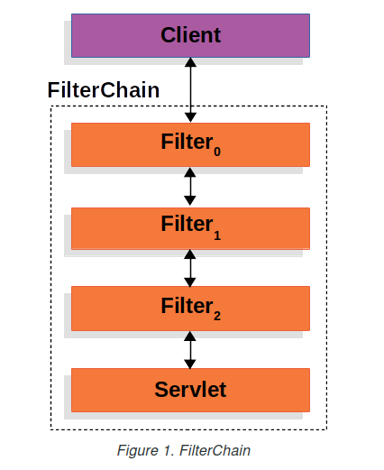
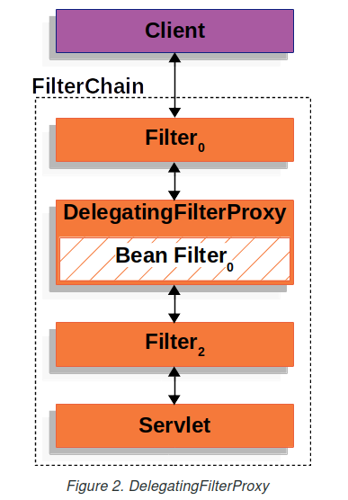
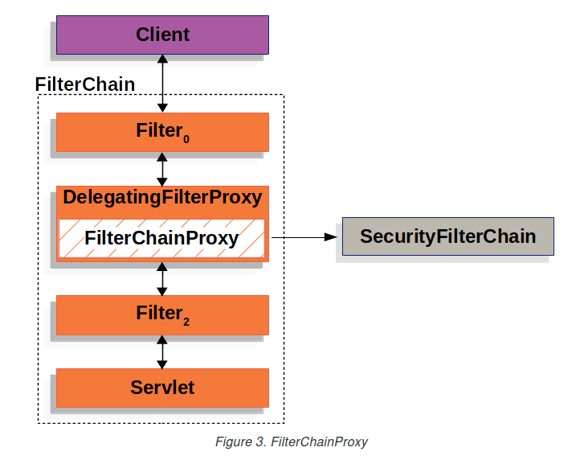
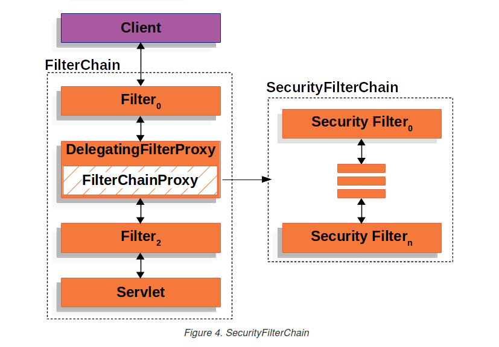
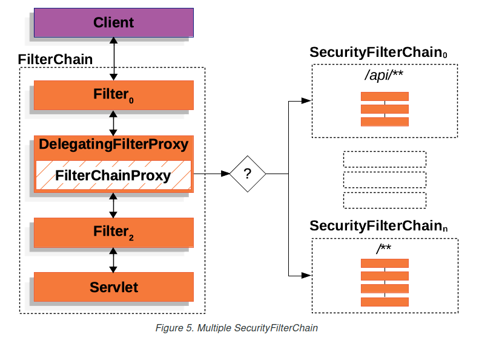
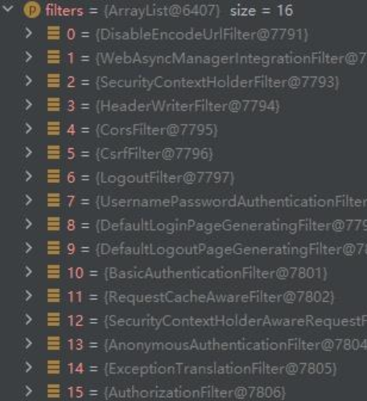
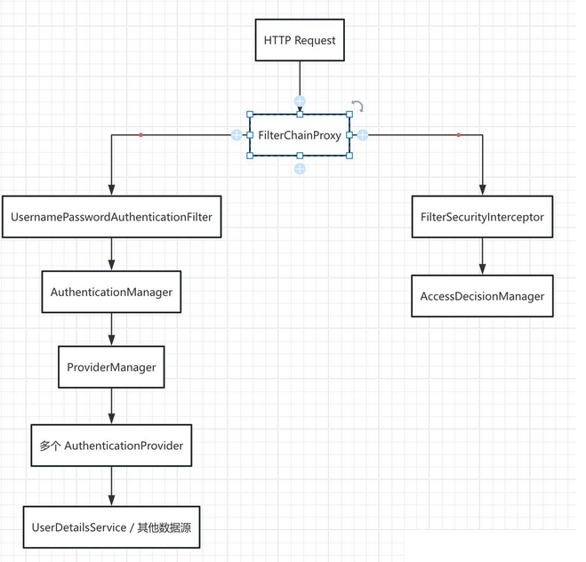
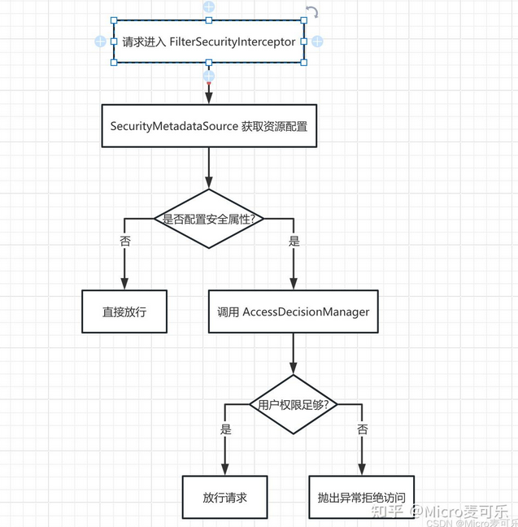

# SpringSecurity底层原理解析

## 回顾过滤器 Filter

以下引入官方文档的示例图来回顾一下，单个 HTTP 请求的处理程序的典型分层，


开发者就可以针对每一个Filter过滤器中对请求进行修改或增强

### 委托过滤代理 DelegatingFilterProxy

Spring 提供了一个Filter名为 DelegatingFilterProxy 的实现，它可以在 Servlet容器 和 Spring容器 之间建立桥梁。



为什么需要一个桥梁? 因为 Servlet 容器并不知道 Spring 容器中定义的 Bean，那么就需要一个代理，帮助我们将 Servlet 容器中的 Filter 实例委托给 Spring 容器管理，观察下面的代码原理

```java
//原始Servlet Filter
public void doFilter(ServletRequest request, ServletResponse response, FilterChain chain) {
    chain.doFilter(request, response); 
}

//模拟DelegatingFilterProxy伪代码 
// 1、获取已注册为 Spring Bean 的 Filter
// 2、将工作委托给 Spring Bean
public void doFilter(ServletRequest request, ServletResponse response, FilterChain chain) {
    Filter delegate = getFilterBean(someBeanName);
    delegate.doFilter(request, response);
}
```

### 过滤链代理 FilterChainProxy

Spring Security的Servlet支持包含在FilterChainProxy中。FilterChainProxy是Spring Security提供的一个特殊的Filter，它允许通过Filter委托给许多SecurityFilterChain实例



### 安全过滤链 SecurityFilterChain

SecurityFilterChain 被 FilterChainProxy 用来确定应该为当前请求调用哪些 Spring Security Filter实例列表



下图显示了多个SecurityFilterChain实例：




在上图中，由FilterChainProxy决定应该使用哪个SecurityFilterChain（仅调用第一个匹配的SecurityFilterChain）

- 如果请求的URL为/api/messages/，则它首先匹配SecurityFilterChain0的/api/**模式
- 如果请求的URL为/messages/，则它与SecurityFilterChainn匹配
- 依次查找匹配...

从上面图解中，我们可以总结 Spring Security 为开发者提供了一整套基于过滤器链（Filter Chain）的安全防护机制。从用户发起 HTTP 请求，到经过多个安全过滤器的逐层检查，直至最终认证与授权完成。

我们来看一下Spring Security默认DefaultSecurityFilterChain启动的时候，默认加载的16个过滤器



Spring Security 已经帮我们封装了大部分的过滤器，实际上我们主要关注以下两个方面即可：

- 身份认证流程：如何通过表单登录（或其他方式）实现用户身份验证，及其内部如何利用 AuthenticationManager、ProviderManager 和多个 AuthenticationProvider 协同工作。
- 授权机制解析：如何通过安全拦截器（如 AbstractSecurityInterceptor）实现方法级别和 URL 级别的权限控制。

## 核心架构

在 Spring Security 中，整个安全流程围绕着一个核心组件展开：FilterChainProxy。它负责拦截所有 HTTP 请求，并将其传递给预先配置好的多个安全过滤器。这些过滤器中，最关键的包括：

- UsernamePasswordAuthenticationFilter：处理基于表单提交的登录请求。
- BasicAuthenticationFilter：处理 HTTP Basic 认证请求。
- FilterSecurityInterceptor：负责权限授权，调用 AccessDecisionManager 来判定当前用户是否有权访问目标资源。

下面是一个简单的架构示意图，帮助你直观了解整个流程：



图解说明:当请求到达 FilterChainProxy 时，根据请求类型，系统会交由不同的过滤器处理：

- 认证流程：例如表单登录时，由 UsernamePasswordAuthenticationFilter 拦截，调用 AuthenticationManager 进行身份校验。
- 授权流程：FilterSecurityInterceptor 负责拦截已认证用户的请求，并通过 AccessDecisionManager 判断其权限是否足够。

## 身份认证流程详解

### 请求拦截与过滤器链

所有 HTTP 请求首先进入 FilterChainProxy，该类遍历预先配置好的过滤器链。以表单登录为例，UsernamePasswordAuthenticationFilter 会在匹配到指定 URL 后触发认证逻辑。

```java
public class UsernamePasswordAuthenticationFilter extends AbstractAuthenticationProcessingFilter {

    // 构造时指定处理的 URL，如 "/perform_login"
    public UsernamePasswordAuthenticationFilter() {
        super(new AntPathRequestMatcher("/perform_login", "POST"));
    }

    @Override
    public Authentication attemptAuthentication(HttpServletRequest request, HttpServletResponse response)
            throws AuthenticationException {
        // 从请求中提取用户名和密码
        String username = obtainUsername(request);
        String password = obtainPassword(request);
        UsernamePasswordAuthenticationToken authRequest = new UsernamePasswordAuthenticationToken(username, password);
        
        // 调用 AuthenticationManager 进行认证
        return this.getAuthenticationManager().authenticate(authRequest);
    }
}
```

说明：这里的 attemptAuthentication 方法负责解析用户提交的数据，然后构造一个 UsernamePasswordAuthenticationToken 对象，并交由 AuthenticationManager 处理。

### AuthenticationManager 与 ProviderManager

AuthenticationManager 是一个接口，其最常用的实现是 ProviderManager。ProviderManager 持有一系列 AuthenticationProvider，用于逐个尝试认证。

```java
public class ProviderManager implements AuthenticationManager {

    private List<AuthenticationProvider> providers;

    @Override
    public Authentication authenticate(Authentication authentication) throws AuthenticationException {
        // 遍历所有 AuthenticationProvider
        for (AuthenticationProvider provider : providers) {
            if (provider.supports(authentication.getClass())) {
                Authentication result = provider.authenticate(authentication);
                if (result != null) {
                    // 认证成功后返回已认证的 Authentication 对象
                    return result;
                }
            }
        }
        throw new ProviderNotFoundException("无法找到对应的 AuthenticationProvider");
    }
}
```

说明：ProviderManager 会遍历所有注册的 AuthenticationProvider（例如 DaoAuthenticationProvider、LdapAuthenticationProvider 等），直到某个 Provider 成功认证为止。如果没有 Provider 能够处理，认证将失败并抛出异常。

### 认证提供者（AuthenticationProvider）

一个典型的 AuthenticationProvider（如 DaoAuthenticationProvider）主要完成以下工作：

- 通过 UserDetailsService 加载用户信息；
- 利用 PasswordEncoder 校验密码；
- 如果认证成功，构造一个包含用户权限信息的已认证 Authentication 对象。


下面是一个自定义 AuthenticationProvider 的简单示例：

```java
@Component
public class CustomAuthenticationProvider implements AuthenticationProvider {

    @Autowired
    private MyUserDetailsService userDetailsService;
    
    @Autowired
    private PasswordEncoder passwordEncoder;

    @Override
    public Authentication authenticate(Authentication authentication) throws AuthenticationException {
        String username = authentication.getName();
        String rawPassword = (String) authentication.getCredentials();
        
        UserDetails user = userDetailsService.loadUserByUsername(username);
        if (user == null) {
            throw new BadCredentialsException("用户不存在");
        }
        
        if (!passwordEncoder.matches(rawPassword, user.getPassword())) {
            throw new BadCredentialsException("密码错误");
        }
        
        return new UsernamePasswordAuthenticationToken(username, rawPassword, user.getAuthorities());
    }

    @Override
    public boolean supports(Class<?> authentication) {
        return UsernamePasswordAuthenticationToken.class.isAssignableFrom(authentication);
    }
}
```

源码剖析：在 authenticate 方法中，我们可以看到 Spring Security 如何利用 UserDetailsService 与 PasswordEncoder 协同工作，确保只有正确的凭证才能获得认证成功的结果。

## 授权机制解析

认证成功后，系统进入授权阶段。授权主要通过 FilterSecurityInterceptor 完成，该拦截器负责在请求被具体业务逻辑处理前检查用户是否有权限访问对应资源。

### FilterSecurityInterceptor 工作原理

FilterSecurityInterceptor 继承自 AbstractSecurityInterceptor，其主要职责为：

- 获取当前请求对应的安全配置（如所需角色、权限等），通常由 SecurityMetadataSource 提供；
- 调用 AccessDecisionManager，依据用户权限集合决定是否允许访问；
- 若访问被拒绝，则抛出 AccessDeniedException。


以下代码展示了大致流程：

```java
public class FilterSecurityInterceptor extends AbstractSecurityInterceptor implements Filter {

    @Autowired
    private SecurityMetadataSource securityMetadataSource;

    @Override
    public void doFilter(ServletRequest request, ServletResponse response, FilterChain chain)
            throws IOException, ServletException {
        // 封装请求信息
        FilterInvocation fi = new FilterInvocation(request, response, chain);
        // 获取安全配置（资源需要的权限）
        Collection<ConfigAttribute> attributes = securityMetadataSource.getAttributes(fi);
        
        // 若资源无安全配置，则直接放行
        if (attributes == null || attributes.isEmpty()) {
            fi.getChain().doFilter(fi.getRequest(), fi.getResponse());
            return;
        }
        
        // 检查用户是否具有访问权限
        InterceptorStatusToken token = super.beforeInvocation(fi);
        try {
            fi.getChain().doFilter(fi.getRequest(), fi.getResponse());
        } finally {
            super.afterInvocation(token, null);
        }
    }
}
```

图解说明



> 通过这种设计，Spring Security 能够灵活配置 URL、方法等不同层次的授权策略

### AccessDecisionManager与决策流程

AccessDecisionManager 根据传入的用户权限集合、请求所需权限及上下文信息进行判断。常见实现包括 AffirmativeBased、ConsensusBased 和 UnanimousBased。

伪代码示例：

```java
public class AffirmativeBased implements AccessDecisionManager {

    @Override
    public void decide(Authentication authentication, Object object, Collection<ConfigAttribute> configAttributes)
            throws AccessDeniedException {
        for (ConfigAttribute attribute : configAttributes) {
            if (this.supports(attribute)) {
                // 如果任何一个决策者同意访问，则允许
                if (voter.vote(authentication, object, configAttributes) == AccessDecisionVoter.ACCESS_GRANTED) {
                    return;
                }
            }
        }
        throw new AccessDeniedException("没有足够权限访问该资源");
    }
}
```

说明：这种投票机制允许开发者根据实际业务需求定制多重决策规则，保证授权过程既灵活又安全。

## 自定义扩展点与源码调试

Spring Security 的设计充分考虑了扩展性。常见的扩展点包括：

- 自定义 Filter：在现有 FilterChain 中插入新的安全过滤器；
- 自定义 AuthenticationProvider：实现特定业务场景下的身份验证；
- 自定义 AccessDecisionManager：满足细粒度的授权需求；
- 扩展 SecurityMetadataSource：支持基于动态资源的权限配置。

在IDEA调试源码时，双击 shift 弹出源码搜索框，你可以通过断点跟踪 FilterChainProxy、AuthenticationManager、ProviderManager 的调用过程，进一步了解每个组件的具体职责与协作方式

## 总结

通过本文的源码剖析，我们了解了 Spring Security 的核心架构与工作流程：

- 认证流程 从过滤器链的拦截，到 UsernamePasswordAuthenticationFilter 的处理，再到 AuthenticationManager 与多个 AuthenticationProvider 的协作。
- 授权流程 则通过 FilterSecurityInterceptor 获取安全配置，并调用 AccessDecisionManager 决策用户是否具有访问权限。

这些机制保证了 Spring Security 在面对复杂安全场景时依然具有高度的灵活性和扩展性。深入理解这些原理，有助于你在实际项目中更精准地定制安全策略，并针对性地进行功能扩展或问题排查。

# 参考与来源

- [官方文档参考](https://docs.spring.io/spring-security/reference/servlet/architecture.html)
- [最新Spring Security实战教程（三）Spring Security 的底层原理解析](https://zhuanlan.zhihu.com/p/1920762099652624959)