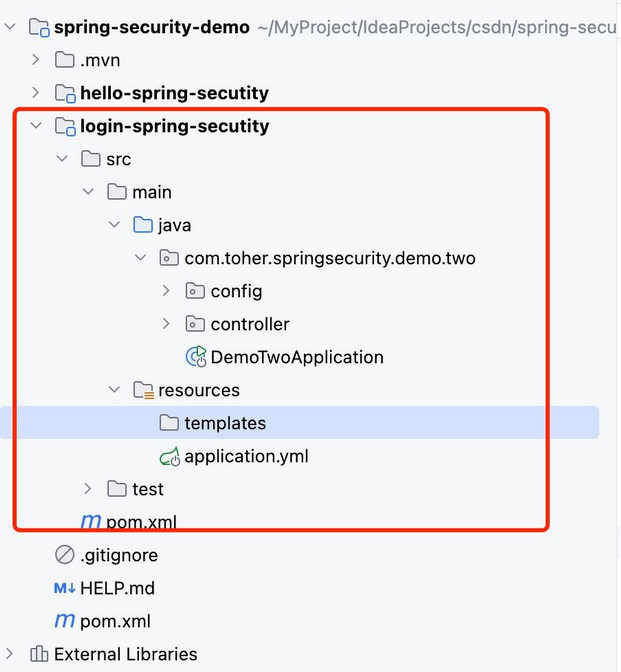
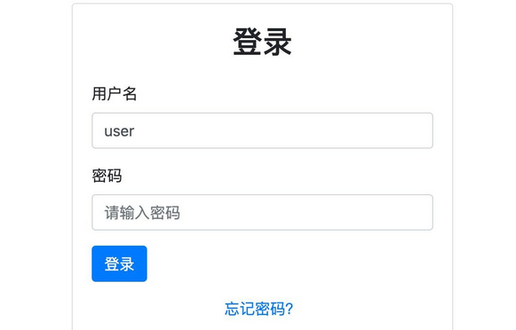
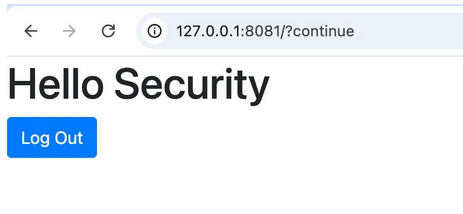
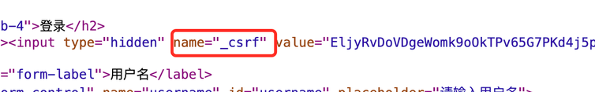
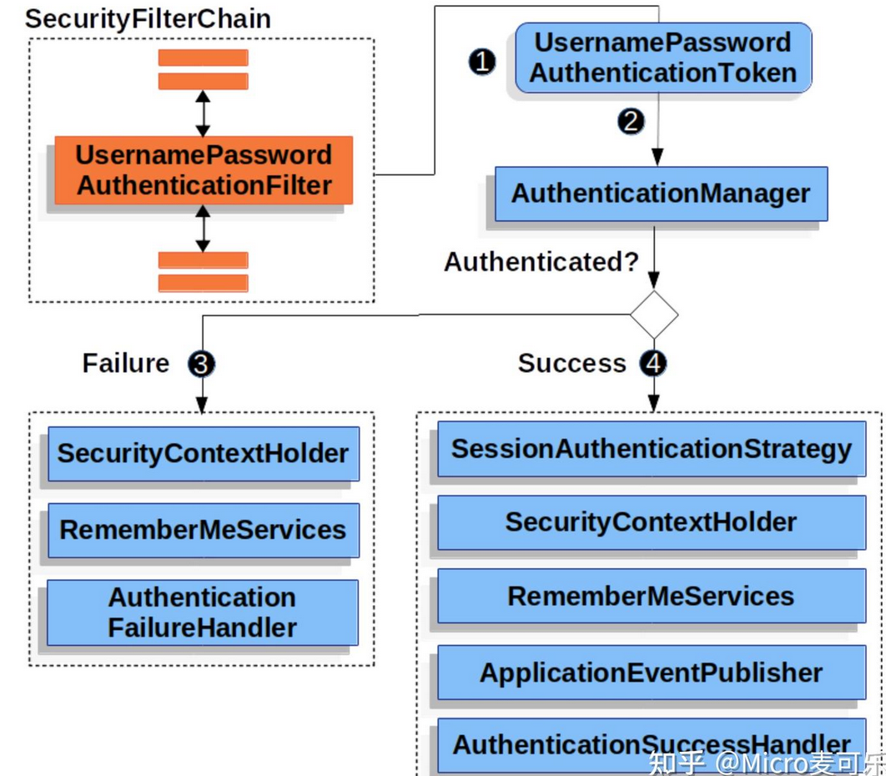
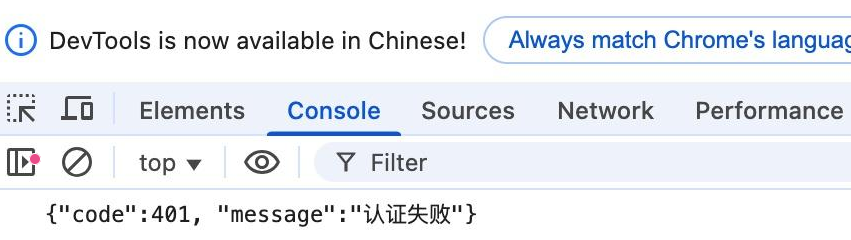

# 表单登录定制到处理逻辑的深度改造

通过上一章节《最新Spring Security实战教程（一）初识Spring Security安全框架》的讲解介绍相信大家已经认识 Spring Security 安全框架，在我们创建第一个项目演示中，相信大家发现了默认表单登录的局限性
Spring Security 默认提供的登录页虽然快速可用，但存在三大问题：

- 界面风格与业务系统不匹配
- 登录成功/失败处理逻辑固定
- 缺乏扩展能力（如验证码、多因子认证）

本章节我们将Spring Security 默认表单进行登录定制到处理逻辑的深度改造

## 改造

### 改造准备

现在在之前的Maven项目中创建第二个子模块，命名 login-spring-secutity ，由于我们需要自定义登陆页，还需要追加引入 thymeleaf 模版框架

```java
<dependency>
    <groupId>org.springframework.boot</groupId>
    <artifactId>spring-boot-starter-thymeleaf</artifactId>
</dependency>
```

完整的maven项目结构如下：



### 开始登录页改造

我们第一步需要自定义自己的带验证码的登陆页，在 resources/templates 目录下创建login.html

```html
<!-- src/main/resources/templates/login.html -->
<!DOCTYPE html>
<html xmlns:th="http://www.thymeleaf.org">
<head>
    <meta charset="UTF-8">
    <title>企业级登录系统</title>
    <link rel="stylesheet" href="https://maxcdn.bootstrapcdn.com/bootstrap/4.5.2/css/bootstrap.min.css">
</head>
<body>
<div class="container d-flex justify-content-center align-items-center vh-100">
    <div class="w-100" style="max-width: 400px;">
        <div class="card">
            <div class="card-body">
                <h2 class="card-title text-center mb-4">登录</h2>
                <form th:action="@{/login}" method="post">
                    <div class="mb-3">
                        <label for="username" class="form-label">用户名</label>
                        <input type="text" class="form-control" name="username" id="username" placeholder="请输入用户名">
                    </div>
                    <div class="mb-3">
                        <label for="password" class="form-label">密码</label>
                        <input type="password" class="form-control" name="password" id="password" placeholder="请输入密码">
                    </div>
                    <div class="d-grid gap-2">
                        <button type="submit" class="btn btn-primary">登录</button>
                    </div>
                    <p class="mt-3 text-center"><a href="#">忘记密码？</a></p>
                </form>
            </div>
        </div>
    </div>
</div>
</body>
</html>
```

添加一个默认首页index.html，显示登出按钮

```html
<!-- src/main/resources/templates/index.html -->
<html xmlns:th="https://www.thymeleaf.org">
<head>
    <meta charset="UTF-8">
    <title>企业级登录系统</title>
    <link rel="stylesheet" href="https://maxcdn.bootstrapcdn.com/bootstrap/4.5.2/css/bootstrap.min.css">
</head>
<body>

<h1>Hello Security</h1>
<!-- 测试过程不需要关闭csrf防护 -->
<form th:action="@{/login}" method="post">
    <button type="submit" class="btn btn-primary">Log Out</button>
</form>
<!-- 测试过程需要关闭csrf防护 否则404 -->
<a th:href="@{/logout}">Log Out</a>
</body>
</html>
```

添加 contrller 配置首页以及登陆页

```java
@Controller
public class DemoTowController {
    
    @GetMapping("/login")
    public String login() {
        return "login";
    }

    @GetMapping("/")
    public String index() {
        return "index";
    }
}
```

最后对 Spring Security 进行配置

```java
@Configuration
public class BasicSecurityConfig {
    // 配置安全策略
    @Bean
    public SecurityFilterChain filterChain(HttpSecurity http) throws Exception {
        http.
                authorizeHttpRequests(authorize -> authorize
                        .anyRequest().authenticated()
                )
                .formLogin(form -> form
                        .loginPage("/login") // 自定义登录页路径
                        .permitAll() //不需要对login认证
                )
                .logout(withDefaults())
                .csrf(csrf -> csrf.disable()) //关闭csrf防护
        ;
        return http.build();
    }
}
```

测试访问默认访问主页，由于主页被拦截会自动跳转自login登陆页



输入正确用户名密码后，自动返回主页，点击登出按钮自动回到登录页



> 特别说明：
> 注意登录页以及主页登出，action 采用 @{} 生成URL，Spring Security会自动帮我们生成name为_csrf 的隐藏表单，作用于 csrf 防护



如果你登出页是 a 连接形式，为了保证登出不会404的问题

- 我们先关闭 csrf 防护 http.csrf(csrf -> csrf.disable())
- 登出按钮使用表单方式 th:action="@{/logout}"

### 自定义用户名密码

到这里有小伙伴又要说了，每次密码都是Spring Security自动生成的UUID，能自定义用户名密码，答案是肯定的。Spring Security提供了在Spring Boot配置文件设置用户密码功能

```yaml
# 默认安全配置（可通过application.yml覆盖）
spring:
  security:
    user:
      name: admin
      password: admin
```

### 登陆成功失败跳转问题

通过上述代码，小伙伴们看到登陆成功后，默认返回系统主页 即：index.html页面，因为业务需求需要跳转到别的页面，如何配置？

Spring Security 配置类中 formLogin 提供了两个参数 defaultSuccessUrl 和 failureUrl 方便我们进行配置

```java
http.formLogin(form -> form
    .loginPage("/login") // 自定义登录页路径
    .defaultSuccessUrl("/home", true) // 登录成功后跳转路径
    .failureUrl("/login?error=true")  // 登录失败后跳转路径
    .permitAll() //不需要对login认证
)
```

### 自定义登出

登出和登录基本相同，由于篇幅问题这里博主就不配置登出的页面以及登出成功页面了，主要看以下配置，相信大家都能理解了

```java
http.logout(logout -> logout
    .logoutUrl("/logout") //自定义登出页
    .logoutSuccessUrl("/login?logout") //登出成功跳转
)
```

## 前后端分离适配方案

上述的案例中针对的是前后端都在一个整体中的情况，针对现在前后端分离的项目我们如何来进行改造？我们处理以下问题：

- 用户登陆成功返回登陆成功 / 失败 返回对应JSON
- 用户登出成功返回登出成功 / 失败 返回对应JSON


这里首先引入官方的一个介绍图，如下：

我们发现在身份认证管理器 AuthenticationManager中， 有两个结果 Success 以及 Failure ，最终交给 AuthenticationSuccessHandler 以及 AuthenticationFailureHandler 处理器处理。



简单总结：
- 登录成功调用：AuthenticationSuccessHandler
- 登录失败调用：AuthenticationFailureHandler

通过上面的讲解，我们只需要自定义这两个处理器即可，我们在配置文件中增加这两个处理器，完整代码如下：

```java
 // 自定义登录成功处理器
@Configuration
public class BasicSecurityConfig {
    // 配置安全策略
    @Bean
    public SecurityFilterChain filterChain(HttpSecurity http) throws Exception {
        http.
                authorizeHttpRequests(authorize -> authorize
                        .requestMatchers("/ajaxLogin").permitAll() //ajax登陆页不需要认证
                        .anyRequest().authenticated()
                )
                .formLogin(form -> form
                        .loginPage("/login") // 自定义登录页路径
//                        .defaultSuccessUrl("/", true)        // 登录成功后跳转路径
//                        .failureUrl("/login?error=true")         // 登录失败后跳转路径
                        .successHandler(loginSuccessHandler())
                        .failureHandler(loginFailureHandler())
                        .permitAll() //不需要对login认证
                )
                .logout(withDefaults())
                .csrf(csrf -> csrf.disable()) //关闭csrf防护
        ;
        return http.build();
    }

    // 自定义登录成功处理器
    @Bean
    public AuthenticationSuccessHandler loginSuccessHandler() {
        return (request, response, authentication) -> {
            if (isAjaxRequest(request)) {
                response.setContentType("application/json");
                response.setCharacterEncoding("UTF-8");
                response.getWriter().write("{\"code\":200, \"message\":\"/认证成功\"}");
            } else {
                response.sendRedirect("/");
            }
        };
    }

    // 自定义登录失败处理器
    @Bean
    public AuthenticationFailureHandler loginFailureHandler() {
        return (request, response, exception) -> {
            if (isAjaxRequest(request)) {
                response.setCharacterEncoding("UTF-8");
                response.getWriter().write("{\"code\":401, \"message\":\"认证失败\"}");
            } else {
                response.sendRedirect("/login?error=true");
            }
        };
    }

    //判断是否ajax请求
    public boolean isAjaxRequest(HttpServletRequest request) {
        String xRequestedWith = request.getHeader("X-Requested-With");
        return "XMLHttpRequest".equals(xRequestedWith);
    }
```

最后新增一个ajaxLogin.html 使用ajax发送请求（为了测试方便这里就简单创建一个，不使用VUE等工程了）

```html
<!-- src/main/resources/templates/ajaxLogin.html -->
<!DOCTYPE html>
<html xmlns:th="http://www.thymeleaf.org">
<head>
    <meta charset="UTF-8">
    <title>企业级登录系统</title>
    <link rel="stylesheet" href="https://maxcdn.bootstrapcdn.com/bootstrap/4.5.2/css/bootstrap.min.css">
    <script src="http://libs.baidu.com/jquery/2.0.0/jquery.min.js"></script>
</head>
<body>
<div class="container d-flex justify-content-center align-items-center vh-100">
    <div class="w-100" style="max-width: 400px;">
        <div class="card">
            <div class="card-body">
                <h2 class="card-title text-center mb-4">登录</h2>
                <form>
                    <div class="mb-3">
                        <label for="username" class="form-label">用户名</label>
                        <input type="text" class="form-control" name="username" id="username" placeholder="请输入用户名">
                    </div>
                    <div class="mb-3">
                        <label for="password" class="form-label">密码</label>
                        <input type="password" class="form-control" name="password" id="password" placeholder="请输入密码">
                    </div>
                    <div class="d-grid gap-2">
                        <button type="submit" class="btn btn-primary">登录</button>
                    </div>
                    <p class="mt-3 text-center"><a href="#">忘记密码？</a></p>
                </form>
            </div>
        </div>
    </div>
</div>
<script>
    $(document).ready(function () {
        $('form').submit(function (event) {
            event.preventDefault();
            var username = $('#username').val();
            var password = $('#password').val();
            $.ajax({
                type: 'POST',
                url: '/login',
                data: {
                    username: username,
                    password: password
                },
                success: function (response) {
                    console.log(response)
                    if(response.code ==200){
                        window.location.href = '/';
                    }
                }
            })
        })
    })
</script>
</body>
</html>
```

controller 中追加页面展示

```java
@GetMapping("/ajaxLogin")
    public String ajaxLogin() {
        return "ajaxLogin";
}
```

最后启动Spring Boot项目，访问 /ajaxLogin 登陆页，测试输入正确和不正确的账号密码进行测试，并观察浏览器控制台输出



# 来源

- [最新Spring Security实战教程（二）表单登录定制到处理逻辑的深度改造](https://zhuanlan.zhihu.com/p/1918852406881554766)