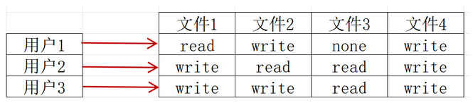
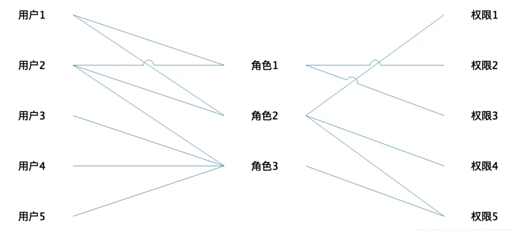
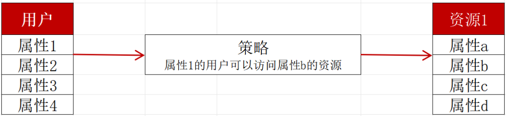
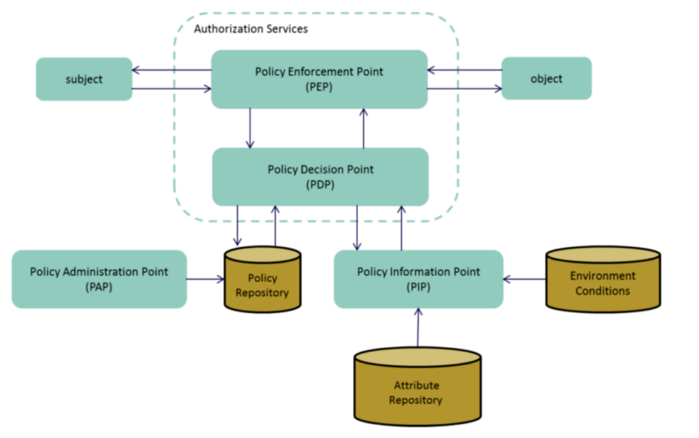
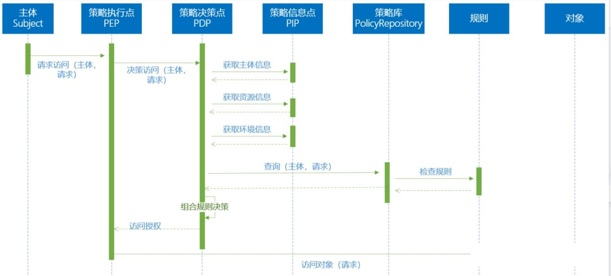

# 认证授权系统设计

Auth系统是任何现代应用的安全基石，其核心拆分为**身份认证**和**权限授权**两大环节

## 一、Authentication（身份认证）：确认「用户是谁」

身份认证是验证用户所声明身份真实性的过程，确保系统知道当前操作者是谁。

### 1.1 认证方式分类

**基础认证方式：**

- 密码认证：最传统的方式，需要安全存储（加盐哈希）和传输（HTTPS）
- 生物识别：指纹、面部识别、虹膜扫描等
- 硬件令牌：U盾、智能卡等物理设备

**多因素认证（MFA）：**

- 知识因素：密码、PIN码、安全问题
- 持有因素：手机验证码、Authenticator应用、硬件令牌
- 固有因素：生物特征、行为特征

**联合认证与单点登录（SSO）：**

- OAuth 2.0：授权委托框架，允许用户授权第三方应用访问其资源
- OpenID Connect：基于OAuth 2.0的身份层，提供标准化的用户身份信息
- SAML 2.0：企业级单点登录标准，常用于企业应用集成
- CAS协议：中央认证服务协议

### 1.2 认证流程设计要点

**登录流程：**

- 凭证收集：安全收集用户凭证（防XSS、CSRF）
- 凭证验证：验证凭证有效性（密码正确性、MFA验证）
- 会话建立：创建安全的会话标识
- 凭证存储：安全的客户端存储（HttpOnly Cookie、Secure Token）

**会话管理：**

- 会话标识：使用不可预测的随机令牌
- 会话存储：服务端存储或安全的无状态令牌（JWT）
- 会话生命周期：设置合理的过期时间和刷新机制
- 会话安全：防止会话劫持、固定攻击

**安全性考虑：**

- 暴力破解防护：失败次数限制、延迟响应、CAPTCHA
- 凭证泄露防护：密码策略、定期强制修改、泄露检测
- 传输安全：全程HTTPS、HSTS头部
- 设备管理：信任设备、新设备验证

## 二、Authorization（权限授权）：确认「用户可以做什么」

权限授权是在认证成功后，决定用户是否有权限执行特定操作或访问特定资源的过程。

### 2.1 权限模型

#### ACL：权限模型的“原始形态”

ACL（Access Control List）是一种基于列表的访问控制模型，是最传统的权限控制方式，通过列出每个资源和用户或角色之间的权限来管理访问。

每个资源会维护一张“允许谁访问”的列表。例如某个文件A的ACL记录为：“张三可读，李四可写......”。



由于这种方式简单直观，在小规模系统或需要简单直接的访问控制时非常有用，非常便于小型系统快速落地。

然而，在大规模、动态或复杂系统中却由于缺乏集中管理能力、扩展性差等，导致不够灵活且难以维护。因此，它往往适合应用在小型系统、权限结构简单、变化频率低的场景。

#### RBAC：以角色为核心的主流模型

RBAC（Role-Based Access Control）是大多数企业当前采用的权限控制模型，也是当前最常见的权限模型。

其基本思想是通过角色集合在用户和权限之间建立关联。简单理解就是，先定义角色（如“人事主管”），再给角色赋权，最后把用户赋予角色。



因此，企业IT人员不需要跟踪每个系统用户和他们的属性，只需要更新相应的角色，将角色分配给用户，或者删除分配，用户便拥有/删除该角色的所有操作权限。

这样的权限分配模型使得权限分配集中化且可复用，大大简化了权限管理，减少系统开销。同时，也让审计变得更简单，便于权限可视化管理。

但**如果企业角色多、权限细化，容易产生“角色膨胀”问题（为细分权限需创建大量相似角色）**，精细化权限控制难实现。此外，这种缺乏上下文支持（如时间、地点等）也难应对越来越复杂的网络攻击。

实际应用中，由于RBAC管理成本相对较低，适用于大多数组织结构化的权限需求，尤其适用于组织结构清晰、相对稳定以及岗位职责明确的传统企业权限体系中。在更动态和复杂的环境中，可以考虑其他访问控制模型，如ABAC和ACL来补充RBAC的不足。

然而，需注意的是，企业大多数由应用程序开发人员编写的 RBAC 实现仅限于简单的角色成员资格检查，而没有任何权限概念。

这种做法将权限控制逻辑固化在代码中，角色与权限脱钩。一旦角色变更需修改代码，增加维护负担。过程中，还存在审计难，权限透明度低，安全隐患大等问题。

这也是为什么企业亟需实现统一权限治理，在加强权限管控能力的同时，有效规避固有应用系统程序中存在的权限管理漏洞。

#### ABAC：以属性为基础的动态控制

ABAC（Attribute-Based Access Control）是基于“属性”进行权限判定，属性包括用户属性（如职位、年龄）、资源属性（如数据等级）、环境属性（如访问时间、设备类型）等。

它的核心是通过策略规则组合这些属性进行访问判断。



NIST 将 ABAC 定义为一种访问控制方法，在这种方法中，根据分配的主体属性、环境条件以及用这些属性和条件指定的一组策略，批准或拒绝主体对对象进行操作的请求。

这样的权限模型在灵活性和精细的访问控制方面具有相当大的优势，特别适用于动态环境和复杂、细粒度权限需求的场景。

例如，可以根据需要设置精细化且动态的策略规则——销售部经理在工作日9~18点才能访问CRM......

然而，它可能需要更多的管理和配置工作，例如，在定义权限的时候，用户和对象之间的关系无法可视化，不易审计；

如果规则设计复杂或混乱，对于管理员来说，维护和跟踪会很麻烦。尤其是一旦规则多，容易产生“规则爆炸”现象。此外，实时策略评估开销大，可能会影响性能。

因此，选择RBAC还是ABAC取决于组织的具体需求和环境。具体来说，ABAC更适用于多系统、多业务、多角色、多环境变量的复杂权限需求，如金融、医疗、大型平台等。

#### PBAC：基于策略的访问控制

PBAC（Policy-Based Access Control）是一种融合RBAC和ABAC优势的策略驱动型权限管理模型，可在一个框架中按需自动部署合适授权策略（粗/细粒度混用），强调“集中策略定义 + 分布式实时执行 + 业务友好界面”。



- Subject（访问主体）：就是“谁”——用户、服务账号、IoT 设备，带一票属性（部门、角色、IP、安全等级）。
- Object（访问客体）：就是“什么”——接口、文件、数据库字段、微服务，也带属性（分类、敏感度、所在区域）。
- Environment（环境）就是“当时什么情况”——时间、地理位置、网络段、威胁情报评分。
- PEP（Policy Enforcement Point，策略执行点）
  - 门卫：业务代码/网关/ sidecar 里插的一行 SDK。
  - 职责：把请求打包成 XACML Request → 问 PDP → 得到 Permit/Deny → 放行或抛 403。
  - 对业务方只暴露“boolean check()”，屏蔽后面所有复杂度。
- PDP（Policy Decision Point，策略决策点）
  - 法官：核心引擎（开源实现如 OPA、AuthZForce、Axiomatics）。
  - 职责：
    - 加载 PAP 下发的策略；
    - 实时向 PIP 要缺失的属性；
    - 把 Subject/Object/Environment 代入策略算结果 → 返回给 PEP。
    - 性能关键：毫秒级、可横向扩容、本地缓存。
- PIP（Policy Information Point，属性提供点）
  - 证人：任何能吐属性的系统——LDAP、HR 库、IAM、CMDB、甚至 REST。
  - PDP 算到一半发现“缺用户.region”就现场问 PIP，拿完继续算。
  - 好处：策略写“活人”即可，不用同步数据；代价：需保证 PIP 高可用。
- PAP（Policy Administration Point，策略管理点）
  - 立法机构：UI 或 Git 仓库，供安全/合规同学写策略、做版本、灰度发布。
  - 一键把新政策推给全部 PDP（类比配置中心）。
- Policy Repository（策略仓库）
  - 法典库：DB / Git / Object Storage，存 Rego/XACML 文件；PAP 写，PDP 读。

一条完整的访问流程（箭头顺序）



```
Subject → 请求 → PEP  
PEP 组装 XACML Request → 发给 PDP  
PDP 查本地缓存策略 ▼  
├─ 缺属性？→ 问 PIP → 拿属性  
└─ 代入策略求值 → 得到 Permit / Deny  
PDP 把结果 → 返回 PEP  
PEP 执行放行或拒绝
```

它不仅支持角色与属性组合的权限策略，还提供图形化界面与自然语言建模，业务人员和应用负责人可无需编程即可创建、调整策略，让业务人员也能参与权限策略制定，而不必依赖开发人员，提高响应速度与业务灵活性。

所有访问策略由统一界面定义与管理，确保策略一致性与可审计性；在多个系统与平台中，可灵活部署、实时执行，适应现代微服务、API、SaaS架构。

此外，根据用户身份、资源类型、上下文（如风险信号、时间、位置等）动态判断是否授权，是实现“零信任安全模型”的关键技术能力。

### 2.2 授权粒度

**垂直权限（功能权限）：**

- 基于功能模块的访问控制
- 例如：管理员可以访问用户管理模块，普通用户不能

**水平权限（数据权限）：**

- 基于数据所有权的访问控制
- 例如：用户只能编辑自己创建的文章
- **难点**：防止越权访问（IDOR漏洞）

**细粒度权限：**

- 字段级权限：控制可见/可编辑字段
- 行级权限：数据行过滤（如只能看到本部门数据）
- 操作级权限：特定操作权限（如审核、发布）

### 2.3 授权架构模式

**集中式授权：**

- 中央授权服务处理所有权限决策
- 优点：一致性好，便于审计
- 缺点：单点瓶颈，网络延迟

**嵌入式授权：**

- 各服务内嵌授权逻辑
- 优点：性能好，自治性强
- 缺点：一致性难保证，重复开发

**混合模式：**

- 中央策略管理 + 本地策略执行
- 策略统一管理，决策本地执行

## 三、完整Auth系统架构

### 3.1 核心组件

```
┌─────────────────────────────────────────────┐
│                客户端应用                    │
└───────────────┬──────────────┬──────────────┘
                │              │
    ┌───────────▼─────────┐  ┌─▼──────────────┐
    │   API网关/反向代理    │  │   登录页面      │
    └───────────┬─────────┘  └─┬──────────────┘
                │              │
    ┌───────────▼────────────────▼──────────┐
    │          身份认证服务                  │
    │  ┌────────────────────────────────┐  │
    │  │   • 凭证验证                    │  │
    │  │   • 会话管理                    │  │
    │  │   • 令牌颁发/验证                │  │
    │  │   • MFA处理                     │  │
    │  └────────────────────────────────┘  │
    └───────────────┬──────────────────────┘
                    │
    ┌───────────────▼──────────────────────┐
    │          权限授权服务                  │
    │  ┌────────────────────────────────┐  │
    │  │   • 策略管理                    │  │
    │  │   • 权限验证                    │  │
    │  │   • 角色管理                    │  │
    │  │   • 资源管理                    │  │
    │  └────────────────────────────────┘  │
    └───────────────┬──────────────────────┘
                    │
        ┌───────────▼──────────┐
        │   业务服务集群         │
        │  • 用户服务           │
        │  • 订单服务           │
        │  • 商品服务           │
        └──────────────────────┘
```

### 3.2 数据流示例

**认证流程：**

1. 用户提交凭证到认证服务
2. 认证服务验证凭证（查数据库、验证MFA）
3. 认证服务颁发访问令牌和刷新令牌
4. 客户端存储令牌，后续请求携带令牌

**授权流程：**

1. 客户端请求携带访问令牌访问业务API
2. API网关/拦截器验证令牌有效性
3. 授权服务评估用户是否有权限执行操作
4. 授权通过则执行业务逻辑，否则返回403

### 3.3 关键技术实现

**令牌技术：**

- JWT（JSON Web Token）：无状态令牌，包含声明信息
- Opaque Token：不透明令牌，需查询认证服务验证
- Refresh Token：用于获取新的访问令牌

**安全存储：**

- 客户端：Secure Cookie、HttpOnly标志、SameSite策略
- 服务端：Redis集群存储会话、数据库存储用户凭证

**监控与审计：**

- 完整登录日志（时间、IP、设备、结果）
- 权限变更审计（谁在何时修改了谁的权限）
- 异常行为检测（多地登录、异常时间访问）

## 四、最佳实践与常见问题

### 4.1 最佳实践

1. 最小权限原则：只授予完成任务所需的最小权限
2. 防御性编程：服务端始终验证权限，不信任客户端
3. 定期权限审查：定期审查和清理不必要的权限
4. 零信任架构：永不信任，始终验证
5. 安全开发生命周期：从设计阶段就考虑安全

### 4.2 常见安全问题

1. 会话固定攻击：确保登录前后会话ID变更
2. 权限提升漏洞：仔细验证水平权限和垂直权限
3. 令牌泄露：使用短期令牌，提供撤销机制
4. CSRF攻击：使用Anti-CSRF Token，检查Referer
5. XSS攻击：输出编码，CSP策略

### 4.3 扩展考量

- 多租户系统：租户隔离的认证授权
- 微服务架构：服务间认证（mTLS、服务账户）
- 边缘计算：边缘节点的认证授权
- 物联网：设备认证与权限管理
- 区块链集成：去中心化身份（DID）与可验证凭证

## 五、总结

一个完善的认证授权系统需要：

1. 清晰的分离认证与授权，各自专注于单一职责
2. 多层防御策略，不依赖单一安全机制
3. 可扩展的架构，支持未来业务发展和新技术集成
4. 全面的监控审计，实现安全可观察性
5. 持续的安全演进，定期评估和更新安全措施

通过合理设计认证授权系统，可以在提供良好用户体验的同时，确保系统安全性和数据隐私，为业务发展奠定坚实的安全基础。