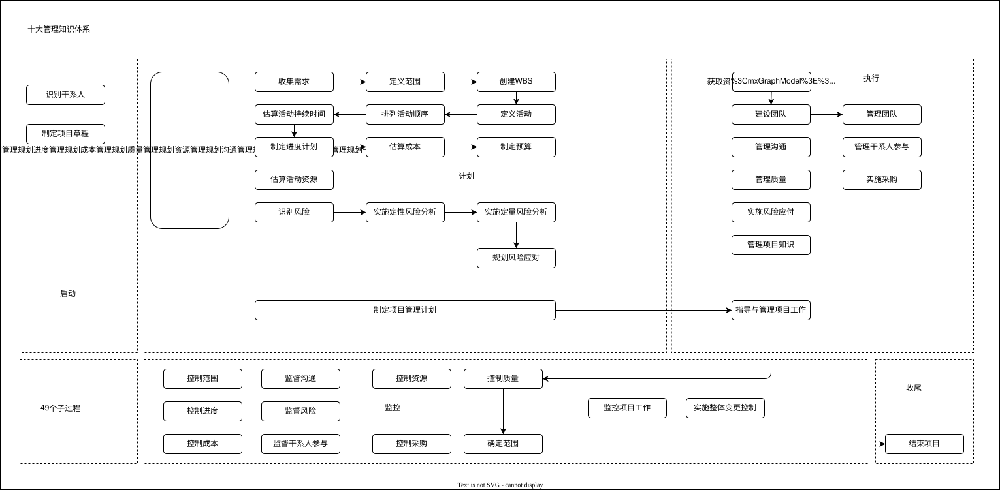

## 十大管理知识体系分类

```
┌─────────────────────────────────────────────────────────────────┐
│                     十大管理知识体系                             │
├─────────────────────────────────────────────────────────────────┤
│                          49个过程                               │
├──────────────┬─────────────────────────────────────────────────┤
│              │ 按过程发生的时间顺序 → 五大过程组                  │
│              ├─────────────────────────────────────────────────┤
│              │ ◆ 启动过程组                                    │
│              │ ◆ 计划过程组                                    │
│              │ ◆ 执行过程组                                    │
│              │ ◆ 监控过程组                                    │
│              │ ◆ 收尾过程组                                    │
│              │                                                 │
│              ├─────────────────────────────────────────────────┤
│              │ 按同类知识领域合并 → 十大管理知识领域              │
│              ├─────────────────────────────────────────────────┤
│              │ ◆ 整合管理                                      │
│              │ ◆ 范围管理                                      │
│              │ ◆ 进度管理                                      │
│              │ ◆ 成本管理                                      │
│              │ ◆ 质量管理                                      │
│              │ ◆ 资源管理                                      │
│              │ ◆ 沟通管理                                      │
│              │ ◆ 采购管理                                      │
│              │ ◆ 风险管理                                      │
│              │ ◆ 干系人管理                                    │
└──────────────┴─────────────────────────────────────────────────┘
```

## 每个管理过程学什么？

```
┌───────────────────┐
│  输入（参考什么）  │
└───────────────────┘
        ↓
┌─────────────────────────┐
│  每个管理过程 （含义★）  │
│                         │
│  工具与技术（用什么技术） |
└─────────────────────────┘
        ↓
┌─────────────────────┐
│  输出（得到什么成果） │
└─────────────────────┘
```

核心逻辑说明
1.  输入：启动一个管理过程时，需要参考的前置信息、文件或成果。
2.  工具与技术：在过程中使用的方法、技巧、工具和手段。
3.  输出：经过过程处理后得到的最终成果、文件或决策。
4.  最重要的是每个管理过程的含义，因为输入输出是通过管理过程的含义推到出来的