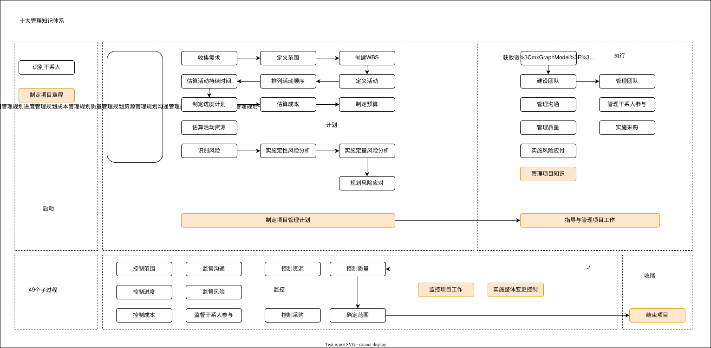
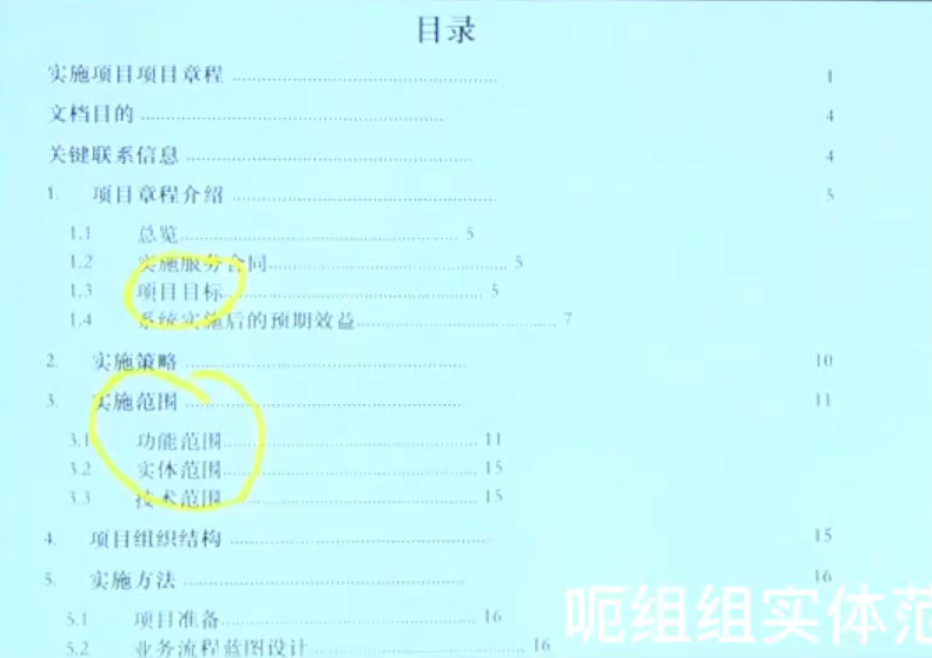
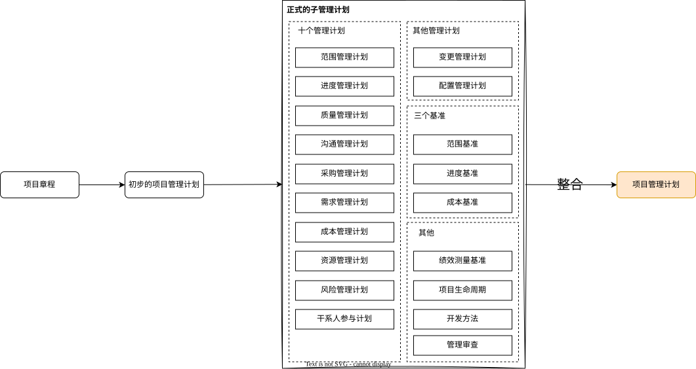

# 信息项目管理_整合管理

项目整合管理包括识别、定义、组合、统一和协调项目管理过程组的各个过程和项目管理活动，在项目管理中，整合管理兼具统一、合并、沟通和建立联系的性质，`项目整合管理贯穿项目始终`。

# 项目整合管理目标

- 资源分配；
- 平衡竞争性需求；
- 研究各种备选方法；
- 裁剪过程以实现项目目标；
  - 49个管理过程，在实际项目中，并不会全部使用。所以会裁剪一些过程。
- 管理各个项目管理知识领域之间的依赖关系。

# 整合管理的一些基础知识

## 一、执行整合

`项目整合管理由项目经理负责`，该管理责任不可授权或转移，项目经理需`对整个项目承担最终责任`。

- **组织层面**：项目经理与项目发起人协同合作，精准把握战略目标，确保项目目标、成果与项目组合、项目集及业务领域保持一致。
- **项目层面**：项目经理负责引导团队聚焦核心工作并开展协同作业，为此，项目经理需完成过程、知识与人员的整合工作。

> 课堂笔记
> 
> 项目经理职责定位：
> - 项目责任承担：项目经理负责项目整合管理，对项目完成承担最终责任，被称为整合者。
> - 技术能力要求：项目经理不一定要是技术专家，但需具备管理知识，类似乐队指挥，了解项目总体走向。
> - 不同层面职责：在项目层面带领团队成员完成项目目标；在组织层面与发起人携手，确保项目满足企业战略需求、创造利润和竞争力。

---

**过程层面执行整合**：项目管理过程中，部分过程可能仅发生一次（例如项目章程的初始创建），但多数过程会在整个项目期间相互重叠、重复发生，比如需求变更。在项目全周期实施整体变更控制过程，核心目的是整合各类变更请求。

**认知层面执行整合**：管理项目可采用多种方法，方法的选择通常取决于项目具体特点，包括项目规模、项目或组织的复杂性，以及组织文化。项目经理应尽量熟练掌握所有项目管理知识领域。

**背景层面执行整合**：随着新技术的不断涌现，组织和项目所处的环境发生了很大变化。项目经理需要意识到项目背景和这些新因素，决定如何在项目中最好地利用这些新环境因素，以助力项目成功。

> 课堂笔记
> 
> - 过程层面整合：49 个项目管理过程在整个项目期间重叠使用，如制定项目管理计划、指导与管理项目执行等过程贯穿全程，且交错迭代进行。
> - 认知层面整合：项目经理要根据项目和团队成员情况选择项目管理方法，并提升自身项目管理知识。
> - 背景层面整合：IT 领域项目市场技术变化快，项目经理需关注外部环境，跟踪其变化对项目的影响。

## 二、整合的复杂性

项目的复杂性来源于组织的系统行为、人类行为以及组织或环境中的不确定性。

**复杂性含义**
- 包含多个部分；
- 不同部分之间存在一系列关联；
- 不同部分之间的动态交互作用；
- 这些交互作用所产生的行为远远大于各部分简单的相加。

> 课堂笔记
>
> 复杂表现形式：项目整合管理复杂，其复杂性体现在分成多个部分，各部分相互联系、相互作用，交叉作用关系大于各部分简单相加。

## 三、管理新实践

1. 使用信息化工具
2. 使用可视化管理工具
3. 项目知识管理
4. 项目经理在项目以外的职责
5. 混合型方法

> 课堂笔记
>
> - 信息化工具使用：采用信息系统管理项目，如进度管理的 Project、缺陷管理的 ClearCase 等。
> - 可视化工具应用：使用可视化管理工具，如报表生成、燃尽图等。
> - 新要求与方法：新的项目管理要求项目经理`走出项目`，思考组织战略需求，让项目创造的价值符合组织和市场需求，还涉及项目管理专业知识、项目经理额外职责及混合型方法。

## 四、项目管理计划和项目文件

### 项目管理计划

项目管理文件：包括各种管理计划、三个基准、绩效测量基准、项目生命周期描述、开发方法等。

项目计划的更新，就是更新以下这些文件

- 十个管理计划
  - 范围管理计划
  - 需求管理计划
  - 进度管理计划
  - 成本管理计划
  - 质量管理计划
  - 资源管理计划
  - 沟通管理计划
  - 风险管理计划
  - 采购管理计划
  - 干系人参与计划
- 三个基准
  - 范围基准
  - 进度基准
  - 成本基准

- 其他管理计划/补充内容
  - 变更管理计划
  - 配置管理计划
- 其他
  - 项目生命周期描述
  - 绩效测量基准
  - 开发方法

### 项目文件

项目文件：众多过程输出的项目文件更新，更新的是如干系人登记册、风险登记册等文件；项目管理计划更新则针对项目管理计划相关内容。

项目文件的更新，就是更新以下文件

- 干系人登记册
- 风险登记册
- 经验教训登记册

- 项目日历
- 资源日历

- 假设日志
- 变更日志
- 问题日志

- 需求文件
- 需求跟踪矩阵
- 项目范围说明书

- 项目进度计划
- 项目进度网络
- 进度数据
- 进度预测

- 活动属性
- 活动清单
- 里程碑清单
- 成本估算
- 持续时间估算
- 估算依据

- 资源需求
- 资源分解结构
- 物质资源分配单
- 项目团队派工单

- 质量控制测量结果
- 质量测量指标

- 团队章程
- 项目沟通记录
- 测试与评估文件 

- 质量报告
- 风险报告
  
# 项目整合管理7个过程

1. 制定项目章程
2. 制订项目管理计划
3. 指导与管理项目工作
4. 管理项目知识
5. 监控项目工作
6. 实施整体变更控制
7. 结束项目或阶段

> 课堂笔记
>
> 管理过程：项目整合管理包括制定项目章程、制定项目管理计划等 7 个过程，分布在各个过程组，各过程在所在过程组做整合之事
>
> 核心概念：整合管理也叫整体管理，各过程整合所在过程组的相关内容

七个管理过程在图中的位置：

## 过程1：制定项目章程

### 制定项目章程的定义与作用

制定项目章程是编写一份正式批准项目并授权项目经理在项目活动中使用组织资源的文件的过程。
- 批准项目的合法地位
- 授权项目经理在项目活动中使用组织资源

> 课堂笔记
>
> 定义：项目章程是项目存在最初始的文件，干了两件事，明确项目合法地位和任命项目经理。

### 本过程的主要作用

- (1)明确项目与组织战略目标之间的直接联系;
- (2)确立项目的正式地位;
- (3)展示组织对项目的承诺。

> 课堂笔记
>
> - 作用：明确项目与组织战略目标的直接联系，确立项目正式地位，展示组织对项目承诺（组织向项目承诺了资源）。
> - 类比说明：项目章程类似结婚证，明确项目合法地位，无章程时无法合理动用资源，有章程则可。
> - 发布者：项目章程由发起人颁发，项目经理可参与编写但不能发布，通常由外部人员发布。

### 输入

#### 立项管理文件

- 核心说明
  - 立项管理包括商业需求和成本效益分析，论证项目的合理性并确定项目边界。
  - `立项管理文件不是项目文件`，项目经理不可以对它们进行更新或修改，只可以提出相关建议。
  - 虽然立项管理文件是在项目之前制定的，但需要`定期审核`。
- 具体内容:
  - 项目建议书
  - 可行性研究报告
  - 项目评估报告

#### 协议

- 核心说明：形式多样，分内部/外部场景。公司内部，可能是口头协议。为外部客户做项目时，通常需要签订合同。
- 具体内容：合同、谅解备忘录、服务水平协议、协议书、意向书、口头协议或其他书面协议

#### 事业环境因素

- 核心说明：我们不可控的，是项目开展的外部/组织客观环境条件
- 具体内容：
  - 政府或行业标准 (如产品标准、质量标准、安全标准和工艺标准)
  - 法律法规要求和相关制约因素
  - 市场条件
  - 组织文化和氛围
  - 组织治理框架
  - 干系人的期望和风险临界值

#### 组织过程资产

- 核心说明：我们可控的，是组织积累的可复用的项目管理相关资源
- 具体内容：
  - 组织的标准政策、流程和程序
  - 项目组合、项目集和项目的治理框架
  - 监督和报告的方法
  - 模板
  - 历史信息与经验教训知识库

> 课堂笔记
>
> 依据立项管理文件、协议、事业环境因素和组织过程资产。立项管理文件包括商业需求、成本效益分析等，形成项目建议书等文件，需定期审核；协议有多种形式，分公司内部和外部项目协议；事业环境因素不可控，如行业标准等，组织过程资产可控，如企业标准等。

### 输出

#### 项目章程

- 项目章程记录了关于项目和项目预期交付的产品、服务或成果的`高层级信息`。
- 
- 项目章程内容
  - `项目目的`；可测量的项目目标和相关的成功标准
  - 高层级需求、`高层级`项目描述、边界定义以及主要可交付成果；整体项目风险；总体里程碑进度计划；预先批准的财务资源；关键干系人名单
  - 项目审批要求、项目退出标准
  - 委派的项目经理及其职责和职权；发起人或其他批准项目章程的人员的姓名和职权
- 项目章程细节:
  - (1) 项目章程可以由`发起人`编制，也可由项目经理与发起机构合作编制；
  - (2) 项目经理应在规划开始之前任命项目经理，最好在制定项目章程时就任命；
  - (3) 项目由`项目以外的机构来启动`，例如发起人、项目集或项目管理办公室 (PMO)、项目组合治理委员会主席或其授权代表；
  - (4) `项目章程不能当作合同`。

#### 假设日志

- 假设日志用于记录整个项目生命周期中的所有假设条件和制约因素。
- 在项目启动之前进行可行性研究和论证时，即开始识别高层级的战略和运营假设条件与制约因素。这些假设条件与制约因素应纳入项目章程。较低层级的活动和任务假设条件在项目期间随着诸如定义技术规范、估算、进度和风险等项目活动进展而生成

> 课堂笔记
>
> 输出项目章程和假设日志。项目章程记录项目高层级信息，包括项目目标、高层级需求等多方面内容；假设日志记录项目全部假设条件和制约因素，制定章程时输出高层级假设日志，低层级假设在执行过程优化

### 项目章程相关注意事项

注意：
- 事业环境因素、组织过程资产是所有过程的输入
- 教材中提到的输入、输出、工具与技术并不全
- 如果考核输入输出题目，会有明显的错误

> 课堂笔记
>
> - 文件区分：制定项目章程时无项目管理计划和项目文件，立项管理文件不是项目文件。
> - 批准人员：项目章程可由发起人、项目集或项目管理办公室等批准，不能作为合同。
> - 考核方式：输入输出考核题目错误明显，抓重点学习即可

### 制定项目章程工具与技术

- 专家判断
- 数据收集 
  - 头脑风暴、焦点小组、访谈
- 人际关系与团队技能
  - 冲突管理、引导、会议管理
- 会议

本教材中，工具集合有：数据收集、数据分析、数据表现、人际关系与团队技能、决策。

| 技能分类表         | 具体内容                                                                                   |
| ------------------ | ------------------------------------------------------------------------------------------ |
| 数据收集           | 头脑风暴、焦点小组、核对单、访谈、标杆对照                                                 |
| 数据分析           | 成本效益分析、备选方案分析、根本原因分析、文件分析、过程分析、挣值分析、绩效审查、趋势分析 |
| 数据表现           | 亲和图、因果图、流程图、直方图、矩阵图、散点图                                             |
| 人际关系与团队技能 | 冲突管理、影响力、激励、谈判、团队建设、积极倾听、引导、领导力、人际交际、大局观           |
| 决策               | 投票、独裁型决策制定、多标准决策分析                                                       |

> 课堂笔记
>
> - 工具集合：包括专家判断、数据收集（含头脑风暴等）、人际关系与团队技能（含冲突管理等）、会议等；教材中有工具集合，如数据收集、数据分析等，各集合包含若干工具。
> - 学习方式：工具和技术独立考核，单个学习即可，不用纠结每个过程用什么工具。

#### 工具1：专家判断

制定项目章程过程中,应征求具备如下领域相关专业知识或接受过相关培训的个人或小组的意见,涉及领域包括:
- 组织战略
- 效益管理
- 项目所在的行业以及项目关注的领域的技术知识
- 持续时间和预算的估算
- 风险识别等领域

> 课堂笔记
>
> 专家判断：找相关知识领域专家咨询意见，用于制定项目章程时多方面内容的评估，该工具应用广泛但学习内容不多。

#### 工具2：数据收集

- (1)头脑风暴
  - 用于在短时间内获得`大量创意`,包括:创意产生和创意分析。
- (2)焦点小组
  - 召集干系人和`主题专家`讨论项目风险、成功标准和其他议题,比一对一访谈更有利于互动交流。
- (3)访谈
  - 通过与干系人直接交谈,了解高层级需求、假设条件、制约因素、审批标准以及其他信息。

> 课堂笔记
>
> 头脑风暴：起源于医学概念，让大家短时间内畅所欲言，激发创意，过程中不讨论、不评价。
> 焦点小组：召集干系人和主题专家讨论项目风险、成功标准等议题，比一对一访谈更有效率。
> 访谈：通过和干系人交谈获取想法，了解高层级需求等信息

#### 工具3：人际关系与团队技能

- (1)冲突管理
  - 有助于干系人就目标、成功标准、高层级需求、项目描述、总体里程碑和其他内容达成一致意见。
- (2)引导
  - 有效引导团队活动成功达成决定、解决方案或结论。
- (3)会议
  - 准备议程、确保邀请每个关键干系人代表,以及准备和发头看续的会议纪要和行动计划。

> 课堂笔记
>
> 冲突管理：解决干系人不同意见，使其达成一致。
> 引导：会议主持人引导团队活动达成决定、解决方案或结论。
> 会议：可用于增进人际关系，也用于识别项目多方面内容，该工具在各过程普遍使用。

#### 工具4：会议

在制定项目章程过程中,与关键干系人举行会议的目的是识别项目目标、成功标准、主要可交付成果、高层级需求、总体里程碑和其他概述信息。

### 小结

> 课堂笔记
>
> 项目章程重点内容：
> - 定义与作用：明确项目合法地位，任命项目经理。
> - 输入与输出：输入项目立项相关文件、协议、事业环境因素和组织过程资产，输出项目章程。
> 
> 项目章程常见问题解答：
> - 立项文件性质：立项文件不属于项目文件。
> - 协议的作用：协议是做事的依据，制定项目章程时需参考合同等协议。
> - 项目经理更换：一般项目章程不修改，换项目经理需更新章程，但教材未涉及此内容。
> - 做题建议：模块班一个多月内先听课，等老师通知再做题。
> - 组织过程资产：在后续过程中会频繁出现。
> - 假设日志输出：项目可行性研究时有相关假设，制定项目章程时输出高层级假设条件。

## 过程2：制订项目管理计划

> 课堂笔记
>
> 项目过程特点：
> - 非顺序进行：项目过程并非按顺序开展，而是在项目中重叠进行，学习时会将相同知识领域的内容放在一起学习。
> - 渐进明细：项目涉及的文件，如项目管理计划文件和项目文件，都采用滚动式规划，是渐进明细的。

### 本过程的主要作用

制订项目管理计划是定义、准备和协调项目计划的所有组成部分,并把它们`整合`为一份综合项目管理计划的过程。

### 输入

1. 项目章程
2. 其他知识领域规划过程的输出

### 输出

项目管理计划

> 课堂笔记
>
> 项目管理计划概念：
> - 定义：定义、准备和协调项目计划的所有组成部分，整合成为一份综合的项目管理计划的过程，核心是整合。
> - 输出：一份项目管理计划。
> - 输入：项目章程和其他知识领域的规划过程的输出。

### 几个问题

1. 为什么要做计划? ---- 为项目绩效考核和控制提供基线
2. 计划赶不上变化怎么办? ---- 变化后要及时更新计划,但更新要走整体`变更流程`
3. 计划是否做得越细越好?
   1. 滚动式规划：并非越细越好,只对眼前阶段做详细的计划,远期做粗略
   2. 渐进明细：项目的不确定性,不能期待计划一步到位

> 课堂笔记
> 
> 制定计划的必要性：
> - 提供基线：为项目绩效提供控制基线，明确项目目标和各时间点的任务，避免不清楚项目进度和任务内容。
> - 应对变化：若计划赶不上变化，可通过整体变更控制流程更新项目管理计划。
> 
> 计划的精细程度：
> - 滚动式规划：项目管理中一般将眼前计划做得详细，远期计划做得粗略，到相应阶段再细化后续计划。
> - 非越细越好：由于项目的不确定性，不能期待计划一步到位。

### 项目管理计划制定过程

> 课堂笔记
>
> 项目管理计划制定过程：
> - 初步计划：依据项目章程中的高层级信息，制定初步的项目管理计划（非正式）。
> - 子计划与基准：通过初步计划做出正式的子管理计划，如范围、成本、质量管理计划等，还形成范围、进度和成本三个基准。
> - 整合：将子管理计划和三个基准整合，形成项目管理计划。
> 
> 项目管理计划内容：
> - 子管理计划：包括十大管理领域规划输出的 10 个子管理计划，如范围管理输出的需求管理计划等。
> - 其他管理计划：变更管理计划、配置管理计划。
> - 基准：范围、进度和成本基准。
> - 其他内容：绩效测量基准、项目的生命周期、开发方法、管理审查等。

### 项目管理计划特点

项目管理计划确定项目的执行、监控和收尾方式,其内容会根据项目所在的应用领域和复杂程度的不同而不同。
- 项目管理计划可以是概括或详细的
- 确定基准之后,只能通过变更请求,来更新项目管理计划
- 项目管理计划需要通过不断更新来渐进明细

> 课堂笔记
>
> 项目管理计划特点：
> - 可概括可详细：根据项目的应用领域和复杂程度，项目管理计划可以是概括的或详细的。
> - 需变更更新：确定基准后，只有通过变更控制才能更新项目管理计划。
> - 可正式可非正式：项目管理计划可以是正式的，也可以是非正式的。

### 工具与技术

- 专家判断
- 数据收集：头脑风暴、核对单、焦点小组、访谈
- 人际关系与团队技能：冲突管理、引导、会议管理
- 会议

#### 工具1：核对单

很多组织基于自身经验制定了标准化的核对单,或者采用所在行业的核对单。核对单可以指导项目经理制订计划或帮助检查项目管理计划是否包含所需的全部信息。

#### 工具2：焦点小组

召集干系人讨论项目管理方法以及项目管理计划各个组成部分的整合方式。

#### 工具3：会议

*（kick-off meeting，开工会议）*

利用项目开工会议来明确项目规划阶段工作的完成并宣布开始项目执行阶段,目的是传达项目目标、获得团队对项目的承诺,以及阐明每个干系人的角色和职责。
- 小型项目:项目在启动之后就会开工
- 大型项目:开工会议在执行阶段开始时召开
- 多阶段项目:每个阶段开始时都要召开一次开工会议

> 课堂笔记
>
> - 专家判断：在制定过程中会运用到专家判断。
> - 数据收集：用到头脑风暴、核对表、焦点小组访谈等工具。
> - 核对单：很多组织基于自身经验或行业标准制定标准化核对单，用于指导项目经理制定计划或确定计划信息完整性，类似日常列出待办事项并完成一项打勾的做法。
> - 焦点小组：召集干系人针对项目管理计划制定的某一焦点进行讨论。
> - 开工会议
>   - 会议作用：做完项目管理计划后，在开工会议上发布计划，起到动员作用。
>   - 召开时间：小型项目在启动后开工时召开；大型项目在执行阶段，即项目管理计划做好要开始干时召开；多阶段项目在每个阶段开始时都要召开。

