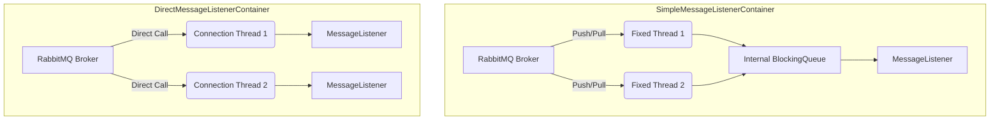

# RabbitMQ的SpringAMQP实现

在 RabbitMQ 的 Spring AMQP 实现中，Message Listener Container 是核心组件，负责连接管理、队列监听和消息分发。

目前主要有两大容器实现：
- SimpleMessageListenerContainer (SMLC) 
- DirectMessageListenerContainer (DMLC)。

理解它们的底层差异，是优化高并发消息系统的关键。

----

# 1. 核心架构对比

## SimpleMessageListenerContainer (SMLC)

SMLC 是经典的容器实现。它的特点是“主动拉取 + 内部排队”。它开启固定数量的 Consumer 线程，每个线程通过循环去 RabbitMQ 队列中拉取消息，放入内部的 BlockingQueue 中，再分配给 Listener。

## DirectMessageListenerContainer (DMLC)

DMLC 是较新的实现。它的特点是“被动推送 + 动态分配”。它不维护内部队列，而是直接在 RabbitMQ 驱动的线程中回调 Listener。

| 特性           | Simple (SMLC)            | Direct (DMLC)                |
| -------------- | ------------------------ | ---------------------------- |
| 线程模型       | 容器管理固定线程池       | 借用 RabbitMQ 客户端连接线程 |
| 队列关联       | 1个线程可能处理多个队列  | 1个线程对应1个队列（通常）   |
| 运行期动态调整 | 能够动态增减消费者数量   | 运行中调整较为局限           |
| 资源利用       | 适合队列少、并发高的场景 | 适合队列多、负载分布广的场景 |


# 2. 逻辑架构图



# 3. 结合 RabbitMQ 六种模式的适用性

RabbitMQ 的模式（简单、工作、发布订阅、路由、主题、RPC）在底层本质上都是对交换机（Exchange）和队列（Queue）的组合。

| 模式                 | 推荐容器                            | 理由                                                        |
| -------------------- | ----------------------------------- | ----------------------------------------------------------- |
| Simple / Work Queues | Simple	适合通过 concurrentConsumers | 快速水平扩展处理能力。                                      |
| Publish/Subscribe    | Direct                              | 如果订阅者（临时队列）非常多，Direct 占用的线程开销更小。   |
| Routing / Topics     | Direct                              | 复杂路由下，若存在大量细粒度队列，Direct 更灵活。           |
| RPC                  | Simple	RPC                          | 强调响应速度和顺序，Simple 的内部缓存机制能提供更稳的吞吐。 |

# 4. 场景区别：选型指南

## 场景 A：队列数量少，但单个队列压力极大

- 推荐：Simple (SMLC)
- 原因： 可以通过设置 concurrentConsumers 开启多个线程监听同一个队列，利用内部缓存应对突发流量。

## 场景 B：队列数量极多（如成千上万个用户私有队列）

- 推荐：Direct (DMLC)
- 原因： SMLC 为每个监听器维护线程和队列，开销巨大。DMLC 采用按需调用的方式，在大量低负载队列场景下极其节省 CPU 和内存。

# 5. 进阶：其他监听方法与优化

除了上述两种主流容器，在 Spring 生态中还有以下方式：

## @RabbitListener 注解
这是最常用的方式。你可以通过配置 RabbitListenerContainerFactory 来决定底层使用 SMLC 还是 DMLC。

```java
@Bean
public SimpleRabbitListenerContainerFactory simpleFactory() {
    SimpleRabbitListenerContainerFactory factory = new SimpleRabbitListenerContainerFactory();
    factory.setConcurrentConsumers(3); // 默认 SMLC
    return factory;
}
```

## Stream 插件 (RabbitMQ Stream)

对于超高吞吐（每秒百万级）的场景，传统的容器可能成为瓶颈。
- 原理： 类似 Kafka 的持久化日志。
- 优势： 支持消息重放、单分区大规模并发。

## 批处理监听 (Batching)

如果逻辑允许，可以配置容器进行批量消费：
- 设置： factory.setBatchListener(true);
- 好处： 减少 ACK 的网络往返次数，显著提升写入数据库等 IO 密集型操作的效率。

# 总结建议

- 追求稳定和传统的高吞吐： 选 Simple。
- 追求大规模队列和资源节省： 选 Direct。
