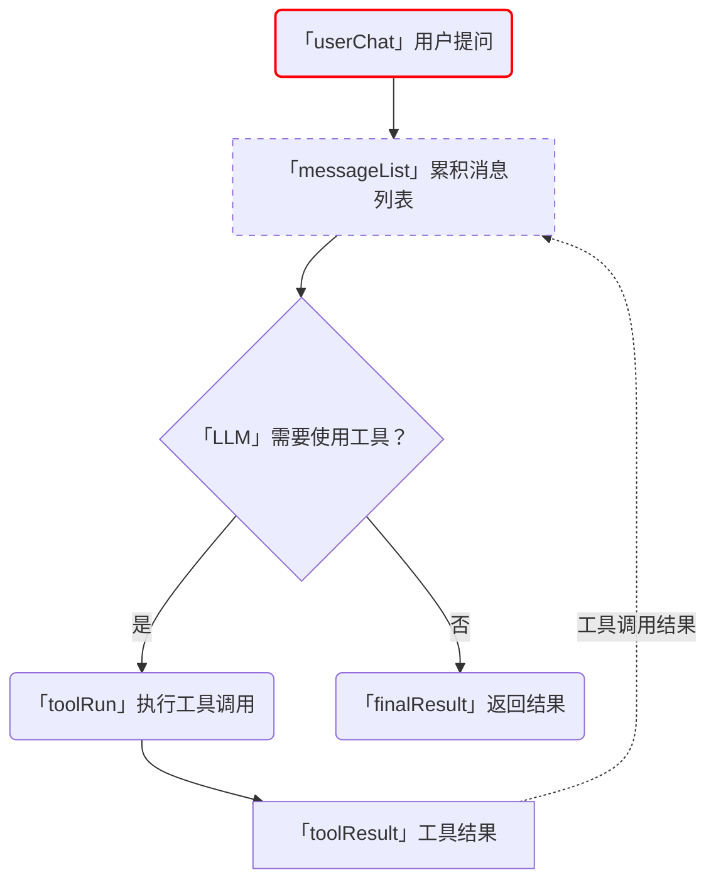

# agent循环

```mermaid
flowchart TD
    userChat@{shape: rounded, label: "「userChat」用户提问"}
    LLM@{shape: diamond, label: "「LLM」需要使用工具？" }
    toolRun@{shape: rounded, label: "「toolRun」执行工具调用"}
    finalResult@{shape: rounded, label: "「finalResult」返回结果"}
    messageList@{shape: rect, label: "「messageList」累积消息列表"}
    toolResult@{shape: rect, label: "「toolResult」工具结果"}

    userChat --> messageList
    LLM -->|是| toolRun
    LLM -->|否| finalResult
    toolRun --> toolResult
    toolResult -.->|工具调用结果| messageList
    messageList --> LLM

    style userChat stroke:#ff0000, stroke-width:2px
    messageList:::dashedNode
    classDef dashedNode stroke-dasharray: 5 5
```