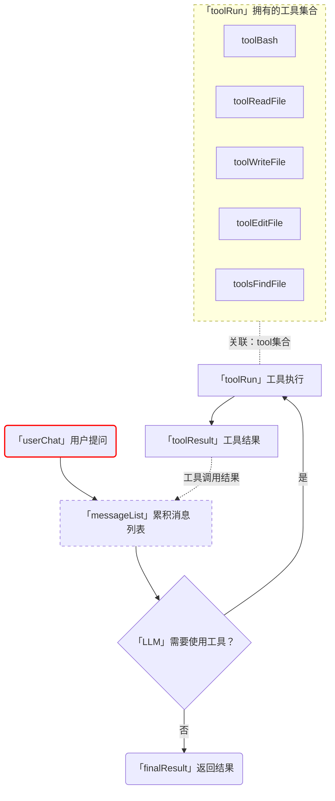

# 使用工具

```mermaid
flowchart TD
    userChat@{shape: rounded, label: "「userChat」用户提问"}
    LLM@{shape: diamond, label: "「LLM」需要使用工具？" }
    finalResult@{shape: rounded, label: "「finalResult」返回结果"}
    messageList@{shape: rect, label: "「messageList」累积消息列表"}
    toolRun@{shape: rect, label: "「toolRun」工具执行"}
    toolResult@{shape: rect, label: "「toolResult」工具结果"}

    subgraph toolBox[「toolRun」拥有的工具集合]
        toolBash@{shape: rect, label: "toolBash"}
        toolReadFile@{shape: rect, label: "toolReadFile"}
        toolWriteFile@{shape: rect, label: "toolWriteFile"}
        toolEditFile@{shape: rect, label: "toolEditFile"}
        toolsFindFile@{shape: rect, label: "toolsFindFile"}
    end

    userChat --> messageList
    LLM -->|是| toolRun
    LLM -->|否| finalResult
    toolRun --> toolResult
    toolResult -.->|工具调用结果| messageList
    messageList --> LLM
    toolBox -.-|关联：tool集合| toolRun

    style userChat stroke:#ff0000, stroke-width:2px
    toolBox:::dashedNode
    messageList:::dashedNode
    classDef dashedNode stroke-dasharray: 5 5
```

