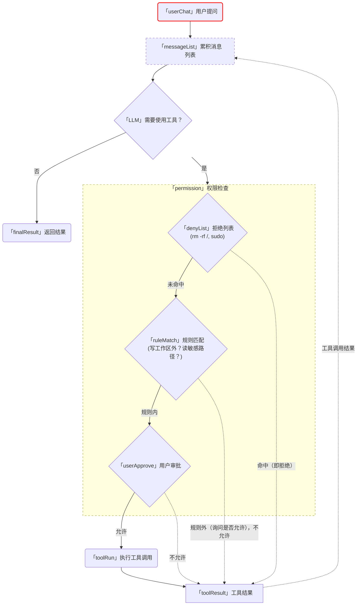

# 权限检查

```mermaid
flowchart TD
    userChat@{shape: rounded, label: "「userChat」用户提问"}
    LLM@{shape: diamond, label: "「LLM」需要使用工具？" }
    toolRun@{shape: rounded, label: "「toolRun」执行工具调用"}
    finalResult@{shape: rounded, label: "「finalResult」返回结果"}
    messageList@{shape: rect, label: "「messageList」累积消息列表"}
    toolResult@{shape: rect, label: "「toolResult」工具结果"}

    subgraph permission["「permission」权限检查"]
        denyList@{shape: diamond, label: "「denyList」拒绝列表\r\n(rm -rf /, sudo)"}
        ruleMatch@{shape: diamond, label: "「ruleMatch」规则匹配\r\n(写工作区外？读敏感路径？)"}
        userApprove@{shape: diamond, label: "「userApprove」用户审批"}
    end

    userChat --> messageList
    LLM -->|是| permission
    LLM -->|否| finalResult
    toolRun --> toolResult
    toolResult -.->|工具调用结果| messageList
    denyList -->|未命中| ruleMatch
    denyList -.->|命中（即拒绝）| toolResult
    ruleMatch -->|规则内| userApprove
    ruleMatch -.->|规则外（询问是否允许），不允许| toolResult
    userApprove -->|允许| toolRun
    userApprove -.->|不允许| toolResult
    messageList --> LLM

    style userChat stroke:#ff0000, stroke-width:2px
    messageList:::dashedNode
    permission:::dashedNode
    classDef dashedNode stroke-dasharray: 5 5
```

