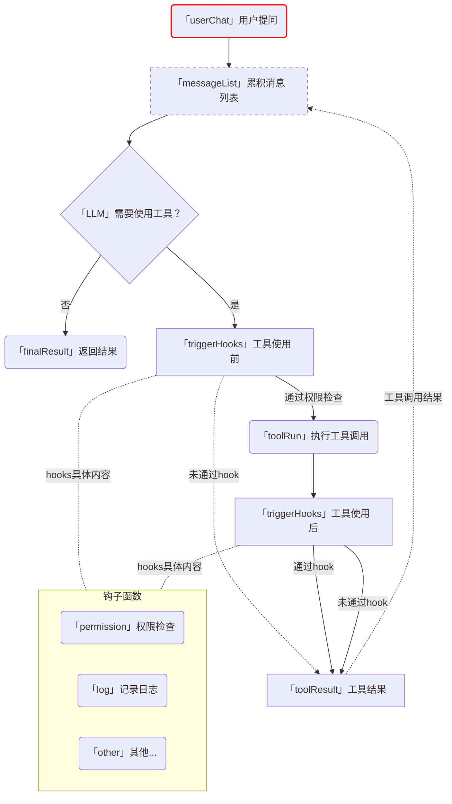

# 钩子

- 扩展逻辑挂在外面，循环本身一字不改
- permission检查，也作为hooks的一部分

```mermaid
flowchart TD
    userChat@{shape: rounded, label: "「userChat」用户提问"}
    LLM@{shape: diamond, label: "「LLM」需要使用工具？" }
    toolRun@{shape: rounded, label: "「toolRun」执行工具调用"}
    finalResult@{shape: rounded, label: "「finalResult」返回结果"}
    messageList@{shape: rect, label: "「messageList」累积消息列表"}
    toolResult@{shape: rect, label: "「toolResult」工具结果"}
    
    hookPreToolUse@{shape: rect, label: "「triggerHooks」工具使用前"}
    hookPostToolUse@{shape: rect, label: "「triggerHooks」工具使用后"}

    subgraph hookFunctions["钩子函数"]
        permissionHook@{shape: rounded, label: "「permission」权限检查"}
        logHook@{shape: rounded, label: "「log」记录日志"}
        otherHook@{shape: rounded, label: "「other」其他..."}
    end

    hookPreToolUse -.-|hooks具体内容| hookFunctions
    hookPostToolUse -.-|hooks具体内容| hookFunctions

    userChat --> messageList
    LLM -->|是| hookPreToolUse
    hookPreToolUse -->|通过权限检查| toolRun
    hookPreToolUse -.->|未通过hook| toolResult
    LLM -->|否| finalResult
    toolRun --> hookPostToolUse
    hookPostToolUse -->|通过hook| toolResult
    hookPostToolUse -->|未通过hook| toolResult
    toolResult -.->|工具调用结果| messageList
    messageList --> LLM

    style userChat stroke:#ff0000, stroke-width:2px
    messageList:::dashedNode
    classDef dashedNode stroke-dasharray: 5 5
```
