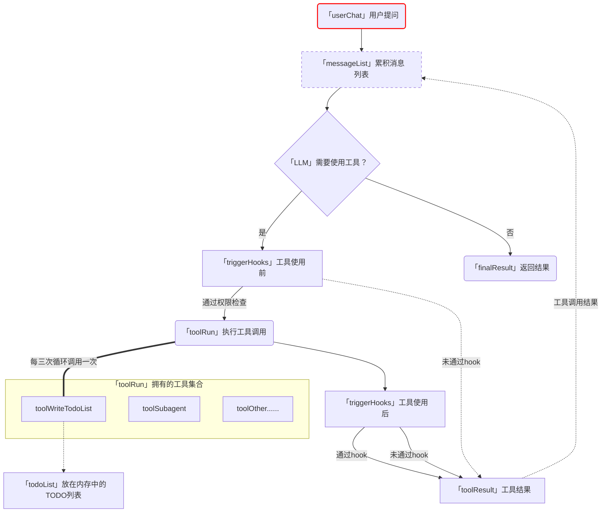

# subagent

- 地位上，subagent只是一个工具（和bash，readFile之类的没有区别）
- 这个subagent工具，内部依旧是一个agent循环
  - 多了一个“stop”钩子，保证外部能停止这个subagent
  - 循环不是无限次循环，多了一个至多30次的条件

```mermaid
flowchart TD
    userChat@{shape: rounded, label: "「userChat」用户提问"}
    LLM@{shape: diamond, label: "「LLM」需要使用工具？" }
    toolRun@{shape: rounded, label: "「toolRun」执行工具调用"}
    finalResult@{shape: rounded, label: "「finalResult」返回结果"}
    messageList@{shape: rect, label: "「messageList」累积消息列表"}
    toolResult@{shape: rect, label: "「toolResult」工具结果"}
    todoList@{shape: rect, label: "「todoList」放在内存中的TODO列表"}
    hookPreToolUse@{shape: rect, label: "「triggerHooks」工具使用前"}
    hookPostToolUse@{shape: rect, label: "「triggerHooks」工具使用后"}

    subgraph toolBox[「toolRun」拥有的工具集合]
        toolWriteTodoList@{shape: rect, label: "toolWriteTodoList"}
        toolSubagent@{shape: rect, label: "toolSubagent"}
        toolOther@{shape: rect, label: "toolOther......"}
    end

    userChat --> messageList
    LLM -->|是| hookPreToolUse
    hookPreToolUse -->|通过权限检查| toolRun
    hookPreToolUse -.->|未通过hook| toolResult
    LLM -->|否| finalResult
    toolRun ===|每三次循环调用一次| toolWriteTodoList
    toolWriteTodoList -.-> todoList
    toolRun --> hookPostToolUse
    hookPostToolUse -->|通过hook| toolResult
    hookPostToolUse -->|未通过hook| toolResult
    toolResult -.->|工具调用结果| messageList
    messageList --> LLM

    style userChat stroke:#ff0000, stroke-width:2px

    messageList:::dashedNode
    classDef dashedNode stroke-dasharray: 5 5
```

