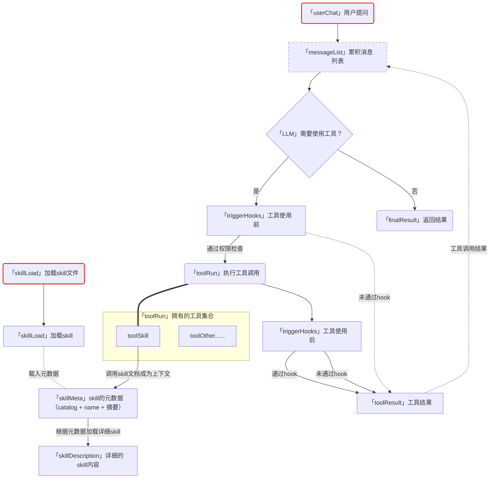

# skill加载

```mermaid
flowchart TD
    processStart@{shape: rounded, label: "「skillLoad」加载skill文件"}
    skillLoad@{shape: rect, label: "「skillLoad」加载skill"}
    skillMeta@{shape: rect, label: "「skillMeta」skill的元数据（catalog + name + 摘要）"}
    skillDescription@{shape: rect, label: "「skillDescription」详细的skill内容"}

    processStart --> skillLoad
    skillLoad -.-|载入元数据| skillMeta


    userChat@{shape: rounded, label: "「userChat」用户提问"}
    LLM@{shape: diamond, label: "「LLM」需要使用工具？" }
    toolRun@{shape: rounded, label: "「toolRun」执行工具调用"}
    finalResult@{shape: rounded, label: "「finalResult」返回结果"}
    messageList@{shape: rect, label: "「messageList」累积消息列表"}
    toolResult@{shape: rect, label: "「toolResult」工具结果"}
    hookPreToolUse@{shape: rect, label: "「triggerHooks」工具使用前"}
    hookPostToolUse@{shape: rect, label: "「triggerHooks」工具使用后"}

    subgraph toolBox[「toolRun」拥有的工具集合]
        toolSkill@{shape: rect, label: "toolSkill"}
        toolOther@{shape: rect, label: "toolOther......"}
    end

    userChat --> messageList
    LLM -->|是| hookPreToolUse
    hookPreToolUse -->|通过权限检查| toolRun
    hookPreToolUse -.->|未通过hook| toolResult
    LLM -->|否| finalResult
    toolRun === toolSkill
    toolSkill -->|调用skill文档成为上下文| skillMeta
    skillMeta -->|根据元数据加载详细skill| skillDescription
    toolRun --> hookPostToolUse
    hookPostToolUse -->|通过hook| toolResult
    hookPostToolUse -->|未通过hook| toolResult
    toolResult -.->|工具调用结果| messageList
    messageList --> LLM

    style userChat stroke:#ff0000, stroke-width:2px
    style processStart stroke:#ff0000, stroke-width:2px

    messageList:::dashedNode
    classDef dashedNode stroke-dasharray: 5 5
```

