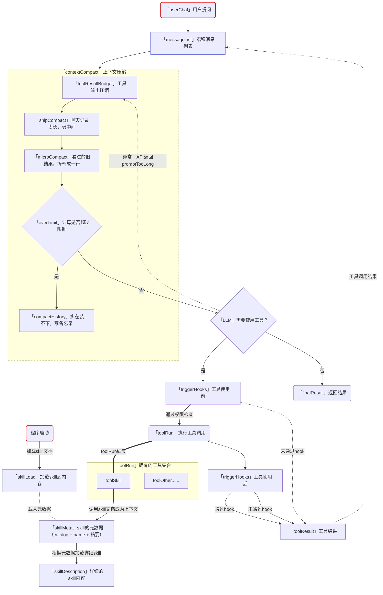

# context compact

- 上下文总会满，先整理，再总结
- 可以把上下文窗口看作模型当前使用的一张草稿纸（草稿纸的大小固定）。用户消息、模型回复、tool_use 和 tool_result 都会按顺序写在这张纸上。模型每次继续工作时，都要重新读取这些内容。

## 四个函数说明
- toolResultBudget  — 大件先存仓库。
  - 工具输出（读文件、跑命令的结果）可能巨大。一次调了多个工具，所有结果加起来超过 20 万字符时，从最大的开始，把超过 3 万字符的结果完整写到硬盘（ .task_outputs/tool-results/ ），上下文里只留“文件路径 + 前 2000 字预览”
  - 类比：快递箱太大塞不进抽屉 → 箱子存仓库，抽屉里只放一张取货单。内容没丢，要用随时取。
- snipCompact  — 聊天记录太长，剪中间
  - 消息超过 50 条时，先把完整历史存档到  .transcripts/ ，然后只留开头 3 条 + 最近 47 条，中间换成一行“[47 条消息已归档在 xxx]”
  - 类比：聊天记录太长，把中间部分打包存档，只留开头和结尾。
  - 细节：下剪刀时会避开“工具调用”和“工具结果”这对搭档，剪散了 API 会直接报错。
- microCompact  — 看过的旧结果，折叠成一行
  - 模型已经读过的工具结果里，只保留最近 3 条完整的；更早的、超过 120 字符的，正文换成一行占位符： `[Earlier tool result omitted.]`  或  `[已存到某文件]` 。刚产生、模型还没看过的结果绝不动——保证每条新结果至少被完整读一次。
  - 类比：旧聊天里的长文件内容，看过了就折叠成一行摘要。
- compactHistory  — 实在装不下，写备忘录
  - 前三步做完还超 5 万字符时的终极手段：全部历史存档 → 让模型把历史总结成一份简短的事实摘要（目标、决定、文件、剩余工作、用户约束）→ 用一条  `[Compacted]`  消息替换全部历史。
  - 类比：把整本日记浓缩成一页备忘录，原文存档备查。摘要里明确区分“当前用户请求”和“历史摘要”，防止模型把历史里的指令当成命令执行。

前三步是纯文本操作，不花一分钱（不调 API）；只有第四步才多花一次模型调用。所以顺序固定：能转存的先转存，能剪的先剪，能折叠的先折叠，最后才总结

## 流程图

