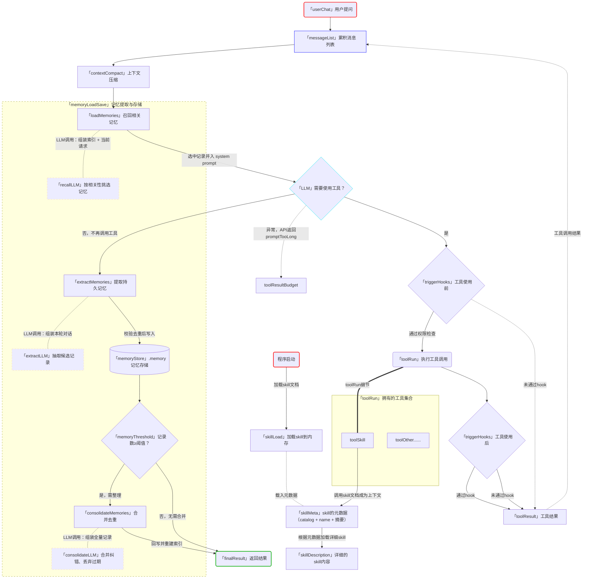

# Memory

- "把以后还会用到的信息留下来。" 文件存储 + 索引 + 相关性选择 + 按需召回。
- Harness 层：Memory 在会话之外保存可复用知识，并在相关任务中取回。

- Agent 开始新会话时，messages 里没有上一次的对话。用户之前说过的编码偏好、项目背景和排查线索，下次任务还可能用到。没有持久存储，这些信息只能由用户重新说一遍。
- 把完整 transcript 留下来适合归档，却不适合每次都发给模型。对话会越来越长，当前任务需要的信息很难定位，旧事实也可能已经过期。Memory 要解决的是两个问题：哪些信息值得跨会话保存，以及当前任务应该取回哪几条。

## memory和skill的区别和联系

本质上它们都是 **「文件/目录 + 索引」** 这套结构，运行机制一模一样
- 两者都是一个 Markdown 文件 = 一条知识，靠 frontmatter 描述它，靠索引文件选择它，用到时才读正文
- 唯一的本质差别在于 **"谁写入"**
  - Skill：人类手写、只读、稳定，是给 Agent 的"操作手册"
  - Memory：Agent 自己从对话里提取、会增删整理，是"自累积的笔记"

| 区别   | Skill                       | Memory                               |
| ------ | --------------------------- | ------------------------------------ |
| 正文   | skills/*.md（人写）         | .memory/*.md（AI 提取）              |
| 索引   | 简短清单                    | MEMORY.md 索引                       |
| 元数据 | frontmatter 字段            | frontmatter（name/description/type） |
| 用法   | 启动时加载索引 → 按需读正文 | 同样：选索引 → 按需读正文            |

## memory具体流程

Memory 挂在 agent 循环的两端：**进入循环前召回（读）**，**离开循环后提取（写）**。图中用虚线 `memoryLoadSave` 子图圈出这一类动作：

1. **进入循环 — 召回（读）**：`loadMemories(messages)` 拿最近的用户消息作为查询，`selectRelevantMemories` 基于「MEMORY.md 索引」挑选最相关的 ≤5 条记忆正文，再由 `buildSystem` 并入 system prompt（作为背景知识，不当作新命令，当前请求优先级更高）。
2. **循环中**：召回内联在 `contextCompact → memoryRecall → LLM` 这一步，即每次进入 LLM 前先补充相关记忆（实际代码中每个用户请求只执行一次，图中画在循环内是简化表达）。
3. **离开循环 — 提取（写）**：当 LLM 判断不再需要工具（`否，不再调用工具`），`extractMemories` 从本轮对话提取候选记录，`shouldStoreMemory` 过滤掉临时性/不完整内容后，把四类记忆（user / feedback / project / reference）写入 `.memory/` 存储。
4. **合并去重（整理）**：`memoryThreshold`（记录数≥阈值，默认 10）判定是否需要整理：是则 `consolidateMemories` 合并去重后回写存储，否则跳过。两条路径最终都汇入绿色边框的 `finalResult`（流程终点）返回结果。

一句话总结：**入环读、出环写、超阈值整理**——记忆是会话外的持久侧路，不打断主循环。

## 流程图

