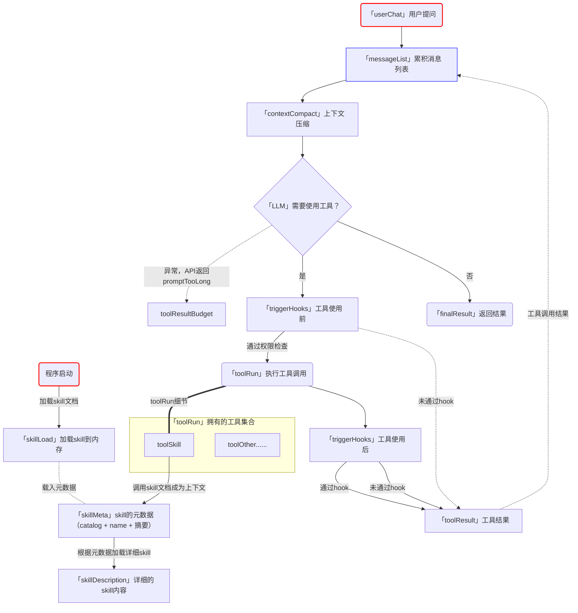

# Memory

- "把以后还会用到的信息留下来。" 文件存储 + 索引 + 相关性选择 + 按需召回。
- Harness 层：Memory 在会话之外保存可复用知识，并在相关任务中取回。

- Agent 开始新会话时，messages 里没有上一次的对话。用户之前说过的编码偏好、项目背景和排查线索，下次任务还可能用到。没有持久存储，这些信息只能由用户重新说一遍。
- 把完整 transcript 留下来适合归档，却不适合每次都发给模型。对话会越来越长，当前任务需要的信息很难定位，旧事实也可能已经过期。Memory 要解决的是两个问题：哪些信息值得跨会话保存，以及当前任务应该取回哪几条。

## 流程图

