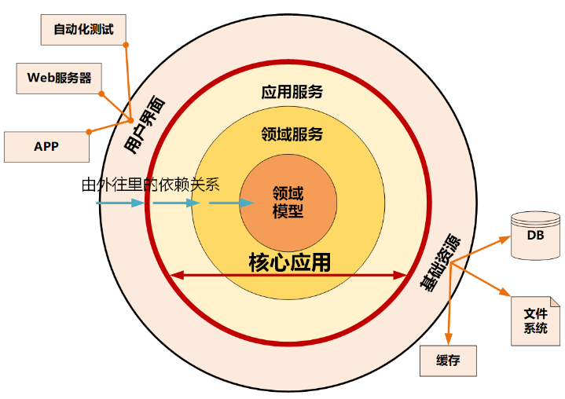
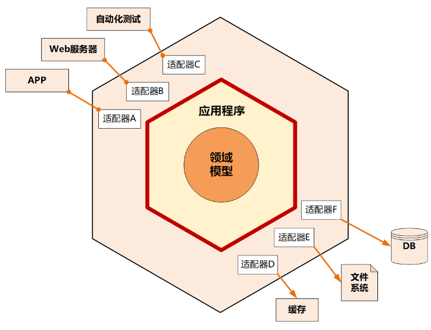

## DDD之架构模型

### 整洁架构（洋葱架构）

整洁架构又名“洋葱架构”。整洁架构的层就像洋葱片一样，它体现了分层的设计思想。在整洁架构里，同心圆代表应用软件的不同部分，从里到外依次是领域模型、领域服务、应用服务和最外围的容易变化的内容，比如用户界面和基础设施。

整洁架构最主要的原则是依赖原则，它定义了各层的依赖关系，**越往里依赖越低，代码级别越高，越是核心能力**。外圆代码依赖只能指向内圆，内圆不需要知道外圆的任何情况。

在洋葱架构中，各层的职能是这样划分的：

- 领域模型实现领域内核心业务逻辑，它封装了企业级的业务规则。**领域模型的主体是实体，一个实体可以是一个带方法的对象，也可以是一个数据结构和方法集合**。
- 领域服务实现涉及多个实体的复杂业务逻辑。
- 应用服务实现与用户操作相关的服务组合与编排，它包含了应用特有的业务流程规则，封装和实现了系统所有用例。
- 最外层主要提供适配的能力，适配能力分为主动适配和被动适配。主动适配主要实现外部用户、网页、批处理和自动化测试等对内层业务逻辑访问适配。被动适配主要是实现核心业务逻辑对基础资源访问的适配，比如数据库、缓存、文件系统和消息中间件等。
- 红圈内的领域模型、领域服务和应用服务一起组成软件核心业务能力

### 六边形架构

六边形架构又名“端口适配器架构”。追溯微服务架构的渊源，一般都会涉及到六边形架构。

**六边形架构的核心理念是：应用是通过端口与外部进行交互的**。这也是微服务架构下 API 网关盛行的主要原因。

在六边形架构中，**红圈内的核心业务逻辑（应用程序和领域模型）与外部资源（包括 APP、Web 应用以及数据库资源等）完全隔离，仅通过适配器进行交互**。它**解决了业务逻辑与用户界面的代码交错问题，很好地实现了前后端分离**。六边形架构各层的依赖关系与整洁架构一样，都是由外向内依赖。

六边形架构将系统分为内六边形和外六边形两层，这两层的职能划分如下：

- 红圈内的六边形实现应用的核心业务逻辑；
- 外六边形完成外部应用、驱动和基础资源等的交互和访问，对前端应用以 API 主动适配的方式提供服务，对基础资源以依赖倒置被动适配的方式实现资源访问。
- 六边形架构的一个端口可能对应多个外部系统，不同的外部系统也可能会使用不同的适配器，由适配器负责协议转换。这就使得应用程序能够以一致的方式被用户、程序、自动化测试和批处理脚本使用

### 两者的区别与联系

#### 洋葱架构：像 “政府部门的层级”

- **最内层（领域核心）**：国家宪法、根本大法（相当于业务核心规则，绝对稳定）；
- **中间层（领域服务+应用服务）**：各部委的政策制定、流程审批（基于宪法执行具体业务）；
- **最外层（适配层）**：基层办事窗口（对接群众、企业，把政策落地，比如办理营业执照）。
- 特点：层级分明，上层指导下层，下层依赖上层的规则，不能越级。

#### 六边形架构：像“手机的核心+外设接口”
- **中间核心**：手机的主板+CPU（相当于业务逻辑，不关心外接什么设备）；
- **端口**：手机的充电口、耳机孔、Type-C接口（相当于抽象接口，定义了“能接什么”）；
- **适配器**：充电线、耳机、U盘（相当于适配实现，负责对接具体外部设备）。
- 特点：核心只提供接口，外接设备只要适配接口就能用，换设备不用换核心（比如换耳机不用换主板）。

#### 核心区别对比
| 对比维度 | **洋葱架构（Onion Architecture）** | **六边形架构（Hexagonal Architecture）** |
| :--- | :--- | :--- |
| **提出视角** | **分层视角**：像剥洋葱一样，从内到外划分层层圈层 | **交互视角**：像一个六边形盒子，核心在中间，外部系统通过“边”连接 |
| **结构划分** | 明确的**圈层分层**，从内到外依次是： 1. **领域核心层**（实体+值对象，最内层） 2. **领域服务层**（跨实体业务逻辑） 3. **应用服务层**（业务流程编排） 4. **外部适配层**（数据库、Web、第三方API） | 无严格分层，只有两个核心部分： 1. **应用核心**（包含领域层+应用层，业务逻辑） 2. **外部系统**（数据库、Web等） 两者通过 **端口（Port）+适配器（Adapter）** 连接 |
| **依赖规则** | 严格遵循 **“内层不依赖外层，外层依赖内层”** 圈层之间的依赖方向是“向内”的 | 依赖规则隐含在“端口-适配器”中： 核心定义**端口**（抽象接口），适配器实现端口并对接外部系统 核心不依赖适配器，适配器依赖核心 |
| **关键术语** | 核心术语是 **“层/圈层”**，比如“领域层”“应用层”“适配层” | 核心术语是 **“端口（Port）”“适配器（Adapter）”**，比如“输入端口”“输出适配器” |
| **落地重点** | 强调**分层边界清晰**，适合复杂业务系统的层级划分 | 强调**交互方式解耦**，适合灵活对接多类外部系统（比如同时对接MySQL、Redis、MQ） |

#### 两者的共同目标

1. **业务核心独立**：领域逻辑（业务规则）不依赖任何外部系统（数据库、Web框架、第三方API）；
2. **依赖方向统一**：所有外部依赖都指向内部核心，内层绝不依赖外层

#### 总结：什么时候用哪个视角？

- 当你需要**梳理系统的层级边界**，明确“哪些是核心逻辑，哪些是外部依赖”时，用**洋葱架构**的视角，它能帮你快速划分代码目录；
- 当你需要**对接新的外部系统**（比如把MySQL换成MongoDB，或新增一个短信服务）时，用**六边形架构**的视角，它能帮你聚焦“定义端口→实现适配器”，不改动任何核心业务逻辑。

本质上，它们是**同一架构思想的两种“话术”**，最终都是为了让业务逻辑“不被外部技术绑架”，实现高内聚、低耦合。

### 参考

[架构模型](https://hanchenhao.github.io/MadBOK/DomainDrivenDesign/09-%E6%9E%B6%E6%9E%84%E6%A8%A1%E5%9E%8B.html#%E6%95%B4%E6%B4%81%E6%9E%B6%E6%9E%84)