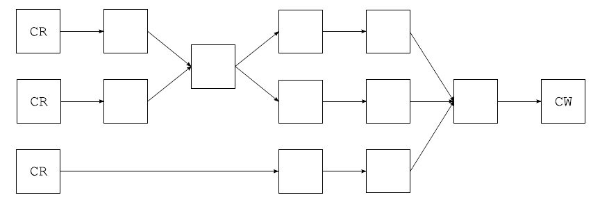

# 1. 引言

## 1.1 动机

程序分析、程序生成与程序变换是有用的技术，可用于许多场合：

- 程序分析，其范围可以从简单的语法分析一直到完整的语义分析，可用于查找应用程序中的潜在缺陷、检测未被使用的代码、对代码进行逆向工程等。
- 程序生成用于编译器中。这既包括传统的编译器，也包括用于分布式编程的桩编译器或骨架编译器、即时编译器（Just In Time compiler）等。
- 程序变换可用于优化或混淆程序、向应用程序中插入调试代码或性能监控代码，以及用于面向切面编程等。

所有这些技术都可以用于任何编程语言，但难易程度因语言而异。就 Java 而言，它们既可以作用于 Java 源代码，也可以作用于已编译的 Java 类。在已编译类上工作的优点之一是，显然，不再需要源代码。因此程序变换可以用于任何应用程序，包括闭源和商业的应用程序。在已编译代码上工作的另一个优点是，可以在运行时、即在类被加载进 Java 虚拟机之前就对它们进行分析、生成或变换（在运行时生成并编译源代码是可行的，但速度确实很慢，而且需要一个完整的 Java 编译器）。其好处是，桩编译器或切面织入器（aspect weaver）这类工具对用户变得透明。

由于程序分析、生成和变换技术有如此多的可能用途，人们已经为许多语言（包括 Java）实现了许多分析、生成和变换程序的工具。ASM 就是针对 Java 语言的这类工具之一，它专为运行时的——也包括离线的——类生成与类变换而设计。因此 ASM[^1] 库被设计为作用于已编译的 Java 类。它还被设计得尽可能快、尽可能小。尽可能快很重要，这样才不至于让在运行时使用 ASM 进行动态类生成或变换的应用程序变得太慢。而尽可能小也很重要，这样才能用于内存受限的环境，并避免使使用 ASM 的小型应用程序或库的体积膨胀。

ASM 并不是生成和变换已编译 Java 类的唯一工具，但它是最近、最高效的工具之一。它可以从 http://asm.objectweb.org 下载。其主要优点如下：

- 它有一个简单、设计良好且模块化的 API，易于使用。
- 它有完善的文档，并有一个配套的 Eclipse 插件。
- 它支持最新的 Java 版本，即 Java 7。
- 它体积小、速度快，而且非常健壮。
- 它庞大的用户社区可以为新用户提供支持。
- 它的开源许可证允许你几乎以任何你想要的方式使用它。

## 1.2 概述

### 1.2.1 范围

ASM 库的目标是生成、变换和分析已编译的 Java 类，这些类以字节数组的形式表示（即它们在磁盘上的存储形式以及被加载进 Java 虚拟机时的形式）。为此，ASM 提供了读取、写入和变换这种字节数组的工具，所使用的概念比字节层次更高，例如数值常量、字符串、Java 标识符、Java 类型、Java 类结构元素等。注意，ASM 库的范围严格限于读取、写入、变换和分析类。特别是，类加载过程不在其范围之内。

### 1.2.2 模型

ASM 库提供两套用于生成和变换已编译类的 API：Core API（核心 API）提供类的基于事件的表示，而 Tree API（树 API）提供类的基于对象的表示。

在基于事件的模型中，一个类由一系列事件表示，每个事件代表类的一个元素，例如其头部、一个字段、一个方法声明、一条指令等。基于事件的 API 定义了可能的事件集合以及它们必须出现的顺序，并提供一个类解析器，它每解析一个元素就生成一个事件，还提供一个类写入器，它根据这种事件的序列生成已编译类。

在基于对象的模型中，一个类由一棵对象树表示，每个对象代表类的一部分，例如类本身、一个字段、一个方法、一条指令等，并且每个对象都持有指向表示其组成部分的对象的引用。基于对象的 API 提供了一种方式，把表示某个类的事件序列转换为表示同一个类的对象树，反之亦然，把对象树转换为等价的事件序列。换言之，基于对象的 API 构建在基于事件的 API 之上。

这两套 API 可以与用于 XML 文档的 Simple API for XML（SAX）和 Document Object Model（DOM）API 相类比：基于事件的 API 类似于 SAX，而基于对象的 API 类似于 DOM。基于对象的 API 构建在基于事件的 API 之上，正如 DOM 可以建立在 SAX 之上一样。

ASM 同时提供这两套 API，因为并不存在最好的 API。事实上，每套 API 都有自己的优点和缺点：

- 基于事件的 API 比基于对象的 API 更快，所需内存也更少，因为无需创建并在内存中保存表示该类的对象树（SAX 与 DOM 之间也存在同样的差别）。
- 然而，用基于事件的 API 实现类变换可能更困难，因为在任何给定时刻只有一个类元素可用（即与当前事件对应的那个元素），而在基于对象的 API 中整个类都存放在内存中。

注意，这两套 API 一次只处理一个类，并且彼此独立：不维护任何关于类层次结构的信息；如果某个类变换影响到其他类，那么修改这些其他类就是用户自己的责任。

### 1.2.3 架构

ASM 应用程序具有很强的架构色彩。实际上，基于事件的 API 是围绕事件生产者（类解析器）、事件消费者（类写入器）以及各种预定义的事件过滤器组织起来的，用户自定义的生产者、消费者和过滤器也可以加入其中。因此使用这套 API 是一个两步过程：

- 把事件生产者、过滤器和消费者组件组装成可能很复杂的架构，
- 然后启动事件生产者，以运行生成或变换过程。

基于对象的 API 也有架构方面的特点：事实上，作用于对象树的类生成器或类变换器组件可以被组合起来，它们之间的连接表示变换的顺序。

尽管典型 ASM 应用程序中的大多数组件架构都相当简单，但也可以设想如下这样的复杂架构，其中箭头表示类解析器、写入器或变换器之间基于事件或基于对象的通信，并且在链中的任何位置都可以在基于事件的表示与基于对象的表示之间进行转换：

## 1.3 组织结构

ASM 库由若干个包组成，这些包分布在若干个 jar 文件中：

- `org.objectweb.asm` 和 `org.objectweb.asm.signature` 包定义了基于事件的 API，并提供类解析器和写入器组件。它们包含在 `asm.jar` 归档文件中。
- `org.objectweb.asm.util` 包位于 `asm-util.jar` 归档文件中，提供各种基于 Core API 的工具，可在 ASM 应用程序的开发和调试期间使用。
- `org.objectweb.asm.commons` 包提供若干有用的预定义类变换器，它们大多基于 Core API。它包含在 `asm-commons.jar` 归档文件中。
- `org.objectweb.asm.tree` 包位于 `asm-tree.jar` 归档文件中，定义了基于对象的 API，并提供在基于事件的表示与基于对象的表示之间进行转换的工具。
- `org.objectweb.asm.tree.analysis` 包提供一个类分析框架和若干预定义的类分析器，它们基于 Tree API。它包含在 `asm-analysis.jar` 归档文件中。

本文档分为两部分。第一部分介绍 Core API，即 `asm`、`asm-util` 和 `asm-commons` 归档文件。第二部分介绍 Tree API，即 `asm-tree` 和 `asm-analysis` 归档文件。每一部分至少包含一章讲述与类相关的 API，一章讲述与方法相关的 API，以及一章讲述与注解、泛型类型等相关的 API。每一章既涵盖编程接口，也涵盖相关的工具和预定义组件。所有示例的源代码都可以在 ASM 网站上获取。

这种组织方式便于循序渐进地介绍类文件的各项特性，但有时不得不把对同一个 ASM 类的介绍分散到若干小节中。因此建议按顺序阅读本文档。关于 ASM API 的参考指南，请使用 Javadoc。

## 排版约定

斜体（Italic）用于强调句子中的元素。

等宽字体（Constant width）用于代码片段。

粗体等宽字体（Bold constant width）用于强调代码元素。

斜体等宽字体（Italic constant width）用于代码中的可变部分以及标签。

## 1.4 致谢

我要感谢 François Horn 在本文档撰写过程中提出的宝贵意见，这些意见极大地改善了本文档的结构和可读性。

[^1]: ASM 这个名字没有任何含义：它只是对 C 语言中 `__asm__` 关键字的引用，该关键字允许用汇编语言实现某些函数。
