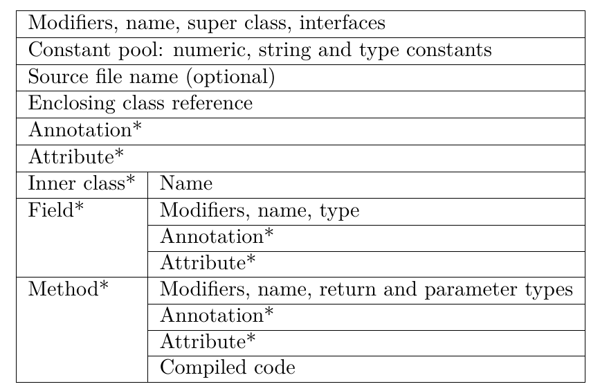
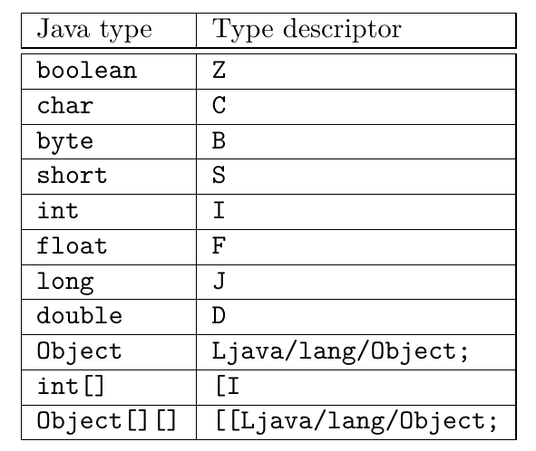
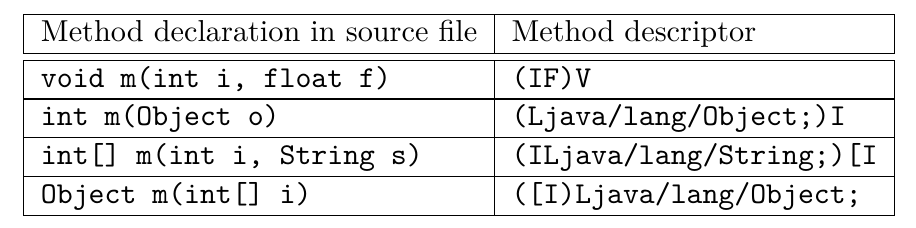
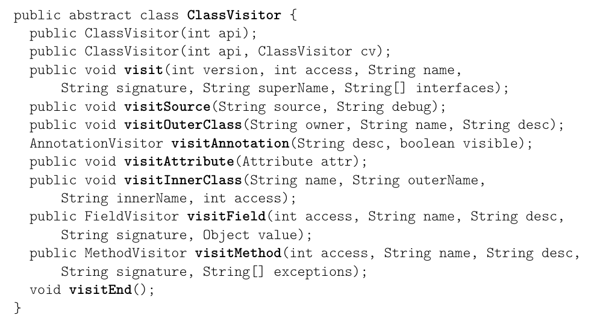
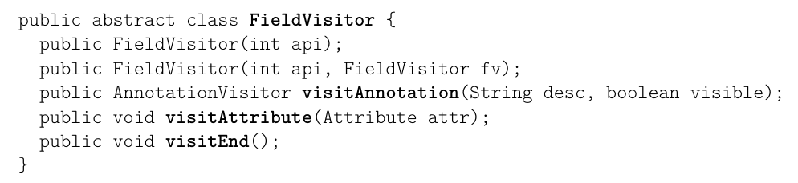
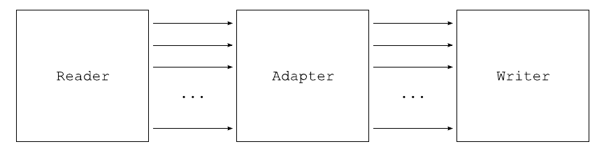
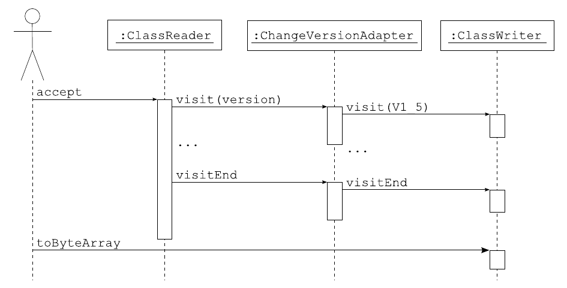
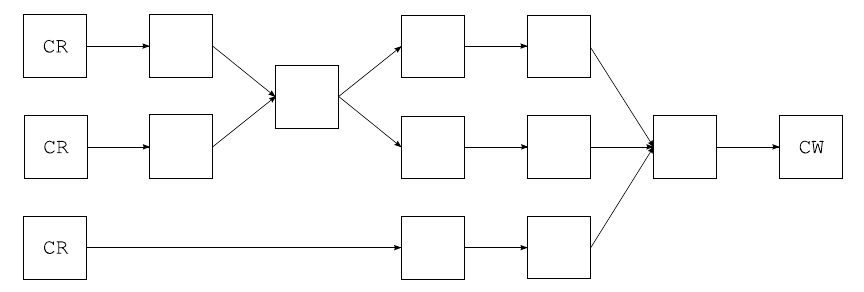

# 2. 类

本章说明如何使用核心 ASM API 生成和变换已编译的 Java 类。本章首先介绍已编译的类，然后介绍用于生成和变换它们的相应 ASM 接口、组件和工具，并给出许多示例。方法、注解和泛型的内容将在后续章节中说明。

## 2.1 结构

### 2.1.1 概述

已编译类的整体结构相当简单。事实上，与本地编译的应用程序不同，已编译的类保留了源代码中的结构信息以及几乎所有符号。实际上，一个已编译的类包含：

- 一节，描述该类的修饰符（例如 `public` 或 `private`）、名称、超类、接口和注解。
- 该类中声明的每个字段一节。每一节描述字段的修饰符、名称、类型和注解。
- 该类中声明的每个方法和构造器一节。每一节描述方法的修饰符、名称、返回类型和参数类型以及注解。它还包含方法的已编译代码，其形式是一系列 Java 字节码指令。

然而，源代码中的类和已编译的类之间存在一些差异：

- 一个已编译的类只描述一个类，而一个源文件可以包含多个类。例如，描述一个带有一个内部类的类的源文件会被编译成两个类文件：一个用于主类，一个用于内部类。不过，主类文件中包含对其内部类的引用，而方法内部定义的内部类则包含对其外围方法的引用。

- 已编译的类当然不包含注释，但可以包含类、字段、方法和代码属性，这些属性可用于将附加信息关联到这些元素。自从 Java 5 引入注解以来——注解可以用于同样的目的——属性已变得几乎无用。

- 已编译的类不包含包声明和导入部分，因此所有类型名都必须使用完全限定名。

另一个非常重要的结构差异是，已编译的类包含一个常量池节。该常量池是一个数组，包含类中出现的所有数值、字符串和类型常量。这些常量只在常量池节中定义一次，并在类文件的所有其他节中通过其索引被引用。幸运的是，ASM 隐藏了与常量池相关的所有细节，因此你不必操心它。图 2.1 总结了已编译类的整体结构。确切的结构在《Java 虚拟机规范》第 4 节中描述。

```text
Modifiers, name, super class, interfaces
Constant pool: numeric, string and type constants
Source file name (optional)
Enclosing class reference
Annotation*
Attribute*
Inner class* Name
Field*        Modifiers, name, type
              Annotation*
              Attribute*
Method*       Modifiers, name, return and parameter types
              Annotation*
              Attribute*
              Compiled code
```

**图 2.1：已编译类的整体结构（* 表示零个或多个）**



另一个重要差异是，Java 类型在已编译的类和源代码中的类里表示方式不同。接下来的几节将说明它们在已编译的类中的表示方式。

### 2.1.2 内部名

在许多情况下，类型被限定为类类型或接口类型。例如，一个类的超类、一个类实现的接口，或者一个方法抛出的异常，都不能是基本类型或数组类型，而必然是类类型或接口类型。这些类型在已编译的类中用内部名表示。一个类的内部名就是该类的完全限定名，只是把点替换为斜杠。例如，`String` 的内部名是 `java/lang/String`。

### 2.1.3 类型描述符

内部名只用于被限定为类类型或接口类型的类型。在所有其他情况下，例如字段类型，Java 类型在已编译的类中用类型描述符表示（见图 2.2）。

```text
Java type      Type descriptor
boolean        Z
char           C
byte           B
short          S
int            I
float          F
long           J
double         D
Object         Ljava/lang/Object;
int[]          [I
Object[][]     [[Ljava/lang/Object;
```

**图 2.2：一些 Java 类型的类型描述符**



基本类型的描述符是单个字符：`Z` 表示 `boolean`，`C` 表示 `char`，`B` 表示 `byte`，`S` 表示 `short`，`I` 表示 `int`，`F` 表示 `float`，`J` 表示 `long`，`D` 表示 `double`。类类型的描述符是该类的内部名，前面加上 `L`，后面加上分号。例如，`String` 的类型描述符是 `Ljava/lang/String;`。最后，数组类型的描述符是一个方括号，后跟数组元素类型的描述符。

### 2.1.4 方法描述符

方法描述符是在单个字符串中描述方法参数类型和返回类型的一系列类型描述符。方法描述符以左括号开头，后跟每个形参的类型描述符，再跟一个右括号，然后跟返回类型的类型描述符；如果方法返回 `void`，则为 `V`（方法描述符不包含方法名或参数名）。

```text
Method declaration in source file   Method descriptor
void m(int i, float f)              (IF)V
int m(Object o)                     (Ljava/lang/Object;)I
int[] m(int i, String s)            (ILjava/lang/String;)[I
Object m(int[] i)                   ([I)Ljava/lang/Object;
```

**图 2.3：方法描述符示例**



一旦你了解了类型描述符的工作方式，理解方法描述符就很容易了。例如，`(I)I` 描述的方法接收一个 `int` 类型的参数，并返回一个 `int`。图 2.3 给出了几个方法描述符示例。

## 2.2 接口与组件

### 2.2.1 展示

用于生成和变换已编译类的 ASM API 基于 `ClassVisitor` 抽象类（见图 2.4）。该类中的每个方法都对应于类文件结构中同名的节（见图 2.1）。简单的节通过单次方法调用访问，其参数描述该节的内容，并且返回 `void`。内容长度和复杂度可以任意的节，则通过一次初始方法调用访问，该调用返回一个辅助访问者类。`visitAnnotation`、`visitField` 和 `visitMethod` 方法就是这种情况，它们分别返回一个 `AnnotationVisitor`、一个 `FieldVisitor` 和一个 `MethodVisitor`。

同样的原则递归地用于这些辅助类。例如，`FieldVisitor` 抽象类（见图 2.5）中的每个方法都对应于类文件子结构中同名的节，而 `visitAnnotation` 返回一个辅助的 `AnnotationVisitor`，与 `ClassVisitor` 中一样。这些辅助访问者的创建和使用将在后续章节中说明：事实上，本章仅限于可以用 `ClassVisitor` 类单独解决的简单问题。

```java
public abstract class ClassVisitor {
    public ClassVisitor(int api);
    public ClassVisitor(int api, ClassVisitor cv);
    public void visit(int version, int access, String name,
        String signature, String superName, String[] interfaces);
    public void visitSource(String source, String debug);
    public void visitOuterClass(String owner, String name, String desc);
    AnnotationVisitor visitAnnotation(String desc, boolean visible);
    public void visitAttribute(Attribute attr);
    public void visitInnerClass(String name, String outerName,
        String innerName, int access);
    public FieldVisitor visitField(int access, String name, String desc,
        String signature, Object value);
    public MethodVisitor visitMethod(int access, String name, String desc,
        String signature, String[] exceptions);
    void visitEnd();
}
```

**图 2.4：`ClassVisitor` 类**



```java
public abstract class FieldVisitor {
    public FieldVisitor(int api);
    public FieldVisitor(int api, FieldVisitor fv);
    public AnnotationVisitor visitAnnotation(String desc, boolean visible);
    public void visitAttribute(Attribute attr);
    public void visitEnd();
}
```

**图 2.5：`FieldVisitor` 类**



`ClassVisitor` 类的方法必须按以下顺序调用，该顺序在该类的 Javadoc 中指定：

```text
visit visitSource? visitOuterClass? ( visitAnnotation | visitAttribute )*
( visitInnerClass | visitField | visitMethod )*
visitEnd
```

这意味着必须首先调用 `visit`，随后至多调用一次 `visitSource`，随后至多调用一次 `visitOuterClass`，随后是任意数量、任意顺序的 `visitAnnotation` 和 `visitAttribute` 调用，随后是任意数量、任意顺序的 `visitInnerClass`、`visitField` 和 `visitMethod` 调用，最后以一次 `visitEnd` 调用结束。

ASM 提供了三个基于 `ClassVisitor` API 的核心组件，用于生成和变换类：

- `ClassReader` 类解析以字节数组形式给出的已编译类，并在传给其 `accept` 方法的 `ClassVisitor` 实例上调用相应的 `visitXxx` 方法。它可以看作一个事件生产者。
- `ClassWriter` 类是 `ClassVisitor` 抽象类的子类，它直接以二进制形式构建已编译类。它的输出是一个包含该已编译类的字节数组，可以通过 `toByteArray` 方法取得。它可以看作一个事件消费者。
- `ClassVisitor` 类把它收到的所有方法调用委托给另一个 `ClassVisitor` 实例。它可以看作一个事件过滤器。

接下来的几节将通过具体示例说明如何使用这些组件来生成和变换类。

### 2.2.2 解析类

解析一个已有的类，唯一必需的组件就是 `ClassReader` 组件。我们用一个例子来说明这一点。假设我们想以类似于 `javap` 工具的方式打印一个类的内容。第一步是编写 `ClassVisitor` 类的一个子类，用来打印它所访问的类的信息。下面是该子类的一个可能的、过于简化的实现：

```java
public class ClassPrinter extends ClassVisitor {
    public ClassPrinter() {
        super(ASM4);
    }

    public void visit(int version, int access, String name,
            String signature, String superName, String[] interfaces) {
        System.out.println(name + " extends " + superName + " {");
    }

    public void visitSource(String source, String debug) {
    }

    public void visitOuterClass(String owner, String name, String desc) {
    }

    public AnnotationVisitor visitAnnotation(String desc,
            boolean visible) {
        return null;
    }

    public void visitAttribute(Attribute attr) {
    }

    public void visitInnerClass(String name, String outerName,
            String innerName, int access) {
    }

    public FieldVisitor visitField(int access, String name, String desc,
            String signature, Object value) {
        System.out.println("     " + desc + " " + name);
        return null;
    }

    public MethodVisitor visitMethod(int access, String name,
            String desc, String signature, String[] exceptions) {
        System.out.println("     " + name + desc);
        return null;
    }

    public void visitEnd() {
        System.out.println("}");
    }
}
```

第二步是把 `ClassPrinter` 与 `ClassReader` 组件组合起来，使得 `ClassReader` 产生的事件由我们的 `ClassPrinter` 消费：

```java
ClassPrinter cp = new ClassPrinter();
ClassReader cr = new ClassReader("java.lang.Runnable");
cr.accept(cp, 0);
```

第二行创建一个 `ClassReader` 来解析 `Runnable` 类。最后一行调用的 `accept` 方法解析 `Runnable` 类的字节码，并在 `cp` 上调用相应的 `ClassVisitor` 方法。结果输出如下：

```text
java/lang/Runnable extends java/lang/Object {
     run()V
}
```

注意，构造 `ClassReader` 实例有若干种方式。必须读取的类可以按名称指定（如上例），也可以按值指定，即作为一个字节数组或一个 `InputStream`。读取类内容的输入流可以用 `ClassLoader` 的 `getResourceAsStream` 方法获得：

```java
cl.getResourceAsStream(classname.replace('.', '/') + ".class");
```

> 笔记：
> - 顺序完全符合 2.2.1 节给的顺序图
> - 操作原则：解析一个类，就是给 ClassReader 配一个 ClassVisitor，在 accept 时把事件送过去
> - Reader + 自定义 Visitor = 解析。 接下来反过来：Writer + 手工调用 = 生成
> - [解析类完整代码](#解析类完整代码)

### 2.2.3 生成类

生成一个类，唯一必需的组件就是 `ClassWriter` 组件。我们用一个例子来说明这一点。考虑下面的接口：

```java
package pkg;
public interface Comparable extends Mesurable {
    int LESS = -1;
    int EQUAL = 0;
    int GREATER = 1;
    int compareTo(Object o);
}
```

它可以通过对 `ClassVisitor` 的六次方法调用来生成：

```java
ClassWriter cw = new ClassWriter(0);
cw.visit(V1_5, ACC_PUBLIC + ACC_ABSTRACT + ACC_INTERFACE,
        "pkg/Comparable", null, "java/lang/Object",
        new String[] { "pkg/Mesurable" });
cw.visitField(ACC_PUBLIC + ACC_FINAL + ACC_STATIC, "LESS", "I",
        null, new Integer(-1)).visitEnd();
cw.visitField(ACC_PUBLIC + ACC_FINAL + ACC_STATIC, "EQUAL", "I",
        null, new Integer(0)).visitEnd();
cw.visitField(ACC_PUBLIC + ACC_FINAL + ACC_STATIC, "GREATER", "I",
        null, new Integer(1)).visitEnd();
cw.visitMethod(ACC_PUBLIC + ACC_ABSTRACT, "compareTo",
        "(Ljava/lang/Object;)I", null, null).visitEnd();
cw.visitEnd();
byte[] b = cw.toByteArray();
```

第一行创建一个 `ClassWriter` 实例，它将真正构建该类的字节数组表示（构造函数的参数将在下一章解释）。

对 `visit` 方法的调用定义了类头。`V1_5` 参数是一个常量，和所有其他 ASM 常量一样，它定义在 `ASM Opcodes` 接口中。它指定了类版本，即 Java 1.5。`ACC_XXX` 常量是对应于 Java 修饰符的标志。这里我们指定该类是一个接口，并且它是 `public` 和 `abstract` 的（因为它不能被实例化）。下一个参数以内部名形式指定类名（参见 2.1.2 节）。回忆一下，已编译的类不包含包或 import 部分，因此所有类名都必须是完全限定的。下一个参数对应于泛型（参见 4.1 节）。在我们的例子中它是 `null`，因为该接口没有被类型变量参数化。第五个参数是超类，以内部名形式给出（接口类隐式继承自 `Object`）。最后一个参数是它所扩展的接口数组，用它们的内部名指定。

接下来的三次 `visitField` 调用与之类似，用于定义三个接口字段。第一个参数是一组对应于 Java 修饰符的标志。这里我们指定这些字段是 `public`、`final` 和 `static` 的。第二个参数是字段名，与它在源代码中出现的名字相同。第三个参数是字段的类型，以类型描述符的形式给出。这里的字段是 `int` 字段，其描述符为 `I`。第四个参数对应于泛型。在我们的例子中它是 `null`，因为这些字段类型没有使用泛型。最后一个参数是字段的常量值：这个参数只能用于真正的常量字段，即 `final static` 字段。对于其他字段，它必须是 `null`。由于这里没有注解，我们立即调用返回的 `FieldVisitor` 的 `visitEnd` 方法，也就是说，不调用它的 `visitAnnotation` 或 `visitAttribute` 方法。

`visitMethod` 调用用于定义 `compareTo` 方法。这里第一个参数同样是一组对应于 Java 修饰符的标志。第二个参数是方法名，与它在源代码中出现的名字相同。第三个参数是方法的描述符。第四个参数对应于泛型。在我们的例子中它是 `null`，因为该方法没有使用泛型。最后一个参数是该方法可能抛出的异常数组，用它们的内部名指定。这里它是 `null`，因为该方法没有声明任何异常。`visitMethod` 方法返回一个 `MethodVisitor`（参见图 3.4），可以用它来定义方法的注解和属性，最重要的是定义方法的代码。这里，由于没有注解且方法为抽象方法，我们立即调用返回的 `MethodVisitor` 的 `visitEnd` 方法。

最后，一次对 `visitEnd` 的调用用于通知 `cw` 该类已经结束，而一次对 `toByteArray` 的调用用于把它作为字节数组取回。

#### 使用生成的类

前面的字节数组可以存储到 `Comparable.class` 文件中以备将来使用。也可以换一种方式，用 `ClassLoader` 动态加载它。一种方法是定义一个 `ClassLoader` 子类，把它的 `defineClass` 方法声明为 `public`：

```java
class MyClassLoader extends ClassLoader {
    public Class defineClass(String name, byte[] b) {
        return defineClass(name, b, 0, b.length);
    }
}
```

然后就可以直接用下面的代码加载生成的类：

```java
Class c = myClassLoader.defineClass("pkg.Comparable", b);
```

另一种加载生成的类的方法——这大概也更干净——是定义一个 `ClassLoader` 子类，覆写它的 `findClass` 方法，以便即时生成所请求的类：

```java
class StubClassLoader extends ClassLoader {
    @Override
    protected Class findClass(String name)
            throws ClassNotFoundException {
        if (name.endsWith("_Stub")) {
            ClassWriter cw = new ClassWriter(0);
            ...
            byte[] b = cw.toByteArray();
            return defineClass(name, b, 0, b.length);
        }
        return super.findClass(name);
    }
}
```

事实上，使用生成的类的方式取决于具体场景，已超出 ASM API 的范围。如果你在编写一个编译器，类的生成过程将由表示待编译程序的抽象语法树驱动，而生成的类会被存储到磁盘上。如果你在编写动态代理类生成器或切面织入器，那么你将通过某种方式使用 `ClassLoader`。

> 笔记：
> - 得出一个很小的原则：ASM 只管“造出字节数组”，不管“怎么把它装进 JVM”
> - [生成类完成代码](#生成类完成代码)

### 2.2.4 变换类

到目前为止，`ClassReader` 和 `ClassWriter` 组件都是单独使用的。事件是「手工」产生的，并直接由 `ClassWriter` 消费；或者相反地，事件由 `ClassReader` 产生，并被「手工」消费，即由自定义的 `ClassVisitor` 实现消费。当把这些组件组合在一起使用时，事情才真正开始变得有趣。第一步是把 `ClassReader` 产生的事件导向 `ClassWriter`。结果是，由类读取器解析的类被类写入器重新构造出来：

```java
byte[] b1 = ...;
ClassWriter cw = new ClassWriter(0);
ClassReader cr = new ClassReader(b1);
cr.accept(cw, 0);
byte[] b2 = cw.toByteArray(); // b2 表示的类与 b1 相同
```

这本身并不是真的有趣（复制一个字节数组还有更简单的办法！），但请稍等。下一步是在类读取器和类写入器之间引入一个 `ClassVisitor`：

```java
byte[] b1 = ...;
ClassWriter cw = new ClassWriter(0);
// cv 把所有事件转发给 cw
ClassVisitor cv = new ClassVisitor(ASM4, cw) { };
ClassReader cr = new ClassReader(b1);
cr.accept(cv, 0);
byte[] b2 = cw.toByteArray(); // b2 表示的类与 b1 相同
```

与上面这段代码相对应的架构如图 2.6 所示，其中组件用方块表示，事件用箭头表示（并带有一条垂直的时间线，就像时序图中那样）。

**图 2.6：一个变换链**



然而结果并没有变化，因为这个 `ClassVisitor` 事件过滤器没有过滤任何东西。但现在只需覆写一些方法、过滤某些事件，就能够变换一个类了。例如，考虑下面这个 `ClassVisitor` 子类：

```java
public class ChangeVersionAdapter extends ClassVisitor {
    public ChangeVersionAdapter(ClassVisitor cv) {
        super(ASM4, cv);
    }

    @Override
    public void visit(int version, int access, String name,
            String signature, String superName, String[] interfaces) {
        cv.visit(V1_5, access, name, signature, superName, interfaces);
    }
}
```

这个类只覆写了 `ClassVisitor` 类的一个方法。因此，除了对 `visit` 方法的调用之外，所有调用都会原封不动地转发给传给构造函数的类访问者 `cv`，而对 `visit` 方法的调用则以修改后的类版本号转发。相应的时序图如图 2.7 所示。

**图 2.7：ChangeVersionAdapter 的时序图**



通过修改 `visit` 方法的其他参数，你可以实现除修改类版本之外的其它变换。例如，你可以向已实现接口的列表中添加一个接口。也可以修改类的名字，但这需要的远不止修改 `visit` 方法中的 `name` 参数。确实，类名可能出现在已编译类内部的许多不同位置，要想真正重命名该类，所有这些出现之处都必须修改。

> 笔记：
> - 变换 = 在 Reader 和 Writer 之间插一个 ClassVisitor，覆写你关心的 visitXxx，决定“改哪些参数”或“哪些调用不转发”
> - [变化类具体代码](#变化类具体代码)

#### 优化

前面的变换只修改了原始类中的四个字节。然而，使用上面的代码时，`b1` 被完整解析，并且相应的事件被用来从零开始构造 `b2`，这并不十分高效。更高效的做法是把 `b1` 中未被变换的部分直接复制到 `b2` 中，而不解析这些部分，也不产生相应的事件。ASM 会针对方法自动执行这一优化：

- 如果 `ClassReader` 组件检测到，传给它的 `accept` 方法的 `ClassVisitor` 所返回的某个 `MethodVisitor` 来自一个 `ClassWriter`，这就意味着该方法的内容不会被变换，实际上甚至不会被应用程序看到。
- 在这种情况下，`ClassReader` 组件不会解析该方法的内容，不会产生相应的事件，而只是把该方法的字节数组表示复制到 `ClassWriter` 中。

如果 `ClassReader` 和 `ClassWriter` 组件相互持有引用，它们就会执行这一优化，引用可以这样设置：

```java
byte[] b1 = ...
ClassReader cr = new ClassReader(b1);
ClassWriter cw = new ClassWriter(cr, 0);
ChangeVersionAdapter ca = new ChangeVersionAdapter(cw);
cr.accept(ca, 0);
byte[] b2 = cw.toByteArray();
```

得益于这一优化，上面的代码比之前的代码快两倍，因为 `ChangeVersionAdapter` 不变换任何方法。对于常见的类变换——它们会变换部分或全部方法——加速幅度较小，但仍然可观：它确实在 10% 到 20% 的数量级上。不幸的是，这一优化要求把原始类中定义的所有常量都复制到变换后的类中。对于添加字段、方法或指令的变换来说这不是问题，但对于删除或重命名大量类元素的变换来说，与未优化的情况相比，这会导致类文件更大。因此建议只对「增量式」变换使用这一优化。

> 笔记：
> - 优化原理是“相互持有引用” ---- 不需要深究这个机制，只需要知道：要让优化生效，构造 ClassWriter 时把 ClassReader 传进去
> - 取舍原则 ---- 如果你的变换是“加东西”（加字段、加方法、加指令），常量复制过来正好用得上；如果你的变换是“删东西或改大量名字”，常量池里会留着一堆不再需要的常量，类文件反而变大 ---- 也就是说：只对增量式变换用这个优化

#### 使用变换后的类

变换后的类 `b2` 可以存储到磁盘上，也可以用 `ClassLoader` 加载，如上一节所述。但是在 `ClassLoader` 内部进行的类变换只能变换由这个类加载器加载的类。如果你想变换所有类，就必须把你的变换放进一个 `ClassFileTransformer` 中，正如 `java.lang.instrument` 包中所定义的那样（更多细节参见该包的文档）：

```java
public static void premain(String agentArgs, Instrumentation inst) {
    inst.addTransformer(new ClassFileTransformer() {
        public byte[] transform(ClassLoader l, String name, Class c,
                ProtectionDomain d, byte[] b)
                throws IllegalClassFormatException {
            ClassReader cr = new ClassReader(b);
            ClassWriter cw = new ClassWriter(cr, 0);
            ClassVisitor cv = new ChangeVersionAdapter(cw);
            cr.accept(cv, 0);
            return cw.toByteArray();
        }
    });
}
```

### 2.2.5 删除类成员

上一节中用于变换类版本的方法，当然也可以应用于 `ClassVisitor` 类的其他方法。例如，通过修改 `visitField` 和 `visitMethod` 方法中的 `access` 或 `name` 参数，你可以更改某个字段或某个方法的修饰符或名称。此外，除了转发带有修改后参数的方法调用之外，你还可以选择完全不转发该调用。其效果就是相应的类元素被删除。

例如，下面的类适配器删除了关于外部类和内部类的信息，以及编译该类时所依据的源文件名称（生成的类仍然完全可用，因为这些元素仅用于调试目的）。这是通过在相应的 visit 方法中不转发任何内容来实现的：

```java
public class RemoveDebugAdapter extends ClassVisitor {
    public RemoveDebugAdapter(ClassVisitor cv) {
        super(ASM4, cv);
    }
    @Override
    public void visitSource(String source, String debug) {
    }
    @Override
    public void visitOuterClass(String owner, String name, String desc) {
    }
    @Override
    public void visitInnerClass(String name, String outerName,
        String innerName, int access) {
    }
}
```

这种策略对字段和方法不适用，因为 `visitField` 和 `visitMethod` 方法必须返回结果。为了删除某个字段或方法，你不能转发该方法调用，并向调用者返回 `null`。例如，下面的类适配器删除由名称和描述符指定的单个方法（仅靠名称不足以标识一个方法，因为一个类可以包含多个同名但参数不同的方法）：

```java
public class RemoveMethodAdapter extends ClassVisitor {
    private String mName;
    private String mDesc;
    public RemoveMethodAdapter(
        ClassVisitor cv, String mName, String mDesc) {
        super(ASM4, cv);
        this.mName = mName;
        this.mDesc = mDesc;
    }
    @Override
    public MethodVisitor visitMethod(int access, String name,
        String desc, String signature, String[] exceptions) {
        if (name.equals(mName) && desc.equals(mDesc)) {
            // 不委托给下一个访问者 -> 这会删除该方法
            return null;
        }
        return cv.visitMethod(access, name, desc, signature, exceptions);
    }
}
```

> 笔记：
> - 本质上是ClassVistor，也就是变换
> - [删除类具体代码](#删除类具体代码)

### 2.2.6 添加类成员

除了转发比接收到的更少的调用之外，你也可以「转发」更多调用，其效果就是添加类元素。只要遵守各个 `visitXxx` 方法必须被调用的顺序（参见 2.2.1 节），就可以在原始方法调用之间的若干位置插入新的调用。

例如，如果你想向一个类中添加一个字段，就必须在原始方法调用之间插入一次新的 `visitField` 调用，并且必须把这个新调用放在你的类适配器的某个 visit 方法中。例如，你不能把它放在 `visit` 方法中，因为这可能导致一次 `visitField` 调用之后紧跟着 `visitSource`、`visitOuterClass`、`visitAnnotation` 或 `visitAttribute`，而这是不合法的。出于同样的原因，你也不能把这个新调用放在 `visitSource`、`visitOuterClass`、`visitAnnotation` 或 `visitAttribute` 方法中。唯一可行的选择是 `visitInnerClass`、`visitField`、`visitMethod` 或 `visitEnd` 方法。

如果你把这个新调用放在 `visitEnd` 方法中，那么该字段总会被添加（除非你添加了显式的条件），因为这个方法总会被调用。如果你把它放在 `visitField` 或 `visitMethod` 中，则会添加多个字段：原始类中的每个字段或方法对应一个。这两种方案都可能是有意义的，取决于你的需求。例如，你可以添加单个计数器字段来统计对某个对象的调用次数，也可以为每个方法各添加一个计数器，以便分别统计每个方法的调用次数。

> **注意**：事实上，唯一真正正确的解决方案是在 `visitEnd` 方法中进行额外的调用来添加新成员。确实，一个类不能包含重复的成员，而要确保一个新成员唯一，唯一的方法就是把它与所有已有成员进行比较，而这只能在所有成员都被访问之后才能进行，即在 `visitEnd` 方法中。这种限制相当大。使用程序员不太可能用到的生成名称，例如 `_counter$` 或 `_4B7F_`，在实践中就足以避免成员重复，而不必在 `visitEnd` 中添加它们。注意，正如第 1 章所讨论的，Tree API（树 API）没有这个限制：使用该 API，可以在一次变换过程中的任何时候添加新成员。

为了说明上述讨论，下面是一个类适配器，它向类中添加一个字段，除非该字段已经存在：

```java
public class AddFieldAdapter extends ClassVisitor {
    private int fAcc;
    private String fName;
    private String fDesc;
    private boolean isFieldPresent;
    public AddFieldAdapter(ClassVisitor cv, int fAcc, String fName,
        String fDesc) {
        super(ASM4, cv);
        this.fAcc = fAcc;
        this.fName = fName;
        this.fDesc = fDesc;
    }
    @Override
    public FieldVisitor visitField(int access, String name, String desc,
        String signature, Object value) {
        if (name.equals(fName)) {
            isFieldPresent = true;
        }
        return cv.visitField(access, name, desc, signature, value);
    }
    @Override
    public void visitEnd() {
        if (!isFieldPresent) {
            FieldVisitor fv = cv.visitField(fAcc, fName, fDesc, null, null);
            if (fv != null) {
                fv.visitEnd();
            }
        }
        cv.visitEnd();
    }
}
```

该字段是在 `visitEnd` 方法中添加的。覆写 `visitField` 方法并不是为了修改已有的字段或删除某个字段，而只是为了检测我们想要添加的字段是否已经存在。注意 `visitEnd` 方法中在调用 `fv.visitEnd()` 之前的 `fv != null` 判断：这是因为，正如我们在上一节中看到的，类访问者可以在 `visitField` 中返回 `null`。

### 2.2.7 变换链

到目前为止，我们看到的都是简单的变换链，由一个 `ClassReader`、一个类适配器和一个 `ClassWriter` 组成。当然，也可以使用更复杂的链，把若干个类适配器链接在一起。把若干适配器链接起来，可以组合若干相互独立的类变换，从而实现复杂的变换。还要注意，变换链不一定是线性的。你可以编写一个 `ClassVisitor`，把它接收到的所有方法调用同时转发给若干个 `ClassVisitor`：

```java
public class MultiClassAdapter extends ClassVisitor {
    protected ClassVisitor[] cvs;
    public MultiClassAdapter(ClassVisitor[] cvs) {
        super(ASM4);
        this.cvs = cvs;
    }
    @Override public void visit(int version, int access, String name,
        String signature, String superName, String[] interfaces) {
        for (ClassVisitor cv : cvs) {
            cv.visit(version, access, name, signature, superName, interfaces);
        }
    }
    ...
}
```

对称地，若干个类适配器也可以委托给同一个 `ClassVisitor`（这需要采取一些预防措施，例如确保 `visit` 和 `visitEnd` 方法在这个 `ClassVisitor` 上恰好被调用一次）。因此，像图 2.8 所示那样的变换链是完全可行的。

## 2.3 工具

除了 `ClassVisitor` 类以及相关的 `ClassReader` 和 `ClassWriter` 组件之外，ASM 还在 `org.objectweb.asm.util` 包中提供了若干工具，它们在开发类生成器或适配器期间可能很有用，但在运行时并不需要。ASM 还提供了一个工具类，用于在运行时操作内部名、类型描述符和方法描述符。下面将介绍所有这些工具。

**图 2.8：一条复杂的变换链**



### 2.3.1 Type

正如你在前面几节中所看到的，ASM API 按照 Java 类型在已编译的类中的存储方式来暴露它们，即以内部名或类型描述符的形式。也可以按照它们在源代码中出现的形式来暴露它们，从而使代码更易读。但这需要在 `ClassReader` 和 `ClassWriter` 中系统地在两种表示之间进行转换，从而降低性能。这就是 ASM 不会把内部名和类型描述符透明地转换为其等价的源代码形式的原因。不过，它提供了 `Type` 类，以便在必要时手动完成这种转换。

一个 `Type` 对象表示一个 Java 类型，既可以由类型描述符构造，也可以由 `Class` 对象构造。`Type` 类还包含表示基本类型的静态变量。例如，`Type.INT_TYPE` 是表示 `int` 类型的 `Type` 对象。

`getInternalName` 方法返回某个 `Type` 的内部名。例如，`Type.getType(String.class).getInternalName()` 给出 `String` 类的内部名，即 `"java/lang/String"`。该方法只能用于类类型或接口类型。

`getDescriptor` 方法返回某个 `Type` 的描述符。因此，例如，你可以在代码中使用 `Type.getType(String.class).getDescriptor()` 来代替 `"Ljava/lang/String;"`。或者，你可以使用 `Type.INT_TYPE.getDescriptor()` 来代替 `I`。

一个 `Type` 对象也可以表示一个方法类型。这类对象既可以由方法描述符构造，也可以由 `Method` 对象构造。此时 `getDescriptor` 方法返回与该类型对应的方法描述符。此外，还可以使用 `getArgumentTypes` 和 `getReturnType` 方法获取与一个方法的参数类型和返回类型对应的 `Type` 对象。例如，`Type.getArgumentTypes("(I)V")` 返回一个数组，其中只包含一个元素 `Type.INT_TYPE`。类似地，调用 `Type.getReturnType("(I)V")` 返回 `Type.VOID_TYPE` 对象。

### 2.3.2 TraceClassVisitor

为了检查生成或变换后的类是否符合你的预期，`ClassWriter` 返回的字节数组实际上帮不上什么忙，因为人类无法读懂它。文本表示会容易使用得多。这正是 `TraceClassVisitor` 类所提供的。顾名思义，这个类继承自 `ClassVisitor` 类，并构建被访问类的文本表示。因此，你可以使用 `TraceClassVisitor` 来代替 `ClassWriter` 生成类，从而获得实际生成内容的一份可读追踪。或者更好的是，你可以同时使用两者。事实上，除了默认行为之外，`TraceClassVisitor` 还可以把它所有方法的调用都委托给另一个访问者，例如一个 `ClassWriter`：

```java
ClassWriter cw = new ClassWriter(0);
TraceClassVisitor cv = new TraceClassVisitor(cw, printWriter);
cv.visit(...);
...
cv.visitEnd();
byte b[] = cw.toByteArray();
```

这段代码创建了一个 `TraceClassVisitor`，它把它接收到的所有调用都委托给 `cw`，并把对这些调用的文本表示打印到 `printWriter`。例如，在 2.2.3 节的示例中使用 `TraceClassVisitor`，将得到：

```text
// class version 49.0 (49)
// access flags 1537
public abstract interface pkg/Comparable implements pkg/Mesurable    {
  // access flags 25
  public final static I LESS = -1
  // access flags 25
  public final static I EQUAL = 0
  // access flags 25
  public final static I GREATER = 1
  // access flags 1025
  public abstract compareTo(Ljava/lang/Object;)I
}
```

注意，你可以在生成链或变换链中的任何位置使用 `TraceClassVisitor`，而不只是在 `ClassWriter` 之前，以便查看链中该位置发生了什么。还要注意，这个适配器生成的类的文本表示可以方便地用于比较类，只需使用 `String.equals()`。

### 2.3.3 CheckClassAdapter

`ClassWriter` 类不会检查其方法是否以适当的顺序、用合法的参数被调用。因此，有可能生成会被 Java 虚拟机校验器拒绝的非法类。为了尽早检测出其中一些错误，可以使用 `CheckClassAdapter` 类。与 `TraceClassVisitor` 一样，这个类继承自 `ClassVisitor` 类，并把它对其方法的所有调用委托给另一个 `ClassVisitor`，例如 `TraceClassVisitor` 或 `ClassWriter`。然而，这个类不打印被访问类的文本表示，而是在委托给下一个访问者之前，检查其方法是否以适当的顺序、用合法的参数被调用。如果出错，将抛出 `IllegalStateException` 或 `IllegalArgumentException`。

为了检查一个类、打印该类的文本表示，并最终创建字节数组表示，你应该使用类似这样的代码：

```java
ClassWriter cw = new ClassWriter(0);
TraceClassVisitor tcv = new TraceClassVisitor(cw, printWriter);
CheckClassAdapter cv = new CheckClassAdapter(tcv);
cv.visit(...);
...
cv.visitEnd();
byte b[] = cw.toByteArray();
```

注意，如果你以不同的顺序链接这些类访问者，它们所执行的操作也会以不同的顺序进行。例如，使用下面的代码，检查将在追踪之后进行：

```java
ClassWriter cw = new ClassWriter(0);
CheckClassAdapter cca = new CheckClassAdapter(cw);
TraceClassVisitor cv = new TraceClassVisitor(cca, printWriter);
```

与 `TraceClassVisitor` 一样，你可以在生成链或变换链中的任何位置使用 `CheckClassAdapter`，而不只是在 `ClassWriter` 之前，以便检查链中该位置的类。

### 2.3.4 ASMifier

这个类为 `TraceClassVisitor` 工具提供了另一种后端（该工具默认使用 `Textifier` 后端，产生上面所示的那种输出）。这种后端使 `TraceClassVisitor` 类的每个方法都打印出用于调用它的 Java 代码。例如，调用 `visitEnd()` 方法会打印 `cv.visitEnd();`。结果是，当一个带有 `ASMifier` 后端的 `TraceClassVisitor` 访问者访问某个类时，它会打印出用 ASM 生成该类的源代码。如果你使用这个访问者来访问一个已经存在的类，这将非常有用。例如，如果你不知道如何用 ASM 生成某个已编译的类，就编写相应的源代码，用 `javac` 编译它，然后用 `ASMifier` 访问编译后的类。你将得到用于生成这个已编译类的 ASM 代码！

`ASMifier` 类可以从命令行使用。例如，使用：

```text
java -classpath asm.jar:asm-util.jar \
     org.objectweb.asm.util.ASMifier \
     java.lang.Runnable
```

会生成如下代码（经缩进后）：

```java
package asm.java.lang;
import org.objectweb.asm.*;
public class RunnableDump implements Opcodes {
    public static byte[] dump() throws Exception {
        ClassWriter cw = new ClassWriter(0);
        FieldVisitor fv;
        MethodVisitor mv;
        AnnotationVisitor av0;
        cw.visit(V1_5, ACC_PUBLIC + ACC_ABSTRACT + ACC_INTERFACE,
            "java/lang/Runnable", null, "java/lang/Object", null);
        {
            mv = cw.visitMethod(ACC_PUBLIC + ACC_ABSTRACT, "run", "()V",
                null, null);
            mv.visitEnd();
        }
        cw.visitEnd();
        return cw.toByteArray();
    }
}
```

## 附加

### 解析类完整代码

```java
import org.objectweb.asm.AnnotationVisitor;
import org.objectweb.asm.Attribute;
import org.objectweb.asm.ClassReader;
import org.objectweb.asm.ClassVisitor;
import org.objectweb.asm.FieldVisitor;
import org.objectweb.asm.MethodVisitor;
import org.objectweb.asm.Opcodes;

public class ParseClassDemo {

    public static class ClassPrinter extends ClassVisitor {

        public ClassPrinter() {
            super(Opcodes.ASM4);
        }

        @Override
        public void visit(int version, int access, String name,
                          String signature, String superName, String[] interfaces) {
            System.out.println(name + " extends " + superName + " {");
        }

        @Override
        public void visitSource(String source, String debug) {
        }

        @Override
        public void visitOuterClass(String owner, String name, String desc) {
        }

        @Override
        public AnnotationVisitor visitAnnotation(String desc, boolean visible) {
            return null;
        }

        @Override
        public void visitAttribute(Attribute attr) {
        }

        @Override
        public void visitInnerClass(String name, String outerName,
                                    String innerName, int access) {
        }

        @Override
        public FieldVisitor visitField(int access, String name, String desc,
                                       String signature, Object value) {
            System.out.println(" " + desc + " " + name);
            return null;
        }

        @Override
        public MethodVisitor visitMethod(int access, String name, String desc,
                                         String signature, String[] exceptions) {
            System.out.println(" " + name + desc);
            return null;
        }

        @Override
        public void visitEnd() {
            System.out.println("}");
        }
    }

    public static void main(String[] args) throws Exception {
        ClassPrinter cp = new ClassPrinter();
        ClassReader cr = new ClassReader("java.lang.Runnable");
        cr.accept(cp, 0);
    }
}
```

### 生成类完成代码

```java
import org.objectweb.asm.ClassWriter;
import org.objectweb.asm.Opcodes;

public class GenerateAndLoadComparable {
    // 原文中的 MyClassLoader
    static class MyClassLoader extends ClassLoader {
        public Class<?> defineClass(String name, byte[] b) {
            return defineClass(name, b, 0, b.length);
        }
    }

    // 原文中的 StubClassLoader，这里把 findClass 里的生成逻辑补全
    static class StubClassLoader extends ClassLoader {
        @Override
        protected Class<?> findClass(String name) throws ClassNotFoundException {
            if (name.endsWith("_Stub")) {
                String internalName = name.replace('.', '/');
                ClassWriter cw = new ClassWriter(0);
                cw.visit(Opcodes.V1_5,
                        Opcodes.ACC_PUBLIC + Opcodes.ACC_ABSTRACT + Opcodes.ACC_INTERFACE,
                        internalName, null, "java/lang/Object", null);
                cw.visitEnd();
                byte[] b = cw.toByteArray();
                return defineClass(name, b, 0, b.length);
            }
            return super.findClass(name);
        }
    }

    public static void main(String[] args) throws NoSuchFieldException, IllegalAccessException, ClassNotFoundException {
        // 1. 生成 pkg/Mesurable，因为 Comparable extends Mesurable
        ClassWriter cwMesurable = new ClassWriter(0);
        cwMesurable.visit(Opcodes.V1_5,
                Opcodes.ACC_PUBLIC + Opcodes.ACC_ABSTRACT + Opcodes.ACC_INTERFACE,
                "pkg/Mesurable", null, "java/lang/Object", null);
        cwMesurable.visitEnd();
        byte[] bMesurable = cwMesurable.toByteArray();

        // 2. 生成 pkg/Comparable，原文 2.2.3 的代码
        ClassWriter cw = new ClassWriter(0);
        cw.visit(Opcodes.V1_5,
                Opcodes.ACC_PUBLIC + Opcodes.ACC_ABSTRACT + Opcodes.ACC_INTERFACE,
                "pkg/Comparable", null, "java/lang/Object",
                new String[] { "pkg/Mesurable" });
        cw.visitField(Opcodes.ACC_PUBLIC + Opcodes.ACC_FINAL + Opcodes.ACC_STATIC,
                "LESS", "I", null, Integer.valueOf(-1)).visitEnd();
        cw.visitField(Opcodes.ACC_PUBLIC + Opcodes.ACC_FINAL + Opcodes.ACC_STATIC,
                "EQUAL", "I", null, Integer.valueOf(0)).visitEnd();
        cw.visitField(Opcodes.ACC_PUBLIC + Opcodes.ACC_FINAL + Opcodes.ACC_STATIC,
                "GREATER", "I", null, Integer.valueOf(1)).visitEnd();
        cw.visitMethod(Opcodes.ACC_PUBLIC + Opcodes.ACC_ABSTRACT,
                "compareTo", "(Ljava/lang/Object;)I", null, null).visitEnd();
        cw.visitEnd();
        byte[] b = cw.toByteArray();

        // 3. 使用生成的类：原文中的 MyClassLoader
        MyClassLoader myClassLoader = new MyClassLoader();
        myClassLoader.defineClass("pkg.Mesurable", bMesurable);
        Class<?> comparable = myClassLoader.defineClass("pkg.Comparable", b);

        // 4. 验证加载结果
        System.out.println("name = " + comparable.getName());
        System.out.println("isInterface = " + comparable.isInterface());
        System.out.println("superclass = " + comparable.getSuperclass());
        for (Class<?> itf : comparable.getInterfaces()) {
            System.out.println("implements = " + itf.getName());
        }
        System.out.println("LESS = " + comparable.getField("LESS").get(null));
        System.out.println("EQUAL = " + comparable.getField("EQUAL").get(null));
        System.out.println("GREATER = " + comparable.getField("GREATER").get(null));

        // 5. 第二种方式：StubClassLoader，即时生成 _Stub 类
        StubClassLoader stubClassLoader = new StubClassLoader();
        Class<?> stub = stubClassLoader.loadClass("pkg.Comparable_Stub");
        System.out.println("stub = " + stub.getName());
        System.out.println("stub.isInterface = " + stub.isInterface());
    }
}
```

### 变化类具体代码

```java
import org.objectweb.asm.*;

public class TransformClassDemo {
    // 补全原文的 byte[] b1 = ...;
    // 用 2.2.3 的代码生成一个原始类
    public static byte[] createOriginalClass() {
        ClassWriter cw = new ClassWriter(0);
        cw.visit(Opcodes.V1_5,
                Opcodes.ACC_PUBLIC + Opcodes.ACC_ABSTRACT + Opcodes.ACC_INTERFACE,
                "pkg/Comparable", null, "java/lang/Object",
                new String[]{"pkg/Mesurable"});

        cw.visitField(Opcodes.ACC_PUBLIC + Opcodes.ACC_FINAL + Opcodes.ACC_STATIC,
                "LESS", "I", null, -1).visitEnd();
        cw.visitField(Opcodes.ACC_PUBLIC + Opcodes.ACC_FINAL + Opcodes.ACC_STATIC,
                "EQUAL", "I", null, 0).visitEnd();
        cw.visitField(Opcodes.ACC_PUBLIC + Opcodes.ACC_FINAL + Opcodes.ACC_STATIC,
                "GREATER", "I", null, 1).visitEnd();

        cw.visitMethod(Opcodes.ACC_PUBLIC + Opcodes.ACC_ABSTRACT,
                "compareTo", "(Ljava/lang/Object;)I", null, null).visitEnd();

        cw.visitEnd();
        return cw.toByteArray();
    }

    // 原文中的 ChangeVersionAdapter
    public static class ChangeVersionAdapter extends ClassVisitor {

        public ChangeVersionAdapter(ClassVisitor cv) {
            super(Opcodes.ASM4, cv);
        }

        @Override
        public void visit(int version, int access, String name,
                          String signature, String superName, String[] interfaces) {
            cv.visit(Opcodes.V1_5, access, name, signature, superName, interfaces);
        }
    }

    public static void main(String[] args) {
        byte[] b1 = createOriginalClass();          // 有一个原始类（虽然这里是用 ASM 生成的，但也可以是从 .class 文件读取的）

        // 1. 第一步：ClassReader 产生的事件直接导向 ClassWriter
        ClassWriter cw1 = new ClassWriter(0);
        ClassReader cr1 = new ClassReader(b1);      // cr1读取“原始类”
        cr1.accept(cw1, 0);            // cr1 读取的“原始类”给到 cw1
        byte[] b2 = cw1.toByteArray();
        System.out.println("copy: " + b1.length + " -> " + b2.length);  // 可以看见，b2表示的类，b1表示的“原始类”，两者一模一样

        // 2. 第二步：在 ClassReader 和 ClassWriter 之间引入一个空 ClassVisitor
        ClassWriter cw2 = new ClassWriter(0);
        ClassVisitor cv = new ClassVisitor(Opcodes.ASM4, cw2) {};   // 引入空 ClassVisitor
        ClassReader cr2 = new ClassReader(b1);
        cr2.accept(cv, 0);
        byte[] b3 = cw2.toByteArray();      // 引入空 ClassVisitor，不会对事件做任何处理。所以，b3 表示的类与 b1 相同
        System.out.println("empty filter: " + b3.length);

        // 3. 第三步：使用 ChangeVersionAdapter 变换类版本
        ClassWriter cw3 = new ClassWriter(0);
        ChangeVersionAdapter ca = new ChangeVersionAdapter(cw3);    // 引入不为空的 ClassVisitor。此时，该具体实现，会把类版本改为 V1_5
        ClassReader cr3 = new ClassReader(b1);
        cr3.accept(ca, 0);
        byte[] b4 = cw3.toByteArray();
        System.out.println("changed version: " + b4.length);

        // 4. 优化版本：让 ClassWriter 持有 ClassReader 引用
        ClassReader cr4 = new ClassReader(b1);
        ClassWriter cw4 = new ClassWriter(cr4, 0);
        ChangeVersionAdapter ca2 = new ChangeVersionAdapter(cw4);
        cr4.accept(ca2, 0);
        byte[] b5 = cw4.toByteArray();
        System.out.println("optimized: " + b5.length);
    }
}
```

### 删除类具体代码

```java
import org.objectweb.asm.*;
import org.objectweb.asm.util.TraceClassVisitor;
import java.io.PrintWriter;

public class RemoveMemberDemo {

    // 构造一个原始类，带有 source、outer class、inner class 信息
    // 并带有两个方法：keep() 和 remove()
    public static byte[] createOriginalClass() {
        ClassWriter cw = new ClassWriter(0);
        cw.visit(Opcodes.V1_5,
                Opcodes.ACC_PUBLIC,
                "pkg/Demo", null, "java/lang/Object", null);

        cw.visitSource("Demo.java", null);
        cw.visitOuterClass("pkg/Outer", null, null);
        cw.visitInnerClass("pkg/Demo$Inner", "pkg/Demo", "Inner",
                Opcodes.ACC_PUBLIC + Opcodes.ACC_STATIC);

        // 一个字段，便于观察它是否被保留
        cw.visitField(Opcodes.ACC_PUBLIC, "value", "I", null, null).visitEnd();

        // 方法 keep()V
        MethodVisitor mv1 = cw.visitMethod(Opcodes.ACC_PUBLIC, "keep", "()V",
                null, null);
        mv1.visitCode();
        mv1.visitInsn(Opcodes.RETURN);
        mv1.visitMaxs(0, 1);
        mv1.visitEnd();

        // 方法 remove()V
        MethodVisitor mv2 = cw.visitMethod(Opcodes.ACC_PUBLIC, "remove", "()V",
                null, null);
        mv2.visitCode();
        mv2.visitInsn(Opcodes.RETURN);
        mv2.visitMaxs(0, 1);
        mv2.visitEnd();

        cw.visitEnd();
        return cw.toByteArray();
    }

    // 用 TraceClassVisitor 打印一个类的可读文本
    public static void trace(String title, byte[] b) {
        System.out.println("==== " + title + " ====");
        ClassReader cr = new ClassReader(b);
        cr.accept(new TraceClassVisitor(new PrintWriter(System.out)), 0);
        System.out.println();
    }

    // 原文中的 RemoveDebugAdapter
    public static class RemoveDebugAdapter extends ClassVisitor {

        public RemoveDebugAdapter(ClassVisitor cv) {
            super(Opcodes.ASM4, cv);
        }

        @Override
        public void visitSource(String source, String debug) {
        }

        @Override
        public void visitOuterClass(String owner, String name, String desc) {
        }

        @Override
        public void visitInnerClass(String name, String outerName,
                                    String innerName, int access) {
        }
    }

    // 原文中的 RemoveMethodAdapter
    public static class RemoveMethodAdapter extends ClassVisitor {

        private String mName;
        private String mDesc;

        public RemoveMethodAdapter(ClassVisitor cv, String mName, String mDesc) {
            super(Opcodes.ASM4, cv);
            this.mName = mName;
            this.mDesc = mDesc;
        }

        @Override
        public MethodVisitor visitMethod(int access, String name, String desc,
                                         String signature, String[] exceptions) {
            if (name.equals(mName) && desc.equals(mDesc)) {
                // 不委托给下一个访问者 -> 这会删除该方法
                return null;
            }
            return cv.visitMethod(access, name, desc, signature, exceptions);
        }
    }

    public static void main(String[] args) {
        byte[] b1 = createOriginalClass();
        trace("原始类", b1);

        // 1. 用 RemoveDebugAdapter 删除 source / outer class / inner class
        ClassWriter cw1 = new ClassWriter(0);
        RemoveDebugAdapter debugAdapter = new RemoveDebugAdapter(cw1);
        ClassReader cr1 = new ClassReader(b1);
        cr1.accept(debugAdapter, 0);
        byte[] b2 = cw1.toByteArray();
        trace("删除 source / outer / inner 之后", b2);

        // 2. 用 RemoveMethodAdapter 删除 remove()V
        ClassWriter cw2 = new ClassWriter(0);
        RemoveMethodAdapter methodAdapter =
                new RemoveMethodAdapter(cw2, "remove", "()V");
        ClassReader cr2 = new ClassReader(b1);
        cr2.accept(methodAdapter, 0);
        byte[] b3 = cw2.toByteArray();
        trace("删除 remove()V 之后", b3);

        // 3. 两个适配器串起来：先删调试信息，再删方法
        ClassWriter cw3 = new ClassWriter(0);
        RemoveMethodAdapter ca3 = new RemoveMethodAdapter(cw3, "remove", "()V");
        RemoveDebugAdapter ca4 = new RemoveDebugAdapter(ca3);
        ClassReader cr3 = new ClassReader(b1);
        cr3.accept(ca4, 0);
        byte[] b4 = cw3.toByteArray();
        trace("同时删除调试信息和 remove()V 之后", b4);
    }
}
```
