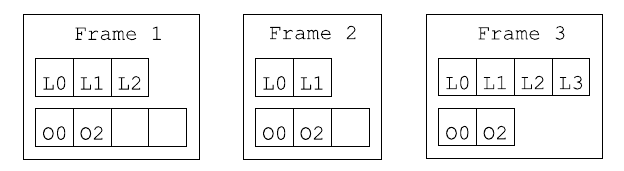
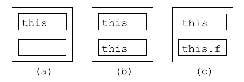
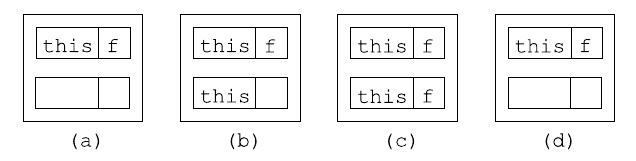
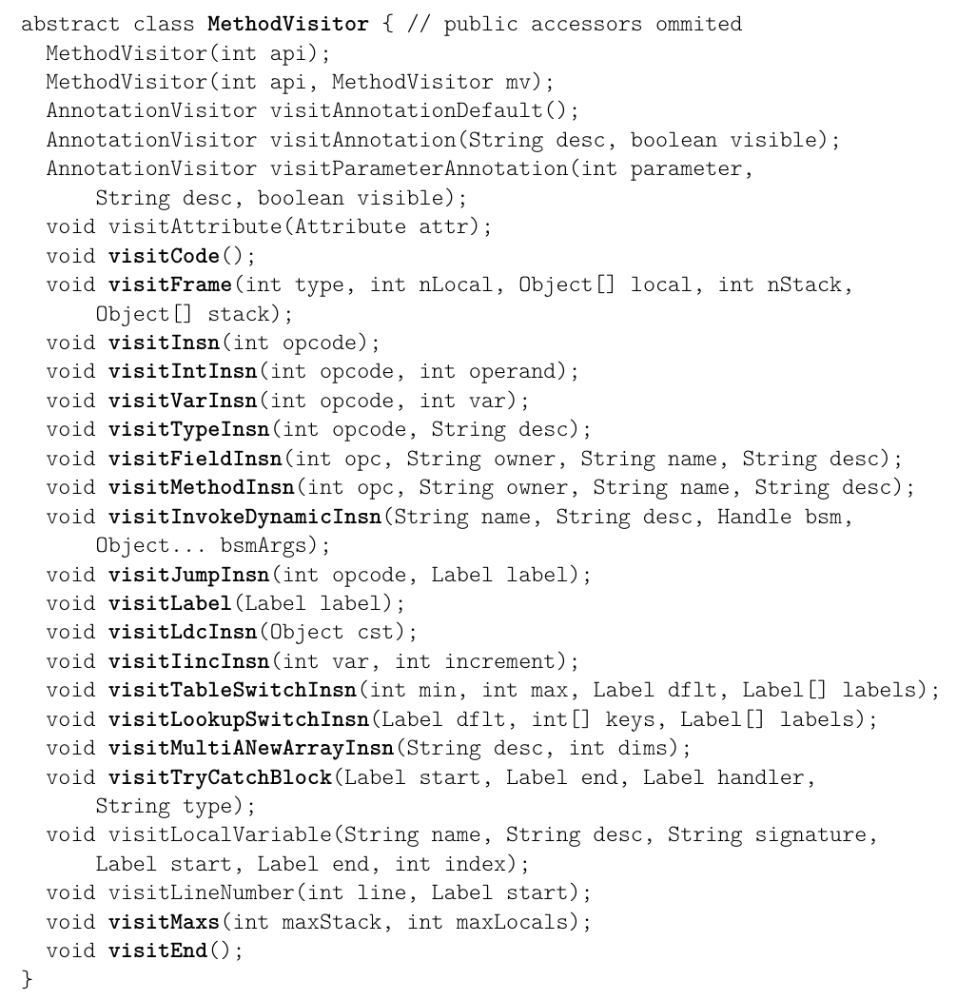
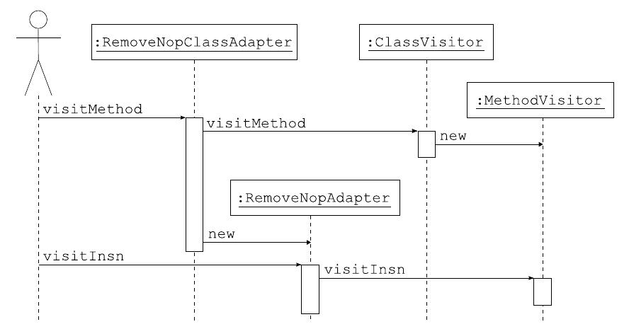
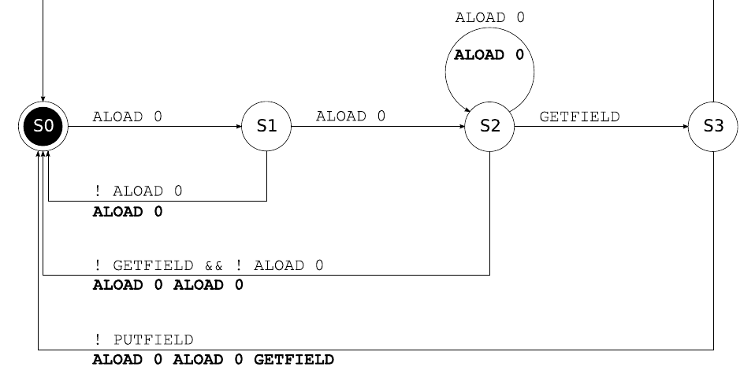

# 目录

目录：[ASM4中文指南](2026/asm4-guide-zh/README.md)

# 3. 方法

本章介绍如何使用 ASM 的 Core API（核心 API）生成和转换已编译的方法。本章先介绍已编译的方法，然后介绍用于生成和转换它们的相应 ASM 接口、组件和工具，并配有大量说明性示例。

> 笔记：
>
> 先看这一章的推进顺序：还是延续第 2 章的路子，先看被操作的对象——已编译方法里的字节码指令、异常处理器和帧；再看操作它的工具——`MethodVisitor`、方法适配器和 commons 包里的辅助适配器。
>
> 由此得出一个读法：不要一上来背 API 名字，而是先把“方法 = 指令序列 + 运行时帧信息 + 少量元数据”这件事看清楚。后面每个 `visitXxxInsn` 调用，都可以回到“它访问的是哪条指令、会怎样改变操作数栈”来理解。

## 3.1 结构

在已编译的类中，方法的代码以字节码指令序列的形式存储。为了生成和转换类，了解这些指令并理解它们的工作方式至关重要。本节对这些指令作一概述，它足以让你开始编写简单的类生成器和类转换器。完整的定义请阅读《Java 虚拟机规范》。

> 笔记：
>
> 先看 3.1 这一节的任务：它不是马上教你调用 ASM API，而是先让你看清方法代码在类文件里是什么。原文按“执行模型 → 指令 → 示例 → 异常处理器 → 帧”推进，每一步都在回答同一个问题：一段方法代码运行时，局部变量、操作数栈、跳转和帧分别怎样配合。
>
> 由此得出读法：这一节先把“方法”拆成可以观察的结构；下一节再把这些结构交给 `MethodVisitor` 去生成和变换。

### 3.1.1 执行模型

在介绍字节码指令之前，有必要先介绍 Java 虚拟机的执行模型。如你所知，Java 代码在线程中执行。每个线程都有自己的执行栈，执行栈由帧（栈帧）构成。每个帧代表一次方法调用：每当调用一个方法时，就会在当前线程的执行栈上压入一个新帧。当该方法返回时——无论是正常返回还是因异常而返回——这个帧就会从执行栈中弹出，执行在调用方法中继续（此时调用方法的帧位于栈顶）。

每个帧包含两部分：局部变量部分和操作数栈部分。局部变量部分包含的变量可以通过其索引以任意顺序访问。操作数栈部分，顾名思义，是一个值的栈，这些值被字节码指令用作操作数。这意味着只能按后进先出（Last In First Out）的顺序访问该栈中的值。不要把操作数栈与线程的执行栈混淆：执行栈中的每个帧都包含自己的操作数栈。

局部变量部分和操作数栈部分的大小取决于方法的代码。它在编译时计算，并与字节码指令一起存储在已编译的类中。因此，对应同一个方法调用的所有帧都具有相同的大小，但对应不同方法的帧，其局部变量部分和操作数栈部分的大小可以不同。

**图 3.1：含 3 个帧的执行栈**


图 3.1 展示了一个包含 3 个帧的示例执行栈。第一个帧包含 3 个局部变量，其操作数栈的最大大小为 4，并且其中包含两个值。第二个帧包含 2 个局部变量，其操作数栈中有两个值。最后，位于执行栈顶部的第三个帧包含 4 个局部变量和两个操作数。

帧在被创建时，其栈被初始化为空，其局部变量被初始化为目标对象 `this`（对于非静态方法）以及方法的参数。例如，调用方法 `a.equals(b)` 会创建一个栈为空的帧，并把前两个局部变量初始化为 `a` 和 `b`（其他局部变量未初始化）。

局部变量部分和操作数栈部分中的每个槽位都可以保存任意 Java 值，但 `long` 和 `double` 值除外。这些值需要两个槽位。这使局部变量的管理变得复杂：例如，第 i 个方法参数不一定存储在局部变量 i 中。例如，调用 `Math.max(1L, 2L)` 会创建一个帧，其中第一个和第二个局部变量槽位存放 `1L` 值，第三个和第四个槽位存放 `2L` 值。

> 笔记：
>
> 先看这一节回答的问题：「JVM 到底怎么执行一个方法」。先抓三个概念：**执行栈**、**帧**、以及帧的两个部分——局部变量区和操作数栈。方法调用 = 压栈一个帧，方法返回 = 弹出这个帧，所以递归太深会栈溢出；每个帧都自带一个操作数栈，指令从这里取操作数再压回结果——注意别和线程执行栈混淆。
>
> 再看两个容易踩的细节：**帧的大小在编译期就定死了**，同一个方法的所有帧大小相同；**`long`/`double` 占两个槽位**，所以「第 i 个参数就存在局部变量 i」并不总成立——比如 `Math.max(1L, 2L)` 里 1L 占 0-1 号槽、2L 占 2-3 号槽。后面写字节码变换要数局部变量下标时，这两条会反复用到。

### 3.1.2 字节码指令

一条字节码指令由一个标识该指令的操作码和固定数量的参数组成：

- 操作码是一个无符号字节值——字节码之名正源于此——并由一个助记符表示。例如，操作码值 0 由助记符 `NOP` 表示，对应什么都不做的指令。
- 参数是定义指令确切行为的静态值。它们紧跟在操作码之后给出。例如，`GOTO label` 指令的操作码值为 167，它以 `label` 为参数，`label` 是一个标签，用于指定下一条要执行的指令。指令参数绝不能与指令操作数混淆：参数值是静态已知的，并存储在已编译的代码中；而操作数值来自操作数栈，只有在运行时才已知。

字节码指令可以分为两类：一小部分指令用于在局部变量与操作数栈之间传递值，反之亦然；其他指令只作用于操作数栈：它们从栈中弹出一些值，根据这些值计算出一个结果，再把它压回栈中。

`ILOAD`、`LLOAD`、`FLOAD`、`DLOAD` 和 `ALOAD` 指令读取一个局部变量并将其值压入操作数栈。它们以必须读取的局部变量的索引 `i` 作为参数。`ILOAD` 用于加载 `boolean`、`byte`、`char`、`short` 或 `int` 局部变量。`LLOAD`、`FLOAD` 和 `DLOAD` 分别用于加载 `long`、`float` 或 `double` 值（`LLOAD` 和 `DLOAD` 实际上加载 `i` 和 `i + 1` 两个槽位）。最后，`ALOAD` 用于加载任何非基本类型的值，即对象引用和数组引用。与之对称，`ISTORE`、`LSTORE`、`FSTORE`、`DSTORE` 和 `ASTORE` 指令从操作数栈中弹出一个值，并将其存储到由索引 `i` 指定的局部变量中。

如你所见，`xLOAD` 和 `xSTORE` 指令是带类型的（事实上，如下文所述，几乎所有指令都带类型）。这样做是为了确保不会进行非法转换。确实，把一个值存入局部变量后再以不同的类型加载它是非法的。例如，`ISTORE 1 ALOAD 1` 序列就是非法的——它会允许把一个任意内存地址存入局部变量 1，再把这个地址转换为对象引用！然而，把一个类型与当前存储在该局部变量中的值的类型不同的值存入该局部变量，是完全合法的。这意味着局部变量的类型，即存储在该局部变量中的值的类型，可以在方法执行期间改变。

如上所述，所有其他字节码指令只作用于操作数栈。它们可以归为以下几类（参见附录 A.1）：

- **栈（Stack）**：这些指令用于操作栈上的值：`POP` 弹出栈顶的值，`DUP` 压入栈顶值的一份副本，`SWAP` 弹出两个值并以相反的顺序将它们压回，等等。
- **常量（Constants）**：这些指令把一个常量值压入操作数栈：`ACONST_NULL` 压入 `null`，`ICONST_0` 压入 `int` 值 0，`FCONST_0` 压入 `0f`，`DCONST_0` 压入 `0d`，`BIPUSH b` 压入 `byte` 值 b，`SIPUSH s` 压入 `short` 值 s，`LDC cst` 压入任意的 `int`、`float`、`long`、`double`、`String` 或 class[^1] 常量 cst，等等。
- **算术与逻辑（Arithmetic and logic）**：这些指令从操作数栈弹出数值，将它们组合起来，并把结果压入栈中。它们没有任何参数。`xADD`、`xSUB`、`xMUL`、`xDIV` 和 `xREM` 对应 `+`、`-`、`*`、`/` 和 `%` 运算，其中 x 为 `I`、`L`、`F` 或 `D`。类似地，还有其他指令对应 `<<`、`>>`、`>>>`、`|`、`&` 和 `^`，用于 `int` 和 `long` 值。
- **类型转换（Casts）**：这些指令从栈中弹出一个值，将其转换为另一种类型，并把结果压回。它们对应 Java 中的强制类型转换表达式。`I2F`、`F2D`、`L2D` 等把数值从一种数值类型转换为另一种数值类型。`CHECKCAST t` 把引用值转换为类型 t。
- **对象（Objects）**：这些指令用于创建对象、锁定对象、测试对象类型等。例如，`NEW type` 指令在栈上压入一个类型为 `type` 的新对象（其中 `type` 是内部名）。
- **字段（Fields）**：这些指令读取或写入字段的值。`GETFIELD owner name desc` 弹出一个对象引用，并压入其 `name` 字段的值。`PUTFIELD owner name desc` 弹出一个值和一个对象引用，并把该值存储到其 `name` 字段中。在这两种情况下，对象都必须是 `owner` 类型，其字段都必须是 `desc` 类型。`GETSTATIC` 和 `PUTSTATIC` 是类似的指令，但用于静态字段。
- **方法（Methods）**：这些指令调用方法或构造器。它们弹出与方法参数个数相同数量的值，再加一个目标对象的值，并压入方法调用的结果。`INVOKEVIRTUAL owner name desc` 调用类 `owner` 中定义的 `name` 方法，其方法描述符为 `desc`。`INVOKESTATIC` 用于静态方法，`INVOKESPECIAL` 用于私有方法和构造器，`INVOKEINTERFACE` 用于接口中定义的方法。最后，对于 Java 7 类，`INVOKEDYNAMIC` 用于新的动态方法调用机制。
- **数组（Arrays）**：这些指令用于读取和写入数组中的值。`xALOAD` 指令弹出一个索引和一个数组，并压入该索引处数组元素的值。`xASTORE` 指令弹出一个值、一个索引和一个数组，并把该值存储到数组的该索引处。这里 x 可以是 `I`、`L`、`F`、`D` 或 `A`，也可以是 `B`、`C` 或 `S`。
- **跳转（Jumps）**：这些指令在某个条件为真时跳转到任意指令，或无条件跳转。它们用于编译 `if`、`for`、`do`、`while`、`break` 和 `continue` 语句。例如，`IFEQ label` 从栈中弹出一个 `int` 值，如果该值为 0，则跳转到 `label` 所指定的指令（否则执行正常继续到下一条指令）。还存在许多其他跳转指令，例如 `IFNE` 或 `IFGE`。最后，`TABLESWITCH` 和 `LOOKUPSWITCH` 对应 Java 的 `switch` 语句。
- **返回（Return）**：最后，`xRETURN` 和 `RETURN` 指令用于终止方法的执行并把结果返回给调用者。`RETURN` 用于返回 `void` 的方法，`xRETURN` 用于其他方法。

> 笔记：
>
> 先看一条指令由什么组成：操作码是“做什么”，参数是“静态写在字节码里的补充信息”。再看原文特别提醒的区别：参数不是操作数，参数编译时就知道，操作数要到运行时从操作数栈里弹出来。
>
> 再看这些指令的分类。`xLOAD`/`xSTORE` 在局部变量和操作数栈之间搬值，而且带类型；其他大多数指令只操作栈，比如常量入栈、算术、字段访问、方法调用、跳转和返回。
>
> 由此得出一个阅读原则：看到字节码时先问“它从哪里取值、往哪里放值”，再问“类型和参数是什么”。下一节的 bean 示例就是按这个顺序逐条算栈。

### 3.1.3 示例

让我们看一些基本示例，以便更具体地体会字节码指令的工作方式。考虑以下 bean 类：

```java
package pkg;
public class Bean {
    private int f;
    public int getF() {
        return this.f;
    }
    public void setF(int f) {
        this.f = f;
    }
}
```

getter 方法的字节码为：

```text
ALOAD 0
GETFIELD pkg/Bean f I
IRETURN
```

第一条指令读取局部变量 0，它在该方法调用的帧创建时被初始化为 `this`，并把该值压入操作数栈。第二条指令从栈中弹出这个值，即 `this`，并压入该对象的 `f` 字段，即 `this.f`。最后一条指令从栈中弹出这个值，并把它返回给调用者。该方法执行帧的连续状态如图 3.2 所示。

**图 3.2：`getF` 方法执行帧的连续状态：a) 初始状态，b) `ALOAD 0` 之后，c) `GETFIELD` 之后**


setter 方法的字节码为：

```text
ALOAD 0
ILOAD 1
PUTFIELD pkg/Bean f I
RETURN
```

第一条指令如前所述把 `this` 压入操作数栈。第二条指令压入局部变量 1，它在该方法调用的帧创建时被初始化为 `f` 参数的值。第三条指令弹出这两个值，并把 `int` 值存储到被引用对象的 `f` 字段中，即 `this.f`。最后一条指令在源代码中是隐式的，但在已编译代码中是必需的，它销毁当前执行帧并返回给调用者。该方法执行帧的连续状态如图 3.3 所示。

`Bean` 类还有一个由编译器生成的默认公有构造器，因为程序员没有定义显式构造器。这个默认公有构造器被生成为 `Bean() { super(); }`。该构造器的字节码如下：

```text
ALOAD 0
INVOKESPECIAL java/lang/Object <init> ()V
RETURN
```

**图 3.3：`setF` 方法执行帧的连续状态：a) 初始状态，b) `ALOAD 0` 之后，c) `ILOAD 1` 之后，d) `PUTFIELD` 之后**


第一条指令把 `this` 压入操作数栈。第二条指令从栈中弹出这个值，并调用 `Object` 类中定义的 `<init>` 方法。这对应 `super()` 调用，即对超类 `Object` 的构造器的调用。这里可以看到，构造器在已编译类和源代码类中的命名不同：在已编译类中它们总是命名为 `<init>`，而在源代码类中它们具有其定义所在类的名称。最后一条指令返回给调用者。

现在考虑一个稍复杂的 setter 方法：

```java
public void checkAndSetF(int f) {
    if (f >= 0) {
        this.f = f;
    } else {
        throw new IllegalArgumentException();
    }
}
```

这个新 setter 方法的字节码如下：

```text
  ILOAD 1
  IFLT label
  ALOAD 0
  ILOAD 1
  PUTFIELD pkg/Bean f I
  GOTO end
label:
  NEW java/lang/IllegalArgumentException
  DUP
  INVOKESPECIAL java/lang/IllegalArgumentException <init> ()V
  ATHROW
end:
  RETURN
```

第一条指令把初始化为 `f` 的局部变量 1 压入操作数栈。`IFLT` 指令从栈中弹出这个值，并将其与 0 比较。如果它小于（Less Than，LT）0，则跳转到由标签 `label` 指定的指令；否则它什么也不做，执行继续到下一条指令。接下来的三条指令与 `setF` 方法中的指令相同。`GOTO` 指令无条件跳转到由 `end` 标签指定的指令，即 `RETURN` 指令。`label` 和 `end` 标签之间的指令创建并抛出一个异常：`NEW` 指令创建一个异常对象并将其压入操作数栈。`DUP` 指令在栈上复制这个值。`INVOKESPECIAL` 指令弹出这两份副本中的一份，并在其上调用异常构造器。最后，`ATHROW` 指令弹出剩余的副本并把它作为异常抛出（因此执行不会继续到下一条指令）。

> 笔记：
>
> 先看这一节怎样用「读」的方式把 3.1.1 的概念落到实处：`getF` 怎么用一条 `ALOAD 0` 把 `this` 压栈、`GETFIELD` 弹出 `this` 压入字段值、`IRETURN` 弹出这个值返回——每读一条指令都要问「它对操作数栈做了什么」；再看 `setF`，无非是把值参数压栈、赋值；然后看构造器为什么比普通方法多一段 `INVOKESPECIAL <init>`——它必须先调用超类构造器；最后 `checkAndSetF` 引入了**分支**（`IFLT`、`GOTO`）和**异常路径**（`NEW` 建对象、`DUP` 复制引用、`INVOKESPECIAL <init>` 初始化、`ATHROW` 抛出）。
>
> 由此得出一个阅读习惯：**用操作数栈给自己「算账」**——每条指令弹几个、压几个，栈平衡了，方法就读懂了。

### 3.1.4 异常处理器

没有任何字节码指令用于捕获异常：相反，方法的字节码与一个异常处理器列表相关联，该列表指定当方法某个给定部分抛出异常时必须执行的代码。异常处理器类似于 try catch 块：它有一个范围（range），即一段与 try 块内容对应的指令序列，还有一个处理器（handler），对应 catch 块的内容。范围由起始标签和结束标签指定，处理器由一个起始标签指定。例如，下面的源代码：

```java
public static void sleep(long d) {
    try {
        Thread.sleep(d);
    } catch (InterruptedException e) {
        e.printStackTrace();
    }
}
```

可以编译为：

```text
TRYCATCHBLOCK try catch catch java/lang/InterruptedException
try:
  LLOAD 0
  INVOKESTATIC java/lang/Thread sleep (J)V
  RETURN
catch:
  INVOKEVIRTUAL java/lang/InterruptedException printStackTrace ()V
  RETURN
```

`try` 和 `catch` 标签之间的代码对应 try 块，而 `catch` 标签之后的代码对应 catch 块。`TRYCATCHBLOCK` 行指定了一个异常处理器，它覆盖 `try` 和 `catch` 标签之间的范围，其处理器从 `catch` 标签开始，并且针对其类是 `InterruptedException` 子类的异常。这意味着，如果在 `try` 和 `catch` 之间的任何位置抛出此类异常，栈会被清空，异常被压入这个空栈，执行在 `catch` 处继续。

> 笔记：
>
> 先看这里和普通指令的不同：字节码里没有一条“catch 指令”。异常处理器是挂在方法代码旁边的一张表，用起始标签、结束标签和处理器标签描述一个范围。
>
> 再看 `TRYCATCHBLOCK try catch catch java/lang/InterruptedException`：前两个标签圈出 try 范围，第三个标签指向 catch 代码入口，最后的内部名说明要捕获哪类异常。真正跳到 catch 时，原来的操作数栈会被清空，只留下被捕获的异常对象。
>
> 由此得出一个要点：生成或变换 try/catch 时，重点不是插入捕获指令，而是把标签范围和处理器入口维护正确。

### 3.1.5 帧

使用 Java 6 或更高版本编译的类，除了字节码指令之外，还包含一组栈映射帧，用于加速 Java 虚拟机内部的类校验过程。栈映射帧给出方法执行帧在其执行过程中某一时刻的状态。更确切地说，它给出在某条特定字节码指令执行之前，每个局部变量槽位和每个操作数栈槽位中所含值的类型。

例如，如果考虑上一节的 `getF` 方法，我们可以定义三个栈映射帧，分别给出紧接 `ALOAD` 之前、紧接 `GETFIELD` 之前和紧接 `IRETURN` 之前的执行帧状态。这三个栈映射帧对应图 3.2 所示的三种情况，可以描述如下，其中第一对方括号之间的类型对应局部变量，其他的对应操作数栈：

| 执行帧在以下指令执行之前的状态 | 指令 |
| --- | --- |
| `[pkg/Bean] []` | `ALOAD 0` |
| `[pkg/Bean] [pkg/Bean]` | `GETFIELD` |
| `[pkg/Bean] [I]` | `IRETURN` |

对 `checkAndSetF` 方法也可以做同样的处理：

| 执行帧在以下指令执行之前的状态 | 指令 |
| --- | --- |
| `[pkg/Bean I] []` | `ILOAD 1` |
| `[pkg/Bean I] [I]` | `IFLT label` |
| `[pkg/Bean I] []` | `ALOAD 0` |
| `[pkg/Bean I] [pkg/Bean]` | `ILOAD 1` |
| `[pkg/Bean I] [pkg/Bean I]` | `PUTFIELD` |
| `[pkg/Bean I] []` | `GOTO end` |
| `[pkg/Bean I] []` | `label :` |
| `[pkg/Bean I] []` | `NEW` |
| `[pkg/Bean I] [Uninitialized(label)]` | `DUP` |
| `[pkg/Bean I] [Uninitialized(label) Uninitialized(label)]` | `INVOKESPECIAL` |
| `[pkg/Bean I] [java/lang/IllegalArgumentException]` | `ATHROW` |
| `[pkg/Bean I] []` | `end :` |
| `[pkg/Bean I] []` | `RETURN` |

这与前一个方法类似，只是多了 `Uninitialized(label)` 类型。这是一种仅在栈映射帧中使用的特殊类型，它表示一个已分配内存但尚未调用其构造器的对象。其参数指定创建该对象的指令。对于这种类型的值，唯一可以调用的方法就是构造器。当调用构造器时，帧中该类型的所有出现都会被替换为真实类型，此处为 `IllegalArgumentException`。

栈映射帧还可以使用另外三种特殊类型：`UNINITIALIZED_THIS` 是构造器中局部变量 0 的初始类型，`TOP` 对应未定义的值，`NULL` 对应 `null`。

如上所述，从 Java 6 开始，已编译的类除了字节码之外还包含一组栈映射帧。为了节省空间，已编译的方法并非每条指令都包含一个帧：实际上，它只包含那些对应跳转目标或异常处理器的指令的帧，以及紧随无条件跳转指令之后的指令的帧。确实，其他帧可以很容易且很快地从这些帧推断出来。

对于 `checkAndSetF` 方法，这意味着只存储两个帧：一个用于 `NEW` 指令，因为它是 `IFLT` 指令的目标，同时也因为它紧随无条件跳转指令 `GOTO` 之后；另一个用于 `RETURN` 指令，因为它是 `GOTO` 指令的目标，同时也因为它紧随「无条件跳转」指令 `ATHROW` 之后。

为了进一步节省空间，每个帧都通过只存储其相对于前一帧的差异来压缩，而初始帧不存储

[^1]: 这对应 Java 语法 `identifier.class`。

根本不存储，因为它可以很容易地从方法参数类型推导出来。对于 `checkAndSetF` 方法，必须存储的两个帧是相等的，并且与初始帧相等，因此它们被存储为由 `F_SAME` 助记符指定的单个字节值。这些帧可以直接表示在与之关联的字节码指令之前。这样就得到了 `checkAndSetF` 方法的最终字节码：

```text
  ILOAD 1
  IFLT label
  ALOAD 0
  ILOAD 1
  PUTFIELD pkg/Bean f I
  GOTO end
label:
  F_SAME
  NEW java/lang/IllegalArgumentException
  DUP
  INVOKESPECIAL java/lang/IllegalArgumentException <init> ()V
  ATHROW
end:
  F_SAME
  RETURN
```

> 笔记：
>
> 先看这一节回答的问题：「栈映射帧在类文件里怎么存」。三个要点：一，**不用给每条指令都存帧**——只在跳转目标、异常处理器入口、无条件跳转之后的第一条指令前存，其余帧都能从这些「锚点帧」快速推出来；二，**帧按与上一帧的差异压缩**，`F_SAME` 就是「和初始帧一模一样」的简写，`checkAndSetF` 的两个帧正好都退化成了它；三，帧的类型里有几种特殊标记：`TOP`（未初始化/未定义值）、`NULL`（null）、`UNINITIALIZED_THIS`（构造器开头 `this` 的类型），以及只在帧里出现的 `Uninitialized(label)`——`NEW` 出来还没调构造器的对象就是这个类型，调完 `<init>` 才变成真实类型。
>
> 手动算这些帧又繁琐又容易错，所以实践里常让 ASM 用 `COMPUTE_FRAMES` 自动算——3.2 节很快就讲。

## 3.2 接口与组件

> 笔记：
>
> 先看 3.2 和 3.1 的关系：3.1 已经把方法拆成指令、异常处理器和帧；3.2 开始把这些东西对应到 ASM 的访问接口上。也就是说，前一节回答“方法里有什么”，这一节回答“这些东西怎样被访问、生成和改写”。
>
> 再看本节顺序：先展示 `MethodVisitor` 的调用规则，再生成方法，接着做无状态、有状态变换。由此得出一条主线：先会按顺序发事件，再学会在事件流里拦截和改写。

### 3.2.1 展示

用于生成和变换已编译方法的 ASM API 基于 `MethodVisitor` 抽象类（参见图 3.4），该类由 `ClassVisitor` 的 `visitMethod` 方法返回。除了一些与注解和调试信息相关的方法（这些方法将在下一章介绍）之外，该类还根据字节码指令的参数数量和类型，为每一类字节码指令定义了一个方法（这些类别与 3.1.2 节中给出的类别并不对应）。这些方法必须按以下顺序调用（还有一些额外的约束在 `MethodVisitor` 接口的 Javadoc 中给出）：

```text
visitAnnotationDefault?
( visitAnnotation | visitParameterAnnotation | visitAttribute )*
( visitCode
   ( visitTryCatchBlock | visitLabel | visitFrame | visitXxx Insn |
      visitLocalVariable | visitLineNumber )*
   visitMaxs )?
visitEnd
```

这意味着，注解和属性（如果有的话）必须最先访问；对于非抽象方法，随后是方法的字节码。对于这些方法，代码必须按顺序访问，并且恰好位于一次 `visitCode` 调用与一次 `visitMaxs` 调用之间。

```java
abstract class MethodVisitor { // 公开的访问器已省略
    MethodVisitor(int api);
    MethodVisitor(int api, MethodVisitor mv);
    AnnotationVisitor visitAnnotationDefault();
    AnnotationVisitor visitAnnotation(String desc, boolean visible);
    AnnotationVisitor visitParameterAnnotation(int parameter,
        String desc, boolean visible);
    void visitAttribute(Attribute attr);
    void visitCode();
    void visitFrame(int type, int nLocal, Object[] local, int nStack,
        Object[] stack);
    void visitInsn(int opcode);
    void visitIntInsn(int opcode, int operand);
    void visitVarInsn(int opcode, int var);
    void visitTypeInsn(int opcode, String desc);
    void visitFieldInsn(int opc, String owner, String name, String desc);
    void visitMethodInsn(int opc, String owner, String name, String desc);
    void visitInvokeDynamicInsn(String name, String desc, Handle bsm,
        Object... bsmArgs);
    void visitJumpInsn(int opcode, Label label);
    void visitLabel(Label label);
    void visitLdcInsn(Object cst);
    void visitIincInsn(int var, int increment);
    void visitTableSwitchInsn(int min, int max, Label dflt, Label[] labels);
    void visitLookupSwitchInsn(Label dflt, int[] keys, Label[] labels);
    void visitMultiANewArrayInsn(String desc, int dims);
    void visitTryCatchBlock(Label start, Label end, Label handler,
        String type);
    void visitLocalVariable(String name, String desc, String signature,
        Label start, Label end, int index);
    void visitLineNumber(int line, Label start);
    void visitMaxs(int maxStack, int maxLocals);
    void visitEnd();
}
```

**图 3.4：MethodVisitor 类**



因此，`visitCode` 和 `visitMaxs` 方法可用于在一系列事件中检测方法字节码的开始和结束。与类的情况类似，`visitEnd` 方法必须最后调用，它用于在一系列事件中检测一个方法的结束。

`ClassVisitor` 和 `MethodVisitor` 类可以组合起来生成完整的类：

```java
ClassVisitor cv = ...;
cv.visit(...);
MethodVisitor mv1 = cv.visitMethod(..., "m1", ...);
mv1.visitCode();
mv1.visitInsn(...);
...
mv1.visitMaxs(...);
mv1.visitEnd();
MethodVisitor mv2 = cv.visitMethod(..., "m2", ...);
mv2.visitCode();
mv2.visitInsn(...);
...
mv2.visitMaxs(...);
mv2.visitEnd();
cv.visitEnd();
```

注意，不必先结束一个方法才能开始访问另一个方法。事实上，`MethodVisitor` 实例是完全独立的，可以以任意顺序使用（只要尚未调用 `cv.visitEnd()`）：

```java
ClassVisitor cv = ...;
cv.visit(...);
MethodVisitor mv1 = cv.visitMethod(..., "m1", ...);
mv1.visitCode();
mv1.visitInsn(...);
...
MethodVisitor mv2 = cv.visitMethod(..., "m2", ...);
mv2.visitCode();
mv2.visitInsn(...);
...
mv1.visitMaxs(...);
mv1.visitEnd();
...
mv2.visitMaxs(...);
mv2.visitEnd();
cv.visitEnd();
```

ASM 提供了三个基于 `MethodVisitor` API 的核心组件，用于生成和变换方法：

- `ClassReader` 类解析已编译方法的内容，并在传给其 `accept` 方法的 `ClassVisitor` 所返回的 `MethodVisitor` 对象上调用相应的方法。
- `ClassWriter` 的 `visitMethod` 方法返回 `MethodVisitor` 接口的一个实现，该实现直接以二进制形式构建已编译方法。
- `MethodVisitor` 类把它接收到的所有方法调用都委托给另一个 `MethodVisitor` 实例。它可以被视为一个事件过滤器。

#### ClassWriter 选项

正如我们在 3.1.5 节中所见，为一个方法计算栈映射帧并不太容易：你必须计算所有帧，找出那些对应于跳转目标或位于无条件跳转之后的帧，最后再压缩这些剩余的帧。同样，计算方法中局部变量部分和操作数栈部分的大小要容易一些，但仍然不算容易。幸运的是，ASM 可以替你完成这一计算。在创建 `ClassWriter` 时，你可以指定必须自动计算的内容：

- 使用 `new ClassWriter(0)` 时不自动计算任何内容。你必须自己计算帧以及局部变量和操作数栈的大小。
- 使用 `new ClassWriter(ClassWriter.COMPUTE_MAXS)` 时会替你计算局部变量部分和操作数栈部分的大小。你仍然必须调用 `visitMaxs`，但可以使用任意参数：这些参数将被忽略并重新计算。使用该选项时，你仍然必须自己计算帧。
- 使用 `new ClassWriter(ClassWriter.COMPUTE_FRAMES)` 时所有内容都会自动计算。你不必调用 `visitFrame`，但仍然必须调用 `visitMaxs`（参数将被忽略并重新计算）。

使用这些选项很方便，但也是有代价的：`COMPUTE_MAXS` 选项使 `ClassWriter` 变慢 10%，而使用 `COMPUTE_FRAMES` 选项会使其慢两倍。这必须与你自行完成这一计算所需的时间相比较：在特定情形下，与 ASM 中所使用的必须处理所有情况的算法相比，通常存在更简单、更快的算法来完成这种计算。

注意，如果你选择自己计算帧，可以让 `ClassWriter` 类替你完成压缩步骤。为此，你只需用 `visitFrame(F_NEW, nLocals, locals, nStack, stack)` 访问未压缩的帧，其中 `nLocals` 和 `nStack` 分别是局部变量的数量和操作数栈的大小，而 `locals` 和 `stack` 是包含相应类型的数组（详见 Javadoc）。

还要注意，为了自动计算帧，有时需要计算两个给定类的公共超类。默认情况下，`ClassWriter` 类在 `getCommonSuperClass` 方法中通过把这两个类加载到 JVM 中并使用反射 API 来完成这一计算。如果你正在生成若干个相互引用的类，这可能会成为问题，因为被引用的类可能尚不存在。在这种情况下，你可以覆写 `getCommonSuperClass` 方法来解决这个问题。

> 笔记：
>
> 先看 3.2.1 这段浓缩出的两张「时刻表」。第一张是 `MethodVisitor` 的**调用顺序**：`visitCode` 开场，指令（含标签、帧、行号）按出现顺序依次访问，`visitMaxs` 结算栈和局部变量大小，`visitEnd` 收尾。第二张是 `ClassWriter` 的三个计算选项：`new ClassWriter(0)` 什么都不算，最大栈、最大局部变量、帧全要自己负责；`COMPUTE_MAXS` 替你算栈和局部变量（帧仍自己写）；`COMPUTE_FRAMES` 连帧一起算，最省心——但要付出约两倍时间，而且算公共超类时默认要真的加载类，生成相互引用的新类时可能踩坑，得覆写 `getCommonSuperClass`。
>
> 由此得出：**能自己算就别全自动**，特别是简单的变换，手算往往比开 `COMPUTE_FRAMES` 更划算。

### 3.2.2 生成方法

如果 `mv` 是一个 `MethodVisitor`，那么可以用以下方法调用生成 3.1.3 节中定义的 `getF` 方法的字节码：

```java
mv.visitCode();
mv.visitVarInsn(ALOAD, 0);
mv.visitFieldInsn(GETFIELD, "pkg/Bean", "f", "I");
mv.visitInsn(IRETURN);
mv.visitMaxs(1, 1);
mv.visitEnd();
```

第一次调用开始字节码的生成。随后是三次调用，它们生成该方法的三个指令（如你所见，字节码与 ASM API 之间的对应关系相当简单）。对 `visitMaxs` 的调用必须在所有指令都已访问之后进行。它用于定义该方法执行帧中局部变量部分和操作数栈部分的大小。正如我们在 3.1.3 节中所见，这两个部分的大小各为 1 个槽（slot）。最后，最后一次调用用于结束该方法的生成。

`setF` 方法和构造函数的字节码可以用类似的方式生成。一个更有意思的例子是 `checkAndSetF` 方法：

```java
mv.visitCode();
mv.visitVarInsn(ILOAD, 1);
Label label = new Label();
mv.visitJumpInsn(IFLT, label);
mv.visitVarInsn(ALOAD, 0);
mv.visitVarInsn(ILOAD, 1);
mv.visitFieldInsn(PUTFIELD, "pkg/Bean", "f", "I");
Label end = new Label();
mv.visitJumpInsn(GOTO, end);
mv.visitLabel(label);
mv.visitFrame(F_SAME, 0, null, 0, null);
mv.visitTypeInsn(NEW, "java/lang/IllegalArgumentException");
mv.visitInsn(DUP);
mv.visitMethodInsn(INVOKESPECIAL,
    "java/lang/IllegalArgumentException", "<init>", "()V");
mv.visitInsn(ATHROW);
mv.visitLabel(end);
mv.visitFrame(F_SAME, 0, null, 0, null);
mv.visitInsn(RETURN);
mv.visitMaxs(2, 2);
mv.visitEnd();
```

在 `visitCode` 和 `visitEnd` 调用之间，你可以看到与 3.1.5 节末尾所示字节码精确对应的方法调用：每条指令、标签或帧对应一次调用（唯一的例外是 `label` 和 `end` 这两个 `Label` 对象的声明和构造）。

> **注意**：一个 `Label` 对象指的是紧跟针对该标签的 `visitLabel` 调用之后的那条指令。例如，`end` 指的是 `RETURN` 指令，而不是紧接着访问的那个帧，因为帧不是指令。多个标签指向同一条指令是完全合法的，但一个标签必须恰好指向一条指令。换句话说，可以用不同的标签连续调用 `visitLabel`，但用于某条指令的标签必须恰好用 `visitLabel` 访问一次。最后一个约束是标签不能共享：每个方法必须有自己的标签。

> 笔记：
>
> 先看 `getF` 的生成代码：`visitCode` 开始，三条指令分别对应 `ALOAD 0`、`GETFIELD`、`IRETURN`，然后 `visitMaxs(1, 1)` 写入最大栈和局部变量大小，最后 `visitEnd` 收束。这个例子说明字节码文本和 ASM 调用几乎是一一对应的。
>
> 再看 `checkAndSetF` 多出的东西：跳转目标要先创建 `Label`，在真正到达目标位置时调用 `visitLabel`；栈映射帧也要放在对应标签之后、对应指令之前。由此得出一个小心法：生成带分支的方法时，先把标签位置想清楚，再按指令顺序写 `visitXxx`。

### 3.2.3 变换方法

现在你应该已经猜到，方法可以像类一样被变换，也就是使用一个方法适配器，把它接收到的方法调用稍作修改后转发出去：更改参数可用于修改单条指令，不转发某个收到的调用就删除了一条指令，而在收到的调用之间插入调用则添加了新指令。`MethodVisitor` 类为这样的方法适配器提供了一个基本实现，它除了转发收到的所有方法调用之外什么也不做。

为了理解方法适配器可以如何使用，让我们考虑一个非常简单的适配器，它删除方法内部的 `NOP` 指令（由于它们什么都不做，因此可以毫无问题地删除）：

```java
public class RemoveNopAdapter extends MethodVisitor {
    public RemoveNopAdapter(MethodVisitor mv) {
        super(ASM4, mv);
    }
    @Override
    public void visitInsn(int opcode) {
        if (opcode != NOP) {
            mv.visitInsn(opcode);
        }
    }
}
```

该适配器可以按如下方式在类适配器内部使用：

```java
public class RemoveNopClassAdapter extends ClassVisitor {
    public RemoveNopClassAdapter(ClassVisitor cv) {
        super(ASM4, cv);
    }
    @Override
    public MethodVisitor visitMethod(int access, String name,
            String desc, String signature, String[] exceptions) {
        MethodVisitor mv;
        mv = cv.visitMethod(access, name, desc, signature, exceptions);
        if (mv != null) {
            mv = new RemoveNopAdapter(mv);
        }
        return mv;
    }
}
```

换句话说，类适配器只是构建一个方法适配器，把链中下一个类访问者返回的方法访问者封装起来，然后返回这个适配器。其效果是构建出一条与类适配器链相似的方法适配器链（参见图 3.5）。

但要注意，这并不是必须的：完全可以构建一条与类适配器链不相似的方法适配器链。每个方法甚至可以有不同的方法适配器链。例如，类适配器可以选择只在方法中而不在构造函数中删除 `NOP`。这可以按如下方式实现：

```java
...
mv = cv.visitMethod(access, name, desc, signature, exceptions);
if (mv != null && !name.equals("<init>")) {
    mv = new RemoveNopAdapter(mv);
}
...
```

在这种情况下，构造函数对应的适配器链更短。相反，构造函数的适配器链也可以更长，其中包含若干个方法

适配器连接在一起，而这些适配器是在 `visitMethod` 内部创建的。方法适配器链的拓扑结构甚至可以与类适配器链不同。例如，类适配器链可以是线性的，而方法适配器链可以有分支：

**图 3.5：RemoveNopAdapter 的时序图**



```java
public MethodVisitor visitMethod(int access, String name,
    String desc, String signature, String[] exceptions) {
    MethodVisitor mv1, mv2;
    mv1 = cv.visitMethod(access, name, desc, signature, exceptions);
    mv2 = cv.visitMethod(access, "_" + name, desc, signature, exceptions);
    return new MultiMethodAdapter(mv1, mv2);
}
```

既然我们已经了解了如何在类适配器内部使用和组合方法适配器，接下来看看如何实现比 `RemoveNopAdapter` 更有意思的适配器。

> 笔记：
>
> 先看方法变换和类变换的共同套路：类适配器在 `visitMethod` 里把链上下一站返回的 `MethodVisitor` 再包一层适配器返回，就拼出一条与类适配器链**平行的方法适配器链**（图 3.5 的时序图）。`RemoveNopAdapter` 的奥义就一句话：**收到的调用不转发 = 删除**——`visitInsn` 里看到 `NOP` 直接 return，指令就从输出里消失了。
>
> 注意方法链可以和类链不一样：可以让构造器的链更短（`!name.equals("<init>")` 时跳过适配器），也可以给一个方法同时接两条链交给 `MultiMethodAdapter` 分发。动手前先在纸上画一下「谁接谁」，比直接写代码更能避免 `visitXxx` 顺序错乱。完整可运行程序见 [RemoveNopAdapter完整代码](#RemoveNopAdapter完整代码)。

### 3.2.4 无状态变换

假设我们想要测量程序中每个类所花费的时间。我们需要在每个类中添加一个静态的 `timer` 字段，并且需要把这个类中每个方法的执行时间累加到该 `timer` 字段上。换句话说，我们想把下面这样的类 C：

```java
public class C {
    public void m() throws Exception {
        Thread.sleep(100);
    }
}
```

变换成：

```java
public class C {
    public static long timer;
    public void m() throws Exception {
        timer -= System.currentTimeMillis();
        Thread.sleep(100);
        timer += System.currentTimeMillis();
    }
}
```

为了了解如何在 ASM 中实现这一点，我们可以编译这两个类，并比较 `TraceClassVisitor` 在这两个版本上的输出（既可以使用默认的 `Textifier` 后端，也可以使用 `ASMifier` 后端）。使用默认后端时，我们得到以下差异（以粗体显示）：

```text
GETSTATIC C.timer : J
INVOKESTATIC java/lang/System.currentTimeMillis()J
LSUB
PUTSTATIC C.timer : J
LDC 100
INVOKESTATIC java/lang/Thread.sleep(J)V
GETSTATIC C.timer : J
INVOKESTATIC java/lang/System.currentTimeMillis()J
LADD
PUTSTATIC C.timer : J
RETURN
MAXSTACK = 4
MAXLOCALS = 1
```

可以看到，我们必须在方法的开头添加四条指令，并在 `return` 指令之前再添加四条指令。我们还需要更新操作数栈的最大尺寸。方法代码的开头是通过 `visitCode` 方法访问的。因此，我们可以在方法适配器中覆写这个方法来添加前四条指令：

```java
public void visitCode() {
    mv.visitCode();
    mv.visitFieldInsn(GETSTATIC, owner, "timer", "J");
    mv.visitMethodInsn(INVOKESTATIC, "java/lang/System",
        "currentTimeMillis", "()J");
    mv.visitInsn(LSUB);
    mv.visitFieldInsn(PUTSTATIC, owner, "timer", "J");
}
```

其中 `owner` 必须设置为正在变换的类的名称。现在，我们必须把另外四条指令添加到任何 `RETURN` 之前，同时也要添加到任何 `xRETURN` 或 `ATHROW` 之前，它们都是终止方法执行的指令。这些指令没有任何参数，因此是在 `visitInsn` 方法中被访问的。于是我们可以覆写这个方法来添加我们的指令：

```java
public void visitInsn(int opcode) {
    if ((opcode >= IRETURN && opcode <= RETURN) || opcode == ATHROW) {
        mv.visitFieldInsn(GETSTATIC, owner, "timer", "J");
        mv.visitMethodInsn(INVOKESTATIC, "java/lang/System",
            "currentTimeMillis", "()J");
        mv.visitInsn(LADD);
        mv.visitFieldInsn(PUTSTATIC, owner, "timer", "J");
    }
    mv.visitInsn(opcode);
}
```

最后，我们必须更新操作数栈的最大尺寸。我们添加的这些指令会压入两个 `long` 值，因此需要操作数栈上的四个槽位。在方法开头，操作数栈最初是空的，所以我们知道在开头添加的四条指令需要大小为 4 的栈。我们还知道，插入的代码不会改变栈的状态（因为它弹出的值数量与压入的数量相同）。因此，如果原来的代码需要大小为 s 的栈，那么变换后的方法所需的最大栈尺寸就是 `max(4, s)`。遗憾的是，我们还在 `return` 指令之前添加了四条指令，而在这里我们并不知道这些指令之前操作数栈的尺寸。我们只知道它小于或等于 s。因此，我们只能说在 `return` 指令之前添加的代码可能需要尺寸最大为 s + 4 的操作数栈。这种最坏情况在实践中很少出现：对于常见的编译器，`RETURN` 之前的操作数栈只包含返回值，也就是说其尺寸至多为 0、1 或 2。但是如果我们想处理所有可能的情况，就需要使用最坏情况[^2]。这时我们必须按如下方式覆写 `visitMaxs` 方法：

```java
public void visitMaxs(int maxStack, int maxLocals) {
    mv.visitMaxs(maxStack + 4, maxLocals);
}
```

当然，也可以不去管最大栈尺寸，而是依赖 `COMPUTE_MAXS` 选项，它还会计算出最优值而不是最坏情况值。不过对于这样简单的变换来说，手动更新 `maxStack` 并不需要费多少工夫。

现在有一个有趣的问题：栈映射帧怎么办？原来的代码不包含任何帧，变换后的代码也不包含，但这是否只是因为我们用作示例的这段特定代码呢？是否存在必须更新帧的情况？答案是否定的，因为 1）插入的代码不会改变操作数栈，2）插入的代码不包含跳转指令，3）原代码的跳转指令——或者更正式地说，控制流图——没有被修改。这意味着原来的帧不会改变；而且由于不需要为插入的代码存储新的帧，压缩后的原有帧也不会改变。

现在我们可以把所有要素整合到相互关联的 `ClassVisitor` 和 `MethodVisitor` 子类中：

```java
public class AddTimerAdapter extends ClassVisitor {
    private String owner;
    private boolean isInterface;
    public AddTimerAdapter(ClassVisitor cv) {
        super(ASM4, cv);
    }
    @Override public void visit(int version, int access, String name,
        String signature, String superName, String[] interfaces) {
        cv.visit(version, access, name, signature, superName, interfaces);
        owner = name;
        isInterface = (access & ACC_INTERFACE) != 0;
    }
    @Override public MethodVisitor visitMethod(int access, String name,
        String desc, String signature, String[] exceptions) {
        MethodVisitor mv = cv.visitMethod(access, name, desc, signature,
            exceptions);
        if (!isInterface && mv != null && !name.equals("<init>")) {
            mv = new AddTimerMethodAdapter(mv);
        }
        return mv;
    }
    @Override public void visitEnd() {
        if (!isInterface) {
            FieldVisitor fv = cv.visitField(ACC_PUBLIC + ACC_STATIC, "timer",
                "J", null, null);
            if (fv != null) {
                fv.visitEnd();
            }
        }
        cv.visitEnd();
    }
    class AddTimerMethodAdapter extends MethodVisitor {
        public AddTimerMethodAdapter(MethodVisitor mv) {
            super(ASM4, mv);
        }
        @Override public void visitCode() {
            mv.visitCode();
            mv.visitFieldInsn(GETSTATIC, owner, "timer", "J");
            mv.visitMethodInsn(INVOKESTATIC, "java/lang/System",
                "currentTimeMillis", "()J");
            mv.visitInsn(LSUB);
            mv.visitFieldInsn(PUTSTATIC, owner, "timer", "J");
        }
        @Override public void visitInsn(int opcode) {
            if ((opcode >= IRETURN && opcode <= RETURN) || opcode == ATHROW) {
                mv.visitFieldInsn(GETSTATIC, owner, "timer", "J");
                mv.visitMethodInsn(INVOKESTATIC, "java/lang/System",
                    "currentTimeMillis", "()J");
                mv.visitInsn(LADD);
                mv.visitFieldInsn(PUTSTATIC, owner, "timer", "J");
            }
            mv.visitInsn(opcode);
        }
        @Override public void visitMaxs(int maxStack, int maxLocals) {
            mv.visitMaxs(maxStack + 4, maxLocals);
        }
    }
}
```

这个类适配器用于实例化方法适配器（构造函数除外），同时也用于添加 `timer` 字段，并把正在变换的类的名称存储在一个可以从方法适配器访问的字段中。

> 笔记：
>
> 先看 `AddTimerAdapter` 为什么是「无状态变换」的教科书：它不需要记住之前看过什么——开头固定插四行（覆写 `visitCode`），每个返回语句前再插四行（在 `visitInsn` 里认 `IRETURN`~`RETURN` 和 `ATHROW` 这几种终止指令）。
>
> 三个细节值得记：一，**终止指令不止 `RETURN`**，各种 `xRETURN` 和 `ATHROW` 都要覆盖，否则计时逻辑会漏；二，**插入的代码要 4 个栈槽**（两个 `long`），`visitMaxs` 里最坏情况只能按 `maxStack + 4` 算，想拿最优值就开 `COMPUTE_MAXS`；三，**帧完全不用动**——因为插入代码不改变操作数栈、不含跳转、不修改控制流，原帧依然成立。另外它跳过构造器是故意的：构造器开头插代码会破坏尚未执行的 `super()` 调用，这个坑 3.3.4 节的 `AdviceAdapter` 会专门解决。完整程序见 [AddTimerAdapter完整代码](#AddTimerAdapter完整代码)。

### 3.2.5 有状态变换

上一节中看到的变换是局部的，它不依赖于在当前指令之前已经访问过的指令：在开头添加的代码总是相同的，并且总会被添加；在每个 `RETURN` 指令之前插入的代码也是如此。这类变换称为无状态变换。它们实现起来很简单，但只有最简单的变换才满足这一性质。

更复杂的变换需要记住一些关于在当前指令之前已访问过的指令的状态。例如，考虑一个删除所有 `ICONST_0 IADD` 序列的变换，该序列的净效果是加上 0。显然，当访问到一条 `IADD` 指令时，只有当上一次访问的指令是 `ICONST_0` 时才必须删除它。这需要在方法适配器内部存储状态。由于这个原因，这类变换称为有状态变换。

让我们更详细地看一下这个例子。当访问到 `ICONST_0` 时，只有当紧接着的指令是 `IADD` 时才必须删除它。问题在于，下一条指令此时还是未知的。解决办法是把这一决定推迟到下一条指令：如果它是 `IADD`，就删除这两条指令，否则就发出 `ICONST_0` 和当前指令。

为了实现删除或替换某些指令序列的变换，引入一个 `MethodVisitor` 子类会很方便，它的各个 `visitXxx Insn` 方法都调用一个公共的 `visitInsn()` 方法：

```java
public abstract class PatternMethodAdapter extends MethodVisitor {
    protected final static int SEEN_NOTHING = 0;
    protected int state;
    public PatternMethodAdapter(int api, MethodVisitor mv) {
        super(api, mv);
    }
    @Overrid public void visitInsn(int opcode) {
        visitInsn();
        mv.visitInsn(opcode);
    }
    @Override public void visitIntInsn(int opcode, int operand) {
        visitInsn();
        mv.visitIntInsn(opcode, operand);
    }
    ...
    protected abstract void visitInsn();
}
```

那么，上面的变换可以这样实现：

```java
public class RemoveAddZeroAdapter extends PatternMethodAdapter {
    private static int SEEN_ICONST_0 = 1;
    public RemoveAddZeroAdapter(MethodVisitor mv) {
        super(ASM4, mv);
    }
    @Override public void visitInsn(int opcode) {
        if (state == SEEN_ICONST_0) {
            if (opcode == IADD) {
                state = SEEN_NOTHING;
                return;
            }
        }
        visitInsn();
        if (opcode == ICONST_0) {
            state = SEEN_ICONST_0;
            return;
        }
        mv.visitInsn(opcode);
    }
    @Override protected void visitInsn() {
        if (state == SEEN_ICONST_0) {
            mv.visitInsn(ICONST_0);
        }
        state = SEEN_NOTHING;
    }
}
```

`visitInsn(int)` 方法首先测试该序列是否已被检测到。在这种情况下，它重新初始化状态并立即返回，其效果就是删除该序列。在其他情况下，它调用公共的 `visitInsn` 方法，如果上一次访问的指令是 `ICONST_0`，该方法就会发出一个 `ICONST_0`。然后，如果当前指令是 `ICONST_0`，它就记住这一事实并返回，以便推迟关于这条指令的决定。在所有其他情况下，当前指令会被转发给下一个访问者。

#### 标签与帧

正如我们在前面几节中所看到的，标签和帧是在与其关联的指令之前被访问的。换句话说，它们与指令在同一时刻被访问，尽管它们本身并不是指令。这对检测指令序列的变换有影响，但这种影响实际上是一个优势。的确，如果我们要删除的某条指令是跳转指令的目标，会发生什么呢？如果某条指令可能跳转到 `ICONST_0`，这就意味着存在一个标签指向这条指令。删除这两条指令之后，这个标签将指向被删除的 `IADD` 之后的那条指令，这正是我们想要的结果。但是，如果某条指令可能跳转到 `IADD`，我们就不能删除该指令序列（我们无法确定在这次跳转之前已经有一个 0 被压入栈中）。好在此时 `ICONST_0` 和 `IADD` 之间必然存在一个标签，这很容易检测到。

对于栈映射帧，推理是相同的：如果在这两条指令之间访问到了一个栈映射帧，我们就不能删除它们。这两种情况都可以通过在模式匹配算法中把标签和帧当作指令来处理。这可以在 `PatternMethodAdapter` 中完成（注意 `visitMaxs` 也会调用公共的 `visitInsn` 方法；这是用来处理方法结尾恰好是待检测序列的前缀的情况）：

```java
public abstract class PatternMethodAdapter extends MethodVisitor {
    ...
    @Override public void visitFrame(int type, int nLocal, Object[] local,
        int nStack, Object[] stack) {
        visitInsn();
        mv.visitFrame(type, nLocal, local, nStack, stack);
    }
    @Override public void visitLabel(Label label) {
        visitInsn();
        mv.visitLabel(label);
    }
    @Override public void visitMaxs(int maxStack, int maxLocals) {
        visitInsn();
        mv.visitMaxs(maxStack, maxLocals);
    }
}
```

正如我们将在下一章看到的，编译后的方法可能包含关于源文件行号的信息，例如用于异常栈轨迹。这类信息是通过 `visitLineNumber` 方法访问的，它同样与指令在同一时刻被调用。不过在这里，指令序列中间出现行号并不会影响对该序列进行变换或删除的可能性。因此，解决办法是在模式匹配算法中完全忽略它们。

#### 更复杂的例子

前面的例子可以很容易地推广到更复杂的指令序列。例如，考虑一个删除字段自赋值的变换——这类赋值通常源于笔误，比如 `f = f;`，或者用字节码表示就是 `ALOAD 0 ALOAD 0 GETFIELD f PUTFIELD f`。在实现这个变换之前，最好先设计出识别该序列的状态机（参见图 3.6）。

**图 3.6：ALOAD 0 ALOAD 0 GETFIELD f PUTFIELD f 的状态机**



每个转移都标注了一个条件（当前指令的值）和一个动作（必须发出的指令序列，以粗体显示）。例如，从 S1 到 S0 的转移在当前指令不是 `ALOAD 0` 时发生。在这种情况下，为到达该状态而访问过的那个 `ALOAD 0` 会被发出。注意从 S2 到自身的转移：当出现三个或更多连续的 `ALOAD 0` 时就会发生这种情况。此时我们停留在已经访问过两个 `ALOAD 0` 的状态，并发出第三个。一旦状态机确定下来，编写相应的方法适配器就很简单了（8 个 `switch` 分支对应于图中的 8 个转移）：

```java
class RemoveGetFieldPutFieldAdapter extends PatternMethodAdapter {
    private final static int SEEN_ALOAD_0 = 1;
    private final static int SEEN_ALOAD_0ALOAD_0 = 2;
    private final static int SEEN_ALOAD_0ALOAD_0GETFIELD = 3;
    private String fieldOwner;
    private String fieldName;
    private String fieldDesc;
    public RemoveGetFieldPutFieldAdapter(MethodVisitor mv) {
        super(mv);
    }
    @Override
    public void visitVarInsn(int opcode, int var) {
        switch (state) {
        case SEEN_NOTHING: // S0 -> S1
            if (opcode == ALOAD && var == 0) {
                state = SEEN_ALOAD_0;
                return;
            }
            break;
        case SEEN_ALOAD_0: // S1 -> S2
            if (opcode == ALOAD && var == 0) {
                state = SEEN_ALOAD_0ALOAD_0;
                return;
            }
            break;
        case SEEN_ALOAD_0ALOAD_0: // S2 -> S2
            if (opcode == ALOAD && var == 0) {
                mv.visitVarInsn(ALOAD, 0);
                return;
            }
            break;
        }
        visitInsn();
        mv.visitVarInsn(opcode, var);
    }
    @Override
    public void visitFieldInsn(int opcode, String owner, String name,
        String desc) {
        switch (state) {
        case SEEN_ALOAD_0ALOAD_0: // S2 -> S3
            if (opcode == GETFIELD) {
                state = SEEN_ALOAD_0ALOAD_0GETFIELD;
                fieldOwner = owner;
                fieldName = name;
                fieldDesc = desc;
                return;
            }
            break;
        case SEEN_ALOAD_0ALOAD_0GETFIELD: // S3 -> S0
            if (opcode == PUTFIELD && name.equals(fieldName)) {
                state = SEEN_NOTHING;
                return;
            }
            break;
        }
        visitInsn();
        mv.visitFieldInsn(opcode, owner, name, desc);
    }
    @Override protected void visitInsn() {
        switch (state) {
        case SEEN_ALOAD_0: // S1 -> S0
            mv.visitVarInsn(ALOAD, 0);
            break;
        case SEEN_ALOAD_0ALOAD_0: // S2 -> S0
            mv.visitVarInsn(ALOAD, 0);
            mv.visitVarInsn(ALOAD, 0);
            break;
        case SEEN_ALOAD_0ALOAD_0GETFIELD: // S3 -> S0
            mv.visitVarInsn(ALOAD, 0);
            mv.visitVarInsn(ALOAD, 0);
            mv.visitFieldInsn(GETFIELD, fieldOwner, fieldName, fieldDesc);
            break;
        }
        state = SEEN_NOTHING;
    }
}
```

注意，出于与 3.2.4 节中 `AddTimerAdapter` 例子相同的原因，本节介绍的有状态变换不需要变换栈映射帧：变换后原有的帧依然有效。它们甚至不需要变换局部变量和操作数栈的尺寸。最后需要指出的是，有状态变换并不限于检测和变换指令序列。许多其他类型的变换也是有状态的。例如，下一节介绍的方法适配器就是如此。

[^2]: 但愿不必给出最优的操作数栈尺寸。给出任何大于或等于该最优值的值都是可以的，尽管这可能会浪费线程执行栈上的内存。

> 笔记：
>
> 先看删除 `ICONST_0 IADD` 这个例子，变换在这里升级为「**有状态**」：只看当前一条指令不够，得记住之前看过什么才能决定怎么处理。核心手法是「**推迟决定**」——看到 `ICONST_0` 先压着不发出，等下一跳：是 `IADD` 就整个序列删掉，否则把压住的 `ICONST_0` 补发出去再继续。
>
> `PatternMethodAdapter` 给了这套套路一个脚手架：所有 `visitXxxInsn` 都先拐到公共的 `visitInsn()` 上「刷新」状态。这里有个关键的直觉：**标签和帧要当指令看**——`ICONST_0` 和 `IADD` 之间一旦出现标签，说明可能有跳转直接落在 `IADD` 上（那时栈上根本没有 0），这个序列绝不能删，帧同理，所以 `visitFrame`/`visitLabel`/`visitMaxs` 都要先刷新状态。到了删字段自赋值（`ALOAD 0 ALOAD 0 GETFIELD f PUTFIELD f`），序列变长，就干脆画成**状态机**（图 3.6），8 条转移对应 8 个 `switch` 分支，逐条对照着写不会漏。两个完整程序见 [PatternMethodAdapter完整代码](#PatternMethodAdapter完整代码) 和 [RemoveGetFieldPutFieldAdapter完整代码](#RemoveGetFieldPutFieldAdapter完整代码)。

## 3.3 工具

`org.objectweb.asm.commons` 包中包含了一些预定义的方法适配器，它们对于定义自己的适配器很有用。本节介绍其中三个，并展示如何将它们与 3.2.4 节的 AddTimerAdapter 示例结合使用。本节还展示如何使用上一章中介绍的工具来简化方法的生成或变换。

> 笔记：
>
> 先看 3.3 的位置：前面你已经手写了方法生成器和方法适配器，这里开始看 ASM 已经准备好的工具。它们不改变前面那条主线，只是把“算操作码、跟踪文本、记录栈和局部变量、新增局部变量、处理进入退出点”这些常见动作封装起来。
>
> 由此得出读法：不要把 3.3 当成新体系；它是对 3.2 的减负。每个工具都问一句：它替你少写了哪一类重复代码。

### 3.3.1 基本工具

2.3 节中介绍的工具也可以用于方法。

#### Type

许多字节码指令，例如 `xLOAD`、`xADD` 或 `xRETURN`，都依赖于它们所作用的类型。`Type` 类提供了一个 `getOpcode` 方法，可用于为这些指令获取与给定类型对应的操作码。该方法以一个 `int` 类型的操作码为参数，并返回调用它的那个类型所对应的操作码。例如，如果 `t` 等于 `Type.FLOAT_TYPE`，那么 `t.getOpcode(IMUL)` 返回 `FMUL`。

#### TraceClassVisitor

该类在上一章中已经介绍过，它会打印出所访问类的文本表示，其中包括这些类的方法的文本表示，其形式与本章中使用的形式非常相似。因此，它可以在变换链中的任意位置用来跟踪所生成或变换的方法的内容。例如：

```text
java -classpath asm.jar:asm-util.jar \
     org.objectweb.asm.util.TraceClassVisitor \
     java.lang.Void
```

会打印出：

```text
// class version 49.0 (49)
// access flags 49
public final class java/lang/Void {
  // access flags 25
  // signature Ljava/lang/Class<Ljava/lang/Void;>;
  // declaration: java.lang.Class<java.lang.Void>
  public final static Ljava/lang/Class; TYPE
  // access flags 2
  private <init>()V
    ALOAD 0
    INVOKESPECIAL java/lang/Object.<init> ()V
    RETURN
    MAXSTACK = 1
    MAXLOCALS = 1
  // access flags 8
  static <clinit>()V
    LDC "void"
    INVOKESTATIC java/lang/Class.getPrimitiveClass (...)...
    PUTSTATIC java/lang/Void.TYPE : Ljava/lang/Class;
    RETURN
    MAXSTACK = 1
    MAXLOCALS = 0
}
```

这展示了如何生成静态块 `static { ... }`，也就是通过一个 `<clinit>` 方法（表示 CLass INITializer）。注意，如果你想在链中的某个位置只跟踪单个方法的内容，而不是跟踪其类的全部内容，可以改用 `TraceMethodVisitor` 而不是 `TraceClassVisitor`（在这种情况下必须显式指定后端；这里我们使用 `Textifier`）：

```java
public MethodVisitor visitMethod(int access, String name,
        String desc, String signature, String[] exceptions) {
    MethodVisitor mv = cv.visitMethod(access, name, desc, signature,
            exceptions);
    if (debug && mv != null && ...) { // 若该方法必须被跟踪
        Printer p = new Textifier(ASM4) {
            @Override public void visitMethodEnd() {
                print(aPrintWriter); // 在访问结束后打印
            }
        };
        mv = new TraceMethodVisitor(mv, p);
    }
    return new MyMethodAdapter(mv);
}
```

这段代码会打印出经 `MyMethodAdapter` 变换之后的方法。

#### CheckClassAdapter

该类在上一章中已经介绍过，它检查 `ClassVisitor` 的方法是否以恰当的顺序、用合法的参数被调用，对 `MethodVisitor` 的方法也是如此。因此，它可以在变换链中的任意位置用来检查 `MethodVisitor` API 是否被正确使用。与 `TraceMethodVisitor` 类似，你可以使用 `CheckMethodAdapter` 类来检查单个方法，而不是检查它的整个类：

```java
public MethodVisitor visitMethod(int access, String name,
        String desc, String signature, String[] exceptions) {
    MethodVisitor mv = cv.visitMethod(access, name, desc, signature,
            exceptions);
    if (debug && mv != null && ...) { // 若该方法必须被检查
        mv = new CheckMethodAdapter(mv);
    }
    return new MyMethodAdapter(mv);
}
```

这段代码检查 `MyMethodAdapter` 是否正确使用了 `MethodVisitor` API。但请注意，这个适配器不会检查字节码是否正确：例如它不会检测出 `ISTORE 1 ALOAD 1` 是无效的。事实上，如果你使用 `CheckMethodAdapter` 的另一个构造函数（参见 Javadoc），并且在 `visitMaxs` 中提供合法的 `maxStack` 和 `maxLocals` 参数，这类错误是可以被检测出来的。

#### ASMifier

该类在上一章中已经介绍过，它同样适用于方法的内容。可以用它来了解如何用 ASM 生成某些编译后的代码：只需用 Java 写出对应的源代码，用 `javac` 编译它，然后用 ASMifier 访问这个类。你将得到用于生成与你的源代码相对应的字节码的 ASM 代码。

> 笔记：
>
> 先看 3.3.1 为什么叫“基本工具”：它把第 2 章的工具搬到方法层面。`Type.getOpcode` 帮你从一个通用操作码推到具体类型操作码；`TraceClassVisitor`/`TraceMethodVisitor` 帮你把方法内容打印成类似本章示例的文本；`CheckClassAdapter`/`CheckMethodAdapter` 帮你检查 `MethodVisitor` 调用顺序和参数。
>
> 再看 `ASMifier` 的用法：先用 Java 写出想要的源代码，再编译，再让 ASMifier 反推出生成这些字节码所需的 ASM 调用。由此得出一个实用顺序：不确定怎么写方法生成代码时，先让工具把“标准答案”打印出来。

### 3.3.2 AnalyzerAdapter

这个方法适配器会根据 `visitFrame` 中访问到的帧，计算出每条指令之前的栈映射帧。实际上，正如 3.1.5 节所解释的，为了节省空间，并且因为「其他帧可以很容易、很快地从这些帧推断出来」，`visitFrame` 只会在方法中某些特定的指令之前被调用。这个适配器所做的正是这种推断。当然，它只对包含预先计算好的栈映射帧的类有效，也就是用 Java 6 或更高版本编译的类（或者之前用带 `COMPUTE_FRAMES` 选项的 ASM 适配器升级到 Java 6 的类）。

在我们的 AddTimerAdapter 示例中，可以用这个适配器获取 `RETURN` 指令之前的操作数栈大小，从而在 `visitMaxs` 中计算出 `maxStack` 的最优变换值（事实上，实践中并不推荐这种做法，因为它比使用 `COMPUTE_MAXS` 的效率低得多）：

```java
class AddTimerMethodAdapter2 extends AnalyzerAdapter {
    private int maxStack;

    public AddTimerMethodAdapter2(String owner, int access,
            String name, String desc, MethodVisitor mv) {
        super(ASM4, owner, access, name, desc, mv);
    }

    @Override public void visitCode() {
        super.visitCode();
        mv.visitFieldInsn(GETSTATIC, owner, "timer", "J");
        mv.visitMethodInsn(INVOKESTATIC, "java/lang/System",
                "currentTimeMillis", "()J");
        mv.visitInsn(LSUB);
        mv.visitFieldInsn(PUTSTATIC, owner, "timer", "J");
        maxStack = 4;
    }

    @Override public void visitInsn(int opcode) {
        if ((opcode >= IRETURN && opcode <= RETURN) || opcode == ATHROW) {
            mv.visitFieldInsn(GETSTATIC, owner, "timer", "J");
            mv.visitMethodInsn(INVOKESTATIC, "java/lang/System",
                    "currentTimeMillis", "()J");
            mv.visitInsn(LADD);
            mv.visitFieldInsn(PUTSTATIC, owner, "timer", "J");
            maxStack = Math.max(maxStack, stack.size() + 4);
        }
        super.visitInsn(opcode);
    }

    @Override public void visitMaxs(int maxStack, int maxLocals) {
        super.visitMaxs(Math.max(this.maxStack, maxStack), maxLocals);
    }
}
```

`stack` 字段定义在 `AnalyzerAdapter` 类中，包含操作数栈中的类型。更准确地说，在某个 `visitXxxInsn` 中、在被覆写的方法被调用之前，这个列表包含该指令之前的操作数栈状态。注意，必须调用被覆写的方法，`stack` 字段才能被正确更新（因此在原始代码中使用的是 `super` 而不是 `mv`）。

另一种做法是调用超类的方法来插入新指令：其效果是这些指令的帧将由 `AnalyzerAdapter` 计算。此外，由于这个适配器会根据它计算出的帧来更新 `visitMaxs` 的参数，我们无需自己去更新它们：

```java
class AddTimerMethodAdapter3 extends AnalyzerAdapter {
    public AddTimerMethodAdapter3(String owner, int access,
            String name, String desc, MethodVisitor mv) {
        super(ASM4, owner, access, name, desc, mv);
    }

    @Override public void visitCode() {
        super.visitCode();
        super.visitFieldInsn(GETSTATIC, owner, "timer", "J");
        super.visitMethodInsn(INVOKESTATIC, "java/lang/System",
                "currentTimeMillis", "()J");
        super.visitInsn(LSUB);
        super.visitFieldInsn(PUTSTATIC, owner, "timer", "J");
    }

    @Override public void visitInsn(int opcode) {
        if ((opcode >= IRETURN && opcode <= RETURN) || opcode == ATHROW) {
            super.visitFieldInsn(GETSTATIC, owner, "timer", "J");
            super.visitMethodInsn(INVOKESTATIC, "java/lang/System",
                    "currentTimeMillis", "()J");
            super.visitInsn(LADD);
            super.visitFieldInsn(PUTSTATIC, owner, "timer", "J");
        }
        super.visitInsn(opcode);
    }
}
```

> 笔记：
>
> 先看 `AnalyzerAdapter` 解决的问题：3.2.4 里为了更新 `maxStack` 只能用最坏情况，原因是到 `RETURN` 前不知道当前操作数栈有多高。`AnalyzerAdapter` 会根据已有帧推导每条指令前的栈状态，于是可以直接读它的 `stack` 字段。
>
> 再看两种写法的差别：一种是在插入指令时仍调用 `mv`，自己用 `stack.size() + 4` 更新最大值；另一种直接调用 `super.visitXxx` 插入指令，让适配器连插入指令的帧和 `visitMaxs` 参数一起维护。
>
> 由此得出限制：它依赖预先计算好的栈映射帧，只适合 Java 6 或更高版本编译、或已经用 `COMPUTE_FRAMES` 处理过的类。

### 3.3.3 LocalVariablesSorter

这个方法适配器会按照局部变量在方法中出现的顺序对方法中使用的局部变量重新编号。例如，在一个有两个参数的方法中，第一个被读取或写入且索引大于或等于 3 的局部变量——前三个局部变量分别对应 `this` 和两个方法参数，因此不能改变——会被赋予索引 3，第二个会被赋予索引 4，依此类推。这个适配器对于在方法中插入新的局部变量很有用。如果没有这个适配器，就必须把所有新的局部变量添加在所有已有局部变量之后，但不幸的是，直到方法结束（即 `visitMaxs` 中）才能知道已有局部变量的数量。

为了展示如何使用这个适配器，假设我们想用一个局部变量来实现 AddTimerAdapter：

```java
public class C {
    public static long timer;

    public void m() throws Exception {
        long t = System.currentTimeMillis();
        Thread.sleep(100);
        timer += System.currentTimeMillis() - t;
    }
}
```

这可以很容易地通过继承 `LocalVariablesSorter` 并使用该类中定义的 `newLocal` 方法来实现：

```java
class AddTimerMethodAdapter4 extends LocalVariablesSorter {
    private int time;

    public AddTimerMethodAdapter4(int access, String desc,
            MethodVisitor mv) {
        super(ASM4, access, desc, mv);
    }

    @Override public void visitCode() {
        super.visitCode();
        mv.visitMethodInsn(INVOKESTATIC, "java/lang/System",
                "currentTimeMillis", "()J");
        time = newLocal(Type.LONG_TYPE);
        mv.visitVarInsn(LSTORE, time);
    }

    @Override public void visitInsn(int opcode) {
        if ((opcode >= IRETURN && opcode <= RETURN) || opcode == ATHROW) {
            mv.visitMethodInsn(INVOKESTATIC, "java/lang/System",
                    "currentTimeMillis", "()J");
            mv.visitVarInsn(LLOAD, time);
            mv.visitInsn(LSUB);
            mv.visitFieldInsn(GETSTATIC, owner, "timer", "J");
            mv.visitInsn(LADD);
            mv.visitFieldInsn(PUTSTATIC, owner, "timer", "J");
        }
        super.visitInsn(opcode);
    }

    @Override public void visitMaxs(int maxStack, int maxLocals) {
        super.visitMaxs(maxStack + 4, maxLocals);
    }
}
```

注意，当局部变量被重新编号时，与方法相关联的原始帧就变得无效了，插入新的局部变量时更是如此。所幸可以避免从头重新计算这些帧：实际上不需要添加或删除任何帧，「只需」重新排列原始帧中局部变量的内容，就能得到变换后方法的帧。`LocalVariablesSorter` 会自动处理这一点。如果你还需要为自己的某个方法适配器做增量的栈映射帧更新，可以从这个类的源码中获得启发。

如上所示，使用局部变量并不能解决这个类原始版本中关于 `maxStack` 最坏情况取值的问题。如果你想在 `LocalVariablesSorter` 之外再使用 `AnalyzerAdapter` 来解决该问题，就必须通过委托而不是继承来使用这些适配器（因为多重继承是不可能的）：

```java
class AddTimerMethodAdapter5 extends MethodVisitor {
    public LocalVariablesSorter lvs;
    public AnalyzerAdapter aa;
    private int time;
    private int maxStack;

    public AddTimerMethodAdapter5(MethodVisitor mv) {
        super(ASM4, mv);
    }

    @Override public void visitCode() {
        mv.visitCode();
        mv.visitMethodInsn(INVOKESTATIC, "java/lang/System",
                "currentTimeMillis", "()J");
        time = lvs.newLocal(Type.LONG_TYPE);
        mv.visitVarInsn(LSTORE, time);
        maxStack = 4;
    }

    @Override public void visitInsn(int opcode) {
        if ((opcode >= IRETURN && opcode <= RETURN) || opcode == ATHROW) {
            mv.visitMethodInsn(INVOKESTATIC, "java/lang/System",
                    "currentTimeMillis", "()J");
            mv.visitVarInsn(LLOAD, time);
            mv.visitInsn(LSUB);
            mv.visitFieldInsn(GETSTATIC, owner, "timer", "J");
            mv.visitInsn(LADD);
            mv.visitFieldInsn(PUTSTATIC, owner, "timer", "J");
            maxStack = Math.max(aa.stack.size() + 4, maxStack);
        }
        mv.visitInsn(opcode);
    }

    @Override public void visitMaxs(int maxStack, int maxLocals) {
        mv.visitMaxs(Math.max(this.maxStack, maxStack), maxLocals);
    }
}
```

为了使用这个适配器，你必须把一个 `LocalVariablesSorter` 链接到一个 `AnalyzerAdapter`，后者又链接到你的适配器：第一个适配器将对局部变量排序并相应地更新帧，分析器适配器将在考虑前一个适配器所做重编号的前提下计算中间帧，而你的适配器将能访问这些重编号后的中间帧。这个链可以在 `visitMethod` 中按如下方式构造：

```java
mv = cv.visitMethod(access, name, desc, signature, exceptions);
if (!isInterface && mv != null && !name.equals("<init>")) {
    AddTimerMethodAdapter5 at = new AddTimerMethodAdapter5(mv);
    at.aa = new AnalyzerAdapter(owner, access, name, desc, at);
    at.lvs = new LocalVariablesSorter(access, desc, at.aa);
    return at.lvs;
}
```

> 笔记：
>
> 先看 `LocalVariablesSorter` 解决的痛点：方法还没结束时，你不知道原方法到底用了多少局部变量槽，但插入代码又可能马上需要一个新槽。继承它以后，用 `newLocal(Type.LONG_TYPE)` 就能安全拿到一个新局部变量编号。
>
> 再看它顺手处理的麻烦：局部变量重编号会让原来的帧失效，尤其是插入新局部变量时。`LocalVariablesSorter` 会重新排列帧里局部变量的内容，所以你不用从零重算所有帧。
>
> 由此得出一个组合规则：想同时用 `LocalVariablesSorter` 和 `AnalyzerAdapter` 时，因为 Java 没有多重继承，就把它们接成委托链，让重编号后的帧继续被分析器看到。

### 3.3.4 AdviceAdapter

这个方法适配器是一个抽象类，可用于在方法的开头以及任何 `RETURN` 或 `ATHROW` 指令之前插入代码。它的主要优点是它也适用于构造器，因为在构造器中代码不能正好插在构造器的开头，而要插在调用超类构造器之后。事实上，这个适配器的大部分代码都用于检测这次超类构造器调用。

如果你仔细查看 3.2.4 节中的 `AddTimerAdapter` 类，就会发现由于这个问题，`AddTimerMethodAdapter` 没有用于构造器。通过继承 `AdviceAdapter`，这个方法适配器可以被改进为同样适用于构造器（注意 `AdviceAdapter` 继承自 `LocalVariablesSorter`，所以我们也可以很容易地使用局部变量）：

```java
class AddTimerMethodAdapter6 extends AdviceAdapter {
    public AddTimerMethodAdapter6(int access, String name, String desc,
            MethodVisitor mv) {
        super(ASM4, mv, access, name, desc);
    }

    @Override protected void onMethodEnter() {
        mv.visitFieldInsn(GETSTATIC, owner, "timer", "J");
        mv.visitMethodInsn(INVOKESTATIC, "java/lang/System",
                "currentTimeMillis", "()J");
        mv.visitInsn(LSUB);
        mv.visitFieldInsn(PUTSTATIC, owner, "timer", "J");
    }

    @Override protected void onMethodExit(int opcode) {
        mv.visitFieldInsn(GETSTATIC, owner, "timer", "J");
        mv.visitMethodInsn(INVOKESTATIC, "java/lang/System",
                "currentTimeMillis", "()J");
        mv.visitInsn(LADD);
        mv.visitFieldInsn(PUTSTATIC, owner, "timer", "J");
    }

    @Override public void visitMaxs(int maxStack, int maxLocals) {
        super.visitMaxs(maxStack + 4, maxLocals);
    }
}
```

> 笔记：
>
> 先看 `AdviceAdapter` 解决的问题：3.2.4 的计时器适配器故意跳过构造器，因为构造器开头不能随便插代码，必须等超类构造器调用完成之后才安全。`AdviceAdapter` 的主要价值，就是替你检测这次 `INVOKESPECIAL <init>`。
>
> 再看它给出的接口：把“方法进入时插代码”放进 `onMethodEnter`，把“每个 `RETURN` 或 `ATHROW` 前插代码”放进 `onMethodExit`。它还继承自 `LocalVariablesSorter`，所以需要局部变量时也能一起处理。
>
> 由此得出一个收束：**AnalyzerAdapter** 算中间栈，**LocalVariablesSorter** 管新局部变量和帧重排，**AdviceAdapter** 封装进入/退出插桩，尤其补上构造器这个坑。完整程序见 [AdviceAdapter完整代码](#AdviceAdapter完整代码)。
>

## 附加

### RemoveNopAdapter完整代码

与 3.2.3「变换方法」对应：删除方法体内的 `NOP`。程序先用 ASM 生成一个带 `NOP` 的测试类 `pkg/NopDemo`（构造器和 `add` 方法里各放了 `NOP`），再用 `RemoveNopClassAdapter` 变换——注意构造器的链更短、`NOP` 被保留，这正是原文「方法适配器链可以不同于类适配器链」的演示，最后反射调用验证删除后行为不变。

```java
import org.objectweb.asm.ClassReader;
import org.objectweb.asm.ClassVisitor;
import org.objectweb.asm.ClassWriter;
import org.objectweb.asm.MethodVisitor;
import org.objectweb.asm.Opcodes;
import org.objectweb.asm.util.TraceClassVisitor;

import java.io.PrintWriter;
import java.lang.reflect.Method;

/**
 * 3.2.3 变换方法 —— RemoveNopAdapter 完整可运行示例。
 *
 * 思路：
 * 1. 自己用 ASM 生成一个测试类 pkg/NopDemo：
 *    - 构造器 <init>()V 里故意放一条 NOP；
 *    - add(int,int) 方法里故意放两条 NOP。
 * 2. 用 RemoveNopClassAdapter 变换它（只删除“方法”里的 NOP，
 *    构造器 <init> 不碰，这正是原文“适配器链可以不同”的演示）。
 * 3. 用 TraceClassVisitor 打印变换前后对比。
 * 4. 用自定义 ClassLoader 加载变换后的类，反射调用 add(2,3) 验证仍然可用。
 */
public class RemoveNopAdapterDemo {

    /** 生成原始测试类 pkg/NopDemo（类版本用 V1_5=49，不需要栈映射帧） */
    static byte[] createOriginalClass() {
        ClassWriter cw = new ClassWriter(0);
        cw.visit(Opcodes.V1_5, Opcodes.ACC_PUBLIC, "pkg/NopDemo", null,
                "java/lang/Object", null);

        // 构造器 <init>()V：ALOAD 0; NOP; INVOKESPECIAL <init>; RETURN
        // 故意在 super() 调用前插一条 NOP，用于演示“构造器中的 NOP 不会被删”
        MethodVisitor mv = cw.visitMethod(Opcodes.ACC_PUBLIC, "<init>", "()V", null, null);
        mv.visitCode();
        mv.visitVarInsn(Opcodes.ALOAD, 0);
        mv.visitInsn(Opcodes.NOP);
        mv.visitMethodInsn(Opcodes.INVOKESPECIAL, "java/lang/Object",
                "<init>", "()V", false);
        mv.visitInsn(Opcodes.RETURN);
        mv.visitMaxs(1, 1);
        mv.visitEnd();

        // add(int a, int b)：ILOAD 1; NOP; ILOAD 2; NOP; IADD; IRETURN
        mv = cw.visitMethod(Opcodes.ACC_PUBLIC, "add", "(II)I", null, null);
        mv.visitCode();
        mv.visitVarInsn(Opcodes.ILOAD, 1); // a
        mv.visitInsn(Opcodes.NOP);         // 要被删除的 NOP
        mv.visitVarInsn(Opcodes.ILOAD, 2); // b
        mv.visitInsn(Opcodes.NOP);         // 要被删除的 NOP
        mv.visitInsn(Opcodes.IADD);        // a + b
        mv.visitInsn(Opcodes.IRETURN);
        mv.visitMaxs(2, 3);
        mv.visitEnd();

        cw.visitEnd();
        return cw.toByteArray();
    }

    /** 原文 3.2.3 的 RemoveNopAdapter：收到 NOP 就不转发 = 删除它 */
    public static class RemoveNopAdapter extends MethodVisitor {
        public RemoveNopAdapter(MethodVisitor mv) {
            super(Opcodes.ASM4, mv);
        }

        @Override
        public void visitInsn(int opcode) {
            if (opcode != Opcodes.NOP) {
                mv.visitInsn(opcode);
            }
        }
    }

    /** 原文 3.2.3 的 RemoveNopClassAdapter，加上“只删方法、不删构造器”的判断 */
    public static class RemoveNopClassAdapter extends ClassVisitor {
        public RemoveNopClassAdapter(ClassVisitor cv) {
            super(Opcodes.ASM4, cv);
        }

        @Override
        public MethodVisitor visitMethod(int access, String name, String desc,
                String signature, String[] exceptions) {
            MethodVisitor mv = cv.visitMethod(access, name, desc, signature, exceptions);
            if (mv != null && !name.equals("<init>")) {
                mv = new RemoveNopAdapter(mv);
            }
            return mv;
        }
    }

    /** 用 TraceClassVisitor 打印类的文本表示 */
    static void trace(String title, byte[] b) {
        System.out.println("==== " + title + " ====");
        ClassReader cr = new ClassReader(b);
        cr.accept(new TraceClassVisitor(new PrintWriter(System.out, true)), 0);
        System.out.println();
    }

    /** 自定义 ClassLoader：把变换后的字节数组定义成类 */
    static class Loader extends ClassLoader {
        Class<?> define(String name, byte[] b) {
            return defineClass(name, b, 0, b.length);
        }
    }

    public static void main(String[] args) throws Exception {
        byte[] b1 = createOriginalClass();
        trace("变换前", b1);

        // 变换链：ClassReader -> RemoveNopClassAdapter -> ClassWriter
        ClassWriter cw = new ClassWriter(0);
        RemoveNopClassAdapter ca = new RemoveNopClassAdapter(cw);
        ClassReader cr = new ClassReader(b1);
        cr.accept(ca, 0);
        byte[] b2 = cw.toByteArray();
        trace("变换后（add 里的 NOP 消失，<init> 里的 NOP 保留）", b2);

        System.out.println("变换前字节数 = " + b1.length + "，变换后字节数 = " + b2.length);

        // 反射验证：变换后的类仍能加载、仍能正常调用
        Loader loader = new Loader();
        Class<?> cls = loader.define("pkg.NopDemo", b2);
        Object obj = cls.newInstance();
        Method add = cls.getMethod("add", int.class, int.class);
        int r = (Integer) add.invoke(obj, 2, 3);
        System.out.println("反射调用 add(2, 3) = " + r + "（期望 5）");
    }
}
```

程序实际运行输出如下：

```text
==== 变换后（add 里的 NOP 消失，<init> 里的 NOP 保留） ====
  public <init>()V
    ALOAD 0
    NOP
    INVOKESPECIAL java/lang/Object.<init> ()V
    RETURN
    MAXSTACK = 1
    MAXLOCALS = 1

  public add(II)I
    ILOAD 1
    ILOAD 2
    IADD
    IRETURN
    MAXSTACK = 2
    MAXLOCALS = 3

变换前字节数 = 173，变换后字节数 = 171
反射调用 add(2, 3) = 5（期望 5）
```

### AddTimerAdapter完整代码

与 3.2.4「无状态变换」对应：在方法开头和每个终止指令（`IRETURN`~`RETURN`、`ATHROW`）前插入计时代码。程序生成测试类 `pkg/TimerDemo`（`compute(int)` 里故意 `Thread.sleep` 模拟耗时），变换后先看 `TraceClassVisitor` 输出里的 `MAXSTACK`（原 4 → 变换后 8，即 `maxStack + 4` 的最坏情况），再反射调用两次验证 `timer` 正确累加。

```java
import org.objectweb.asm.ClassReader;
import org.objectweb.asm.ClassVisitor;
import org.objectweb.asm.ClassWriter;
import org.objectweb.asm.FieldVisitor;
import org.objectweb.asm.MethodVisitor;
import org.objectweb.asm.Opcodes;
import org.objectweb.asm.util.TraceClassVisitor;

import java.io.PrintWriter;
import java.lang.reflect.Field;
import java.lang.reflect.Method;

/**
 * 3.2.4 无状态变换 —— AddTimerAdapter 完整可运行示例。
 *
 * 思路（完全照原书）：
 * 1. 自己生成测试类 pkg/TimerDemo：public long compute(int n) throws Exception，
 *    先 Thread.sleep(n) 模拟耗时，再返回 n * 2L。
 * 2. AddTimerAdapter 变换：
 *    - visitEnd 里补一个 public static long timer 字段；
 *    - 每个非 <init> 方法的 visitCode（方法开头）插入
 *        timer -= System.currentTimeMillis();
 *    - 每个返回类指令（IRETURN..RETURN、ATHROW）之前插入
 *        timer += System.currentTimeMillis();
 *    - visitMaxs 手工 maxStack + 4（long 占 2 槽，两条指令各压入两个 long 最多 4 槽）。
 *    因为类版本是 V1_5（不用栈映射帧）、方法里没有跳转、插入代码不改变栈的状态，
 *    所以“帧”这条不用管 —— 这正是原书 3.2.4 末尾论证的内容。
 * 3. 反射调用变换后的 compute，再读 timer 字段，验证它记录了近似执行时间。
 */
public class AddTimerAdapterDemo {

    /** 生成原始测试类 pkg/TimerDemo，版本用 V1_5，无跳转无帧 */
    static byte[] createOriginalClass() {
        ClassWriter cw = new ClassWriter(0);
        cw.visit(Opcodes.V1_5, Opcodes.ACC_PUBLIC, "pkg/TimerDemo", null,
                "java/lang/Object", null);

        // 构造器 <init>()V
        MethodVisitor mv = cw.visitMethod(Opcodes.ACC_PUBLIC, "<init>", "()V", null, null);
        mv.visitCode();
        mv.visitVarInsn(Opcodes.ALOAD, 0);
        mv.visitMethodInsn(Opcodes.INVOKESPECIAL, "java/lang/Object",
                "<init>", "()V", false);
        mv.visitInsn(Opcodes.RETURN);
        mv.visitMaxs(1, 1);
        mv.visitEnd();

        // compute(int n)：
        //   ILOAD 1; I2L; INVOKESTATIC Thread.sleep(J)V;  -> 模拟耗时
        //   ILOAD 1; LDC 2; IMUL; I2L; LRETURN             -> return (long) n * 2
        mv = cw.visitMethod(Opcodes.ACC_PUBLIC, "compute", "(I)J", null,
                new String[] { "java/lang/Exception" });
        mv.visitCode();
        mv.visitVarInsn(Opcodes.ILOAD, 1);   // n
        mv.visitInsn(Opcodes.I2L);           // (long) n
        mv.visitMethodInsn(Opcodes.INVOKESTATIC, "java/lang/Thread",
                "sleep", "(J)V", false);     // Thread.sleep(n)
        mv.visitVarInsn(Opcodes.ILOAD, 1);   // n
        mv.visitLdcInsn(Integer.valueOf(2)); // 2
        mv.visitInsn(Opcodes.IMUL);          // n * 2
        mv.visitInsn(Opcodes.I2L);           // (long) n * 2
        mv.visitInsn(Opcodes.LRETURN);       // 返回 long：LRETURN 也在“返回指令区间”内
        mv.visitMaxs(4, 2);
        mv.visitEnd();

        cw.visitEnd();
        return cw.toByteArray();
    }

    /** 原文 3.2.4 的 AddTimerAdapter（类适配器）：加字段、装方法适配器 */
    public static class AddTimerAdapter extends ClassVisitor {
        private String owner;
        private boolean isInterface;

        public AddTimerAdapter(ClassVisitor cv) {
            super(Opcodes.ASM4, cv);
        }

        @Override
        public void visit(int version, int access, String name,
                String signature, String superName, String[] interfaces) {
            cv.visit(version, access, name, signature, superName, interfaces);
            owner = name;
            isInterface = (access & Opcodes.ACC_INTERFACE) != 0;
        }

        @Override
        public MethodVisitor visitMethod(int access, String name, String desc,
                String signature, String[] exceptions) {
            MethodVisitor mv = cv.visitMethod(access, name, desc, signature, exceptions);
            // 接口和构造器不装：原书 3.3.4 会解释为什么构造器不能这么做
            if (!isInterface && mv != null && !name.equals("<init>")) {
                mv = new AddTimerMethodAdapter(mv, owner);
            }
            return mv;
        }

        @Override
        public void visitEnd() {
            if (!isInterface) {
                FieldVisitor fv = cv.visitField(
                        Opcodes.ACC_PUBLIC + Opcodes.ACC_STATIC, "timer", "J", null, null);
                if (fv != null) {
                    fv.visitEnd();
                }
            }
            cv.visitEnd();
        }
    }

    /** 原文 3.2.4 的 AddTimerMethodAdapter（方法适配器；owner 由外层传入） */
    static class AddTimerMethodAdapter extends MethodVisitor {
        private final String owner;

        public AddTimerMethodAdapter(MethodVisitor mv, String owner) {
            super(Opcodes.ASM4, mv);
            this.owner = owner;
        }

        @Override
        public void visitCode() {
            mv.visitCode();
            // 方法开头：timer -= System.currentTimeMillis();
            mv.visitFieldInsn(Opcodes.GETSTATIC, owner, "timer", "J");
            mv.visitMethodInsn(Opcodes.INVOKESTATIC, "java/lang/System",
                    "currentTimeMillis", "()J", false);
            mv.visitInsn(Opcodes.LSUB);
            mv.visitFieldInsn(Opcodes.PUTSTATIC, owner, "timer", "J");
        }

        @Override
        public void visitInsn(int opcode) {
            // 任何返回指令（IRETURN..RETURN 是连续区间）以及 ATHROW 之前都插入计时代码
            if ((opcode >= Opcodes.IRETURN && opcode <= Opcodes.RETURN)
                    || opcode == Opcodes.ATHROW) {
                mv.visitFieldInsn(Opcodes.GETSTATIC, owner, "timer", "J");
                mv.visitMethodInsn(Opcodes.INVOKESTATIC, "java/lang/System",
                        "currentTimeMillis", "()J", false);
                mv.visitInsn(Opcodes.LADD);
                mv.visitFieldInsn(Opcodes.PUTSTATIC, owner, "timer", "J");
            }
            mv.visitInsn(opcode);
        }

        @Override
        public void visitMaxs(int maxStack, int maxLocals) {
            // 最坏情况：插入的代码在栈最深的地方又压入了 4 个槽
            mv.visitMaxs(maxStack + 4, maxLocals);
        }
    }

    static void trace(String title, byte[] b) {
        System.out.println("==== " + title + " ====");
        ClassReader cr = new ClassReader(b);
        cr.accept(new TraceClassVisitor(new PrintWriter(System.out, true)), 0);
        System.out.println();
    }

    static class Loader extends ClassLoader {
        Class<?> define(String name, byte[] b) {
            return defineClass(name, b, 0, b.length);
        }
    }

    public static void main(String[] args) throws Exception {
        byte[] b1 = createOriginalClass();
        trace("变换前", b1);

        ClassWriter cw = new ClassWriter(0);
        AddTimerAdapter ca = new AddTimerAdapter(cw);
        ClassReader cr = new ClassReader(b1);
        cr.accept(ca, 0);
        byte[] b2 = cw.toByteArray();
        trace("变换后（出现 timer 字段与计时代码，MAXSTACK = 4 + 4 = 8）", b2);

        Loader loader = new Loader();
        Class<?> cls = loader.define("pkg.TimerDemo", b2);
        Object obj = cls.newInstance();

        Method compute = cls.getMethod("compute", int.class);
        long r1 = (Long) compute.invoke(obj, 50); // 睡 50ms => 返回 100
        long n1 = (Long) cls.getField("timer").get(null);
        long r2 = (Long) compute.invoke(obj, 50);
        long n2 = (Long) cls.getField("timer").get(null);

        System.out.println("compute(50) 返回 = " + r1 + "（期望 100）");
        System.out.println("第 1 次调用后 timer = " + n1 + " ms（应 > 0）");
        System.out.println("第 2 次调用后 timer = " + n2 + " ms（应递增）");
    }
}
```

程序实际运行输出如下：

```text
  public compute(I)J throws java/lang/Exception
    GETSTATIC pkg/TimerDemo.timer : J
    INVOKESTATIC java/lang/System.currentTimeMillis ()J
    LSUB
    PUTSTATIC pkg/TimerDemo.timer : J
    ILOAD 1
    I2L
    INVOKESTATIC java/lang/Thread.sleep (J)V
    ILOAD 1
    LDC 2
    IMUL
    I2L
    GETSTATIC pkg/TimerDemo.timer : J
    INVOKESTATIC java/lang/System.currentTimeMillis ()J
    LADD
    PUTSTATIC pkg/TimerDemo.timer : J
    LRETURN
    MAXSTACK = 8
    MAXLOCALS = 2

compute(50) 返回 = 100（期望 100）
第 1 次调用后 timer = 50 ms（应 > 0）
第 2 次调用后 timer = 100 ms（应递增）
```

### RemoveGetFieldPutFieldAdapter完整代码

与 3.2.5「更复杂的例子」对应：删除字段自赋值序列 `ALOAD 0 ALOAD 0 GETFIELD f PUTFIELD f`。程序生成测试类 `pkg/SelfAssignDemo`，其中 `selfAssign()` 是自赋值（整个序列应被删掉）、`assign(int)` 是普通赋值（必须保留），变换后反射验证两个方法的行为都正确。

```java
import org.objectweb.asm.ClassReader;
import org.objectweb.asm.ClassVisitor;
import org.objectweb.asm.ClassWriter;
import org.objectweb.asm.Label;
import org.objectweb.asm.MethodVisitor;
import org.objectweb.asm.Opcodes;
import org.objectweb.asm.util.TraceClassVisitor;

import java.io.PrintWriter;
import java.lang.reflect.Field;
import java.lang.reflect.Method;

/**
 * 3.2.5 有状态变换 —— RemoveGetFieldPutFieldAdapter 完整可运行示例。
 *
 * 目标：删除「字段自赋值」序列 AL0 AL0 GETFIELD f PUTFIELD f（例如笔误写的 f = f）。
 * 生成测试类 pkg/SelfAssignDemo，含两个方法：
 *   selfAssign() : AL0 AL0 GETFIELD f PUTFIELD f RETURN   —— 应被整体删除
 *   assign(int v): AL0 ILOAD 1 PUTFIELD f RETURN          —— 必须保留
 * PatternMethodAdapter 把「标签、帧、visitMaxs」都当作一次模式刷新点，
 * 从而保持所有 visitXxxInsn 之间一致的“当前指令”概念（详见代码注释）。
 */
public class RemoveGetFieldPutFieldAdapterDemo {

    /** 生成原始测试类 pkg/SelfAssignDemo，版本 V1_5 无需栈映射帧 */
    static byte[] createOriginalClass() {
        ClassWriter cw = new ClassWriter(0);
        cw.visit(Opcodes.V1_5, Opcodes.ACC_PUBLIC, "pkg/SelfAssignDemo", null,
                "java/lang/Object", null);

        cw.visitField(Opcodes.ACC_PRIVATE, "f", "I", null, null).visitEnd();

        // 构造器 <init>()V
        MethodVisitor mv = cw.visitMethod(Opcodes.ACC_PUBLIC, "<init>", "()V", null, null);
        mv.visitCode();
        mv.visitVarInsn(Opcodes.ALOAD, 0);
        mv.visitMethodInsn(Opcodes.INVOKESPECIAL, "java/lang/Object",
                "<init>", "()V", false);
        mv.visitInsn(Opcodes.RETURN);
        mv.visitMaxs(1, 1);
        mv.visitEnd();

        // selfAssign()：ALOAD 0; ALOAD 0; GETFIELD f; PUTFIELD f; RETURN
        // 等价源码 this.f = this.f（自赋值，笔误产物），整段要删掉
        mv = cw.visitMethod(Opcodes.ACC_PUBLIC, "selfAssign", "()V", null, null);
        mv.visitCode();
        mv.visitVarInsn(Opcodes.ALOAD, 0);
        mv.visitVarInsn(Opcodes.ALOAD, 0);
        mv.visitFieldInsn(Opcodes.GETFIELD, "pkg/SelfAssignDemo", "f", "I");
        mv.visitFieldInsn(Opcodes.PUTFIELD, "pkg/SelfAssignDemo", "f", "I");
        mv.visitInsn(Opcodes.RETURN);
        mv.visitMaxs(2, 1);
        mv.visitEnd();

        // assign(int v)：ALOAD 0; ILOAD 1; PUTFIELD f; RETURN —— 正常赋值，不能误删
        mv = cw.visitMethod(Opcodes.ACC_PUBLIC, "assign", "(I)V", null, null);
        mv.visitCode();
        mv.visitVarInsn(Opcodes.ALOAD, 0);
        mv.visitVarInsn(Opcodes.ILOAD, 1);
        mv.visitFieldInsn(Opcodes.PUTFIELD, "pkg/SelfAssignDemo", "f", "I");
        mv.visitInsn(Opcodes.RETURN);
        mv.visitMaxs(2, 2);
        mv.visitEnd();

        cw.visitEnd();
        return cw.toByteArray();
    }

    /**
     * 原文 3.2.5 的 PatternMethodAdapter（补全了原文省略的 visitXxxInsn 转发）：
     * 所有“指令类”访问方法都先调用公共的 visitInsn() 刷新状态机，
     * 标签 / 帧 / visitMaxs 也被当作一次刷新点，保证挂起的指令能及时发出。
     */
    public abstract static class PatternMethodAdapter extends MethodVisitor {
        protected final static int SEEN_NOTHING = 0;
        protected int state;

        public PatternMethodAdapter(int api, MethodVisitor mv) {
            super(api, mv);
        }

        @Override public void visitInsn(int opcode) {
            visitInsn();
            mv.visitInsn(opcode);
        }

        @Override public void visitIntInsn(int opcode, int operand) {
            visitInsn();
            mv.visitIntInsn(opcode, operand);
        }

        @Override public void visitVarInsn(int opcode, int var) {
            visitInsn();
            mv.visitVarInsn(opcode, var);
        }

        @Override public void visitTypeInsn(int opcode, String type) {
            visitInsn();
            mv.visitTypeInsn(opcode, type);
        }

        @Override public void visitFieldInsn(int opcode, String owner, String name,
                String descriptor) {
            visitInsn();
            mv.visitFieldInsn(opcode, owner, name, descriptor);
        }

        @Override public void visitMethodInsn(int opcode, String owner, String name,
                String descriptor, boolean isInterface) {
            visitInsn();
            mv.visitMethodInsn(opcode, owner, name, descriptor, isInterface);
        }

        @Override public void visitInvokeDynamicInsn(String name, String descriptor,
                org.objectweb.asm.Handle bootstrapMethodHandle, Object... bootstrapMethodArguments) {
            visitInsn();
            mv.visitInvokeDynamicInsn(name, descriptor, bootstrapMethodHandle,
                    bootstrapMethodArguments);
        }

        @Override public void visitJumpInsn(int opcode, Label label) {
            visitInsn();
            mv.visitJumpInsn(opcode, label);
        }

        @Override public void visitLdcInsn(Object value) {
            visitInsn();
            mv.visitLdcInsn(value);
        }

        @Override public void visitIincInsn(int var, int increment) {
            visitInsn();
            mv.visitIincInsn(var, increment);
        }

        @Override public void visitTableSwitchInsn(int min, int max, Label dflt,
                Label... labels) {
            visitInsn();
            mv.visitTableSwitchInsn(min, max, dflt, labels);
        }

        @Override public void visitLookupSwitchInsn(Label dflt, int[] keys, Label[] labels) {
            visitInsn();
            mv.visitLookupSwitchInsn(dflt, keys, labels);
        }

        @Override public void visitMultiANewArrayInsn(String descriptor, int numDimensions) {
            visitInsn();
            mv.visitMultiANewArrayInsn(descriptor, numDimensions);
        }

        // 标签、帧、visitMaxs 都算一次“下一条指令”，先刷新状态机再转发
        @Override public void visitFrame(int type, int nLocal, Object[] local,
                int nStack, Object[] stack) {
            visitInsn();
            mv.visitFrame(type, nLocal, local, nStack, stack);
        }

        @Override public void visitLabel(Label label) {
            visitInsn();
            mv.visitLabel(label);
        }

        @Override public void visitMaxs(int maxStack, int maxLocals) {
            visitInsn();
            mv.visitMaxs(maxStack, maxLocals);
        }

        /** 刷新：如果状态机里“挂着”未发出的指令，此刻必须发出并复位状态 */
        protected abstract void visitInsn();
    }

    /** 原文 3.2.5 的 RemoveGetFieldPutFieldAdapter（原书构造漏了 api 参数，这里补上） */
    static class RemoveGetFieldPutFieldAdapter extends PatternMethodAdapter {
        private final static int SEEN_ALOAD_0 = 1;
        private final static int SEEN_ALOAD_0ALOAD_0 = 2;
        private final static int SEEN_ALOAD_0ALOAD_0GETFIELD = 3;
        private String fieldOwner;
        private String fieldName;
        private String fieldDesc;

        public RemoveGetFieldPutFieldAdapter(MethodVisitor mv) {
            super(Opcodes.ASM4, mv);
        }

        @Override
        public void visitVarInsn(int opcode, int var) {
            switch (state) {
            case SEEN_NOTHING: // S0 -> S1
                if (opcode == Opcodes.ALOAD && var == 0) {
                    state = SEEN_ALOAD_0;
                    return;
                }
                break;
            case SEEN_ALOAD_0: // S1 -> S2
                if (opcode == Opcodes.ALOAD && var == 0) {
                    state = SEEN_ALOAD_0ALOAD_0;
                    return;
                }
                break;
            case SEEN_ALOAD_0ALOAD_0: // S2 -> S2（连续第三个 ALOAD 0）
                if (opcode == Opcodes.ALOAD && var == 0) {
                    mv.visitVarInsn(Opcodes.ALOAD, 0);
                    return;
                }
                break;
            }
            visitInsn();
            mv.visitVarInsn(opcode, var);
        }

        @Override
        public void visitFieldInsn(int opcode, String owner, String name, String desc) {
            switch (state) {
            case SEEN_ALOAD_0ALOAD_0: // S2 -> S3，记住字段名
                if (opcode == Opcodes.GETFIELD) {
                    state = SEEN_ALOAD_0ALOAD_0GETFIELD;
                    fieldOwner = owner;
                    fieldName = name;
                    fieldDesc = desc;
                    return;
                }
                break;
            case SEEN_ALOAD_0ALOAD_0GETFIELD: // S3 -> S0，同名字段自赋值，删除序列
                if (opcode == Opcodes.PUTFIELD && name.equals(fieldName)) {
                    state = SEEN_NOTHING;
                    return;
                }
                break;
            }
            visitInsn();
            mv.visitFieldInsn(opcode, owner, name, desc);
        }

        @Override
        protected void visitInsn() {
            // 把状态机里挂起的那几条指令按原序发出去
            switch (state) {
            case SEEN_ALOAD_0: // S1 -> S0
                mv.visitVarInsn(Opcodes.ALOAD, 0);
                break;
            case SEEN_ALOAD_0ALOAD_0: // S2 -> S0
                mv.visitVarInsn(Opcodes.ALOAD, 0);
                mv.visitVarInsn(Opcodes.ALOAD, 0);
                break;
            case SEEN_ALOAD_0ALOAD_0GETFIELD: // S3 -> S0
                mv.visitVarInsn(Opcodes.ALOAD, 0);
                mv.visitVarInsn(Opcodes.ALOAD, 0);
                mv.visitFieldInsn(Opcodes.GETFIELD, fieldOwner, fieldName, fieldDesc);
                break;
            }
            state = SEEN_NOTHING;
        }
    }

    static void trace(String title, byte[] b) {
        System.out.println("==== " + title + " ====");
        ClassReader cr = new ClassReader(b);
        cr.accept(new TraceClassVisitor(new PrintWriter(System.out, true)), 0);
        System.out.println();
    }

    static class Loader extends ClassLoader {
        Class<?> define(String name, byte[] b) {
            return defineClass(name, b, 0, b.length);
        }
    }

    public static void main(String[] args) throws Exception {
        byte[] b1 = createOriginalClass();
        trace("变换前", b1);

        ClassWriter cw = new ClassWriter(0);
        ClassVisitor cv = new ClassVisitor(Opcodes.ASM4, cw) {
            @Override public MethodVisitor visitMethod(int access, String name, String desc,
                    String signature, String[] exceptions) {
                MethodVisitor mv = cv.visitMethod(access, name, desc, signature, exceptions);
                if (mv != null && !name.equals("<init>")) {
                    mv = new RemoveGetFieldPutFieldAdapter(mv);
                }
                return mv;
            }
        };
        ClassReader cr = new ClassReader(b1);
        cr.accept(cv, 0);
        byte[] b2 = cw.toByteArray();
        trace("变换后（selfAssign 的 4 条指令被删除，assign 原样保留）", b2);

        Loader loader = new Loader();
        Class<?> cls = loader.define("pkg.SelfAssignDemo", b2);
        Object obj = cls.newInstance();
        Field f = cls.getDeclaredField("f");
        f.setAccessible(true);

        // selfAssign 空操作，f 维持初值 0
        cls.getMethod("selfAssign").invoke(obj);
        System.out.println("selfAssign() 后 f = " + f.get(obj) + "（期望 0，序列被删）");
        // assign(7) 正常写入
        cls.getMethod("assign", int.class).invoke(obj, 7);
        System.out.println("assign(7) 后 f = " + f.get(obj) + "（期望 7，未被误删）");
    }
}
```

程序实际运行输出如下：

```text
  public selfAssign()V
    RETURN
    MAXSTACK = 2
    MAXLOCALS = 1

  public assign(I)V
    ALOAD 0
    ILOAD 1
    PUTFIELD pkg/SelfAssignDemo.f : I
    RETURN
    MAXSTACK = 2
    MAXLOCALS = 2

selfAssign() 后 f = 0（期望 0，序列被删）
assign(7) 后 f = 7（期望 7，未被误删）
```

### PatternMethodAdapter完整代码

与 3.2.5「标签与帧」对应：`PatternMethodAdapter` 骨架 + `RemoveAddZeroAdapter` 删除 `ICONST_0 IADD` 序列。程序生成测试类 `pkg/AddZeroDemo` 的四个方法分别演示：纯序列被删除、序列被标签保护而保留、中间夹标签的序列保留、以及无关序列（`ICONST_1 IADD`）不受影响。

```java
import org.objectweb.asm.ClassReader;
import org.objectweb.asm.ClassVisitor;
import org.objectweb.asm.ClassWriter;
import org.objectweb.asm.Label;
import org.objectweb.asm.MethodVisitor;
import org.objectweb.asm.Opcodes;
import org.objectweb.asm.util.TraceClassVisitor;

import java.io.PrintWriter;
import java.lang.reflect.Method;

/**
 * 3.2.5 有状态变换 —— PatternMethodAdapter 模板 + RemoveAddZeroAdapter 完整示例。
 *
 * 目标：删除「ICONST_0 IADD」指令对（加 0 无意义）。关键点：
 *   - 见到 ICONST_0 时不能马上决定，必须“挂起”，等看到下一条指令再决定；
 *   - 标签 / 帧 / visitMaxs 被当作一次刷新点：如果 ICONST_0 与 IADD 之间
 *     有标签，说明可能有人直接跳到 IADD（此时栈上没有 0），必须把挂起的
 *     ICONST_0 发出去 —— 即该序列不能被删除。
 * 测试类 pkg/AddZeroDemo 含三个方法：
 *   addZero(x)   : ILOAD 1; ICONST_0; IADD; IRETURN              -> 序列可删
 *   guarded(x)   : ILOAD 1; IFLE else; ILOAD 1; ICONST_0; IADD;
 *                  IRETURN; else: ICONST_M1; IRETURN             -> ILOAD1/ICONST_0/IADD 之间无标签，序列可删
 *   blocked(x)   : ILOAD 1; ICONST_0; L; IADD; IRETURN           -> 标签 L 夹在中间，序列保留
 *   addOne(x)    : ILOAD 1; ICONST_1; IADD; IRETURN              -> 不是 ICONST_0，不受影响
 * 全部用 V1_5 类版本（无栈映射帧），并把 PatternMethodAdapter 的
 * visitFrame 也实现好，保证遇到带帧的类时同样正确。
 */
public class PatternMethodAdapterDemo {

    static byte[] createOriginalClass() {
        ClassWriter cw = new ClassWriter(0);
        cw.visit(Opcodes.V1_5, Opcodes.ACC_PUBLIC, "pkg/AddZeroDemo", null,
                "java/lang/Object", null);

        MethodVisitor mv = cw.visitMethod(Opcodes.ACC_PUBLIC, "<init>", "()V", null, null);
        mv.visitCode();
        mv.visitVarInsn(Opcodes.ALOAD, 0);
        mv.visitMethodInsn(Opcodes.INVOKESPECIAL, "java/lang/Object",
                "<init>", "()V", false);
        mv.visitInsn(Opcodes.RETURN);
        mv.visitMaxs(1, 1);
        mv.visitEnd();

        // addZero(int x) = return x + 0;  字节码：ILOAD 1; ICONST_0; IADD; IRETURN
        mv = cw.visitMethod(Opcodes.ACC_PUBLIC, "addZero", "(I)I", null, null);
        mv.visitCode();
        mv.visitVarInsn(Opcodes.ILOAD, 1);
        mv.visitInsn(Opcodes.ICONST_0);
        mv.visitInsn(Opcodes.IADD);
        mv.visitInsn(Opcodes.IRETURN);
        mv.visitMaxs(2, 2);
        mv.visitEnd();

        // guarded(int x) = x > 0 ? x + 0 : -1
        // ILOAD 1; IFLE else; ILOAD 1; ICONST_0; IADD; IRETURN; else: ICONST_M1; IRETURN
        mv = cw.visitMethod(Opcodes.ACC_PUBLIC, "guarded", "(I)I", null, null);
        mv.visitCode();
        Label elseLabel = new Label();
        mv.visitVarInsn(Opcodes.ILOAD, 1);      // x
        mv.visitJumpInsn(Opcodes.IFLE, elseLabel); // if (x <= 0) goto else
        mv.visitVarInsn(Opcodes.ILOAD, 1);      // x
        mv.visitInsn(Opcodes.ICONST_0);         // 0
        mv.visitInsn(Opcodes.IADD);             // x + 0
        mv.visitInsn(Opcodes.IRETURN);
        mv.visitLabel(elseLabel);
        mv.visitInsn(Opcodes.ICONST_M1);        // -1
        mv.visitInsn(Opcodes.IRETURN);
        mv.visitMaxs(2, 2);
        mv.visitEnd();

        // blocked(int x) = return x + 0，但 ICONST_0 与 IADD 之间夹一个标签 L，
        // 且存在一条跳转到 L 的指令（GOTO）。标签是潜在的跳转目标：
        // 不能保证跳过来时栈上有 0，因此序列必须保留。
        // 注意：该 GOTO 放在 IRETURN 之后属于死代码，JVM 验证器不分析不可达
        // 代码，不会报错；但它足以让 ASM 的 ClassReader 认为 L 是真实跳转目标，
        // 从而在 ICONST_0 与 IADD 之间调用 visitLabel —— 正好触发我们要演示的刷新机制。
        mv = cw.visitMethod(Opcodes.ACC_PUBLIC, "blocked", "(I)I", null, null);
        mv.visitCode();
        mv.visitVarInsn(Opcodes.ILOAD, 1);
        mv.visitInsn(Opcodes.ICONST_0);
        Label middle = new Label();
        mv.visitLabel(middle);   // 标签“打断”模式
        mv.visitInsn(Opcodes.IADD);
        mv.visitInsn(Opcodes.IRETURN);
        mv.visitJumpInsn(Opcodes.GOTO, middle); // 死代码：让 middle 成为跳转目标
        mv.visitMaxs(2, 2);
        mv.visitEnd();

        // addOne(int x) = return x + 1;  ILOAD 1; ICONST_1; IADD; IRETURN
        mv = cw.visitMethod(Opcodes.ACC_PUBLIC, "addOne", "(I)I", null, null);
        mv.visitCode();
        mv.visitVarInsn(Opcodes.ILOAD, 1);
        mv.visitInsn(Opcodes.ICONST_1);
        mv.visitInsn(Opcodes.IADD);
        mv.visitInsn(Opcodes.IRETURN);
        mv.visitMaxs(2, 2);
        mv.visitEnd();

        cw.visitEnd();
        return cw.toByteArray();
    }

    /** 原文 3.2.5 的 PatternMethodAdapter（完整版，同 RemoveGetFieldPutFieldAdapterDemo） */
    public abstract static class PatternMethodAdapter extends MethodVisitor {
        protected final static int SEEN_NOTHING = 0;
        protected int state;

        public PatternMethodAdapter(int api, MethodVisitor mv) {
            super(api, mv);
        }

        @Override public void visitInsn(int opcode) {
            visitInsn();
            mv.visitInsn(opcode);
        }

        @Override public void visitIntInsn(int opcode, int operand) {
            visitInsn();
            mv.visitIntInsn(opcode, operand);
        }

        @Override public void visitVarInsn(int opcode, int var) {
            visitInsn();
            mv.visitVarInsn(opcode, var);
        }

        @Override public void visitTypeInsn(int opcode, String type) {
            visitInsn();
            mv.visitTypeInsn(opcode, type);
        }

        @Override public void visitFieldInsn(int opcode, String owner, String name,
                String descriptor) {
            visitInsn();
            mv.visitFieldInsn(opcode, owner, name, descriptor);
        }

        @Override public void visitMethodInsn(int opcode, String owner, String name,
                String descriptor, boolean isInterface) {
            visitInsn();
            mv.visitMethodInsn(opcode, owner, name, descriptor, isInterface);
        }

        @Override public void visitJumpInsn(int opcode, Label label) {
            visitInsn();
            mv.visitJumpInsn(opcode, label);
        }

        @Override public void visitLdcInsn(Object value) {
            visitInsn();
            mv.visitLdcInsn(value);
        }

        // 帧、标签、visitMaxs 都算“下一条指令”，先刷新状态机
        @Override public void visitFrame(int type, int nLocal, Object[] local,
                int nStack, Object[] stack) {
            visitInsn();
            mv.visitFrame(type, nLocal, local, nStack, stack);
        }

        @Override public void visitLabel(Label label) {
            visitInsn();
            mv.visitLabel(label);
        }

        @Override public void visitMaxs(int maxStack, int maxLocals) {
            visitInsn();
            mv.visitMaxs(maxStack, maxLocals);
        }

        protected abstract void visitInsn();
    }

    /** 原文 3.2.5 的 RemoveAddZeroAdapter：删除 ICONST_0 IADD */
    static class RemoveAddZeroAdapter extends PatternMethodAdapter {
        private final static int SEEN_ICONST_0 = 1;

        public RemoveAddZeroAdapter(MethodVisitor mv) {
            super(Opcodes.ASM4, mv);
        }

        @Override public void visitInsn(int opcode) {
            if (state == SEEN_ICONST_0) {
                if (opcode == Opcodes.IADD) { // ICONST_0 之后紧跟 IADD：删掉整对
                    state = SEEN_NOTHING;
                    return;
                }
            }
            visitInsn(); // 上游传来一条普通指令，先把挂起的 ICONST_0 发出去
            if (opcode == Opcodes.ICONST_0) {
                state = SEEN_ICONST_0; // 挂起 ICONST_0，等下一跳
                return;
            }
            mv.visitInsn(opcode);
        }

        @Override protected void visitInsn() {
            if (state == SEEN_ICONST_0) {
                mv.visitInsn(Opcodes.ICONST_0); // 挂起的 ICONST_0 发出去
            }
            state = SEEN_NOTHING;
        }
    }

    static void trace(String title, byte[] b) {
        System.out.println("==== " + title + " ====");
        ClassReader cr = new ClassReader(b);
        cr.accept(new TraceClassVisitor(new PrintWriter(System.out, true)), 0);
        System.out.println();
    }

    static class Loader extends ClassLoader {
        Class<?> define(String name, byte[] b) {
            return defineClass(name, b, 0, b.length);
        }
    }

    public static void main(String[] args) throws Exception {
        byte[] b1 = createOriginalClass();
        trace("变换前", b1);

        ClassWriter cw = new ClassWriter(0);
        ClassVisitor cv = new ClassVisitor(Opcodes.ASM4, cw) {
            @Override public MethodVisitor visitMethod(int access, String name, String desc,
                    String signature, String[] exceptions) {
                MethodVisitor mv = cv.visitMethod(access, name, desc, signature, exceptions);
                if (mv != null && !name.equals("<init>")) {
                    mv = new RemoveAddZeroAdapter(mv);
                }
                return mv;
            }
        };
        ClassReader cr = new ClassReader(b1);
        cr.accept(cv, 0);
        byte[] b2 = cw.toByteArray();
        trace("变换后（addZero/guarded 中的 ICONST_0 IADD 被删，blocked 被标签拦住、保留）", b2);

        Loader loader = new Loader();
        Class<?> cls = loader.define("pkg.AddZeroDemo", b2);
        Object obj = cls.newInstance();

        Method m = cls.getMethod("addZero", int.class);
        System.out.println("addZero(5) = " + m.invoke(obj, 5) + "（期望 5，序列已删）");
        Method g = cls.getMethod("guarded", int.class);
        System.out.println("guarded(5)  = " + g.invoke(obj, 5) + "（期望 5）");
        System.out.println("guarded(-1) = " + g.invoke(obj, -1) + "（期望 -1）");
        Method bm = cls.getMethod("blocked", int.class);
        System.out.println("blocked(5)  = " + bm.invoke(obj, 5) + "（期望 5，序列保留）");
        Method a1 = cls.getMethod("addOne", int.class);
        System.out.println("addOne(5)   = " + a1.invoke(obj, 5) + "（期望 6，ICONST_1 不受影响）");
    }
}
```

程序实际运行输出如下：

```text
  public guarded(I)I
    ILOAD 1
    IFLE L0
    ILOAD 1
    IRETURN
   L0
    ICONST_M1
    IRETURN

  public blocked(I)I
    ILOAD 1
    ICONST_0
   L0
    IADD
    IRETURN
    GOTO L0

  public addOne(I)I
    ILOAD 1
    ICONST_1
    IADD
    IRETURN

addZero(5) = 5（期望 5，序列已删）
guarded(5)  = 5（期望 5）
guarded(-1) = -1（期望 -1）
blocked(5)  = 5（期望 5，序列保留）
addOne(5)   = 6（期望 6，ICONST_1 不受影响）
```

### AdviceAdapter完整代码

与 3.3.4「AdviceAdapter」对应：用 `onMethodEnter`/`onMethodExit` 重写计时器，构造器也能计时。程序生成测试类 `pkg/AdviceDemo`（构造器把字段 `n` 置为 5，`compute(int)` 里有循环和 `n += x`），变换后先打印 trace（注意计时代码插在 `super()` 之后），再反射创建对象、调用 `compute` 两次，验证 `timer` 和 `n` 都正确。

```java
import org.objectweb.asm.ClassReader;
import org.objectweb.asm.ClassVisitor;
import org.objectweb.asm.ClassWriter;
import org.objectweb.asm.Label;
import org.objectweb.asm.MethodVisitor;
import org.objectweb.asm.Opcodes;
import org.objectweb.asm.Type;
import org.objectweb.asm.commons.AdviceAdapter;
import org.objectweb.asm.util.TraceClassVisitor;

import java.io.PrintWriter;
import java.lang.reflect.Field;
import java.lang.reflect.Method;

/**
 * 3.3.4 工具 —— AdviceAdapter 完整可运行示例。
 *
 * 目标：对类的每个方法（含构造器）自动插入计时逻辑。AdviceAdapter 把
 * “方法入口”和“每个退出点”抽象成两个回调：
 *   onMethodEnter() ：在方法第一条指令之前被调用；
 *   onMethodExit(...)：在方法返回指令之前（或异常结束点）被调用。
 * 我们只需在这两个回调里各放一段代码，ASM 会帮你处理 try/finally 的
 * 所有细节，不需要自己逐条判断 IRETURN/LRETURN/ARETURN/RETURN/ATHROW。
 *
 * 计时方案：方法进入时记下 System.currentTimeMillis() 到一个
 * 新局部变量（newLocal(Type.LONG_TYPE)，AdviceAdapter 自动分配槽位）；
 * 方法退出时再次取时间，相减后累加到静态字段 timer。
 * 构造器也会被统计（AdviceAdapter 会自动跳过对 super() 的调用部分——
 * 默认 onMethodEnter 在 super() 之后才插入）。
 */
public class AdviceAdapterDemo {

    static byte[] createOriginalClass() {
        ClassWriter cw = new ClassWriter(0);
        cw.visit(Opcodes.V1_5, Opcodes.ACC_PUBLIC, "pkg/AdviceDemo", null,
                "java/lang/Object", null);

        // 静态累加器 timer
        cw.visitField(Opcodes.ACC_PUBLIC | Opcodes.ACC_STATIC, "timer", "J", null, null).visitEnd();
        cw.visitField(Opcodes.ACC_PRIVATE, "n", "I", null, null).visitEnd();

        // 构造器：this.n = 5
        MethodVisitor mv = cw.visitMethod(Opcodes.ACC_PUBLIC, "<init>", "()V", null, null);
        mv.visitCode();
        mv.visitVarInsn(Opcodes.ALOAD, 0);
        mv.visitMethodInsn(Opcodes.INVOKESPECIAL, "java/lang/Object",
                "<init>", "()V", false);
        mv.visitVarInsn(Opcodes.ALOAD, 0);
        mv.visitIntInsn(Opcodes.BIPUSH, 5);
        mv.visitFieldInsn(Opcodes.PUTFIELD, "pkg/AdviceDemo", "n", "I");
        mv.visitInsn(Opcodes.RETURN);
        mv.visitMaxs(2, 1);
        mv.visitEnd();

        // compute(int x) : n = n + x; busy 忙转 100 万次; return n
        mv = cw.visitMethod(Opcodes.ACC_PUBLIC, "compute", "(I)I", null, null);
        mv.visitCode();
        mv.visitVarInsn(Opcodes.ALOAD, 0);
        mv.visitVarInsn(Opcodes.ALOAD, 0);
        mv.visitFieldInsn(Opcodes.GETFIELD, "pkg/AdviceDemo", "n", "I");
        mv.visitVarInsn(Opcodes.ILOAD, 1);
        mv.visitInsn(Opcodes.IADD);
        mv.visitFieldInsn(Opcodes.PUTFIELD, "pkg/AdviceDemo", "n", "I");
        // 忙循环耗尽一点时间，让计时结果非零
        mv.visitLdcInsn(Integer.valueOf(1000000));
        mv.visitVarInsn(Opcodes.ISTORE, 2);
        Label loop = new Label();
        mv.visitLabel(loop);
        mv.visitIincInsn(2, -1);
        mv.visitVarInsn(Opcodes.ILOAD, 2);
        mv.visitJumpInsn(Opcodes.IFNE, loop);
        mv.visitVarInsn(Opcodes.ALOAD, 0);
        mv.visitFieldInsn(Opcodes.GETFIELD, "pkg/AdviceDemo", "n", "I");
        mv.visitInsn(Opcodes.IRETURN);
        mv.visitMaxs(2, 3);
        mv.visitEnd();

        cw.visitEnd();
        return cw.toByteArray();
    }

    /** 原文 3.3.4 的 AddTimerMethodAdapter6（基于 AdviceAdapter） */
    static class AddTimerMethodAdapter6 extends AdviceAdapter {
        private int time;

        public AddTimerMethodAdapter6(MethodVisitor mv, int access, String name, String desc) {
            super(Opcodes.ASM4, mv, access, name, desc);
        }

        @Override protected void onMethodEnter() {
            // 方法入口：分配局部变量 time，记录当前毫秒数
            time = newLocal(Type.LONG_TYPE);
            mv.visitMethodInsn(Opcodes.INVOKESTATIC, "java/lang/System",
                    "currentTimeMillis", "()J", false);
            mv.visitVarInsn(Opcodes.LSTORE, time);
        }

        @Override protected void onMethodExit(int opcode) {
            // 方法出口：timer += currentTimeMillis() - time
            // AdviceAdapter 自动保证只在真正的返回/异常退出点触发
            if (opcode != Opcodes.ATHROW) { // 跳过“抛异常退出”
                mv.visitFieldInsn(Opcodes.GETSTATIC, "pkg/AdviceDemo",
                        "timer", "J");
                mv.visitMethodInsn(Opcodes.INVOKESTATIC, "java/lang/System",
                        "currentTimeMillis", "()J", false);
                mv.visitVarInsn(Opcodes.LLOAD, time);
                mv.visitInsn(Opcodes.LSUB);      // delta
                mv.visitInsn(Opcodes.LADD);      // timer + delta
                mv.visitFieldInsn(Opcodes.PUTSTATIC, "pkg/AdviceDemo",
                        "timer", "J");
            }
        }
    }

    static void trace(String title, byte[] b) {
        System.out.println("==== " + title + " ====");
        ClassReader cr = new ClassReader(b);
        cr.accept(new TraceClassVisitor(new PrintWriter(System.out, true)), 0);
        System.out.println();
    }

    static class Loader extends ClassLoader {
        Class<?> define(String name, byte[] b) {
            return defineClass(name, b, 0, b.length);
        }
    }

    public static void main(String[] args) throws Exception {
        byte[] b1 = createOriginalClass();
        trace("变换前", b1);

        // 变换时用 COMPUTE_FRAMES | COMPUTE_MAXS：AdviceAdapter 在方法入口/出口
        // 自动插入的 try/finally 计时代码会使栈深超过我们手写的 MAXSTACK，
        // 手动精确推算各路径栈深很繁琐，交给 ASM 自动计算（简化例子的常见做法）。
        ClassWriter cw = new ClassWriter(ClassWriter.COMPUTE_FRAMES | ClassWriter.COMPUTE_MAXS);
        ClassVisitor cv = new ClassVisitor(Opcodes.ASM4, cw) {
            @Override public MethodVisitor visitMethod(int access, String name, String desc,
                    String signature, String[] exceptions) {
                MethodVisitor mv = cw.visitMethod(access, name, desc, signature, exceptions);
                return new AddTimerMethodAdapter6(mv, access, name, desc);
            }
        };
        ClassReader cr = new ClassReader(b1);
        cr.accept(cv, 0);
        byte[] b2 = cw.toByteArray();
        trace("变换后（每个方法入口/出口都插入了计时代码）", b2);

        Loader loader = new Loader();
        Class<?> cls = loader.define("pkg.AdviceDemo", b2);
        Object obj = cls.newInstance(); // 构造器也被计时一次

        Method m = cls.getMethod("compute", int.class);
        m.invoke(obj, 3);
        m.invoke(obj, 4);
        // 累计了一次构造器 + 两次 compute 的时间
        Field timer = cls.getField("timer");
        long t = timer.getLong(null);
        System.out.println("compute(3); compute(4) 后 timer = " + t + " ms（应 > 0）");
        Field nField = cls.getDeclaredField("n");
        nField.setAccessible(true);
        System.out.println("n 累计 = " + nField.get(obj) + "（期望 5+3+4=12）");
    }
}
```

程序实际运行输出如下：

```text
  public compute(I)I
    INVOKESTATIC java/lang/System.currentTimeMillis ()J
    LSTORE 2
    ALOAD 0
    ALOAD 0
    GETFIELD pkg/AdviceDemo.n : I
    ILOAD 1
    IADD
    PUTFIELD pkg/AdviceDemo.n : I
    ...（循环体省略）...
    GETSTATIC pkg/AdviceDemo.timer : J
    INVOKESTATIC java/lang/System.currentTimeMillis ()J
    LLOAD 2
    LSUB
    LADD
    PUTSTATIC pkg/AdviceDemo.timer : J
    IRETURN
    MAXSTACK = 7
    MAXLOCALS = 5

compute(3); compute(4) 后 timer = 2 ms（应 > 0）
n 累计 = 12（期望 5+3+4=12）
```
