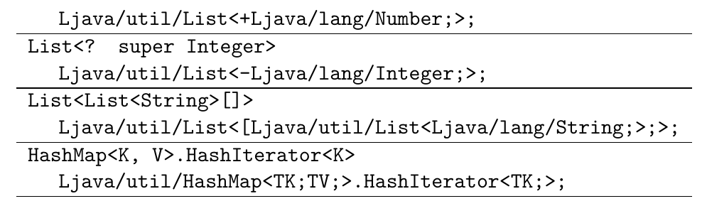
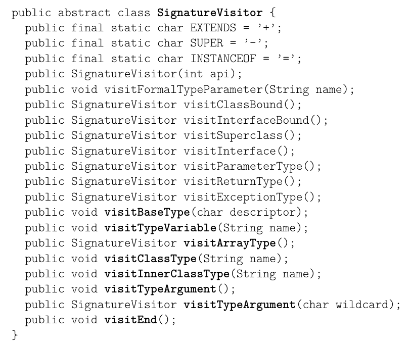
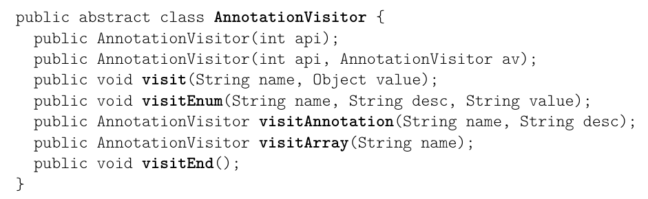

# 4. 元数据

本章说明如何使用 Core API（核心 API）生成和变换已编译 Java 类的元数据，例如注解。每一节都先介绍一种元数据，然后介绍用于生成和变换这些元数据的相应 ASM 接口、组件和工具，并给出一些示例。

## 4.1 泛型

诸如 `List<E>` 这样的泛型类，以及使用了它们的类，都含有关于它们所声明或使用的泛型类型的信息。字节码指令在运行时并不使用这些信息，但可以通过反射 API 访问它们。编译器在进行单独编译时也会使用这些信息。

### 4.1.1 结构

出于向后兼容的原因，关于泛型类型的信息并不存放在类型描述符或方法描述符中（它们早在 Java 5 引入泛型之前就已定义好了），而是存放在与之类似的、称为类型签名、方法签名和类签名的结构中。当涉及泛型类型时，这些签名会与描述符一起存放在类、字段和方法的声明中（泛型类型不影响方法的字节码：编译器用它们进行静态类型检查，但随后会按仿佛没有使用它们的方式来编译方法，即在必要的地方重新引入类型转换）。

与类型描述符和方法描述符不同，并且由于泛型类型的递归性质（一个泛型类型可以被一个泛型类型参数化——例如考虑 `List<List<E>>`），类型签名的文法相当复杂。它由以下规则给出（这些规则的完整描述请参见《Java 虚拟机规范》）：

```text
TypeSignature: Z | C | B | S | I | F | J | D | FieldTypeSignature
FieldTypeSignature: ClassTypeSignature | [ TypeSignature | TypeVar
ClassTypeSignature: L Id ( / Id )* TypeArgs? ( . Id TypeArgs? )* ;
TypeArgs: < TypeArg+ >
TypeArg: * | ( + | - )? FieldTypeSignature
TypeVar: T Id ;
```

第一条规则说明，类型签名要么是基本类型描述符，要么是字段类型签名。第二条规则把字段类型签名定义为类类型签名、数组类型签名或类型变量。第三条规则定义了类类型签名：它们是带有可能的类型实参的类类型描述符，这些类型实参位于尖括号之间，放在主类名之后或（以点号为前缀的）内部类名之后。其余规则定义了类型实参和类型变量。注意，类型实参可以是一个完整的字段类型签名，并带有它自己的类型实参：因此类型签名可能非常复杂（参见图 4.1）。

```text
Java type                         Type signature
List<E>                           Ljava/util/List<TE;>;
List<?>                           Ljava/util/List<*>;
List<? extends Number>            Ljava/util/List<+Ljava/lang/Number;>;
List<? super Integer>             Ljava/util/List<-Ljava/lang/Integer;>;
List<List<String>[]>              Ljava/util/List<[Ljava/util/List<Ljava/lang/String;>;>;
HashMap<K, V>.HashIterator<K>     Ljava/util/HashMap<TK;TV;>.HashIterator<TK;>;
```

**图 4.1：类型签名示例**



方法签名扩展方法描述符的方式，与类型签名扩展类型描述符的方式相同。方法签名描述方法参数的类型签名以及其返回类型的签名。与方法描述符不同，它还包含方法所抛出的异常的签名（以 `^` 开头），并且还可以在尖括号之间包含可选的形参类型参数：

```text
MethodTypeSignature:
  TypeParams? ( TypeSignature* ) ( TypeSignature | V ) Exception*

Exception: ^ClassTypeSignature | ^TypeVar

TypeParams: < TypeParam+ >

TypeParam: Id : FieldTypeSignature? ( : FieldTypeSignature )*
```

例如，下面这个由类型变量 `T` 参数化的泛型静态方法：

```java
static <T> Class<? extends T> m (int n)
```

其方法签名如下：

```text
<T:Ljava/lang/Object;>(I)Ljava/lang/Class<+TT;>;
```

最后，类签名（不要把它与类类型签名相混淆）定义为：其超类的类型签名，后跟所实现接口的类型签名，并且可以带有可选的形参类型参数：

```text
ClassSignature: TypeParams? ClassTypeSignature ClassTypeSignature*
```

例如，声明为 `C<E> extends List<E>` 的类，其类签名是 `<E:Ljava/lang/Object;>Ljava/util/List<TE;>;`。

### 4.1.2 接口与组件

与描述符的情况类似，并且出于同样的效率原因（参见 2.3.1 节），ASM API 按签名在已编译类中存储的原样来暴露它们（签名主要出现在 `ClassVisitor` 类的 `visit`、`visitField` 和 `visitMethod` 方法中，分别作为可选的类签名、类型签名或方法签名参数）。幸运的是，它还提供了一些用于生成和变换签名的工具，这些工具位于 `org.objectweb.asm.signature` 包中，以抽象类 `SignatureVisitor` 为基础（参见图 4.2）。

```java
public abstract class SignatureVisitor {
    public final static char EXTENDS = '+';
    public final static char SUPER = '-';
    public final static char INSTANCEOF = '=';
    public SignatureVisitor(int api);
    public void visitFormalTypeParameter(String name);
    public SignatureVisitor visitClassBound();
    public SignatureVisitor visitInterfaceBound();
    public SignatureVisitor visitSuperclass();
    public SignatureVisitor visitInterface();
    public SignatureVisitor visitParameterType();
    public SignatureVisitor visitReturnType();
    public SignatureVisitor visitExceptionType();
    public void visitBaseType(char descriptor);
    public void visitTypeVariable(String name);
    public SignatureVisitor visitArrayType();
    public void visitClassType(String name);
    public void visitInnerClassType(String name);
    public void visitTypeArgument();
    public SignatureVisitor visitTypeArgument(char wildcard);
    public void visitEnd();
}
```

**图 4.2：`SignatureVisitor` 类**



这个抽象类用于访问类型签名、方法签名和类签名。用于访问类型签名的方法以粗体显示，它们必须按以下顺序调用，该顺序反映了前面给出的文法规则（注意其中有两个方法返回 `SignatureVisitor`：这是由于类型签名的递归定义造成的）：

```text
visitBaseType | visitArrayType | visitTypeVariable |
( visitClassType visitTypeArgument*
   ( visitInnerClassType visitTypeArgument* )* visitEnd ) )
```

用于访问方法签名的方法如下：

```text
( visitFormalTypeParameter visitClassBound? visitInterfaceBound* )*
visitParameterType* visitReturnType visitExceptionType*
```

最后，用于访问类签名的方法如下：

```text
( visitFormalTypeParameter visitClassBound? visitInterfaceBound* )*
visitSuperClass visitInterface*
```

这些方法大多返回一个 `SignatureVisitor`：其用途是访问一个类型签名。注意，与 `ClassVisitor` 返回的 `MethodVisitor` 不同，`SignatureVisitor` 返回的 `SignatureVisitor` 不能为 `null`，而且必须按顺序使用：事实上，在嵌套签名被完全访问之前，不得调用父访问者的任何方法。

与类的情况类似，ASM API 基于这一 API 提供了两个组件：`SignatureReader` 组件解析一个签名，并在给定的签名访问者上调用相应的 visit 方法；`SignatureWriter` 组件则根据它接收到的方法调用构造出一个签名。

这两个类可以按照与类和方法相同的原理来生成和变换签名。例如，假设你想重命名某些签名中出现的类名。这可以用下面这个签名适配器来完成，它把接收到的所有方法调用原样转发，只有 `visitClassType` 和 `visitInnerClassType` 两个方法除外（这里我们假设 `sv` 的方法总是返回 `this`，`SignatureWriter` 就是这种情况）：

```java
public class RenameSignatureAdapter extends SignatureVisitor {
    private SignatureVisitor sv;
    private Map<String, String> renaming;
    private String oldName;
    public RenameSignatureAdapter(SignatureVisitor sv,
            Map<String, String> renaming) {
        super(ASM4);
        this.sv = sv;
        this.renaming = renaming;
    }
    public void visitFormalTypeParameter(String name) {
        sv.visitFormalTypeParameter(name);
    }
    public SignatureVisitor visitClassBound() {
        sv.visitClassBound();
        return this;
    }
    public SignatureVisitor visitInterfaceBound() {
        sv.visitInterfaceBound();
        return this;
    }
    ...
    public void visitClassType(String name) {
        oldName = name;
        String newName = renaming.get(oldName);
        sv.visitClassType(newName == null ? name : newName);
    }
    public void visitInnerClassType(String name) {
        oldName = oldName + "." + name;
        String newName = renaming.get(oldName);
        sv.visitInnerClassType(newName == null ? name : newName);
    }
```

### 4.1.3 工具

2.3 节介绍的 `TraceClassVisitor` 和 `ASMifier` 类以内部形式打印类文件中包含的签名。可以用下面的方法找到与给定泛型类型相对应的签名：编写一个包含若干泛型类型的 Java 类，编译它，然后使用这些命令行工具找到相应的签名。

## 4.2 注解

类、字段、方法和方法参数上的注解，例如 `@Deprecated` 或 `@Override`，如果其保留策略不是 `RetentionPolicy.SOURCE`，就会被存储在编译后的类中。字节码指令在运行时并不使用这些信息，但如果保留策略是 `RetentionPolicy.RUNTIME`，就可以通过反射 API 访问它们。编译器也可以使用这些信息。

### 4.2.1 结构

源代码中的注解可以有多种形式，例如 `@Deprecated`、`@Retention(RetentionPolicy.CLASS)` 或 `@Task(desc="refactor", id=1)`。但在内部，所有注解都具有相同的形式，由一个注解类型和一组名称-值对指定，其中值仅限于：

- 基本类型、`String` 或 `Class` 值，
- 枚举值，
- 注解值，
- 上述值的数组。

注意，注解可以包含其他注解，甚至注解数组。因此注解可以相当复杂。

### 4.2.2 接口与组件

用于生成和变换注解的 ASM API 基于 `AnnotationVisitor` 抽象类（参见图 4.3）。

```java
public abstract class AnnotationVisitor {
    public AnnotationVisitor(int api);
    public AnnotationVisitor(int api, AnnotationVisitor av);
    public void visit(String name, Object value);
    public void visitEnum(String name, String desc, String value);
    public AnnotationVisitor visitAnnotation(String name, String desc);
    public AnnotationVisitor visitArray(String name);
    public void visitEnd();
}
```

**图 4.3：AnnotationVisitor 类**


这个类的方法用于访问注解的名称-值对（注解类型则在返回该类型的方法，即 `visitAnnotation` 方法中被访问）。第一个方法用于基本类型、`String` 和 `Class` 值（后者用 `Type` 对象表示），其余方法用于枚举值、注解值和数组值。除 `visitEnd` 之外，这些方法可以按任意顺序调用：

```text
( visit | visitEnum | visitAnnotation | visitArray )* visitEnd
```

注意，有两个方法返回 `AnnotationVisitor`：这是因为注解可以包含其他注解。另外，与 `ClassVisitor` 返回的 `MethodVisitor` 不同，这两个方法返回的 `AnnotationVisitor` 必须按顺序使用：事实上，在嵌套注解被完全访问之前，不能调用父访问者的任何方法。

还要注意，`visitArray` 方法返回一个 `AnnotationVisitor` 来访问数组的元素。但由于数组的元素没有名称，`visitArray` 返回的访问者的各个方法会忽略 `name` 参数，可以将其设为 `null`。

**添加、删除和检测注解**

与字段和方法类似，在 `visitAnnotation` 方法中返回 `null` 即可删除注解：

```java
public class RemoveAnnotationAdapter extends ClassVisitor {
    private String annDesc;

    public RemoveAnnotationAdapter(ClassVisitor cv, String annDesc) {
        super(ASM4, cv);
        this.annDesc = annDesc;
    }

    @Override
    public AnnotationVisitor visitAnnotation(String desc, boolean vis) {
        if (desc.equals(annDesc)) {
            return null;
        }
        return cv.visitAnnotation(desc, vis);
    }
}
```

添加类注解更困难，因为 `ClassVisitor` 类的方法必须遵守调用顺序上的约束。实际上，必须覆写所有可能出现在 `visitAnnotation` 之后的方法，以便检测出所有注解何时访问完毕（由于有了 `visitCode` 方法，添加方法注解要容易一些）：

```java
public class AddAnnotationAdapter extends ClassVisitor {
    private String annotationDesc;
    private boolean isAnnotationPresent;

    public AddAnnotationAdapter(ClassVisitor cv, String annotationDesc) {
        super(ASM4, cv);
        this.annotationDesc = annotationDesc;
    }

    @Override
    public void visit(int version, int access, String name,
            String signature, String superName, String[] interfaces) {
        int v = (version & 0xFF) < V1_5 ? V1_5 : version;
        cv.visit(v, access, name, signature, superName, interfaces);
    }

    @Override
    public AnnotationVisitor visitAnnotation(String desc,
            boolean visible) {
        if (visible && desc.equals(annotationDesc)) {
            isAnnotationPresent = true;
        }
        return cv.visitAnnotation(desc, visible);
    }

    @Override
    public void visitInnerClass(String name, String outerName,
            String innerName, int access) {
        addAnnotation();
        cv.visitInnerClass(name, outerName, innerName, access);
    }

    @Override
    public FieldVisitor visitField(int access, String name, String desc,
            String signature, Object value) {
        addAnnotation();
        return cv.visitField(access, name, desc, signature, value);
    }

    @Override
    public MethodVisitor visitMethod(int access, String name,
            String desc, String signature, String[] exceptions) {
        addAnnotation();
        return cv.visitMethod(access, name, desc, signature, exceptions);
    }

    @Override
    public void visitEnd() {
        addAnnotation();
        cv.visitEnd();
    }

    private void addAnnotation() {
        if (!isAnnotationPresent) {
            AnnotationVisitor av = cv.visitAnnotation(annotationDesc, true);
            if (av != null) {
                av.visitEnd();
            }
            isAnnotationPresent = true;
        }
    }
}
```

注意，如果类的版本低于 1.5，这个适配器会将其升级到 1.5。这是必要的，因为 JVM 会忽略版本低于 1.5 的类中的注解。

在类适配器和方法适配器中，注解最后一种、可能也是最常见的用法，是利用注解为变换提供参数。例如，你可以只对带有 `@Persistent` 注解的字段变换其字段访问，只对带有 `@Log` 注解的方法添加日志代码，等等。所有这些用法都很容易实现，因为注解必须先被访问：类注解必须在字段和方法之前被访问，方法注解和参数注解必须在代码之前被访问。因此，只需在检测到所需的注解时设置一个标志，然后在后续的变换中使用它即可，正如上面的例子中用 `isAnnotationPresent` 标志所做的那样。

### 4.2.3 工具

2.3 节介绍的 `TraceClassVisitor`、`CheckClassAdapter` 和 `ASMifier` 类也支持注解（与方法类似，也可以使用 `TraceAnnotationVisitor` 或 `CheckAnnotationAdapter`，在单个注解的层面而不是类的层面工作）。可以用它们了解如何生成某个特定的注解。例如使用：

```text
java -classpath asm.jar:asm-util.jar \
     org.objectweb.asm.util.ASMifier \
     java.lang.Deprecated
```

会打印出这样的代码（稍作重构后为）：

```java
package asm.java.lang;

import org.objectweb.asm.*;

public class DeprecatedDump implements Opcodes {
    public static byte[] dump() throws Exception {
        ClassWriter cw = new ClassWriter(0);
        AnnotationVisitor av;
        cw.visit(V1_5, ACC_PUBLIC + ACC_ANNOTATION + ACC_ABSTRACT
                + ACC_INTERFACE, "java/lang/Deprecated", null,
                "java/lang/Object",
                new String[] { "java/lang/annotation/Annotation" });
        {
            av = cw.visitAnnotation("Ljava/lang/annotation/Documented;",
                    true);
            av.visitEnd();
        }
        {
            av = cw.visitAnnotation("Ljava/lang/annotation/Retention;", true);
            av.visitEnum("value", "Ljava/lang/annotation/RetentionPolicy;",
                    "RUNTIME");
            av.visitEnd();
        }
        cw.visitEnd();
        return cw.toByteArray();
    }
}
```

这段代码展示了如何使用 `ACC_ANNOTATION` 标志创建一个注解类，以及如何创建两个类注解：一个不带值，一个带枚举值。可以用类似的方式创建方法注解和参数注解，即使用 `MethodVisitor` 类中定义的 `visitAnnotation` 和 `visitParameterAnnotation` 方法。

## 4.3 调试

用 `javac -g` 编译的类包含其源文件的名称、源代码行号与字节码指令之间的映射，以及源代码中的局部变量名与字节码中的局部变量槽之间的映射。这些可选信息在可用时会被调试器和异常堆栈跟踪使用。

### 4.3.1 结构

类的源文件名存储在类文件结构中一个专门的区段中（参见图 2.1）。

源代码行号与字节码指令之间的映射，以（行号，标签）对的列表形式存储在方法的已编译代码区段中。例如，如果 `l1`、`l2` 和 `l3` 是按此顺序出现的三个标签，那么下面这些对：

```text
(n1, l1)
(n2, l2)
(n3, l3)
```

表示 `l1` 与 `l2` 之间的指令来自第 `n1` 行，`l2` 与 `l3` 之间的指令来自第 `n2` 行，`l3` 之后的指令来自第 `n3` 行。注意，同一个行号可能出现在多个对中。这是因为出现在同一源代码行上的表达式所对应的指令，在字节码中可能并不连续。例如，`for (init; cond; incr) statement;` 通常按以下顺序编译：`init statement incr cond`。

源代码中的局部变量名与字节码中的局部变量槽之间的映射，以（名称、类型描述符、类型签名、start、end、index）元组的列表形式存储在方法的已编译代码区段中。这样一个元组表示：在两个标签 `start` 和 `end` 之间，槽 `index` 中的局部变量对应于元组前三个元素所给出的源代码中名称和类型的局部变量。注意，编译器可能用同一个局部变量槽存储作用域不同的多个源代码局部变量。反过来，一个唯一的源代码局部变量也可能被编译到作用域不连续的局部变量槽中。例如，可能出现下面这样的情况：

```text
l1:
  ... // 这里槽 1 包含局部变量 i
l2:
  ... // 这里槽 1 包含局部变量 j
l3:
  ... // 这里槽 1 再次包含局部变量 i
end:
```

对应的元组是：

```text
("i", "I", null, l1, l2, 1)
("j", "I", null, l2, l3, 1)
("i", "I", null, l3, end, 1)
```

### 4.3.2 接口与组件

调试信息通过 `ClassVisitor` 和 `MethodVisitor` 类的三个方法来访问：

- 源文件名通过 `ClassVisitor` 类的 `visitSource` 方法访问；
- 源代码行号与字节码指令之间的映射通过 `MethodVisitor` 类的 `visitLineNumber` 方法访问，一次访问一个对；
- 源代码中的局部变量名与字节码中的局部变量槽之间的映射通过 `MethodVisitor` 类的 `visitLocalVariable` 方法访问，一次访问一个元组。

`visitLineNumber` 方法必须在作为参数传入的标签被访问之后调用。实践中它紧跟在访问该标签之后调用，这使得在方法访问者中很容易知道当前指令的源代码行号：

```java
public class MyAdapter extends MethodVisitor {
    int currentLine;

    public MyAdapter(MethodVisitor mv) {
        super(ASM4, mv);
    }

    @Override
    public void visitLineNumber(int line, Label start) {
        mv.visitLineNumber(line, start);
        currentLine = line;
    }

    ...
}
```

类似地，`visitLocalVariable` 方法必须在作为参数传入的标签被访问之后调用。下面是与上一节介绍的对和元组相对应的方法调用示例：

```text
visitLineNumber(n1, l1);
visitLineNumber(n2, l2);
visitLineNumber(n3, l3);
visitLocalVariable("i", "I", null, l1, l2, 1);
visitLocalVariable("j", "I", null, l2, l3, 1);
visitLocalVariable("i", "I", null, l3, end, 1);
```

**忽略调试信息**

为了访问行号和局部变量名，`ClassReader` 类可能需要引入「人工」`Label` 对象，也就是说，跳转指令并不需要这些对象，它们只用于表示调试信息。在 3.2.5 节所说明的那种情形下，这可能导致误判：指令序列中间的某个 `Label` 被认为是跳转目标，从而阻止该序列被删除。

为了避免这些误判，可以在 `ClassReader.accept` 方法中使用 `SKIP_DEBUG` 选项。使用该选项时，类读取器不会访问调试信息，也不会为它创建人工标签。当然，调试信息将从类中被删除，因此只有在这一点对你的应用不构成问题时才能使用该选项。

> **注意**：`ClassReader` 类还提供了其他选项，例如 `SKIP_CODE` 用于跳过对已编译代码的访问（如果你只需要类的结构，这会很有用）、`SKIP_FRAMES` 用于跳过栈映射帧，以及 `EXPAND_FRAMES` 用于解压这些帧。

### 4.3.3 工具

与泛型类型和注解一样，你可以使用 `TraceClassVisitor`、`CheckClassAdapter` 和 `ASMifier` 类来了解如何处理调试信息。
