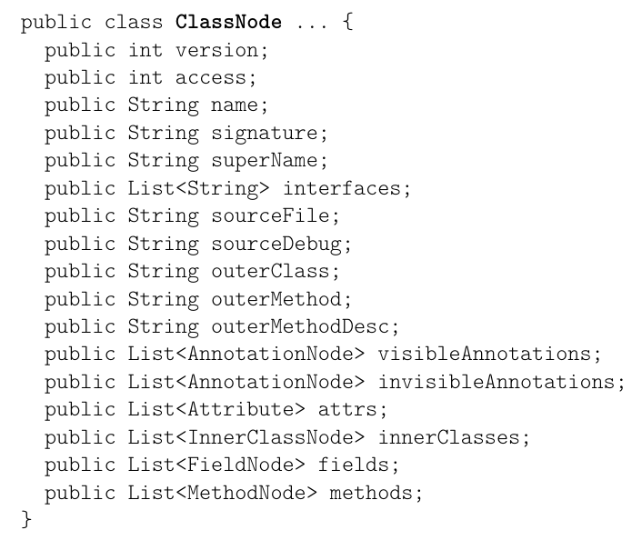
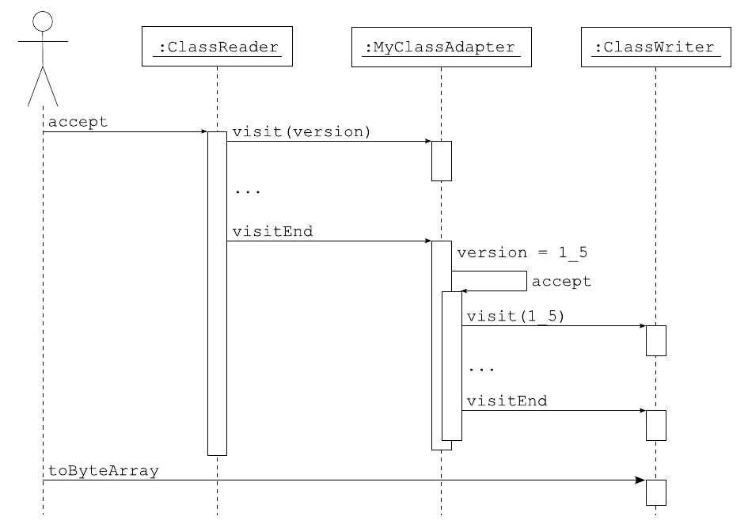

# 目录

目录：[ASM4中文指南](2026/asm4-guide-zh/README.md)

# 6. 类（Tree API）

本章介绍如何使用 ASM Tree API（树 API）生成和变换类。本章首先单独介绍 Tree API，然后说明如何把它与 Core API（核心 API）组合起来。用于方法内容、注解和泛型的 Tree API 将在后续各章中介绍。

## 6.1 接口与组件

### 6.1.1 展示

用于生成和变换已编译 Java 类的 ASM Tree API 基于 `ClassNode` 类（参见图 6.1）。

```java
public class ClassNode ... {
    public int version;
    public int access;
    public String name;
    public String signature;
    public String superName;
    public List<String> interfaces;
    public String sourceFile;
    public String sourceDebug;
    public String outerClass;
    public String outerMethod;
    public String outerMethodDesc;
    public List<AnnotationNode> visibleAnnotations;
    public List<AnnotationNode> invisibleAnnotations;
    public List<Attribute> attrs;
    public List<InnerClassNode> innerClasses;
    public List<FieldNode> fields;
    public List<MethodNode> methods;
}
```

**图 6.1：ClassNode 类（仅显示字段）**



如你所见，该类的公开字段与图 2.1 中给出的类文件结构各节相对应。这些字段的内容与 Core API 中相同。例如 `name` 是内部名，`signature` 是类签名（参见 2.1.2 节和 4.1 节）。有些字段包含其他的 `XxxNode` 类：这些类将在后续各章中详细介绍，它们具有相似的结构，即拥有与类文件结构的各个子节相对应的字段。例如 `FieldNode` 类如下所示：

```java
public class FieldNode ... {
    public int access;
    public String name;
    public String desc;
    public String signature;
    public Object value;
    public FieldNode(int access, String name, String desc,
            String signature, Object value) {
        ...
    }
    ...
}
```

`MethodNode` 类与之类似：

```java
public class MethodNode ... {
    public int access;
    public String name;
    public String desc;
    public String signature;
    public List<String> exceptions;
    ...
    public MethodNode(int access, String name, String desc,
            String signature, String[] exceptions)
    {
        ...
    }
}
```

### 6.1.2 生成类

用 Tree API 生成一个类，仅仅就是创建一个 `ClassNode` 对象并初始化它的字段。例如，2.2.3 节中的 `Comparable` 接口可以按如下方式构建，其代码量与 2.2.3 节大致相同：

```java
ClassNode cn = new ClassNode();
cn.version = V1_5;
cn.access = ACC_PUBLIC + ACC_ABSTRACT + ACC_INTERFACE;
cn.name = "pkg/Comparable";
cn.superName = "java/lang/Object";
cn.interfaces.add("pkg/Mesurable");
cn.fields.add(new FieldNode(ACC_PUBLIC + ACC_FINAL + ACC_STATIC,
        "LESS", "I", null, new Integer(-1)));
cn.fields.add(new FieldNode(ACC_PUBLIC + ACC_FINAL + ACC_STATIC,
        "EQUAL", "I", null, new Integer(0)));
cn.fields.add(new FieldNode(ACC_PUBLIC + ACC_FINAL + ACC_STATIC,
        "GREATER", "I", null, new Integer(1)));
cn.methods.add(new MethodNode(ACC_PUBLIC + ACC_ABSTRACT,
        "compareTo", "(Ljava/lang/Object;)I", null, null));
```

与使用 Core API 相比，使用 Tree API 生成一个类大约多花 30% 的时间（参见附录 A.1），并且消耗更多内存。但它使得可以按任意顺序生成类的各个元素，这在某些情况下会很方便。

> 笔记：
> 
> 先用一张图把 6.1.1 和 6.1.2 串起来：**`ClassNode` 的公开字段，就是类文件结构的镜像**——类头上有什么内容，`ClassNode` 上就有什么字段；`fields`/`methods` 两个列表里装的是 `FieldNode`/`MethodNode`，它们各自对应"字段节"和"方法节"。所以先看 6.1.1 的字段清单，再看 6.1.2 生成类的动作，你会得出一个很直接的结论：**生成一个类 = new 一个 `ClassNode` 再往字段里填值**，先加方法再加字段、先加字段加方法，都无所谓。
> 
> 由此得出一个对比：用 Core API 生成类时，`visit` 系列方法必须按固定顺序调用（类头 → 字段/方法 → `visitEnd`），而**树 API 里这个顺序约束消失了**，你可以按任意顺序拼装——这正是它多花约 30% 时间、多耗内存换来的便利。记住这个"用代价换自由"的基调，6.1.3 和 6.2 节的所有取舍讨论都从它出发。

### 6.1.3 添加和删除类成员

添加和删除类成员，仅仅就是在 `ClassNode` 对象的 `fields` 或 `methods` 列表中增加或删除元素。例如，为了能够方便地组合类变换器，我们如下定义 `ClassTransformer` 类：

```java
public class ClassTransformer {
    protected ClassTransformer ct;
    public ClassTransformer(ClassTransformer ct) {
        this.ct = ct;
    }
    public void transform(ClassNode cn) {
        if (ct != null) {
            ct.transform(cn);
        }
    }
}
```

那么 2.2.5 节中的 `RemoveMethodAdapter` 就可以如下实现：

```java
public class RemoveMethodTransformer extends ClassTransformer {
    private String methodName;
    private String methodDesc;
    public RemoveMethodTransformer(ClassTransformer ct,
            String methodName, String methodDesc) {
        super(ct);
        this.methodName = methodName;
        this.methodDesc = methodDesc;
    }
    @Override public void transform(ClassNode cn) {
        Iterator<MethodNode> i = cn.methods.iterator();
        while (i.hasNext()) {
            MethodNode mn = i.next();
            if (methodName.equals(mn.name) && methodDesc.equals(mn.desc)) {
                i.remove();
            }
        }
        super.transform(cn);
    }
}
```

可以看出，与 Core API 的主要区别在于：你需要遍历所有方法，而使用 Core API 时则无需这样做（`ClassReader` 会替你完成）。事实上，这一区别对几乎所有基于树的变换都成立。例如，2.2.6 节中的 `AddFieldAdapter` 在用 Tree API 实现时同样需要一个迭代器：

```java
public class AddFieldTransformer extends ClassTransformer {
    private int fieldAccess;
    private String fieldName;
    private String fieldDesc;
    public AddFieldTransformer(ClassTransformer ct, int fieldAccess,
            String fieldName, String fieldDesc) {
        super(ct);
        this.fieldAccess = fieldAccess;
        this.fieldName = fieldName;
        this.fieldDesc = fieldDesc;
    }
    @Override public void transform(ClassNode cn) {
        boolean isPresent = false;
        for (FieldNode fn : cn.fields) {
            if (fieldName.equals(fn.name)) {
                isPresent = true;
                break;
            }
        }
        if (!isPresent) {
            cn.fields.add(new FieldNode(fieldAccess, fieldName, fieldDesc,
                    null, null));
        }
        super.transform(cn);
    }
}
```

> 笔记：
> 
> 把 `RemoveMethodTransformer` 和 `AddFieldTransformer` 放在一起看，一条完整的"树变换套路"就出来了：
> 
> - **为什么用 `Iterator` 遍历再 `remove`**：`cn.methods` 是一个普通的 `List`，边用增强 for 遍历边删除元素会抛 `ConcurrentModificationException`；用迭代器删除是标准做法。原文没有点破，但这是树变换最容易踩的坑（删字段同理，`cn.fields` 也要迭代器删）。
> - **为什么变换器要持有 `ct` 并在末尾调 `super.transform(cn)`**：这跟 Core API 适配器"把事件向后转发"是同一个道理，只不过转发出去的是整棵树。多个变换器这样串成一条链，外层干完自己的活，再把控制权交给内层。
> - **变换 = 直接操作列表**：删成员是迭代器 `remove`，加成员是 `cn.fields.add(new FieldNode(...))`。相比 Core API 那种"边访问边改"的事件流节奏，树 API 允许你先看完整棵树再动手，这是它最大的自由度所在。

与生成类时一样，使用 Tree API 变换类比使用 Core API 花费更多时间、消耗更多内存。但它使得某些变换更容易实现。例如，有一种变换会向类中添加一个注解，该注解包含类内容的数字签名。使用 Core API 时，只有访问完整个类之后才能计算数字签名，但此时再添加包含该签名的注解已经太晚，因为注解必须在类成员之前被访问。使用 Tree API 时这个问题就不存在了，因为在这种情况下没有这样的约束。

事实上，用 Core API 也可以实现 `AddDigitialSignature` 示例，但那样必须分两趟变换这个类。在第一趟中，用一个 `ClassReader`（不使用 `ClassWriter`）访问该类，以便根据类的内容计算数字签名。在第二趟中，复用同一个 `ClassReader` 对该类做第二次访问，这一次把 `AddAnnotationAdapter` 串接到一个 `ClassWriter` 上。把这个论证推广开来可以看出，事实上任何变换都可以仅用 Core API 实现，必要时分多趟进行。但这会增加变换代码的复杂度，需要在各趟之间保存状态（其复杂度可能与一棵完整的树表示相当！），而且多次解析类是有代价的，必须把这一代价与构造相应 `ClassNode` 的代价相比较。

结论是：Tree API 通常用于那些无法用 Core API 一趟完成的变换。但当然也有例外。例如，混淆器无法一趟实现，因为在原始名到混淆名的映射完全构建好之前，你无法变换类，而构建该映射需要解析所有的类。但 Tree API 也不是一个好的解决方案，因为它需要把所有待混淆类的对象表示都保存在内存中。在这种情况下，更好的做法是使用 Core API 并分两趟：一趟计算原始名与混淆名之间的映射（一张简单的哈希表，其内存需求远小于所有类的完整对象表示），另一趟则基于该映射来变换这些类。

> 笔记：
> 
> 6.1.3 最后两段其实是一张**选型对照表**，值得提炼成三条：
> 
> - **优先选 Tree 的场景**：一趟变换里需要"先看完整类再动手"。原文的 `AddDigitialSignature` 就是典型——签名要算完整个类才能得出，而注解又必须排在类成员之前被访问，Core API 只能分两趟，把状态存在类之间；树 API 一步到位。
> - **优先选 Core 的场景**：对内存敏感的处理。原文的混淆器是反例——两趟 Core 方案只需要一张"原始名 → 混淆名"的哈希表，树方案却要把所有类都装进内存。
> - 由此得出一般原则：**树变换的本质是"把多趟需求压成一趟"**。当变换可以顺着事件流一趟完成时，Core 更快更省；只有当"先看全、再改动"的需求出现时，树的自由才值得付出代价。

## 6.2 组件组合

到目前为止，我们只看到了如何创建和变换 `ClassNode` 对象，但还没有看到如何从类的字节数组表示构造一个 `ClassNode`，或者反过来，如何从 `ClassNode` 构造该字节数组。事实上，这是通过组合 Core API 与 Tree API 的组件来完成的，本节将对此加以说明。

### 6.2.1 展示

除了图 6.1 中显示的字段之外，`ClassNode` 类还继承 `ClassVisitor` 类，并提供了一个以 `ClassVisitor` 作为参数的 `accept` 方法。`accept` 方法根据 `ClassNode` 的字段值生成事件，而 `ClassVisitor` 的各方法执行相反的操作，即根据收到的事件设置 `ClassNode` 的字段：

```java
public class ClassNode extends ClassVisitor {
    ...
    public void visit(int version, int access, String name,
            String signature, String superName, String[] interfaces[]) {
        this.version = version;
        this.access = access;
        this.name = name;
        this.signature = signature;
        ...
    }
    ...
    public void accept(ClassVisitor cv) {
        cv.visit(version, access, name, signature, ...);
        ...
    }
}
```

因此，从字节数组构造 `ClassNode` 可以通过把它与 `ClassReader` 组合来完成：`ClassReader` 生成的事件由 `ClassNode` 组件消费，从而完成其字段的初始化（从上面的代码可以看出这一点）：

```java
ClassNode cn = new ClassNode();
ClassReader cr = new ClassReader(...);
cr.accept(cn, 0);
```

对称地，把 `ClassNode` 与 `ClassWriter` 组合，即可将其转换为字节数组表示：由 `ClassNode` 的 `accept` 方法生成的事件由 `ClassWriter` 消费：

```java
ClassWriter cw = new ClassWriter(0);
cn.accept(cw);
byte[] b = cw.toByteArray();
```

> 笔记：
> 
> 6.2.1 讲的是**两套 API 之间的桥**，理解它只差一个关键事实：`ClassNode` 本身就是一个 `ClassVisitor`。所以两个方向都很顺：
> 
> - **字节数组 → `ClassNode`**：`ClassReader.accept(cn, 0)`，读者产生的事件被 `ClassNode` 消费，事件依次落进对应字段，树就建好了；
> - **`ClassNode` → 字节数组**：`cn.accept(cw)`，树把字段重新变成事件流，`ClassWriter` 消费后输出字节数组。
> 
> 由此得出 6.2.2 的伏笔：**既然树的输入和输出都是"事件"，那树变换就可以伪装成一个普通 `ClassVisitor`，混进 Core API 的适配器链里**。另外注意原文写的是 `new ClassNode(ASM4)` 而不是无参构造——`ClassNode` 的构造器需要被告知字节码版本（API 级别），ASM 4 及其之后的代码都应这样显式传参，后续所有示例都沿用这个写法。

### 6.2.2 模式

用 Tree API 变换一个类，可以把这些要素组合起来实现：

```java
ClassNode cn = new ClassNode(ASM4);
ClassReader cr = new ClassReader(...);
cr.accept(cn, 0);
... // 在此处按需变换 cn
ClassWriter cw = new ClassWriter(0);
cn.accept(cw);
byte[] b = cw.toByteArray();
```

也可以把基于树的类变换器当作 Core API 中的类适配器来使用。为此有两种常见模式。第一种使用继承：

```java
public class MyClassAdapter extends ClassNode {
    public MyClassAdapter(ClassVisitor cv) {
        super(ASM4);
        this.cv = cv;
    }
    @Override public void visitEnd() {
        // 在此处放入你的变换代码
        accept(cv);
    }
}
```

当这个类适配器用于经典的变换链中时：

```java
ClassWriter cw = new ClassWriter(0);
ClassVisitor ca = new MyClassAdapter(cw);
ClassReader cr = new ClassReader(...);
cr.accept(ca, 0);
byte[] b = cw.toByteArray();
```

由 `cr` 生成的事件由 `ClassNode` 类型的 `ca` 消费，从而完成该对象各字段的初始化。最后，当 `visitEnd` 事件被消费时，`ca` 执行变换，并通过调用其 `accept` 方法生成对应于变换后类的新事件，这些事件由 `cw` 消费。假设 `ca` 改变了类的版本，相应的时序图如图 6.2 所示。

**图 6.2：MyClassAdapter 的时序图**



与图 2.7 中 `ChangeVersionAdapter` 的时序图相比可以看出，`ca` 与 `cw` 之间的事件发生在 `cr` 与 `ca` 之间的事件之后，而不是像普通类适配器那样同时发生。事实上，所有基于树的变换都是如此，这也解释了为什么它们比基于事件的变换受到更少的约束。

第二种模式可以达到相同的结果，其时序图也类似，它使用委托而不是继承：

```java
public class MyClassAdapter extends ClassVisitor {
    ClassVisitor next;
    public MyClassAdapter(ClassVisitor cv) {
        super(ASM4, new ClassNode());
        next = cv;
    }
    @Override public void visitEnd() {
        ClassNode cn = (ClassNode) cv;
        // 在此处放入你的变换代码
        cn.accept(next);
    }
}
```

这种模式使用两个对象而不是一个，但其工作方式与第一种模式完全相同：收到的事件被用来构造一个 `ClassNode`，当收到最后一个事件时，该对象被变换，并转换回基于事件的表示。

这两种模式都允许你把基于树的类适配器与基于事件的适配器组合起来。它们也可以用来把多个基于树的适配器组合在一起，但如果你只需要组合基于树的适配器，这并不是最佳方案：在这种情况下，使用 `ClassTransformer` 之类的类可以避免两种表示之间不必要的转换。

> 笔记：
> 
> 6.2.2 的两种模式**殊途同归**：无论继承 `ClassNode`，还是委托 `ClassVisitor` + `ClassNode`，时序图都是图 6.2 那样——`cr` 的事件先全部灌进树，**直到 `visitEnd` 才动手变换**，之后再把事件重放给 `cw`。与图 2.7 的普通适配器对比，区别就一句话：普通适配器"边收边发"，树适配器"收完再发"，所以树变换能在动手前看到完整信息。
> 
> 但注意原文最后一段的提醒：**如果整条链都是树变换器，就不该用这两种模式**——每一级都要多做一次"事件 → 树、树 → 事件"的往返转换，属于无谓开销；直接用 6.1.3 的 `ClassTransformer` 互相串起来更省。由此收束全章：Tree API 不是替代 Core API，而是给"先看全、再动手"的变换一个更自由的选择；两套 API 靠 `ClassNode` 这座桥无缝互操作。

## 附加

本章的完整可运行程序。每个程序都是独立的 Java 文件，可直接用 `javac -cp "asm-9.7.1.jar:asm-tree-9.7.1.jar:asm-util-9.7.1.jar"` 编译、`java -cp ...` 运行；JDK 17 + ASM 9.7.1 下验证通过。

### Tree API 生成类完整代码

用 `ClassNode` + `ClassWriter` 生成类并加载：忠实复刻 6.1.2 的 `Comparable` 接口（含其依赖的 `pkg/Mesurable`），再用 `MethodNode` + `InsnList` 拼出一个带方法体的具体类 `pkg/TreeCalc`，最后用 `TraceClassVisitor` 打印 `ClassNode` 重放出来的事件（6.2.1 的桥接）。

```java
import java.io.PrintWriter;
import java.lang.reflect.Field;
import java.lang.reflect.Method;

import org.objectweb.asm.ClassWriter;
import org.objectweb.asm.Opcodes;
import org.objectweb.asm.tree.ClassNode;
import org.objectweb.asm.tree.FieldNode;
import org.objectweb.asm.tree.InsnNode;
import org.objectweb.asm.tree.MethodInsnNode;
import org.objectweb.asm.tree.MethodNode;
import org.objectweb.asm.tree.VarInsnNode;
import org.objectweb.asm.util.TraceClassVisitor;

public class TreeGenerateClassDemo {

    // 暴露 defineClass，加载 ASM 生成的类（类加载不属于 ASM 的范围，必须由我们自己完成）
    static class MyClassLoader extends ClassLoader {
        Class<?> defineHere(String name, byte[] b) {
            return defineClass(name, b, 0, b.length);
        }
    }

    // 原文 6.1.2 的代码：用 ClassNode 生成 pkg/Comparable 接口
    static byte[] createComparableClass() {
        ClassNode cn = new ClassNode(Opcodes.ASM4);
        cn.version = Opcodes.V1_5;
        cn.access = Opcodes.ACC_PUBLIC + Opcodes.ACC_ABSTRACT + Opcodes.ACC_INTERFACE;
        cn.name = "pkg/Comparable";
        cn.superName = "java/lang/Object";
        cn.interfaces.add("pkg/Mesurable");
        cn.fields.add(new FieldNode(Opcodes.ACC_PUBLIC + Opcodes.ACC_FINAL + Opcodes.ACC_STATIC,
                "LESS", "I", null, Integer.valueOf(-1)));
        cn.fields.add(new FieldNode(Opcodes.ACC_PUBLIC + Opcodes.ACC_FINAL + Opcodes.ACC_STATIC,
                "EQUAL", "I", null, Integer.valueOf(0)));
        cn.fields.add(new FieldNode(Opcodes.ACC_PUBLIC + Opcodes.ACC_FINAL + Opcodes.ACC_STATIC,
                "GREATER", "I", null, Integer.valueOf(1)));
        cn.methods.add(new MethodNode(Opcodes.ACC_PUBLIC + Opcodes.ACC_ABSTRACT,
                "compareTo", "(Ljava/lang/Object;)I", null, null));

        ClassWriter cw = new ClassWriter(0);
        cn.accept(cw);          // ClassNode -> 事件 -> ClassWriter
        return cw.toByteArray();
    }

    // Comparable 实现到的接口 pkg/Mesurable，同样用 ClassNode 生成
    static byte[] createMesurableClass() {
        ClassNode cn = new ClassNode(Opcodes.ASM4);
        cn.version = Opcodes.V1_5;
        cn.access = Opcodes.ACC_PUBLIC + Opcodes.ACC_ABSTRACT + Opcodes.ACC_INTERFACE;
        cn.name = "pkg/Mesurable";
        cn.superName = "java/lang/Object";
        ClassWriter cw = new ClassWriter(0);
        cn.accept(cw);
        return cw.toByteArray();
    }

    // 生成一个带可执行方法的具体类 pkg/TreeCalc：int add(int a, int b) 返回 a + b
    static byte[] createTreeCalcClass() {
        ClassNode cn = new ClassNode(Opcodes.ASM4);
        cn.version = Opcodes.V1_5;
        cn.access = Opcodes.ACC_PUBLIC;
        cn.name = "pkg/TreeCalc";
        cn.superName = "java/lang/Object";

        // 无参构造器：先调用 Object.<init>，否则实例化时过不了校验
        MethodNode init = new MethodNode(Opcodes.ASM4, Opcodes.ACC_PUBLIC, "<init>", "()V", null, null);
        init.instructions.add(new VarInsnNode(Opcodes.ALOAD, 0));
        init.instructions.add(new MethodInsnNode(Opcodes.INVOKESPECIAL,
                "java/lang/Object", "<init>", "()V", false));
        init.instructions.add(new InsnNode(Opcodes.RETURN));
        cn.methods.add(init);

        // 方法体用 InsnList 拼字节码：把两个 int 参数 ILOAD 上来，IADD 后 IRETURN
        MethodNode add = new MethodNode(Opcodes.ASM4, Opcodes.ACC_PUBLIC, "add", "(II)I", null, null);
        add.instructions.add(new VarInsnNode(Opcodes.ILOAD, 1));
        add.instructions.add(new VarInsnNode(Opcodes.ILOAD, 2));
        add.instructions.add(new InsnNode(Opcodes.IADD));
        add.instructions.add(new InsnNode(Opcodes.IRETURN));
        cn.methods.add(add);

        // COMPUTE_MAXS：让 ASM 替我们计算 maxStack/maxLocals（手拼指令很难算准）
        ClassWriter cw = new ClassWriter(ClassWriter.COMPUTE_MAXS);
        cn.accept(cw);
        return cw.toByteArray();
    }

    public static void main(String[] args) throws Exception {
        MyClassLoader cl = new MyClassLoader();
        cl.defineHere("pkg.Mesurable", createMesurableClass());
        Class<?> comparable = cl.defineHere("pkg.Comparable", createComparableClass());

        System.out.println("name        = " + comparable.getName());
        System.out.println("isInterface = " + comparable.isInterface());
        Class<?> sup = comparable.getSuperclass();
        System.out.println("superclass  = " + (sup == null ? "null（接口没有超类）" : sup.getName()));
        for (Class<?> itf : comparable.getInterfaces()) {
            System.out.println("interface   = " + itf.getName());
        }
        Field less = comparable.getField("LESS");
        System.out.println("LESS   = " + less.get(null) + " (" + less.getType().getName() + ")");
        System.out.println("EQUAL  = " + comparable.getField("EQUAL").get(null));
        System.out.println("GREATER = " + comparable.getField("GREATER").get(null));
        System.out.println("compareTo = " + comparable.getDeclaredMethod("compareTo", Object.class));

        // 加载带方法体的具体类并实际调用
        Class<?> calc = cl.defineHere("pkg.TreeCalc", createTreeCalcClass());
        Object instance = calc.getDeclaredConstructor().newInstance();
        Object result = calc.getMethod("add", int.class, int.class).invoke(instance, 20, 22);
        System.out.println("pkg.TreeCalc.add(20, 22) = " + result);

        // 用 TraceClassVisitor 打印 ClassNode 重放出来的事件（6.2.1 的三种组件组合）
        System.out.println();
        System.out.println("=== TraceClassVisitor 打印 ClassNode 发出的事件 ===");
        ClassNode traceNode = new ClassNode(Opcodes.ASM4);
        traceNode.version = Opcodes.V1_5;
        traceNode.access = Opcodes.ACC_PUBLIC;
        traceNode.name = "Trace/Demo";
        traceNode.superName = "java/lang/Object";
        ClassWriter traceWriter = new ClassWriter(0);
        traceNode.accept(new TraceClassVisitor(traceWriter, new PrintWriter(System.out)));
        System.out.println("Trace/Demo 字节数 = " + traceWriter.toByteArray().length);
    }
}
```

编译运行输出示例：

```text
name        = pkg.Comparable
isInterface = true
superclass  = null（接口没有超类）
interface   = pkg.Mesurable
LESS   = -1 (int)
EQUAL  = 0
GREATER = 1
compareTo = public abstract int pkg.Comparable.compareTo(java.lang.Object)
pkg.TreeCalc.add(20, 22) = 42

=== TraceClassVisitor 打印 ClassNode 发出的事件 ===
// class version 49.0 (49)
// access flags 0x1
public class Trace/Demo {

}
Trace/Demo 字节数 = 62
```

### RemoveMethodTransformer 完整代码

完整演示 6.1.3 的变换套路：先生成原始类 `pkg/Calc`，用 `ClassReader` 把它读成 `ClassNode`，`RemoveMethodTransformer` 用迭代器删除 `add(II)I`，再写回字节并加载，最后反射验证"`value()` 还在、`add` 已消失"。

```java
import java.lang.reflect.Method;
import java.util.Iterator;

import org.objectweb.asm.ClassReader;
import org.objectweb.asm.ClassWriter;
import org.objectweb.asm.Opcodes;
import org.objectweb.asm.tree.ClassNode;
import org.objectweb.asm.tree.InsnNode;
import org.objectweb.asm.tree.IntInsnNode;
import org.objectweb.asm.tree.MethodInsnNode;
import org.objectweb.asm.tree.MethodNode;
import org.objectweb.asm.tree.VarInsnNode;

public class TreeRemoveMethodDemo {

    static class MyClassLoader extends ClassLoader {
        Class<?> defineHere(String name, byte[] b) {
            return defineClass(name, b, 0, b.length);
        }
    }

    // 原文 6.1.3 中的 ClassTransformer：可组合变换器的基类，
    // transform 里先把工作交给下一个变换器，相当于 Core API 适配器链中的"向后转发"
    static class ClassTransformer {
        protected ClassTransformer ct;

        public ClassTransformer(ClassTransformer ct) {
            this.ct = ct;
        }

        public void transform(ClassNode cn) {
            if (ct != null) {
                ct.transform(cn);
            }
        }
    }

    // 原文 6.1.3 中的 RemoveMethodTransformer：
    // 用迭代器遍历方法列表并按名字 + 描述符删除，对应 Core API 一章 2.2.5 节 RemoveMethodAdapter
    static class RemoveMethodTransformer extends ClassTransformer {
        private String methodName;
        private String methodDesc;

        public RemoveMethodTransformer(ClassTransformer ct, String methodName, String methodDesc) {
            super(ct);
            this.methodName = methodName;
            this.methodDesc = methodDesc;
        }

        @Override
        public void transform(ClassNode cn) {
            Iterator<MethodNode> i = cn.methods.iterator();
            while (i.hasNext()) {
                MethodNode mn = i.next();
                if (methodName.equals(mn.name) && methodDesc.equals(mn.desc)) {
                    i.remove();   // 用迭代器删除，避免遍历途中修改列表
                }
            }
            super.transform(cn);  // 链式：把 cn 传给下一个变换器
        }
    }

    // 生成原始类 pkg/Calc：value() 返回 42，add(int,int) 返回两数之和
    static byte[] createCalcClass() {
        ClassNode cn = new ClassNode(Opcodes.ASM4);
        cn.version = Opcodes.V1_5;
        cn.access = Opcodes.ACC_PUBLIC;
        cn.name = "pkg/Calc";
        cn.superName = "java/lang/Object";

        MethodNode init = new MethodNode(Opcodes.ASM4, Opcodes.ACC_PUBLIC, "<init>", "()V", null, null);
        init.instructions.add(new VarInsnNode(Opcodes.ALOAD, 0));
        init.instructions.add(new MethodInsnNode(Opcodes.INVOKESPECIAL,
                "java/lang/Object", "<init>", "()V", false));
        init.instructions.add(new InsnNode(Opcodes.RETURN));
        cn.methods.add(init);

        MethodNode value = new MethodNode(Opcodes.ASM4, Opcodes.ACC_PUBLIC, "value", "()I", null, null);
        value.instructions.add(new IntInsnNode(Opcodes.BIPUSH, 42));
        value.instructions.add(new InsnNode(Opcodes.IRETURN));
        cn.methods.add(value);

        MethodNode add = new MethodNode(Opcodes.ASM4, Opcodes.ACC_PUBLIC, "add", "(II)I", null, null);
        add.instructions.add(new VarInsnNode(Opcodes.ILOAD, 1));
        add.instructions.add(new VarInsnNode(Opcodes.ILOAD, 2));
        add.instructions.add(new InsnNode(Opcodes.IADD));
        add.instructions.add(new InsnNode(Opcodes.IRETURN));
        cn.methods.add(add);

        ClassWriter cw = new ClassWriter(ClassWriter.COMPUTE_MAXS);
        cn.accept(cw);
        return cw.toByteArray();
    }

    public static void main(String[] args) throws Exception {
        byte[] original = createCalcClass();

        // 第一步：ClassReader -> ClassNode（6.2.1 的构造方式）
        ClassNode cn = new ClassNode(Opcodes.ASM4);
        new ClassReader(original).accept(cn, 0);
        System.out.print("变换前方法: ");
        for (MethodNode mn : cn.methods) {
            System.out.print(mn.name + mn.desc + "  ");
        }
        System.out.println();

        // 第二步：应用 RemoveMethodTransformer，移除 add(II)I
        new RemoveMethodTransformer(null, "add", "(II)I").transform(cn);
        System.out.print("变换后方法: ");
        for (MethodNode mn : cn.methods) {
            System.out.print(mn.name + mn.desc + "  ");
        }
        System.out.println();

        // 第三步：ClassNode -> ClassWriter -> 加载
        ClassWriter cw = new ClassWriter(0);
        cn.accept(cw);
        Class<?> calc = new MyClassLoader().defineHere("pkg.Calc", cw.toByteArray());

        // 验证：value() 还在且可调用，add(II)I 已被删除
        Object instance = calc.getDeclaredConstructor().newInstance();
        Method value = calc.getMethod("value");
        System.out.println("value() = " + value.invoke(instance));
        try {
            calc.getMethod("add", int.class, int.class);
            System.out.println("add(II)I 仍存在（意外！）");
        } catch (NoSuchMethodException e) {
            System.out.println("add(II)I 已不存在");
        }
    }
}
```

编译运行输出示例：

```text
变换前方法: <init>()V  value()I  add(II)I  
变换后方法: <init>()V  value()I  
value() = 42
add(II)I 已不存在
```

### AddFieldTransformer 完整代码

完整演示 6.1.3 的添加字段与变换器链：先给 `pkg/Base` 加 `public int counter`，再次执行验证查重逻辑；然后把 `RemoveMethodTransformer` 与 `AddFieldTransformer` 串成一条链（外层删 `seven`，内层加 `counter`），一步完成两个变换。

```java
import java.util.Arrays;
import java.util.Iterator;

import org.objectweb.asm.ClassReader;
import org.objectweb.asm.ClassWriter;
import org.objectweb.asm.Opcodes;
import org.objectweb.asm.tree.ClassNode;
import org.objectweb.asm.tree.FieldNode;
import org.objectweb.asm.tree.InsnNode;
import org.objectweb.asm.tree.IntInsnNode;
import org.objectweb.asm.tree.MethodInsnNode;
import org.objectweb.asm.tree.MethodNode;
import org.objectweb.asm.tree.VarInsnNode;

public class TreeAddFieldDemo {

    static class MyClassLoader extends ClassLoader {
        Class<?> defineHere(String name, byte[] b) {
            return defineClass(name, b, 0, b.length);
        }
    }

    // 原文 6.1.3 中的 ClassTransformer：可组合变换器的基类
    static class ClassTransformer {
        protected ClassTransformer ct;

        public ClassTransformer(ClassTransformer ct) {
            this.ct = ct;
        }

        public void transform(ClassNode cn) {
            if (ct != null) {
                ct.transform(cn);
            }
        }
    }

    // 原文 6.1.3 中的 AddFieldTransformer：先在 fields 列表里查重，不存在才添加
    static class AddFieldTransformer extends ClassTransformer {
        private int fieldAccess;
        private String fieldName;
        private String fieldDesc;

        public AddFieldTransformer(ClassTransformer ct, int fieldAccess,
                                   String fieldName, String fieldDesc) {
            super(ct);
            this.fieldAccess = fieldAccess;
            this.fieldName = fieldName;
            this.fieldDesc = fieldDesc;
        }

        @Override
        public void transform(ClassNode cn) {
            boolean isPresent = false;
            for (FieldNode fn : cn.fields) {
                if (fieldName.equals(fn.name)) {
                    isPresent = true;
                    break;
                }
            }
            if (!isPresent) {
                cn.fields.add(new FieldNode(fieldAccess, fieldName, fieldDesc, null, null));
            }
            super.transform(cn);
        }
    }

    // 与 RemoveMethodTransformer 链式组合，演示 6.1.3 的"变换器链"
    static class RemoveMethodTransformer extends ClassTransformer {
        private String methodName;
        private String methodDesc;

        public RemoveMethodTransformer(ClassTransformer ct, String methodName, String methodDesc) {
            super(ct);
            this.methodName = methodName;
            this.methodDesc = methodDesc;
        }

        @Override
        public void transform(ClassNode cn) {
            Iterator<MethodNode> i = cn.methods.iterator();
            while (i.hasNext()) {
                MethodNode mn = i.next();
                if (methodName.equals(mn.name) && methodDesc.equals(mn.desc)) {
                    i.remove();
                }
            }
            super.transform(cn);
        }
    }

    // 生成原始类 pkg/Base：一个静态常量 CONST=3，一个方法 seven() 返回 7
    static byte[] createBaseClass() {
        ClassNode cn = new ClassNode(Opcodes.ASM4);
        cn.version = Opcodes.V1_5;
        cn.access = Opcodes.ACC_PUBLIC;
        cn.name = "pkg/Base";
        cn.superName = "java/lang/Object";
        cn.fields.add(new FieldNode(Opcodes.ACC_PUBLIC + Opcodes.ACC_STATIC + Opcodes.ACC_FINAL,
                "CONST", "I", null, Integer.valueOf(3)));

        MethodNode init = new MethodNode(Opcodes.ASM4, Opcodes.ACC_PUBLIC, "<init>", "()V", null, null);
        init.instructions.add(new VarInsnNode(Opcodes.ALOAD, 0));
        init.instructions.add(new MethodInsnNode(Opcodes.INVOKESPECIAL,
                "java/lang/Object", "<init>", "()V", false));
        init.instructions.add(new InsnNode(Opcodes.RETURN));
        cn.methods.add(init);

        MethodNode seven = new MethodNode(Opcodes.ASM4, Opcodes.ACC_PUBLIC, "seven", "()I", null, null);
        seven.instructions.add(new IntInsnNode(Opcodes.BIPUSH, 7));
        seven.instructions.add(new InsnNode(Opcodes.IRETURN));
        cn.methods.add(seven);

        ClassWriter cw = new ClassWriter(ClassWriter.COMPUTE_MAXS);
        cn.accept(cw);
        return cw.toByteArray();
    }

    // 打印某个 ClassNode 当前的字段/方法清单（便于对照变换前后的差异）
    static void dump(String title, ClassNode cn) {
        System.out.println(title);
        System.out.print("  字段: ");
        for (FieldNode fn : cn.fields) {
            System.out.print(fn.name + ":" + fn.desc + "  ");
        }
        System.out.println();
        System.out.print("  方法: ");
        for (MethodNode mn : cn.methods) {
            System.out.print(mn.name + mn.desc + "  ");
        }
        System.out.println();
    }

    public static void main(String[] args) throws Exception {
        ClassNode cn = new ClassNode(Opcodes.ASM4);
        new ClassReader(createBaseClass()).accept(cn, 0);
        dump("变换前（原始类 pkg/Base）:", cn);

        // 单独使用 AddFieldTransformer：添加 public int counter
        new AddFieldTransformer(null, Opcodes.ACC_PUBLIC, "counter", "I").transform(cn);
        dump("加字段后:", cn);

        // 再跑一次同样的变换，验证查重逻辑：字段已在，不会重复添加
        new AddFieldTransformer(null, Opcodes.ACC_PUBLIC, "counter", "I").transform(cn);
        int count = 0;
        for (FieldNode fn : cn.fields) {
            if ("counter".equals(fn.name)) {
                count++;
            }
        }
        System.out.println("counter 字段出现次数 = " + count + "（重复执行不会叠加）");

        // 链式组合：RemoveMethodTransformer 是外层先执行（删掉 seven），
        // 再通过 super.transform 把控制交给内层的 AddFieldTransformer（加 counter）
        ClassNode cn2 = new ClassNode(Opcodes.ASM4);
        new ClassReader(createBaseClass()).accept(cn2, 0);
        new RemoveMethodTransformer(
                new AddFieldTransformer(null, Opcodes.ACC_PUBLIC, "counter", "I"),
                "seven", "()I").transform(cn2);
        dump("链式变换后（删 seven + 加 counter）:", cn2);

        // 写出并加载验证：字段反射可见，被删的方法反射找不到
        ClassWriter cw = new ClassWriter(0);
        cn2.accept(cw);
        Class<?> base = new MyClassLoader().defineHere("pkg.Base", cw.toByteArray());
        System.out.println("反射字段列表: " + Arrays.toString(base.getDeclaredFields()));
        try {
            base.getMethod("seven");
            System.out.println("seven() 仍存在（意外！）");
        } catch (NoSuchMethodException e) {
            System.out.println("seven() 已被删除");
        }
    }
}
```

编译运行输出示例：

```text
变换前（原始类 pkg/Base）:
  字段: CONST:I  
  方法: <init>()V  seven()I  
加字段后:
  字段: CONST:I  counter:I  
  方法: <init>()V  seven()I  
counter 字段出现次数 = 1（重复执行不会叠加）
链式变换后（删 seven + 加 counter）:
  字段: CONST:I  counter:I  
  方法: <init>()V  
反射字段列表: [public static final int pkg.Base.CONST, public int pkg.Base.counter]
seven() 已被删除
```

### MyClassAdapter 完整代码

完整演示 6.2.2 的第一种模式（继承 `ClassNode`）：`MyClassAdapter` 混在经典的 `cr -> ca -> cw` 事件链里，事件先充满树，`visitEnd` 时把类版本从 49（V1_5）改成 50（V1_6），再重放事件（用 `TraceClassVisitor` 可见），加载后反射读取版本号验证。

```java
import java.io.PrintWriter;

import org.objectweb.asm.ClassReader;
import org.objectweb.asm.ClassVisitor;
import org.objectweb.asm.ClassWriter;
import org.objectweb.asm.Opcodes;
import org.objectweb.asm.tree.ClassNode;
import org.objectweb.asm.util.TraceClassVisitor;

public class TreeMyClassAdapterDemo {

    static class MyClassLoader extends ClassLoader {
        Class<?> defineHere(String name, byte[] b) {
            return defineClass(name, b, 0, b.length);
        }
    }

    // 原文 6.2.2 的第一种模式：继承 ClassNode，把"基于树的变换"嵌入经典的
    // ClassReader -> ClassVisitor -> ClassWriter 事件链中。
    // 事件先填满这棵"树"，等 visitEnd 收到后树才完整，此时才执行变换并重放事件。
    static class MyClassAdapter extends ClassNode {
        ClassVisitor next;

        public MyClassAdapter(ClassVisitor cv) {
            super(Opcodes.ASM4);
            this.next = cv;
        }

        @Override
        public void visit(int version, int access, String name, String signature,
                          String superName, String[] interfaces) {
            System.out.println("[事件流] ClassReader -> MyClassAdapter: visit(" + name + ") 记录到字段");
            super.visit(version, access, name, signature, superName, interfaces);
        }

        @Override
        public void visitEnd() {
            System.out.println("[事件流] ClassReader -> MyClassAdapter: visitEnd（树已完整）");
            // 此处的变换代码可以"任意顺序"读改这棵树的任意部分
            int old = this.version;                        // V1_5 的数值是 49
            this.version = Opcodes.V1_6;                   // V1_6 的数值是 50
            System.out.println("[变换] 类版本 " + old + " -> " + this.version);
            // 变换完成后，把树重新变成事件流，发给下一个 ClassVisitor（这里是 Trace+Writer）
            System.out.println("[事件流] MyClassAdapter -> TraceClassVisitor/ClassWriter: 重放事件");
            accept(next);
        }
    }

    // 生成一个平凡类 pkg/Plain 的字节（类版本 V1_5），作为被变换的"原始类"
    static byte[] createPlainClass() {
        ClassNode cn = new ClassNode(Opcodes.ASM4);
        cn.version = Opcodes.V1_5;
        cn.access = Opcodes.ACC_PUBLIC;
        cn.name = "pkg/Plain";
        cn.superName = "java/lang/Object";
        ClassWriter cw = new ClassWriter(0);
        cn.accept(cw);
        return cw.toByteArray();
    }

    public static void main(String[] args) throws Exception {
        // 经典变换链：cr -> ca(MyClassAdapter) -> TraceClassVisitor + ClassWriter
        ClassWriter cw = new ClassWriter(0);
        ClassVisitor ca = new MyClassAdapter(new TraceClassVisitor(cw, new PrintWriter(System.out)));
        ClassReader cr = new ClassReader(createPlainClass());
        cr.accept(ca, 0);
        byte[] b = cw.toByteArray();

        // 验证版本号的改变：
        ClassReader check = new ClassReader(b);
        check.accept(new ClassVisitor(Opcodes.ASM4) {
            @Override
            public void visit(int version, int access, String name, String signature,
                              String superName, String[] interfaces) {
                System.out.println("输出类的版本号 = " + version);
            }
        }, 0);

        Class<?> plain = new MyClassLoader().defineHere("pkg.Plain", b);
        System.out.println("变换后的类加载成功: " + plain.getName());
    }
}
```

编译运行输出示例：

```text
[事件流] ClassReader -> MyClassAdapter: visit(pkg/Plain) 记录到字段
[事件流] ClassReader -> MyClassAdapter: visitEnd（树已完整）
[变换] 类版本 49 -> 50
[事件流] MyClassAdapter -> TraceClassVisitor/ClassWriter: 重放事件
// class version 50.0 (50)
// access flags 0x1
public class pkg/Plain {

}
输出类的版本号 = 50
变换后的类加载成功: pkg.Plain
```
