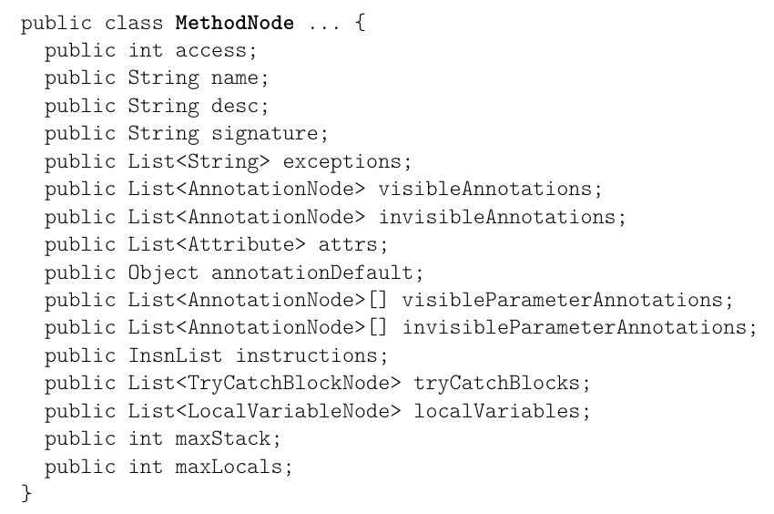

# 目录

目录：[ASM4中文指南](2026/asm4-guide-zh/README.md)

# 7. 方法（Tree API）

本章说明如何使用 ASM 的 Tree API（树 API）生成和变换方法。本章首先单独介绍 Tree API，并给出若干说明性示例，然后介绍如何将其与 Core API（核心 API）组合使用。用于泛型和注解的 Tree API 将在下一章介绍。

## 7.1 接口与组件

### 7.1.1 展示

用于生成和变换方法的 ASM Tree API 基于 `MethodNode` 类（见图 7.1）。

```java
public class MethodNode ... {
    public int access;
    public String name;
    public String desc;
    public String signature;
    public List<String> exceptions;
    public List<AnnotationNode> visibleAnnotations;
    public List<AnnotationNode> invisibleAnnotations;
    public List<Attribute> attrs;
    public Object annotationDefault;
    public List<AnnotationNode>[] visibleParameterAnnotations;
    public List<AnnotationNode>[] invisibleParameterAnnotations;
    public InsnList instructions;
    public List<TryCatchBlockNode> tryCatchBlocks;
    public List<LocalVariableNode> localVariables;
    public int maxStack;
    public int maxLocals;
}
```

**图 7.1：`MethodNode` 类（仅显示字段）**



该类的大部分字段与 `ClassNode` 中对应的字段类似。最重要的字段是最后几个，从 `instructions` 字段开始。该字段是一个指令列表，由一个 `InsnList` 对象管理，其公开 API 如下：

```java
public class InsnList { // 省略了公开的访问器
    int size();
    AbstractInsnNode getFirst();
    AbstractInsnNode getLast();
    AbstractInsnNode get(int index);
    boolean contains(AbstractInsnNode insn);
    int indexOf(AbstractInsnNode insn);
    void accept(MethodVisitor mv);
    ListIterator iterator();
    ListIterator iterator(int index);
    AbstractInsnNode[] toArray();
    void set(AbstractInsnNode location, AbstractInsnNode insn);
    void add(AbstractInsnNode insn);
    void add(InsnList insns);
    void insert(AbstractInsnNode insn);
    void insert(InsnList insns);
    void insert(AbstractInsnNode location, AbstractInsnNode insn);
    void insert(AbstractInsnNode location, InsnList insns);
    void insertBefore(AbstractInsnNode location, AbstractInsnNode insn);
    void insertBefore(AbstractInsnNode location, InsnList insns);
    void remove(AbstractInsnNode insn);
    void clear();
}
```

`InsnList` 是指令的双向链表，其链接存储在 `AbstractInsnNode` 对象自身中。这一点极其重要，因为它对指令对象和指令列表的使用方式有许多影响：

- 一个 `AbstractInsnNode` 对象在一个指令列表中不能出现多次。
- 一个 `AbstractInsnNode` 对象不能同时属于多个指令列表。
- 因此，把一个 `AbstractInsnNode` 添加到某个列表时，必须先把它从原先所属的列表中移除（如果有的话）。
- 另一个结果是，把一个列表的所有元素添加到另一个列表会清空第一个列表。

`AbstractInsnNode` 类是表示字节码指令的那些类的超类。其公开 API 如下：

```java
public abstract class AbstractInsnNode {
    public int getOpcode();
    public int getType();
    public AbstractInsnNode getPrevious();
    public AbstractInsnNode getNext();
    public void accept(MethodVisitor cv);
    public AbstractInsnNode clone(Map labels);
}
```

它的子类是与 `MethodVisitor` 接口的 `visitXxxInsn` 方法相对应的 `XxxInsnNode` 类，它们都以相同的方式构建。例如，`VarInsnNode` 类对应于 `visitVarInsn` 方法，其结构如下：

```java
public class VarInsnNode extends AbstractInsnNode {
    public int var;
    public VarInsnNode(int opcode, int var) {
        super(opcode);
        this.var = var;
    }
    ...
}
```

标签和帧以及行号虽然不是指令，但也由 `AbstractInsnNode` 类的子类表示，即 `LabelNode`、`FrameNode` 和 `LineNumberNode` 类。这使得它们可以像在 Core API 中那样被插入到列表中相应真实指令之前（在 Core API 中，标签和帧正好在其对应的指令之前被访问）。因此，借助 `AbstractInsnNode` 类提供的 `getNext` 方法，很容易找到跳转指令的目标：它就是目标标签之后的第一个真实指令 `AbstractInsnNode`。另一个结果是，与 Core API 一样，只要标签保持不变，删除一条指令并不会破坏跳转指令。

> 笔记：这一节藏着全章两个关键约定。第一，`InsnList` 是**双向链表**，链接关系存在节点自身——同一节点不能同时属于两个列表，`add` 进新列表时会自动离开旧列表，动手前先想清楚。第二，`LabelNode`、`FrameNode`、`LineNumberNode` 的"操作码"是**负数**，真实指令 ≥ 0——后面会反复靠 `getOpcode() < 0` 跳过这些非指令节点，找到"标签后的第一条真实指令"。这正是 Tree API 做全局变换比 Core API 轻松的根本原因：整棵指令树都在手里。

### 7.1.2 生成方法

用 Tree API 生成一个方法，就是创建一个 `MethodNode` 并初始化其字段。最有趣的部分是方法代码的生成。例如，3.1.5 节中的 `checkAndSetF` 方法可以按如下方式生成：

```java
MethodNode mn = new MethodNode(...);
InsnList il = mn.instructions;
il.add(new VarInsnNode(ILOAD, 1));
LabelNode label = new LabelNode();
il.add(new JumpInsnNode(IFLT, label));
il.add(new VarInsnNode(ALOAD, 0));
il.add(new VarInsnNode(ILOAD, 1));
il.add(new FieldInsnNode(PUTFIELD, "pkg/Bean", "f", "I"));
LabelNode end = new LabelNode();
il.add(new JumpInsnNode(GOTO, end));
il.add(label);
il.add(new FrameNode(F_SAME, 0, null, 0, null));
il.add(new TypeInsnNode(NEW, "java/lang/IllegalArgumentException"));
il.add(new InsnNode(DUP));
il.add(new MethodInsnNode(INVOKESPECIAL,
    "java/lang/IllegalArgumentException", "<init>", "()V"));
il.add(new InsnNode(ATHROW));
il.add(end);
il.add(new FrameNode(F_SAME, 0, null, 0, null));
il.add(new InsnNode(RETURN));
mn.maxStack = 2;
mn.maxLocals = 2;
```

与类的情况一样，使用 Tree API 生成方法比使用 Core API 更耗时、更耗内存。但它使得可以按任意顺序生成方法的内容。特别是指令可以按不同于顺序次序的次序生成，这在某些情况下可能很有用。

例如，考虑一个表达式编译器。通常，表达式 `e1 + e2` 的编译方式是：先为 `e1` 生成代码，再为 `e2` 生成代码，然后生成把两个值相加的代码。但如果 `e1` 和 `e2` 不是同一种基本类型，就必须在 `e1` 的代码之后插入一次强制转换，并在 `e2` 的代码之后再插入一次强制转换。然而，需要生成的确切强制转换取决于 `e1` 和 `e2` 的类型。

现在，如果表达式的类型由生成编译后代码的方法返回，那么在使用 Core API 时就会遇到问题：必须在 `e1` 之后插入的强制转换，只有在 `e2` 编译完成之后才能知道，但那时已经太晚了，因为我们无法在先前已访问的指令之间插入指令[^1]。使用 Tree API 则不存在这个问题。例如，一种可行的做法是使用如下 `compile` 方法：

```java
public Type compile(InsnList output) {
    InsnList il1 = new InsnList();
    InsnList il2 = new InsnList();
    Type t1 = e1.compile(il1);
    Type t2 = e2.compile(il2);
    Type t = ...; // 计算 t1 和 t2 的公共超类型
    output.addAll(il1); // 在常数时间内完成
    output.add(...); // 从 t1 到 t 的强制转换指令
    output.addAll(il2); // 在常数时间内完成
    output.add(...); // 从 t2 到 t 的强制转换指令
    output.add(new InsnNode(t.getOpcode(IADD)));
    return t;
}
```

> 笔记：Tree API 生成方法"更耗时"，却换来**指令可按任意顺序生成**。表达式编译器就是例子：`e1 + e2` 的强制转换要等两边类型都算出来才知道，Core API 事件流发出去就收不回来，只能分两趟编译（脚注 ^1）；Tree API 先把子表达式各自编译进临时 `InsnList`，类型齐了再把强制转换插进中间。由此得出经验：**凡是要"回头补指令"的场景，优先选 Tree API**。文末「附加」的 checkAndSetF 字节码生成完整代码演示了逐条构造 `MethodNode` 的完整流程。

### 7.1.3 变换方法

用 Tree API 变换一个方法，只是修改一个 `MethodNode` 对象的字段，特别是指令列表。虽然该列表可以按任意方式修改，但一种常见模式是在遍历它的同时修改它。事实上，与通用的 `ListIterator` 契约不同，`InsnList` 返回的 `ListIterator` 支持许多并发[^2]的列表修改。实际上，你可以使用 `InsnList` 的方法删除当前元素之前（含当前元素）的一个或多个元素，删除下一个元素之后（即不只是紧跟在当前元素之后，而是紧跟在其后继之后）的一个或多个元素，或者在当前元素之前或其后继之后插入一个或多个元素。这些修改会反映到迭代器中，即插入（相应地删除）到下一个元素之后的元素在迭代器中会被看到（相应地不会被看到）。

另一种常见模式是：当需要在一个列表中的指令 `i` 之后插入若干条指令时，把这些新指令添加到一个临时指令列表中，然后一次性把该临时列表插入主列表：

```java
InsnList il = new InsnList();
il.add(...);
...
il.add(...);
mn.instructions.insert(i, il);
```

逐条插入指令也是可以的，但更麻烦，因为每次插入之后都必须更新插入点。

### 7.1.4 无状态变换与有状态变换

我们举几个例子来具体看看如何用 Tree API 变换方法。为了看清 Core API 与 Tree API 之间的差异，重新实现 3.2.4 节的 `AddTimerAdapter` 示例和 3.2.5 节的 `RemoveGetFieldPutFieldAdapter` 是很有意思的。计时器示例可以实现如下：

```java
public class AddTimerTransformer extends ClassTransformer {
    public AddTimerTransformer(ClassTransformer ct) {
        super(ct);
    }
    @Override public void transform(ClassNode cn) {
        for (MethodNode mn : (List<MethodNode>) cn.methods) {
            if ("<init>".equals(mn.name) || "<clinit>".equals(mn.name)) {
                continue;
            }
            InsnList insns = mn.instructions;
            if (insns.size() == 0) {
                continue;
            }
            Iterator<AbstractInsnNode> j = insns.iterator();
            while (j.hasNext()) {
                AbstractInsnNode in = j.next();
                int op = in.getOpcode();
                if ((op >= IRETURN && op <= RETURN) || op == ATHROW) {
                    InsnList il = new InsnList();
                    il.add(new FieldInsnNode(GETSTATIC, cn.name, "timer", "J"));
                    il.add(new MethodInsnNode(INVOKESTATIC, "java/lang/System",
                        "currentTimeMillis", "()J"));
                    il.add(new InsnNode(LADD));
                    il.add(new FieldInsnNode(PUTSTATIC, cn.name, "timer", "J"));
                    insns.insert(in.getPrevious(), il);
                }
            }
            InsnList il = new InsnList();
            il.add(new FieldInsnNode(GETSTATIC, cn.name, "timer", "J"));
            il.add(new MethodInsnNode(INVOKESTATIC, "java/lang/System",
                "currentTimeMillis", "()J"));
            il.add(new InsnNode(LSUB));
            il.add(new FieldInsnNode(PUTSTATIC, cn.name, "timer", "J"));
            insns.insert(il);
            mn.maxStack += 4;
        }
        int acc = ACC_PUBLIC + ACC_STATIC;
        cn.fields.add(new FieldNode(acc, "timer", "J", null, null));
        super.transform(cn);
    }
}
```

你可以在这里看到上一节讨论的、用于在指令列表中插入若干条指令的模式，即使用一个临时指令列表。这个例子还表明，在遍历指令列表的同时，可以在当前指令之前插入指令。注意，实现这个适配器所需的代码量在 Core API 和 Tree API 中大致相同。

> 笔记：读 AddTimerTransformer 时先看**方法开头**插桩，再看 **return 前**插桩：都用"先攒进临时 `InsnList`、再一次 `insert`"的模式（7.1.3 刚讲过）。注意 return 前插入要先取 `in.getPrevious()` 再 `insert`——拿 `in` 本身当参照物，计时代码会插到 `RETURN` 之后，永远不会执行。另外要跳过 `<init>`/`<clinit>`；栈尺寸可按书上 `maxStack += 4` 手工调，也可输出时用 `COMPUTE_FRAMES` 代劳。可运行版本（改用 `System.nanoTime`，含打印方法名的 `LDC` 包装）见「附加」的 AddTimerTransformer 完整代码。

删除字段自赋值的方法适配器（见 3.2.5 节）可以实现如下（假设 `MethodTransformer` 与上一章的 `ClassTransformer` 类类似）：

```java
public class RemoveGetFieldPutFieldTransformer extends
    MethodTransformer {
    public RemoveGetFieldPutFieldTransformer(MethodTransformer mt) {
        super(mt);
    }
    @Override public void transform(MethodNode mn) {
        InsnList insns = mn.instructions;
        Iterator<AbstractInsnNode> i = insns.iterator();
        while (i.hasNext()) {
            AbstractInsnNode i1 = i.next();
            if (isALOAD0(i1)) {
                AbstractInsnNode i2 = getNext(i1);
                if (i2 != null && isALOAD0(i2)) {
                    AbstractInsnNode i3 = getNext(i2);
                    if (i3 != null && i3.getOpcode() == GETFIELD) {
                        AbstractInsnNode i4 = getNext(i3);
                        if (i4 != null && i4.getOpcode() == PUTFIELD) {
                            if (sameField(i3, i4)) {
                                while (i.next() != i4) {
                                }
                                insns.remove(i1);
                                insns.remove(i2);
                                insns.remove(i3);
                                insns.remove(i4);
                            }
                        }
                    }
                }
            }
        }
        super.transform(mn);
    }
    private static AbstractInsnNode getNext(AbstractInsnNode insn) {
        do {
            insn = insn.getNext();
            if (insn != null && !(insn instanceof LineNumberNode)) {
                break;
            }
        } while (insn != null);
        return insn;
    }
    private static boolean isALOAD0(AbstractInsnNode i) {
        return i.getOpcode() == ALOAD && ((VarInsnNode) i).var == 0;
    }
    private static boolean sameField(AbstractInsnNode i,
        AbstractInsnNode j) {
        return ((FieldInsnNode) i).name.equals(((FieldInsnNode) j).name);
    }
}
```

这里同样可以看到，在遍历指令列表的同时可以删除其中的指令。但请注意 `while (i.next() != i4)` 循环：这是必要的，以便把迭代器定位到必须删除的那些指令之后（因为无法删除紧跟在当前元素之后的指令）。基于访问者和基于树这两种实现都能检测出待检测序列中间的标签和帧，并在这种情况下不删除它们。但要忽略序列内部的行号，基于树 API 的实现（见 `getNext` 方法）比 Core API 需要更多代码。不过，这两种实现的主要区别在于，使用 Tree API 不需要状态机。特别地，连续三条或更多条 `ALOAD 0` 指令这一容易被忽略的特殊情况不再成为问题。

使用上述实现时，某条给定指令可能会被检查多次，因为在 `while` 循环的每一步中，将在后续迭代中被检查的 `i2`、`i3` 和 `i4` 也可能在本次迭代中被检查。事实上可以使用一种更高效的实现，其中每条指令至多被检查一次：

```java
public class RemoveGetFieldPutFieldTransformer2 extends
    MethodTransformer {
    ...
    @Override public void transform(MethodNode mn) {
        InsnList insns = mn.instructions;
        Iterator i = insns.iterator();
        while (i.hasNext()) {
            AbstractInsnNode i1 = (AbstractInsnNode) i.next();
            if (isALOAD0(i1)) {
                AbstractInsnNode i2 = getNext(i);
                if (i2 != null && isALOAD0(i2)) {
                    AbstractInsnNode i3 = getNext(i);
                    while (i3 != null && isALOAD0(i3)) {
                        i1 = i2;
                        i2 = i3;
                        i3 = getNext(i);
                    }
                    if (i3 != null && i3.getOpcode() == GETFIELD) {
                        AbstractInsnNode i4 = getNext(i);
                        if (i4 != null && i4.getOpcode() == PUTFIELD) {
                            if (sameField(i3, i4)) {
                                insns.remove(i1);
                                insns.remove(i2);
                                insns.remove(i3);
                                insns.remove(i4);
                            }
                        }
                    }
                }
            }
        }
        super.transform(mn);
    }

    private static AbstractInsnNode getNext(Iterator i) {
        while (i.hasNext()) {
            AbstractInsnNode in = (AbstractInsnNode) i.next();
            if (!(in instanceof LineNumberNode)) {
                return in;
            }
        }
        return null;
    }
    ...
}
```

与前一实现的不同之处在于 `getNext` 方法，它现在作用于列表迭代器。当序列被识别出来时，迭代器正好位于该序列之后，因此不再需要 `while (i.next() != i4)` 循环。但这里又出现了三条或更多连续 `ALOAD 0` 指令这种特殊情况（参见 `while (i3 != null)` 循环）。

> 笔记：两版 `RemoveGetFieldPutFieldTransformer` 对照读，重点看**迭代器定位**。第一版靠 `while (i.next() != i4)` 把迭代器推进到序列之后——`InsnList` 的迭代器不允许删除紧随其后的指令；代价是 `i2`、`i3`、`i4` 被重复检查。第二版 `getNext` 改接收迭代器，识别完序列时迭代器正好停在序列末尾，while 循环消失；再用 `while (i3 != null && isALOAD0(i3))` 处理三条以上连续 `ALOAD 0`——Core API 状态机版最容易漏掉的坑。验证见「附加」的 RemoveGetFieldPutFieldTransformer 完整代码（含改静态字段访问的第三版）。

### 7.1.5 全局变换

到目前为止我们看到的所有方法变换都是局部的，即使是有状态的变换也是如此，其含义是：对指令 i 的变换只依赖于与 i 距离固定的那些指令。然而还存在全局变换，在这种变换中，对指令 i 的变换可能依赖于与 i 距离任意的指令。对于这些变换，Tree API（树 API）确实很有帮助，也就是说，用 Core API（核心 API）来实现它们会非常复杂。

一个例子是这样一个变换：它把跳到 `GOTO` 标签指令的跳转替换为跳到 `label l` 的跳转，并把指向 `RETURN` 指令的 `GOTO` 替换为这条 `RETURN` 指令。确实，跳转指令的目标可以位于这条指令之前或之后的任意距离处。这样的变换可以实现如下：

```java
public class OptimizeJumpTransformer extends MethodTransformer {
    public OptimizeJumpTransformer(MethodTransformer mt) {
        super(mt);
    }

    @Override public void transform(MethodNode mn) {
        InsnList insns = mn.instructions;
        Iterator<AbstractInsnNode> i = insns.iterator();
        while (i.hasNext()) {
            AbstractInsnNode in = i.next();
            if (in instanceof JumpInsnNode) {
                LabelNode label = ((JumpInsnNode) in).label;
                AbstractInsnNode target;
                // 当 target == goto l 时，用 l 替换 label
                while (true) {
                    target = label;
                    while (target != null && target.getOpcode() < 0) {
                        target = target.getNext();
                    }
                    if (target != null && target.getOpcode() == GOTO) {
                        label = ((JumpInsnNode) target).label;
                    } else {
                        break;
                    }
                }
                // 更新目标
                ((JumpInsnNode) in).label = label;
                // 如果可能，用目标指令替换跳转
                if (in.getOpcode() == GOTO && target != null) {
                    int op = target.getOpcode();
                    if ((op >= IRETURN && op <= RETURN) || op == ATHROW) {
                        // 用 'target' 的副本替换 'in'
                        insns.set(in, target.clone(null));
                    }
                }
            }
        }
        super.transform(mn);
    }
}
```

这段代码的工作方式如下：当找到一条跳转指令 `in` 时，把它的目标存放在 `label` 中。然后用最内层的 `while` 循环查找紧跟在 `label` 之后的那条指令（不表示真实指令的 `AbstractInsnNode` 对象，例如 `FrameNode` 或 `LabelNode`，其“操作码”为负数）。只要这条指令是 `GOTO`，就用这条指令的目标替换 `label`，并重复上述步骤。最后，把 `in` 的目标标签替换为更新后的 `label` 值；并且如果 `in` 本身是一条 `GOTO`，而它更新后的目标是一条 `RETURN` 指令，就用这条返回指令的副本替换 `in`（回想一下，一个指令对象在指令列表中不能出现多次）。

这一变换对 3.1.5 节中定义的 `checkAndSetF` 方法的效果如下所示：

```text
// 变换前                     // 变换后
  ILOAD 1                     ILOAD 1
  IFLT label                  IFLT label
  ALOAD 0                     ALOAD 0
  ILOAD 1                     ILOAD 1
  PUTFIELD ...                PUTFIELD ...
  GOTO end                    RETURN
label:                      label:
F_SAME                      F_SAME
  NEW ...                     NEW ...
  DUP                         DUP
  INVOKESPECIAL ...           INVOKESPECIAL ...
  ATHROW                      ATHROW
end:                        end:
F_SAME                      F_SAME
  RETURN                      RETURN
```

注意，尽管这一变换改变了跳转指令（更正式地说，改变了控制流图），但它不需要更新方法的帧。确实，执行帧的状态在每条指令处都保持不变，而且由于没有引入新的跳转目标，也就没有新的帧必须被访问。不过，有可能某个帧不再需要了。例如在上面的例子中，变换之后 `end` 标签不再被使用，其后的 `F_SAME` 帧以及 `RETURN` 指令也不再被使用。所幸的是，访问比严格需要的更多的帧是完全合法的，在方法中包含未被使用的代码——称为死代码或不可达代码——也完全合法。因此，上面的方法适配器是正确的，尽管它可以改进以删除死代码和帧。

> 笔记：这个跳转优化是"全局变换"的典型。先看内层循环：用 `getOpcode() < 0` 跳过标签、帧、行号，找"标签后第一条真实指令"；外层循环沿 **GOTO → GOTO → …** 追到非 GOTO 为止。替换时若 `in` 是 `GOTO` 且终点是 `RETURN`/`ATHROW`，用 `target.clone(null)` 替换——原对象不能搬，一个节点不能同时属于两个列表。再看帧：折叠不引入新的跳转目标，帧状态不变，**所以不需要更新帧**，顶多留下合法死代码。附加程序补了死代码清理，可直接运行（见「附加」的 OptimizeJumpTransformer 完整代码）。

## 7.2 组件组合

到目前为止，我们只看到了如何创建和变换 `MethodNode` 对象，但还没有看到它与类的字节数组表示之间的联系。与类的情况一样，这种联系是通过组合 Core API（核心 API）和 Tree API（树 API）组件来实现的，本节将对此进行说明。

### 7.2.1 展示

除了图 7.1 中所示的字段之外，`MethodNode` 类还继承自 `MethodVisitor` 类，并且提供了两个 `accept` 方法，它们分别以 `MethodVisitor` 或 `ClassVisitor` 作为参数。`accept` 方法根据 `MethodNode` 的字段值生成事件，而 `MethodVisitor` 的方法则执行相反的操作，即根据收到的事件设置 `MethodNode` 的字段。

### 7.2.2 模式

与类的情况一样，可以把基于树的方法变换器当作 Core API 的方法适配器来使用。可以用于类的两种模式对方法同样有效，而且工作方式完全相同。基于继承的模式如下：

```java
public class MyMethodAdapter extends MethodNode {
    public MyMethodAdapter(int access, String name, String desc,
        String signature, String[] exceptions, MethodVisitor mv) {
        super(ASM4, access, name, desc, signature, exceptions);
        this.mv = mv;
    }

    @Override public void visitEnd() {
        // 在此处放入你的变换代码
        accept(mv);
    }
}
```

而基于委托的模式是：

```java
public class MyMethodAdapter extends MethodVisitor {
    MethodVisitor next;

    public MyMethodAdapter(int access, String name, String desc,
        String signature, String[] exceptions, MethodVisitor mv) {
        super(ASM4,
            new MethodNode(access, name, desc, signature, exceptions));
        next = mv;
    }

    @Override public void visitEnd() {
        MethodNode mn = (MethodNode) mv;
        // 在此处放入你的变换代码
        mn.accept(next);
    }
}
```

第一种模式的一个变体是：直接在 `ClassAdapter` 的 `visitMethod` 中使用匿名内部类：

```java
public MethodVisitor visitMethod(int access, String name,
    String desc, String signature, String[] exceptions) {
    return new MethodNode(ASM4, access, name, desc, signature, exceptions) {
        @Override public void visitEnd() {
            // 在此处放入你的变换代码
            accept(cv);
        }
    };
}
```

这些模式表明，可以只对方法使用 Tree API（树 API），而对类使用 Core API（核心 API）。实践中经常使用这一策略。

> 笔记：收尾课——**Core 与 Tree 在同一条管道里无缝衔接**。两种 `MyMethodAdapter` 模式殊途同归：继承版让 `MethodNode` 自己当 `MethodVisitor`，事件直接"录"进树里，`visitEnd()` 变换完再 `accept(mv)` 回放给下游；委托版把 `MethodNode` 藏在父类里，`(MethodNode) mv` 取回，并自己记住下游 `next`。一句话：**读类时 Core 事件进树，写类时 Tree 事件出树**。匿名内部类只是把继承版写进 `visitMethod` 的返回表达式。三种写法跑同一变换并验证的完整程序见「附加」的 MyMethodAdapter 完整代码。

[^1]: 解决办法是分两趟编译表达式：一趟计算表达式类型以及必须插入的强制转换，另一趟生成编译后的代码。

[^2]: 即与 `Iterator.next` 的调用交错进行的修改。当然，不支持多线程的并发修改。

## 附加

下面把本章最重要的示例补成完整、可编译、可运行的程序。每个小节都是一个独立的 Java 程序：完整 import、public 类、main 方法、自己的 `ClassLoader`（`defineClass`），并且尽量保留原文用 `Opcodes.ASM4` 的写法。用 JDK 17 和 ASM 9.7.1 全套 jar 编译运行：

```bash
javac -cp "/path/to/asm-libs/*" XxxDemo.java
java  -cp "/path/to/asm-libs/*:." XxxDemo
```

### checkAndSetF 字节码生成完整代码

对应 7.1.2 节：逐条用 `InsnNode` 子类构造 `MethodNode` 的指令列表（含 `LabelNode`/`FrameNode`/手工 `maxStack`、`maxLocals`），再用 `ClassNode.accept` 接上 `TraceClassVisitor → CheckClassAdapter → ClassWriter`，最后 `defineClass` 加载并反射验证。

```java
import org.objectweb.asm.ClassWriter;
import org.objectweb.asm.FieldVisitor;
import org.objectweb.asm.MethodVisitor;
import org.objectweb.asm.Opcodes;
import org.objectweb.asm.tree.ClassNode;
import org.objectweb.asm.tree.FieldInsnNode;
import org.objectweb.asm.tree.FieldNode;
import org.objectweb.asm.tree.FrameNode;
import org.objectweb.asm.tree.InsnList;
import org.objectweb.asm.tree.InsnNode;
import org.objectweb.asm.tree.JumpInsnNode;
import org.objectweb.asm.tree.LabelNode;
import org.objectweb.asm.tree.MethodInsnNode;
import org.objectweb.asm.tree.MethodNode;
import org.objectweb.asm.tree.TypeInsnNode;
import org.objectweb.asm.tree.VarInsnNode;
import org.objectweb.asm.util.CheckClassAdapter;
import org.objectweb.asm.util.TraceClassVisitor;

import java.io.PrintWriter;
import java.lang.reflect.Field;
import java.lang.reflect.InvocationTargetException;
import java.lang.reflect.Method;

/**
 * 完整程序 1：7.1.2 节「使用 Tree API 生成方法」——生成带 checkAndSetF 方法的 pkg/Bean。
 *
 * 流程：
 *   1. 用 ClassNode 表示整个类（字段 f + 构造器 + checkAndSetF(int)）；
 *   2. checkAndSetF 的方法体逐条用 InsnNode 子类构造（照抄原文 7.1.2 的 InsnList 代码），
 *      LabelNode / FrameNode 也手工加入指令列表，并按书上的写法手工填 maxStack / maxLocals；
 *   3. ClassNode -> TraceClassVisitor(打印) -> CheckClassAdapter(校验) -> ClassWriter(出字节码)；
 *   4. 自定义 ClassLoader defineClass 加载，反射调用验证行为：
 *      - checkAndSetF(3)  应该把 f 设为 3；
 *      - checkAndSetF(-1) 应该抛出 IllegalArgumentException。
 *
 * 备份方案说明：如果 JVM 校验器嫌手工 frames/maxs 太严格，可以把最后的
 * ClassWriter 换成 new ClassWriter(ClassWriter.COMPUTE_MAXS + ClassWriter.COMPUTE_FRAMES)，
 * 让 ASM 自动计算栈尺寸与帧——书里的手写值（maxStack=2、maxLocals=2）本就是正确的。
 */
public class CheckAndSetFGenDemo {

    // 原文 2.2.3 节里最小号的 ClassLoader：直接 defineClass
    static class MyClassLoader extends ClassLoader {
        Class<?> defineClass(String name, byte[] b) {
            return defineClass(name, b, 0, b.length);
        }
    }

    static byte[] createBean() {
        ClassNode cn = new ClassNode(Opcodes.ASM4);
        cn.version = Opcodes.V1_7;
        cn.access = Opcodes.ACC_PUBLIC;
        cn.name = "pkg/Bean";
        cn.superName = "java/lang/Object";

        // 字段：private int f;
        cn.fields.add(new FieldNode(Opcodes.ACC_PRIVATE, "f", "I", null, null));

        // 构造器：public Bean() { super(); }
        MethodNode init = new MethodNode(Opcodes.ASM4, Opcodes.ACC_PUBLIC,
                "<init>", "()V", null, null);
        InsnList ii = init.instructions;
        ii.add(new VarInsnNode(Opcodes.ALOAD, 0));
        ii.add(new MethodInsnNode(Opcodes.INVOKESPECIAL,
                "java/lang/Object", "<init>", "()V", false));
        ii.add(new InsnNode(Opcodes.RETURN));
        init.maxStack = 1;
        init.maxLocals = 1;
        cn.methods.add(init);

        // checkAndSetF(int)：逐条照抄原文 7.1.2 节的 InsnList 构造
        MethodNode mn = new MethodNode(Opcodes.ASM4, Opcodes.ACC_PUBLIC,
                "checkAndSetF", "(I)V", null, null);
        InsnList il = mn.instructions;
        il.add(new VarInsnNode(Opcodes.ILOAD, 1));
        LabelNode label = new LabelNode();
        il.add(new JumpInsnNode(Opcodes.IFLT, label));
        il.add(new VarInsnNode(Opcodes.ALOAD, 0));
        il.add(new VarInsnNode(Opcodes.ILOAD, 1));
        il.add(new FieldInsnNode(Opcodes.PUTFIELD, "pkg/Bean", "f", "I"));
        LabelNode end = new LabelNode();
        il.add(new JumpInsnNode(Opcodes.GOTO, end));
        il.add(label);
        il.add(new FrameNode(Opcodes.F_SAME, 0, null, 0, null));
        il.add(new TypeInsnNode(Opcodes.NEW, "java/lang/IllegalArgumentException"));
        il.add(new InsnNode(Opcodes.DUP));
        il.add(new MethodInsnNode(Opcodes.INVOKESPECIAL,
                "java/lang/IllegalArgumentException", "<init>", "()V", false));
        il.add(new InsnNode(Opcodes.ATHROW));
        il.add(end);
        il.add(new FrameNode(Opcodes.F_SAME, 0, null, 0, null));
        il.add(new InsnNode(Opcodes.RETURN));
        mn.maxStack = 2;
        mn.maxLocals = 2;
        cn.methods.add(mn);

        // 写出：Trace -> Check -> Writer 三层包装
        ClassWriter cw = new ClassWriter(0);
        cn.accept(new TraceClassVisitor(
                new CheckClassAdapter(cw), new PrintWriter(System.out, true)));
        return cw.toByteArray();
    }

    public static void main(String[] args) throws Exception {
        System.out.println("== TraceClassVisitor 打印生成的 pkg/Bean ==");
        byte[] b = createBean();
        System.out.println("== 字节码长度: " + b.length);

        MyClassLoader cl = new MyClassLoader();
        Class<?> beanClass = cl.defineClass("pkg.Bean", b);

        Object bean = beanClass.getConstructor().newInstance();
        Method m = beanClass.getMethod("checkAndSetF", int.class);

        // 1) 正数：直接设置字段
        m.invoke(bean, 3);
        Field f = beanClass.getDeclaredField("f");
        f.setAccessible(true);
        System.out.println("checkAndSetF(3) 之后 f = " + f.getInt(bean));

        // 2) 负数：抛 IllegalArgumentException
        try {
            m.invoke(bean, -1);
            System.out.println("错误：-1 竟然没有抛异常！");
        } catch (InvocationTargetException e) {
            System.out.println("checkAndSetF(-1) 抛出: "
                    + e.getCause().getClass().getSimpleName());
        }
    }
}
```

实际运行输出（节选）：

```text
== TraceClassVisitor 打印生成的 pkg/Bean ==
...
  public checkAndSetF(I)V
    ILOAD 1
    IFLT L0
    ALOAD 0
    ILOAD 1
    PUTFIELD pkg/Bean.f : I
    GOTO L1
   L0
   FRAME SAME
    NEW java/lang/IllegalArgumentException
    DUP
    INVOKESPECIAL java/lang/IllegalArgumentException.<init> ()V
    ATHROW
   L1
   FRAME SAME
    RETURN
    MAXSTACK = 2
    MAXLOCALS = 2
...
== 字节码长度: 289
checkAndSetF(3) 之后 f = 3
checkAndSetF(-1) 抛出: IllegalArgumentException
```

### AddTimerTransformer 完整代码

对应 7.1.4 节：在方法开头插 `timer -= nanoTime()`，在每条 `RETURN`/`ATHROW` 之前插 `timer += nanoTime()` 并打印方法名与累计纳秒。注意三点：打印方法名的 `LDC` 指令要把方法名包装成 `String`；return 前插入必须取 `in.getPrevious()` 作为插入点；带方法体的 `<init>`、`<clinit>` 要跳过。测试类用 Core API 现写，输出时用 `COMPUTE_FRAMES` 省去手工维护 `maxStack`。

```java
import org.objectweb.asm.ClassReader;
import org.objectweb.asm.ClassWriter;
import org.objectweb.asm.MethodVisitor;
import org.objectweb.asm.Opcodes;
import org.objectweb.asm.tree.AbstractInsnNode;
import org.objectweb.asm.tree.ClassNode;
import org.objectweb.asm.tree.FieldInsnNode;
import org.objectweb.asm.tree.FieldNode;
import org.objectweb.asm.tree.InsnList;
import org.objectweb.asm.tree.InsnNode;
import org.objectweb.asm.tree.LdcInsnNode;
import org.objectweb.asm.tree.MethodInsnNode;
import org.objectweb.asm.tree.MethodNode;
import org.objectweb.asm.util.TraceClassVisitor;

import java.io.PrintWriter;
import java.lang.reflect.Field;
import java.lang.reflect.Method;
import java.util.Iterator;
import java.util.List;

/**
 * 完整程序 2：7.1.4 节 AddTimerTransformer——给每个方法的开头和 return 前插入 nanoTime 计时。
 *
 * 与书上 Tree 版一样（用 ClassNode 一级的 ClassTransformer），并做了两处补全方便观察：
 *   - 计时用 System.nanoTime()（书里用 currentTimeMillis，思路完全一样）；
 *   - return 之前额外打印「方法名 + 累计纳秒」——注意打印方法名的 LDC 指令，
 *     常量必须是一个 String（把方法名字符串包装成 LdcInsnNode）。
 *
 * 插桩点：
 *   - 方法开头：insns.insert(il) 把「timer -= nanoTime()」塞到列表头；
 *   - 每个 RETURN/ATHROW 之前：insns.insert(in.getPrevious(), il) 塞「timer += nanoTime()」。
 *
 * 栈尺寸说明：书上用 mn.maxStack += 4 手工调整；本程序输出时用
 * ClassWriter(COMPUTE_FRAMES)（隐含 COMPUTE_MAXS）自动计算，省去手工维护，结果等价。
 */
public class AddTimerTransformerDemo {

    static class MyClassLoader extends ClassLoader {
        Class<?> defineClass(String name, byte[] b) {
            return defineClass(name, b, 0, b.length);
        }
    }

    /** 与原文 ClassTransformer 类似的基类，支持链式串联 */
    public static class ClassTransformer {
        protected ClassTransformer ct;
        public ClassTransformer(ClassTransformer ct) { this.ct = ct; }
        public void transform(ClassNode cn) { if (ct != null) ct.transform(cn); }
    }

    /** 原文 7.1.4 的 Tree 版 AddTimerTransformer */
    public static class AddTimerTransformer extends ClassTransformer {
        public AddTimerTransformer(ClassTransformer ct) { super(ct); }

        @Override
        public void transform(ClassNode cn) {
            for (MethodNode mn : (List<MethodNode>) cn.methods) {
                if ("<init>".equals(mn.name) || "<clinit>".equals(mn.name)) {
                    continue;
                }
                InsnList insns = mn.instructions;
                if (insns.size() == 0) {
                    continue;   // 抽象方法等方法体为空，跳过
                }
                // 每个 RETURN/ATHROW 之前：timer += nanoTime()，随后打印方法名和累计时间
                Iterator<AbstractInsnNode> j = insns.iterator();
                while (j.hasNext()) {
                    AbstractInsnNode in = j.next();
                    int op = in.getOpcode();
                    if ((op >= Opcodes.IRETURN && op <= Opcodes.RETURN)
                            || op == Opcodes.ATHROW) {
                        InsnList il = new InsnList();
                        il.add(new FieldInsnNode(Opcodes.GETSTATIC, cn.name, "timer", "J"));
                        il.add(new MethodInsnNode(Opcodes.INVOKESTATIC,
                                "java/lang/System", "nanoTime", "()J", false));
                        il.add(new InsnNode(Opcodes.LADD));
                        il.add(new FieldInsnNode(Opcodes.PUTSTATIC, cn.name, "timer", "J"));
                        // 打印方法名：LDC 的常量必须把方法名包装成 String
                        il.add(new FieldInsnNode(Opcodes.GETSTATIC, "java/lang/System",
                                "out", "Ljava/io/PrintStream;"));
                        il.add(new LdcInsnNode(mn.name));
                        il.add(new MethodInsnNode(Opcodes.INVOKEVIRTUAL,
                                "java/io/PrintStream", "println", "(Ljava/lang/String;)V", false));
                        // 打印累计纳秒数：System.out.println(timer)
                        il.add(new FieldInsnNode(Opcodes.GETSTATIC, "java/lang/System",
                                "out", "Ljava/io/PrintStream;"));
                        il.add(new FieldInsnNode(Opcodes.GETSTATIC, cn.name, "timer", "J"));
                        il.add(new MethodInsnNode(Opcodes.INVOKEVIRTUAL,
                                "java/io/PrintStream", "println", "(J)V", false));
                        // 关键：插在 return 指令【之前】，否则计时代码永远不会执行
                        insns.insert(in.getPrevious(), il);
                    }
                }
                // 方法开头：timer -= nanoTime()
                InsnList il = new InsnList();
                il.add(new FieldInsnNode(Opcodes.GETSTATIC, cn.name, "timer", "J"));
                il.add(new MethodInsnNode(Opcodes.INVOKESTATIC,
                        "java/lang/System", "nanoTime", "()J", false));
                il.add(new InsnNode(Opcodes.LSUB));
                il.add(new FieldInsnNode(Opcodes.PUTSTATIC, cn.name, "timer", "J"));
                insns.insert(il);   // insert 不带位置参数 = 插到列表头
            }
            // 添加 public static long timer 字段
            int acc = Opcodes.ACC_PUBLIC + Opcodes.ACC_STATIC;
            cn.fields.add(new FieldNode(acc, "timer", "J", null, null));
            super.transform(cn);
        }
    }

    /** 生成原始测试类 pkg/TimerDemo（Core API 现写一个即可） */
    static byte[] createTimerDemo() {
        ClassWriter cw = new ClassWriter(ClassWriter.COMPUTE_FRAMES);
        cw.visit(Opcodes.V1_7, Opcodes.ACC_PUBLIC, "pkg/TimerDemo",
                null, "java/lang/Object", null);
        MethodVisitor mv;
        // 默认构造器
        mv = cw.visitMethod(Opcodes.ACC_PUBLIC, "<init>", "()V", null, null);
        mv.visitCode();
        mv.visitVarInsn(Opcodes.ALOAD, 0);
        mv.visitMethodInsn(Opcodes.INVOKESPECIAL, "java/lang/Object", "<init>", "()V", false);
        mv.visitInsn(Opcodes.RETURN);
        mv.visitMaxs(0, 0);
        mv.visitEnd();
        // int add(int a, int b) { return a + b; }
        mv = cw.visitMethod(Opcodes.ACC_PUBLIC, "add", "(II)I", null, null);
        mv.visitCode();
        mv.visitVarInsn(Opcodes.ILOAD, 1);
        mv.visitVarInsn(Opcodes.ILOAD, 2);
        mv.visitInsn(Opcodes.IADD);
        mv.visitInsn(Opcodes.IRETURN);
        mv.visitMaxs(0, 0);
        mv.visitEnd();
        // int sub(int a, int b) { return a - b; }
        mv = cw.visitMethod(Opcodes.ACC_PUBLIC, "sub", "(II)I", null, null);
        mv.visitCode();
        mv.visitVarInsn(Opcodes.ILOAD, 1);
        mv.visitVarInsn(Opcodes.ILOAD, 2);
        mv.visitInsn(Opcodes.ISUB);
        mv.visitInsn(Opcodes.IRETURN);
        mv.visitMaxs(0, 0);
        mv.visitEnd();
        // void sleep(int ms) throws Exception { Thread.sleep(ms); }
        mv = cw.visitMethod(Opcodes.ACC_PUBLIC, "sleep", "(I)V", null,
                new String[]{"java/lang/Exception"});
        mv.visitCode();
        mv.visitVarInsn(Opcodes.ILOAD, 1);
        mv.visitInsn(Opcodes.I2L);
        mv.visitMethodInsn(Opcodes.INVOKESTATIC, "java/lang/Thread", "sleep", "(J)V", false);
        mv.visitInsn(Opcodes.RETURN);
        mv.visitMaxs(0, 0);
        mv.visitEnd();
        cw.visitEnd();
        return cw.toByteArray();
    }

    public static void main(String[] args) throws Exception {
        // 1. 原始类 -> ClassNode
        ClassReader cr = new ClassReader(createTimerDemo());
        ClassNode cn = new ClassNode(Opcodes.ASM4);
        cr.accept(cn, 0);

        // 2. 变换（链式基类最后一个传 null）
        new AddTimerTransformer(null).transform(cn);

        // 3. 打印变换后的 add 方法，观察插桩代码
        System.out.println("== 变换后 pkg/TimerDemo.add 的字节码（片段）==");
        ClassWriter cw = new ClassWriter(ClassWriter.COMPUTE_FRAMES);
        cn.accept(new TraceClassVisitor(cw, new PrintWriter(System.out, true)));

        // 4. 加载并运行变换后的类：每个方法会先打印方法名、再打印累计纳秒
        MyClassLoader cl = new MyClassLoader();
        Class<?> timerDemo = cl.defineClass("pkg.TimerDemo", cw.toByteArray());
        Object obj = timerDemo.getConstructor().newInstance();

        System.out.println("== 运行变换后的类 ==");
        Method add = timerDemo.getMethod("add", int.class, int.class);
        System.out.println("add(2,3) = " + add.invoke(obj, 2, 3));
        Method sub = timerDemo.getMethod("sub", int.class, int.class);
        System.out.println("sub(10,4) = " + sub.invoke(obj, 10, 4));
        Method sleep = timerDemo.getMethod("sleep", int.class);
        sleep.invoke(obj, 20);

        // 5. 查看累计的静态 timer 字段（sleep(20) 大约 2000 万纳秒）
        Field timer = timerDemo.getField("timer");
        long total = timer.getLong(null);
        System.out.println("== timer 累计纳秒 = " + total
                + "（其中 sleep(20) 约 20_000_000）");
    }
}
```

实际运行输出（节选）：

```text
== 变换后 pkg/TimerDemo.add 的字节码（片段）==
...
  public add(II)I
    GETSTATIC pkg/TimerDemo.timer : J
    INVOKESTATIC java/lang/System.nanoTime ()J
    LSUB
    PUTSTATIC pkg/TimerDemo.timer : J
    ILOAD 1
    ILOAD 2
    IADD
    GETSTATIC pkg/TimerDemo.timer : J
    INVOKESTATIC java/lang/System.nanoTime ()J
    LADD
    PUTSTATIC pkg/TimerDemo.timer : J
    GETSTATIC java/lang/System.out : Ljava/io/PrintStream;
    LDC "add"
    INVOKEVIRTUAL java/io/PrintStream.println (Ljava/lang/String;)V
    ...
== 运行变换后的类 ==
add
282
add(2,3) = 5
sub
597
sub(10,4) = 6
sleep
20128755
== timer 累计纳秒 = 20128755（其中 sleep(20) 约 20_000_000）
```

### RemoveGetFieldPutFieldTransformer 完整代码

对应 7.1.4 节的两版 `removeGetFieldPutField` + 一个扩展变体。第一版用 `while (i.next() != i4)` 把迭代器定位到序列之后再删除（`InsnList` 的迭代器不允许删除紧跟在当前元素之后的指令）；第二版用 `getNext(Iterator)` 让每条指令至多被检查一次，并处理连续三条及以上 `ALOAD 0` 的特殊情况；第三版把 `GETFIELD/PUTFIELD` 改写为静态字段的 `GETSTATIC/PUTSTATIC`——注意此时字段必须先提升为 `static`，并且写操作要多删掉（`POP`）原来为接收者准备的栈项。

```java
import org.objectweb.asm.ClassReader;
import org.objectweb.asm.ClassWriter;
import org.objectweb.asm.MethodVisitor;
import org.objectweb.asm.Opcodes;
import org.objectweb.asm.tree.AbstractInsnNode;
import org.objectweb.asm.tree.ClassNode;
import org.objectweb.asm.tree.FieldInsnNode;
import org.objectweb.asm.tree.FieldNode;
import org.objectweb.asm.tree.FrameNode;
import org.objectweb.asm.tree.InsnList;
import org.objectweb.asm.tree.InsnNode;
import org.objectweb.asm.tree.LabelNode;
import org.objectweb.asm.tree.LineNumberNode;
import org.objectweb.asm.tree.MethodInsnNode;
import org.objectweb.asm.tree.MethodNode;
import org.objectweb.asm.tree.VarInsnNode;
import org.objectweb.asm.util.TraceClassVisitor;

import java.io.PrintWriter;
import java.lang.reflect.Field;
import java.lang.reflect.Method;
import java.util.Iterator;
import java.util.List;

/**
 * 完整程序 3：7.1.4 节 RemoveGetFieldPutFieldTransformer 的三种变体。
 *
 * 任务要求参考「两版 removeGetFieldPutField + 静态字段访问替换」：
 *   1. RemoveGetFieldPutFieldTransformer  —— 书里第一版：匹配 ALOAD0 ALOAD0 GETFIELD PUTFIELD 四连，
 *      靠 while (i.next() != i4) 把迭代器推进到序列之后再逐个 remove（不能删除紧跟当前元素之后的指令）；
 *      getNext(insn) 手工跳过 LineNumberNode。
 *   2. RemoveGetFieldPutFieldTransformer2 —— 书里优化版：getNext(Iterator) 让每条指令至多被检查一次，
 *      并且专门用 while (i3 != null && isALOAD0(i3)) 处理连续三条及以上 ALOAD 0 的特殊情况。
 *   3. StaticAccessRewriter —— 扩展变体：把实例字段的 GETFIELD/PUTFIELD 改写为静态字段的
 *      GETSTATIC/PUTSTATIC。注意栈形状变化：
 *      - 读：ALOAD0; GETFIELD f  →  GETSTATIC sf（接收者不再入栈，原 ALOAD0 删掉）；
 *      - 写：ALOAD0; <值>; PUTFIELD f  →  <值>; PUTSTATIC sf; POP（PUTSTATIC 只消费值，
 *        原来压栈的接收者要补一条 POP 清掉；long/double 字段要改用 POP2）。
 *
 * 输出最终用 ClassWriter(COMPUTE_FRAMES) 重新计算 maxs/frames，避免手工维护栈尺寸（注释见下），
 * 并用 TraceClassVisitor 打印变换前后对照，最后反射运行验证。
 */
public class RemoveGetFieldPutFieldTransformerDemo {

    static class MyClassLoader extends ClassLoader {
        Class<?> defineClass(String name, byte[] b) {
            return defineClass(name, b, 0, b.length);
        }
    }

    /** 书中定义的 MethodTransformer 简化版：链式转发 */
    public static class MethodTransformer {
        protected MethodTransformer mt;
        public MethodTransformer(MethodTransformer mt) { this.mt = mt; }
        public void transform(MethodNode mn) { if (mt != null) mt.transform(mn); }
    }

    // ---------- 第一版：RemoveGetFieldPutFieldTransformer ----------
    public static class RemoveGetFieldPutFieldTransformer extends MethodTransformer {
        public RemoveGetFieldPutFieldTransformer(MethodTransformer mt) { super(mt); }

        @Override
        public void transform(MethodNode mn) {
            InsnList insns = mn.instructions;
            Iterator<AbstractInsnNode> i = insns.iterator();
            while (i.hasNext()) {
                AbstractInsnNode i1 = i.next();
                if (isALOAD0(i1)) {
                    AbstractInsnNode i2 = getNext(i1);
                    if (i2 != null && isALOAD0(i2)) {
                        AbstractInsnNode i3 = getNext(i2);
                        if (i3 != null && i3.getOpcode() == Opcodes.GETFIELD) {
                            AbstractInsnNode i4 = getNext(i3);
                            if (i4 != null && i4.getOpcode() == Opcodes.PUTFIELD) {
                                if (sameField(i3, i4)) {
                                    // 把迭代器定位到序列之后：i.next() 会返回 i4 及其后元素
                                    while (i.next() != i4) {
                                    }
                                    insns.remove(i1);
                                    insns.remove(i2);
                                    insns.remove(i3);
                                    insns.remove(i4);
                                }
                            }
                        }
                    }
                }
            }
            super.transform(mn);
        }

        private static AbstractInsnNode getNext(AbstractInsnNode insn) {
            do {
                insn = insn.getNext();
                if (insn != null && !(insn instanceof LineNumberNode)) {
                    break;
                }
            } while (insn != null);
            return insn;
        }

        private static boolean isALOAD0(AbstractInsnNode i) {
            return i.getOpcode() == Opcodes.ALOAD && ((VarInsnNode) i).var == 0;
        }

        private static boolean sameField(AbstractInsnNode i, AbstractInsnNode j) {
            return ((FieldInsnNode) i).name.equals(((FieldInsnNode) j).name);
        }
    }

    // ---------- 第二版：RemoveGetFieldPutFieldTransformer2（每指令至多检查一次） ----------
    public static class RemoveGetFieldPutFieldTransformer2 extends MethodTransformer {
        public RemoveGetFieldPutFieldTransformer2(MethodTransformer mt) { super(mt); }

        @Override
        public void transform(MethodNode mn) {
            InsnList insns = mn.instructions;
            Iterator<AbstractInsnNode> i = insns.iterator();
            while (i.hasNext()) {
                AbstractInsnNode i1 = i.next();
                if (isALOAD0(i1)) {
                    AbstractInsnNode i2 = getNext(i);
                    if (i2 != null && isALOAD0(i2)) {
                        AbstractInsnNode i3 = getNext(i);
                        // 三条及以上连续 ALOAD 0 的特殊情况：依次吞掉，只保留最前面的两个
                        while (i3 != null && isALOAD0(i3)) {
                            i1 = i2;
                            i2 = i3;
                            i3 = getNext(i);
                        }
                        if (i3 != null && i3.getOpcode() == Opcodes.GETFIELD) {
                            AbstractInsnNode i4 = getNext(i);
                            if (i4 != null && i4.getOpcode() == Opcodes.PUTFIELD) {
                                if (sameField(i3, i4)) {
                                    // 迭代器此刻正好停在序列之后，无需 while 循环
                                    insns.remove(i1);
                                    insns.remove(i2);
                                    insns.remove(i3);
                                    insns.remove(i4);
                                }
                            }
                        }
                    }
                }
            }
            super.transform(mn);
        }

        private static AbstractInsnNode getNext(Iterator<AbstractInsnNode> i) {
            while (i.hasNext()) {
                AbstractInsnNode in = i.next();
                if (!(in instanceof LineNumberNode)) {
                    return in;
                }
            }
            return null;
        }

        private static boolean isALOAD0(AbstractInsnNode i) {
            return i.getOpcode() == Opcodes.ALOAD && ((VarInsnNode) i).var == 0;
        }

        private static boolean sameField(AbstractInsnNode i, AbstractInsnNode j) {
            return ((FieldInsnNode) i).name.equals(((FieldInsnNode) j).name);
        }
    }

    // ---------- 第三版：把 getfield/putfield 改写为静态字段访问 ----------
    public static class StaticAccessRewriter extends MethodTransformer {
        public StaticAccessRewriter(MethodTransformer mt) { super(mt); }

        @Override
        public void transform(MethodNode mn) {
            InsnList insns = mn.instructions;
            // 先收集要动的指令，再统一处理，避免边遍历边删
            AbstractInsnNode[] arr = insns.toArray();
            for (AbstractInsnNode in : arr) {
                if (in.getOpcode() == Opcodes.GETFIELD) {
                    // GETFIELD f -> GETSTATIC sf；前面专用接收者的 ALOAD0 不再需要
                    FieldInsnNode fin = (FieldInsnNode) in;
                    AbstractInsnNode prev = in.getPrevious();
                    if (prev instanceof VarInsnNode && prev.getOpcode() == Opcodes.ALOAD
                            && ((VarInsnNode) prev).var == 0) {
                        insns.remove(prev);
                    }
                    insns.set(in, new FieldInsnNode(Opcodes.GETSTATIC,
                            fin.owner, fin.name, fin.desc));
                } else if (in.getOpcode() == Opcodes.PUTFIELD) {
                    // PUTFIELD f -> PUTSTATIC sf；接收者还在栈上，补一条 POP（int 字段）
                    FieldInsnNode fin = (FieldInsnNode) in;
                    insns.set(in, new FieldInsnNode(Opcodes.PUTSTATIC,
                            fin.owner, fin.name, fin.desc));
                    // 若字段是 long/double，应改为 POP2（本示例字段为 int）
                    insns.insert(in, new InsnNode(Opcodes.POP));
                }
            }
            super.transform(mn);
        }
    }

    // ================= 用 Core API 生成两个测试类 =================

    /** pkg/Bean：实例字段 f；selfAssign 是 ALOAD0 ALOAD0 GETFIELD PUTFIELD 四连；triple 是三条 ALOAD 0 */
    static byte[] createBean1() {
        ClassWriter cw = new ClassWriter(0);
        cw.visit(Opcodes.V1_7, Opcodes.ACC_PUBLIC, "pkg/Bean", null,
                "java/lang/Object", null);
        cw.visitField(Opcodes.ACC_PUBLIC, "f", "I", null, null).visitEnd();

        MethodVisitor mv = cw.visitMethod(Opcodes.ACC_PUBLIC, "<init>", "()V", null, null);
        mv.visitCode();
        mv.visitVarInsn(Opcodes.ALOAD, 0);
        mv.visitMethodInsn(Opcodes.INVOKESPECIAL, "java/lang/Object", "<init>", "()V", false);
        mv.visitInsn(Opcodes.RETURN);
        mv.visitMaxs(0, 0);
        mv.visitEnd();

        // void selfAssign() { f = f; }   —— 等价于 ALOAD0 ALOAD0 GETFIELD f PUTFIELD f
        mv = cw.visitMethod(Opcodes.ACC_PUBLIC, "selfAssign", "()V", null, null);
        mv.visitCode();
        mv.visitVarInsn(Opcodes.ALOAD, 0);
        mv.visitVarInsn(Opcodes.ALOAD, 0);
        mv.visitFieldInsn(Opcodes.GETFIELD, "pkg/Bean", "f", "I");
        mv.visitFieldInsn(Opcodes.PUTFIELD, "pkg/Bean", "f", "I");
        mv.visitInsn(Opcodes.RETURN);
        mv.visitMaxs(0, 0);
        mv.visitEnd();

        // void triple() { f = f; } 前多加一条 ALOAD 0 —— 连续三条 ALOAD 0 的特殊情况
        mv = cw.visitMethod(Opcodes.ACC_PUBLIC, "triple", "()V", null, null);
        mv.visitCode();
        mv.visitVarInsn(Opcodes.ALOAD, 0);
        mv.visitVarInsn(Opcodes.ALOAD, 0);
        mv.visitVarInsn(Opcodes.ALOAD, 0);
        mv.visitFieldInsn(Opcodes.GETFIELD, "pkg/Bean", "f", "I");
        mv.visitFieldInsn(Opcodes.PUTFIELD, "pkg/Bean", "f", "I");
        mv.visitInsn(Opcodes.RETURN);
        mv.visitMaxs(0, 0);
        mv.visitEnd();

        cw.visitEnd();
        return cw.toByteArray();
    }

    /** pkg/Bean2：实例字段 f、静态字段 sf。原方法用 GETFIELD/PUTFIELD 访问 f，变换后改为 GETSTATIC/PUTSTATIC 访问静态 f */
    static byte[] createBean2() {
        ClassWriter cw = new ClassWriter(0);
        cw.visit(Opcodes.V1_7, Opcodes.ACC_PUBLIC, "pkg/Bean2", null,
                "java/lang/Object", null);
        cw.visitField(Opcodes.ACC_PUBLIC, "f", "I", null, null).visitEnd();

        MethodVisitor mv = cw.visitMethod(Opcodes.ACC_PUBLIC, "<init>", "()V", null, null);
        mv.visitCode();
        mv.visitVarInsn(Opcodes.ALOAD, 0);
        mv.visitMethodInsn(Opcodes.INVOKESPECIAL, "java/lang/Object", "<init>", "()V", false);
        mv.visitInsn(Opcodes.RETURN);
        mv.visitMaxs(0, 0);
        mv.visitEnd();

        // int getF() { return this.f; }   —— ALOAD0 GETFIELD f
        mv = cw.visitMethod(Opcodes.ACC_PUBLIC, "getF", "()I", null, null);
        mv.visitCode();
        mv.visitVarInsn(Opcodes.ALOAD, 0);
        mv.visitFieldInsn(Opcodes.GETFIELD, "pkg/Bean2", "f", "I");
        mv.visitInsn(Opcodes.IRETURN);
        mv.visitMaxs(0, 0);
        mv.visitEnd();

        // void setF(int v) { this.f = v; }   —— ALOAD0 ILOAD1 PUTFIELD f
        mv = cw.visitMethod(Opcodes.ACC_PUBLIC, "setF", "(I)V", null, null);
        mv.visitCode();
        mv.visitVarInsn(Opcodes.ALOAD, 0);
        mv.visitVarInsn(Opcodes.ILOAD, 1);
        mv.visitFieldInsn(Opcodes.PUTFIELD, "pkg/Bean2", "f", "I");
        mv.visitInsn(Opcodes.RETURN);
        mv.visitMaxs(0, 0);
        mv.visitEnd();

        // int inc(int v) { return this.f + v; }   —— ALOAD0 GETFIELD f ILOAD1 IADD IRETURN
        mv = cw.visitMethod(Opcodes.ACC_PUBLIC, "inc", "(I)I", null, null);
        mv.visitCode();
        mv.visitVarInsn(Opcodes.ALOAD, 0);
        mv.visitFieldInsn(Opcodes.GETFIELD, "pkg/Bean2", "f", "I");
        mv.visitVarInsn(Opcodes.ILOAD, 1);
        mv.visitInsn(Opcodes.IADD);
        mv.visitInsn(Opcodes.IRETURN);
        mv.visitMaxs(0, 0);
        mv.visitEnd();

        cw.visitEnd();
        return cw.toByteArray();
    }

    /** 打印变换后的方法体片段 */
    static void dump(String title, byte[] bytes) {
        System.out.println("== " + title + " ==");
        new ClassReader(bytes).accept(new TraceClassVisitor(
                new PrintWriter(System.out, true)), org.objectweb.asm.ClassReader.SKIP_DEBUG);
    }

    public static void main(String[] args) throws Exception {
        // ============ 第一版：RemoveGetFieldPutFieldTransformer ============
        byte[] b1 = createBean1();
        ClassNode cn = new ClassNode(Opcodes.ASM4);
        new ClassReader(b1).accept(cn, 0);
        for (MethodNode mn : (List<MethodNode>) cn.methods) {
            new RemoveGetFieldPutFieldTransformer(null).transform(mn);
        }
        ClassWriter cw1 = new ClassWriter(ClassWriter.COMPUTE_FRAMES);
        cn.accept(new org.objectweb.asm.util.CheckClassAdapter(cw1));
        dump("第一版变换后的 pkg/Bean（selfAssign 应被清空，triple 只剩第一条 ALOAD0 + RETURN）", cw1.toByteArray());
        MyClassLoader cl1 = new MyClassLoader();
        Class<?> bean1 = cl1.defineClass("pkg.Bean", cw1.toByteArray());
        Object o1 = bean1.getConstructor().newInstance();
        bean1.getMethod("selfAssign").invoke(o1);   // 空方法，正常执行
        bean1.getMethod("triple").invoke(o1);       // 残余 ALOAD0 + RETURN，校验器允许空栈返回
        System.out.println("第一版：selfAssign / triple 调用成功（f 未被动过）\n");

        // ============ 第二版：RemoveGetFieldPutFieldTransformer2 ============
        ClassNode cn2 = new ClassNode(Opcodes.ASM4);
        new ClassReader(createBean1()).accept(cn2, 0);
        for (MethodNode mn : (List<MethodNode>) cn2.methods) {
            new RemoveGetFieldPutFieldTransformer2(null).transform(mn);
        }
        ClassWriter cw2 = new ClassWriter(ClassWriter.COMPUTE_FRAMES);
        cn2.accept(cw2);
        dump("第二版变换后的 pkg/Bean（triple 三条 ALOAD0 全部命中特殊情况）", cw2.toByteArray());
        // 校验变换后字节码同时通过 CheckClassAdapter 与 JVM 加载
        new org.objectweb.asm.util.CheckClassAdapter(cw1).verify(
                new ClassReader(cw2.toByteArray()), false, new PrintWriter(System.out));
        MyClassLoader cl2 = new MyClassLoader();
        Class<?> bean2v2 = cl2.defineClass("pkg.Bean", cw2.toByteArray());
        Object o2 = bean2v2.getConstructor().newInstance();
        bean2v2.getMethod("selfAssign").invoke(o2);
        bean2v2.getMethod("triple").invoke(o2);
        System.out.println("第二版：selfAssign / triple 调用成功（CheckClassAdapter.verify 通过）\n");

        // ============ 第三版：改写成静态字段访问 ============
        ClassNode cn3 = new ClassNode(Opcodes.ASM4);
        new ClassReader(createBean2()).accept(cn3, 0);
        // 关键一步：把实例字段 f 提升为静态字段（访问改写的前提）
        for (FieldNode fn : (List<FieldNode>) cn3.fields) {
            if ("f".equals(fn.name)) {
                fn.access |= Opcodes.ACC_STATIC;
            }
        }
        for (MethodNode mn : (List<MethodNode>) cn3.methods) {
            new StaticAccessRewriter(null).transform(mn);
        }
        ClassWriter cw3 = new ClassWriter(ClassWriter.COMPUTE_FRAMES);
        cn3.accept(cw3);
        dump("第三版变换后的 pkg/Bean2（GETFIELD->GETSTATIC、PUTFIELD->PUTSTATIC+POP）", cw3.toByteArray());
        MyClassLoader cl3 = new MyClassLoader();
        Class<?> bean2 = cl3.defineClass("pkg.Bean2", cw3.toByteArray());
        Object o3 = bean2.getConstructor().newInstance();
        Field f = bean2.getField("f");   // 已被改写成静态字段
        System.out.println("getF() 初始 = " + bean2.getMethod("getF").invoke(o3)
                + "（读自静态字段 f：" + f.getInt(null) + "）");
        bean2.getMethod("setF", int.class).invoke(o3, 7);
        System.out.println("setF(7) 之后静态字段 f = " + f.getInt(null));
        Method inc = bean2.getMethod("inc", int.class);
        System.out.println("inc(5) = " + inc.invoke(o3, 5) + "（应为 7+5=12）\n");

        System.out.println("==== 三版全部通过 ====");
    }
}
```

实际运行输出（节选）：

```text
== 第一版变换后的 pkg/Bean（selfAssign 应被清空，triple 只剩第一条 ALOAD0 + RETURN） ==
  public selfAssign()V
    RETURN
  public triple()V
    ALOAD 0
    RETURN
第一版：selfAssign / triple 调用成功（f 未被动过）

== 第二版变换后的 pkg/Bean（triple 三条 ALOAD0 全部命中特殊情况） ==
第二版：selfAssign / triple 调用成功（CheckClassAdapter.verify 通过）

== 第三版变换后的 pkg/Bean2（GETFIELD->GETSTATIC、PUTFIELD->PUTSTATIC+POP） ==
  public getF()I
    GETSTATIC pkg/Bean2.f : I
    IRETURN
  public setF(I)V
    ILOAD 1
    PUTSTATIC pkg/Bean2.f : I
    POP
    RETURN
getF() 初始 = 0（读自静态字段 f：0）
setF(7) 之后静态字段 f = 7
inc(5) = 12（应为 7+5=12）
==== 三版全部通过 ====
```

### OptimizeJumpTransformer 完整代码

对应 7.1.5 节：把"跳到 GOTO 的跳转"折叠成"跳到最终目标"，并把指向 `RETURN`/`ATHROW` 的 `GOTO` 直接替换成目标指令的副本（必须 `clone`，因为一个指令对象不能同时属于两个列表）。变换不引入新的跳转目标，所以**不需要更新帧**——输出时用 `ClassWriter(COMPUTE_MAXS)` 保留原始帧；再按书上"可以改进以删除死代码"的提示补一个死代码清理，否则 JDK 17 校验器会因不可达代码缺少栈映射帧而报 `VerifyError`。

```java
import org.objectweb.asm.ClassReader;
import org.objectweb.asm.ClassWriter;
import org.objectweb.asm.MethodVisitor;
import org.objectweb.asm.Opcodes;
import org.objectweb.asm.tree.AbstractInsnNode;
import org.objectweb.asm.tree.ClassNode;
import org.objectweb.asm.tree.FrameNode;
import org.objectweb.asm.tree.InsnList;
import org.objectweb.asm.tree.InsnNode;
import org.objectweb.asm.tree.JumpInsnNode;
import org.objectweb.asm.tree.LabelNode;
import org.objectweb.asm.tree.MethodInsnNode;
import org.objectweb.asm.tree.MethodNode;
import org.objectweb.asm.tree.TypeInsnNode;
import org.objectweb.asm.tree.VarInsnNode;
import org.objectweb.asm.util.TraceClassVisitor;

import java.io.PrintWriter;
import java.lang.reflect.Method;
import java.util.Iterator;
import java.util.List;

/**
 * 完整程序 4：7.1.5 节 OptimizeJumpTransformer——把 GOTO 链折叠成最终目标。
 *
 * 三件事：
 *   1. 跳转指令的目标是"标签后第一条真实指令"（跳过 LabelNode/FrameNode/LineNumberNode，
 *      它们的 getOpcode() < 0）；
 *   2. 若这条真实指令还是 GOTO，就继续沿链追（label = 该 GOTO 的 label），直到追到非 GOTO；
 *   3. 把 in 的 label 更新为追到的终点；若 in 本身是 GOTO 且终点是 RETURN/ATHROW，
 *      就用终点指令的 clone 替换整条 GOTO（一个指令对象不能同时属于多个列表，故必须 clone）。
 *
 * 帧为什么不用动：折叠只改变"跳转到哪"，不引入新的跳转目标，所以每条指令处的执行帧
 * 状态不变（正如原文 7.1.5 末尾所说，顶多留下不再被引用的死代码与冗余 F_SAME 帧，
 * 而这是合法的）。
 *
 * 注意 remove/替换时不要边遍历边 set：这里把遍历到的指令收集到数组后统一处理
 * （InsnList.toArray() + insns.set()），这也是任务要求推荐的稳妥写法。
 */
public class OptimizeJumpTransformerDemo {

    static class MyClassLoader extends ClassLoader {
        Class<?> defineClass(String name, byte[] b) {
            return defineClass(name, b, 0, b.length);
        }
    }

    public static class MethodTransformer {
        protected MethodTransformer mt;
        public MethodTransformer(MethodTransformer mt) { this.mt = mt; }
        public void transform(MethodNode mn) { if (mt != null) mt.transform(mn); }
    }

    /** 对照原文 7.1.5 的实现（在 Tree API 上按 label 链折叠 GOTO） */
    public static class OptimizeJumpTransformer extends MethodTransformer {
        public OptimizeJumpTransformer(MethodTransformer mt) { super(mt); }

        @Override
        public void transform(MethodNode mn) {
            InsnList insns = mn.instructions;
            AbstractInsnNode[] arr = insns.toArray();
            Iterator<AbstractInsnNode> i = insns.iterator();
            while (i.hasNext()) {
                AbstractInsnNode in = i.next();
                if (in instanceof JumpInsnNode) {
                    LabelNode label = ((JumpInsnNode) in).label;
                    AbstractInsnNode target;
                    // 当 target == goto l 时，用 l 替换 label（沿 GOTO 链折叠）
                    while (true) {
                        target = label;
                        while (target != null && target.getOpcode() < 0) {
                            target = target.getNext();
                        }
                        if (target != null && target.getOpcode() == Opcodes.GOTO) {
                            label = ((JumpInsnNode) target).label;
                        } else {
                            break;
                        }
                    }
                    // 更新目标
                    ((JumpInsnNode) in).label = label;
                    // 如果可能，用目标指令替换跳转
                    if (in.getOpcode() == Opcodes.GOTO && target != null) {
                        int op = target.getOpcode();
                        if ((op >= Opcodes.IRETURN && op <= Opcodes.RETURN)
                                || op == Opcodes.ATHROW) {
                            // 用 'target' 的副本替换 'in'
                            insns.set(in, target.clone(null));
                        }
                    }
                }
            }
            super.transform(mn);
        }
    }

    /**
     * 书上 7.1.5 末尾说该变换"可以改进以删除死代码和帧"。
     * 折叠之后确实会留下不再被任何跳转引用的标签块（例如本例 chain 里整段 GOTO 链）。
     * JDK 17 的字节码校验器对"无栈映射帧覆盖的死代码"很严格（VerifyError: Expecting
     * a stack map frame），所以这里补一个极简的死代码清理：从方法入口线性扫描，
     * 遇到无条件转移（RETURN/ATHROW）后，后续既非跳转目标、又非真实指令的元素全部删除；
     * 一旦碰到仍被某条跳转引用的标签，重新恢复可达。
     */
    static void removeUnreachableCode(MethodNode mn) {
        InsnList insns = mn.instructions;
        // 1) 收集仍然被引用的跳转目标标签
        java.util.Set<LabelNode> targets = new java.util.HashSet<>();
        for (AbstractInsnNode in : insns.toArray()) {
            if (in instanceof JumpInsnNode) {
                targets.add(((JumpInsnNode) in).label);
            }
        }
        // 2) 线性扫描标记死区：无条件转移之后、下一个跳转目标标签之前
        java.util.List<AbstractInsnNode> dead = new java.util.ArrayList<>();
        boolean reachable = true;
        for (AbstractInsnNode in : insns.toArray()) {
            if (reachable) {
                int op = in.getOpcode();
                if ((op >= Opcodes.IRETURN && op <= Opcodes.RETURN) || op == Opcodes.ATHROW
                        || op == Opcodes.GOTO) {
                    reachable = false;   // 无条件转移之后不可达
                }
            } else if (in instanceof LabelNode) {
                if (targets.contains(in)) {
                    reachable = true;    // 跳到这个标签的代码又可达了
                } else {
                    dead.add(in);
                }
            } else {
                dead.add(in);            // 死区的帧、行号、真实指令
            }
        }
        // 3) 统一删除（先 toArray 再删，避免边遍历边删）
        for (AbstractInsnNode in : dead) {
            insns.remove(in);
        }
    }

    /** 生成含 GOTO 链 / GOTO->RETURN 的测试类 pkg/JmpDemo */
    static byte[] createJmpDemo() {
        ClassWriter cw = new ClassWriter(0);
        cw.visit(Opcodes.V1_7, Opcodes.ACC_PUBLIC, "pkg/JmpDemo", null,
                "java/lang/Object", null);
        MethodVisitor mv = cw.visitMethod(Opcodes.ACC_PUBLIC, "<init>", "()V", null, null);
        mv.visitCode();
        mv.visitVarInsn(Opcodes.ALOAD, 0);
        mv.visitMethodInsn(Opcodes.INVOKESPECIAL, "java/lang/Object", "<init>", "()V", false);
        mv.visitInsn(Opcodes.RETURN);
        mv.visitMaxs(0, 0);
        mv.visitEnd();

        // void chain() {
        //   GOTO A;   // A: GOTO B; B: RETURN
        // A: GOTO B;  // 两条 GOTO 都指向 RETURN，变换后应全部换成 RETURN
        // B: RETURN;
        // }
        mv = cw.visitMethod(Opcodes.ACC_PUBLIC, "chain", "()V", null, null);
        mv.visitCode();
        org.objectweb.asm.Label a = new org.objectweb.asm.Label();
        org.objectweb.asm.Label b = new org.objectweb.asm.Label();
        mv.visitJumpInsn(Opcodes.GOTO, a);
        mv.visitLabel(a);
        mv.visitJumpInsn(Opcodes.GOTO, b);
        mv.visitLabel(b);
        mv.visitInsn(Opcodes.RETURN);
        mv.visitMaxs(0, 0);
        mv.visitEnd();

        // int sign(int x) {
        //   if (x < 0) return -1; else return 10;
        // }
        // 手写：IFLT neg（条件跳转到"标签后紧跟 GOTO rneg"的位置）→ 制造折叠对象
        mv = cw.visitMethod(Opcodes.ACC_PUBLIC, "sign", "(I)I", null, null);
        mv.visitCode();
        org.objectweb.asm.Label neg = new org.objectweb.asm.Label();
        org.objectweb.asm.Label rneg = new org.objectweb.asm.Label();
        mv.visitVarInsn(Opcodes.ILOAD, 1);
        mv.visitJumpInsn(Opcodes.IFLT, neg);    // 若 x < 0 跳 neg
        mv.visitIntInsn(Opcodes.BIPUSH, 10);    // x >= 0：返回 10
        mv.visitInsn(Opcodes.IRETURN);
        mv.visitLabel(neg);
        mv.visitFrame(Opcodes.F_SAME, 0, null, 0, null);
        mv.visitJumpInsn(Opcodes.GOTO, rneg);   // neg 之后紧跟 GOTO rneg —— 折叠对象
        mv.visitLabel(rneg);
        mv.visitFrame(Opcodes.F_SAME, 0, null, 0, null);
        mv.visitIntInsn(Opcodes.BIPUSH, -1);   // x < 0：返回 -1
        mv.visitInsn(Opcodes.IRETURN);
        mv.visitMaxs(0, 0);
        mv.visitEnd();

        cw.visitEnd();
        return cw.toByteArray();
    }

    public static void main(String[] args) throws Exception {
        byte[] bytes = createJmpDemo();

        System.out.println("== 变换前 pkg/JmpDemo（chain + sign）==");
        new ClassReader(bytes).accept(new TraceClassVisitor(
                new PrintWriter(System.out, true)), 0);

        ClassNode cn = new ClassNode(Opcodes.ASM4);
        new ClassReader(bytes).accept(cn, 0);
        for (MethodNode mn : (List<MethodNode>) cn.methods) {
            new OptimizeJumpTransformer(null).transform(mn);
            removeUnreachableCode(mn);   // 变换后的死代码清理（书本提到的改进项）
        }
        // 只用 COMPUTE_MAXS：折叠不引入新的跳转目标，帧状态处处不变，
        // 因此原来的 F_SAME 帧原样保留即可（对应原文"变换不需要更新帧"的结论）。
        // 注意不要用 COMPUTE_FRAMES 重算——它会把不可达的死代码改写成 NOP/ATHROW。
        ClassWriter cw = new ClassWriter(ClassWriter.COMPUTE_MAXS);
        cn.accept(cw);

        System.out.println("== 变换后 pkg/JmpDemo ==");
        new ClassReader(cw.toByteArray()).accept(new TraceClassVisitor(
                new PrintWriter(System.out, true)), 0);

        // 反射运行验证两种折叠后的行为完全不变
        MyClassLoader cl = new MyClassLoader();
        Class<?> jmp = cl.defineClass("pkg.JmpDemo", cw.toByteArray());
        Object o = jmp.getConstructor().newInstance();
        jmp.getMethod("chain").invoke(o);
        System.out.println("chain() 执行成功");
        Method sign = jmp.getMethod("sign", int.class);
        for (int x : new int[]{-5, 0, 3}) {
            System.out.println("sign(" + x + ") = " + sign.invoke(o, x));
        }
    }
}
```

实际运行输出（节选）：

```text
== 变换前 pkg/JmpDemo（chain + sign）==
  public chain()V
    GOTO L0
   L0
    GOTO L1
   L1
    RETURN
...
== 变换后 pkg/JmpDemo ==
  public chain()V
    RETURN
...
chain() 执行成功
sign(-5) = -1
sign(0) = 10
sign(3) = 10
```

### MyMethodAdapter 完整代码

对应 7.2.2 节：把 `MethodNode` 当作 Core API 的方法适配器，读类时事件"录"进树里，`visitEnd()` 时变换完再 `accept` 把树"回放"给下游。本程序实现三种写法并各跑一遍同一变换（给每个返回 int 的方法结果 +1）：模式一基于继承（`extends MethodNode`，`this.mv = mv`）；模式二基于委托（`extends MethodVisitor`，`super(ASM4, new MethodNode(...))`，visitEnd 时 `(MethodNode) mv` 取回）；第三种是直接写在 `visitMethod` 返回表达式里的匿名内部类变体。

```java
import org.objectweb.asm.ClassReader;
import org.objectweb.asm.ClassVisitor;
import org.objectweb.asm.ClassWriter;
import org.objectweb.asm.MethodVisitor;
import org.objectweb.asm.Opcodes;
import org.objectweb.asm.tree.AbstractInsnNode;
import org.objectweb.asm.tree.ClassNode;
import org.objectweb.asm.tree.InsnNode;
import org.objectweb.asm.tree.MethodNode;
import org.objectweb.asm.util.TraceClassVisitor;

import java.io.PrintWriter;
import java.lang.reflect.Method;

/**
 * 完整程序 5：7.2.2 节「MyMethodAdapter 两种模式 + 匿名内部类变体」。
 *
 * 核心思想：MethodNode 本身继承自 MethodVisitor，可以把它当作 Core API 的
 * 方法适配器插在 visitMethod 的返回链上——
 *   - 读方向（正在读类时）：访问器事件先落到 MethodNode（它"记录"全部事件），
 *     直到 visitEnd() 时我们手里已经拿到一整棵指令树；
 *   - 写方向：visitEnd() 里对树做变换后再 accept(next) 把事件"回放"给下游。
 * 于是 Core API（读/写类）与 Tree API（变换方法）在同一条管道里无缝衔接。
 *
 * 本程序实现三种写法并各跑一遍同一变换（给每个返回 int 的方法结果 +1）：
 *   模式一：继承 —— public class MyMethodAdapter1 extends MethodNode；
 *   模式二：委托 —— public class MyMethodAdapter2 extends MethodVisitor，
 *           构造函数里 super(ASM4, new MethodNode(...))，visitEnd 时强转 mv；
 *   变体：  匿名内部类 —— 直接在类访问器的 visitMethod 里 new MethodNode(...){...}。
 *
 * 输出统一用 ClassWriter(COMPUTE_FRAMES) 重建（手写 maxs 太麻烦，见注释），
 * TraceClassVisitor 打印运行前字节码，反射调用核对结果。
 */
public class MyMethodAdapterDemo {

    static class MyClassLoader extends ClassLoader {
        Class<?> defineClass(String name, byte[] b) {
            return defineClass(name, b, 0, b.length);
        }
    }

    /** 公共变换：给所有返回 int 的方法，在每条 IRETURN 之前插 ICONST_1 + IADD（结果 +1） */
    static void plusOneTransform(MethodNode mn) {
        if (mn.desc == null || !mn.desc.endsWith(")I")) {
            return;   // 只处理返回 int 的方法
        }
        AbstractInsnNode[] arr = mn.instructions.toArray();
        for (AbstractInsnNode in : arr) {
            if (in.getOpcode() == Opcodes.IRETURN) {
                mn.instructions.insertBefore(in, new InsnNode(Opcodes.ICONST_1));
                mn.instructions.insertBefore(in, new InsnNode(Opcodes.IADD));
            }
        }
    }

    // ---------- 模式一：基于继承（对应原文第一个 MyMethodAdapter） ----------
    public static class MyMethodAdapter1 extends MethodNode {
        public MyMethodAdapter1(int access, String name, String desc, String signature,
                                String[] exceptions, MethodVisitor mv) {
            super(Opcodes.ASM4, access, name, desc, signature, exceptions);
            this.mv = mv;   // 记录下游访问器，visitEnd 时把树回放给它
        }

        @Override
        public void visitEnd() {
            // 至此，本方法的全部事件都已被 MethodNode 记录成指令树
            plusOneTransform(this);
            accept(mv);     // 模式一的关键：用 accept 把树转成事件发给下游
        }
    }

    // ---------- 模式二：基于委托（对应原文第二个 MyMethodAdapter） ----------
    public static class MyMethodAdapter2 extends MethodVisitor {
        public MyMethodAdapter2(int access, String name, String desc, String signature,
                                String[] exceptions, MethodVisitor mv) {
            // 委托模式：父类内部"藏"一个 MethodNode 来接收全部事件
            super(Opcodes.ASM4, new MethodNode(access, name, desc, signature, exceptions));
            next = mv;   // 委托模式下真正的下游要自己记住
        }

        MethodVisitor next;

        @Override
        public void visitEnd() {
            MethodNode mn = (MethodNode) mv;   // 取出父类里那个 MethodNode
            plusOneTransform(mn);
            mn.accept(next);
        }
    }

    /** 用 Core API 生成测试类 pkg/Calc：int add(int,int) 与 int sq(int) */
    static byte[] createCalc() {
        ClassWriter cw = new ClassWriter(0);
        cw.visit(Opcodes.V1_7, Opcodes.ACC_PUBLIC, "pkg/Calc", null, "java/lang/Object", null);
        MethodVisitor mv;
        mv = cw.visitMethod(Opcodes.ACC_PUBLIC, "<init>", "()V", null, null);
        mv.visitCode();
        mv.visitVarInsn(Opcodes.ALOAD, 0);
        mv.visitMethodInsn(Opcodes.INVOKESPECIAL, "java/lang/Object", "<init>", "()V", false);
        mv.visitInsn(Opcodes.RETURN);
        mv.visitMaxs(1, 1);
        mv.visitEnd();
        mv = cw.visitMethod(Opcodes.ACC_PUBLIC, "add", "(II)I", null, null);
        mv.visitCode();
        mv.visitVarInsn(Opcodes.ILOAD, 1);
        mv.visitVarInsn(Opcodes.ILOAD, 2);
        mv.visitInsn(Opcodes.IADD);
        mv.visitInsn(Opcodes.IRETURN);
        mv.visitMaxs(2, 3);
        mv.visitEnd();
        mv = cw.visitMethod(Opcodes.ACC_PUBLIC, "sq", "(I)I", null, null);
        mv.visitCode();
        mv.visitVarInsn(Opcodes.ILOAD, 1);
        mv.visitVarInsn(Opcodes.ILOAD, 1);
        mv.visitInsn(Opcodes.IMUL);
        mv.visitInsn(Opcodes.IRETURN);
        mv.visitMaxs(2, 2);
        mv.visitEnd();
        cw.visitEnd();
        return cw.toByteArray();
    }

    /** 跑一遍 类读取器 -> 方法适配器 -> 类写出器 的管道，返回字节码 */
    static byte[] transform(ClassVisitor methodAdapterFactory, boolean withAnonymous)
            throws Exception {
        ClassReader cr = new ClassReader(createCalc());
        ClassWriter cw = new ClassWriter(ClassWriter.COMPUTE_FRAMES);
        if (withAnonymous) {
            // 变体：Adapter 内嵌在 visitMethod 里（这里的 ClassWriter 直接当类下游）
            ClassVisitor cv = new ClassVisitor(Opcodes.ASM4, cw) {
                @Override
                public MethodVisitor visitMethod(int access, String name, String desc,
                                                 String signature, String[] exceptions) {
                    // 匿名内部类的写法：返回的就是一个 MethodNode 匿名子类
                    return new MethodNode(Opcodes.ASM4, access, name, desc, signature, exceptions) {
                        @Override
                        public void visitEnd() {
                            plusOneTransform(this);
                            accept(cv);
                        }
                    };
                }
            };
            cr.accept(cv, 0);
        } else {
            cr.accept(methodAdapterFactory, 0);
        }
        return cw.toByteArray();
    }

    public static void main(String[] args) throws Exception {
        byte[][] outputs = new byte[3][];

        // ============ 模式一：继承 ============
        ClassWriter cw1 = new ClassWriter(ClassWriter.COMPUTE_FRAMES);
        ClassVisitor cv1 = new ClassVisitor(Opcodes.ASM4, cw1) {
            @Override
            public MethodVisitor visitMethod(int access, String name, String desc,
                                             String signature, String[] exceptions) {
                MethodVisitor mv = cv.visitMethod(access, name, desc, signature, exceptions);
                return new MyMethodAdapter1(access, name, desc, signature, exceptions, mv);
            }
        };
        new ClassReader(createCalc()).accept(cv1, 0);
        outputs[0] = cw1.toByteArray();

        // ============ 模式二：委托 ============
        ClassWriter cw2 = new ClassWriter(ClassWriter.COMPUTE_FRAMES);
        ClassVisitor cv2 = new ClassVisitor(Opcodes.ASM4, cw2) {
            @Override
            public MethodVisitor visitMethod(int access, String name, String desc,
                                             String signature, String[] exceptions) {
                MethodVisitor mv = cv.visitMethod(access, name, desc, signature, exceptions);
                return new MyMethodAdapter2(access, name, desc, signature, exceptions, mv);
            }
        };
        new ClassReader(createCalc()).accept(cv2, 0);
        outputs[1] = cw2.toByteArray();

        // ============ 变体：匿名内部类 ============
        outputs[2] = transform(null, true);

        // 打印模式一的字节码（模式二三与之相同，仅实现方式不同）
        System.out.println("== 模式一（继承）变换后的 pkg/Calc：每个 int 结果 +1 ==");
        new ClassReader(outputs[0]).accept(new TraceClassVisitor(
                new PrintWriter(System.out, true)), 0);

        // 三种输出分别加载运行，验证行为一致
        for (int k = 0; k < 3; k++) {
            String label;
            switch (k) {
                case 0: label = "模式一（继承）"; break;
                case 1: label = "模式二（委托）"; break;
                default: label = "变体（匿名内部类）"; break;
            }
            MyClassLoader cl = new MyClassLoader();
            Class<?> calc = cl.defineClass("pkg.Calc", outputs[k]);
            Object o = calc.getConstructor().newInstance();
            Method add = calc.getMethod("add", int.class, int.class);
            Method sq = calc.getMethod("sq", int.class);
            System.out.println("[" + label + "] add(2,3) = " + add.invoke(o, 2, 3)
                    + "（原 5+1）/ sq(4) = " + sq.invoke(o, 4) + "（原 16+1）");
        }
    }
}
```

实际运行输出（节选）：

```text
== 模式一（继承）变换后的 pkg/Calc：每个 int 结果 +1 ==
...
  public add(II)I
    ILOAD 1
    ILOAD 2
    IADD
    ICONST_1
    IADD
    IRETURN
  public sq(I)I
    ILOAD 1
    ILOAD 1
    IMUL
    ICONST_1
    IADD
    IRETURN
...
[模式一（继承）] add(2,3) = 6（原 5+1）/ sq(4) = 17（原 16+1）
[模式二（委托）] add(2,3) = 6（原 5+1）/ sq(4) = 17（原 16+1）
[变体（匿名内部类）] add(2,3) = 6（原 5+1）/ sq(4) = 17（原 16+1）
```
