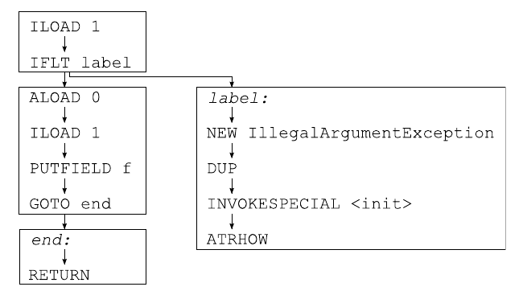

# 8. 方法分析

本章介绍用于分析方法代码的 ASM API，它基于 Tree API。本章首先介绍代码分析算法，然后介绍相应的 ASM API，并给出一些示例。

## 8.1 展示

代码分析是一个非常大的主题，可用于分析代码的算法非常多。在这里把它们全部介绍一遍既不可能，也超出了本文档的范围。事实上，本节的目的只是概述 ASM 中所使用的算法。关于这一主题更好的介绍可以在编译原理相关的书籍中找到。接下来的几节介绍两类重要的代码分析技术，即数据流分析和控制流分析：

- 数据流分析是指针对方法的每条指令，计算该方法执行帧的状态。这个状态可以用抽象程度不同的方式来表示。例如，引用值可以用单个值来表示，可以每个类用一个值来表示，也可以用在 { null, not null, may be null } 集合中的三个可能值来表示，等等。
- 控制流分析是指计算方法的控制流图，并在这个图上进行分析。控制流图是这样一种图：它的节点是指令，它的有向边连接两条指令 i → j，当且仅当 j 可以在 i 之后紧接着被执行。

### 8.1.1 数据流分析

可以执行两类数据流分析：

- 前向分析针对每条指令，根据该指令执行之前的状态，计算该指令执行之后执行帧的状态。
- 后向分析针对每条指令，根据该指令执行之后的状态，计算该指令执行之前执行帧的状态。

前向数据流分析是通过在方法的执行帧上模拟该方法每条字节码指令的执行来完成的，这通常包括：

- 从栈中弹出值，
- 把它们组合起来，
- 再把结果压入栈中。

这看起来像是解释器或 Java 虚拟机所做的事情，但实际上完全不同，因为其目标是模拟方法中所有可能的执行路径（对应所有可能的参数值），而不是由某些特定方法参数值所确定的那一条执行路径。一个后果是，对于分支指令，两个分支都会被模拟（而真正的解释器只根据实际的条件值沿一个分支执行）。

另一个后果是，被操作的值实际上是可能值的集合。这些集合可能非常大，例如「所有可能的值」「所有整数」「所有可能的对象」或「所有可能的 `String` 对象」，在这种情况下它们也可以被称为类型。它们也可以更精确，例如「所有正整数」「0 到 10 之间的所有整数」或「所有可能的非 null 对象」。模拟一条指令 i 的执行，就是针对其操作数值集合中所有值的组合，求出 i 的所有可能结果所构成的集合。例如，如果用三个集合表示整数：P =「正数或 null」，N =「负数或 null」，A =「所有整数」，那么模拟 `IADD` 指令就意味着：如果两个操作数都是 P 则返回 P，如果两个操作数都是 N 则返回 N，其余所有情况返回 A。

最后一个后果是需要计算值集合的并集：例如，与 `(b ? e1 : e2)` 对应的可能值集合，是 `e1` 的可能值与 `e2` 的可能值的并集。更一般地说，只要控制流图中存在两条或多条边具有共同的目标，就需要进行这一运算。在前面的例子中，整数用 P、N、A 三个集合表示，计算其中两个集合的并集很容易：除非这两个集合相等，否则结果总是 A。

### 8.1.2 控制流分析

控制流分析是一种基于方法控制流图的分析。作为一个例子，3.1.3 节中 `checkAndSetF` 方法的控制流图如下所示（图中把标签也像真实指令一样包含进来）：



这个图可以分解为四个基本块（在上图中用矩形表示）。基本块是这样一个指令序列：其中除最后一条指令外，每条指令都恰好有一个后继，并且其中除第一条指令外，任何指令都不能是跳转的目标。

## 8.2 接口与组件

用于代码分析的 ASM API 位于 `org.objectweb.asm.tree.analysis` 包中。正如包名所暗示的，它基于 Tree API。事实上，这个包提供了一个执行前向数据流分析的框架。为了能够用抽象程度不同的值集合执行各种数据流分析，数据流分析算法被拆分为两部分：一部分是固定的，由框架提供；另一部分是可变的，由用户提供。更确切地说：

- 整体的数据流分析算法，以及从栈中弹出适当数量的值并把它们压回栈中的任务，都在 `Analyzer` 和 `Frame` 类中一次性实现。
- 组合值以及计算值集合并集的任务，由用户定义的 `Interpreter` 和 `Value` 抽象类的子类完成。框架提供了几个预定义的子类，将在后续几节中介绍。

尽管该框架的主要目标是执行数据流分析，`Analyzer` 类也可以构造被分析方法的控制流图。这可以通过覆写该类中默认什么都不做的 `newControlFlowEdge` 和 `newControlFlowExceptionEdge` 方法来完成。其结果可用于进行控制流分析。

### 8.2.1 基本数据流分析

`BasicInterpreter` 类是 `Interpreter` 抽象类的预定义子类之一。它使用 `BasicValue` 类中定义的七个值集合来模拟字节码指令的效果：

- `UNINITIALIZED_VALUE` 表示「所有可能的值」。
- `INT_VALUE` 表示「所有 `int`、`short`、`byte`、`boolean` 或 `char` 值」。
- `FLOAT_VALUE` 表示「所有 `float` 值」。
- `LONG_VALUE` 表示「所有 `long` 值」。
- `DOUBLE_VALUE` 表示「所有 `double` 值」。
- `REFERENCE_VALUE` 表示「所有对象和数组值」。
- `RETURNADDRESS_VALUE` 用于子例程（参见附录 A.2）。

这个解释器本身不太有用（方法帧已经提供了这样的信息，而且更详细——参见 3.1.5 节），但它可以作为「空」的 `Interpreter` 实现来构造 `Analyzer`。这样的分析器随后可以用来检测方法中的不可达代码。实际上，即使在跳转指令中同时沿两个分支走，也不可能到达那些无法从第一条指令到达的代码。其结果是：在一次分析之后，无论 `Interpreter` 的实现是什么，对于无法到达的指令，所计算出的帧——由 `Analyzer.getFrames` 方法返回——都是 `null`。利用这一性质可以很容易地实现一个 `RemoveDeadCodeAdapter` 类（还有更高效的做法，但需要写更多代码）：

```java
public class RemoveDeadCodeAdapter extends MethodVisitor {
    String owner;
    MethodVisitor next;
    public RemoveDeadCodeAdapter(String owner, int access, String name,
            String desc, MethodVisitor mv) {
        super(ASM4, new MethodNode(access, name, desc, null, null));
        this.owner = owner;
        next = mv;
    }
    @Override public void visitEnd() {
        MethodNode mn = (MethodNode) mv;
        Analyzer<BasicValue> a =
                new Analyzer<BasicValue>(new BasicInterpreter());
        try {
            a.analyze(owner, mn);
            Frame<BasicValue>[] frames = a.getFrames();
            AbstractInsnNode[] insns = mn.instructions.toArray();
            for (int i = 0; i < frames.length; ++i) {
                if (frames[i] == null && !(insns[i] instanceof LabelNode)) {
                    mn.instructions.remove(insns[i]);
                }
            }
        } catch (AnalyzerException ignored) {
        }
        mn.accept(next);
    }
}
```

当与 7.1.5 节中的 `OptimizeJumpAdapter` 结合使用时，由跳转优化器引入的死代码就会被删除。例如，在 `checkAndSetF` 方法上使用这条适配器链会得到：

```text
// 经过 OptimizeJump 之后         // 经过 RemoveDeadCode 之后
  ILOAD 1                         ILOAD 1
  IFLT label                      IFLT label
  ALOAD 0                         ALOAD 0
  ILOAD 1                         ILOAD 1
  PUTFIELD ...                    PUTFIELD ...
  RETURN                          RETURN
label:                            label:
F_SAME                            F_SAME
  NEW ...                         NEW ...
  DUP                             DUP
  INVOKESPECIAL ...               INVOKESPECIAL ...
  ATHROW                          ATHROW
end:                              end:
F_SAME
  RETURN
```

注意，死标签不会被删除。这是有意为之的：它确实不会改变生成的代码，却可以避免删除一个虽然不可达、但可能被 `LocalVariableNode` 之类引用的标签。

### 8.2.2 基本数据流校验器

`BasicVerifier` 类扩展了 `BasicInterpreter` 类。它使用同样的七个集合，但与 `BasicInterpreter` 不同，它会检查指令是否被正确使用。例如，它会检查 `IADD` 指令的操作数是否为 `INTEGER_VALUE` 值（而 `BasicInterpreter` 只是返回结果，即 `INTEGER_VALUE`）。这个类可以在开发类生成器或适配器期间用于调试目的，如 3.3 节所述。例如，这个类可以检测出 `ISTORE 1 ALOAD 1` 序列是无效的。它可以像下面这样被纳入一个工具方法适配器中（在实践中，使用 `CheckMethodAdapter` 类更简单，它可以被配置为使用 `BasicVerifier`）：

```java
public class BasicVerifierAdapter extends MethodVisitor {
    String owner;
    MethodVisitor next;
    public BasicVerifierAdapter(String owner, int access, String name,
            String desc, MethodVisitor mv) {
        super(ASM4, new MethodNode(access, name, desc, null, null));
        this.owner = owner;
        next = mv;
    }
    @Override public void visitEnd() {
        MethodNode mn = (MethodNode) mv;
        Analyzer<BasicValue> a =
                new Analyzer<BasicValue(new BasicVerifier());
        try {
            a.analyze(owner, mn);
        } catch (AnalyzerException e) {
            throw new RuntimeException(e.getMessage());
        }
        mn.accept(next);
    }
}
```

### 8.2.3 简单数据流校验器

`SimpleVerifier` 类扩展了 `BasicVerifier` 类。它使用更多的集合来模拟字节码指令的执行：实际上，每个类都由它自己的集合表示，该集合代表这个类的所有可能对象。因此它可以检测出更多错误，例如在可能值为「所有 `Thread` 类型的对象」的对象上调用 `String` 类中定义的方法。这个类使用 Java 反射 API 来执行与类层次结构相关的校验和计算。因此它会把方法所引用的类加载到 JVM 中。这一默认行为可以通过覆写这个类的 `protected` 方法来改变。

与 `BasicVerifier` 一样，这个类可以在开发类生成器或适配器期间使用，以便更容易地发现缺陷。但它也可以用于其他目的。一个例子是删除方法中不必要的强制类型转换的变换：如果这个分析器发现某条 `CHECKCAST` 指令的操作数是「所有 `from` 类型的对象」这一值集合，并且 `to` 是 `from` 的超类，那么这条 `CHECKCAST` 指令就是不必要的，可以被删除。该变换的实现如下：

```java
public class RemoveUnusedCastTransformer extends MethodTransformer {
    String owner;
    public RemoveUnusedCastTransformer(String owner,
            MethodTransformer mt) {
        super(mt);
        this.owner = owner;
    }
    @Override public MethodNode transform(MethodNode mn) {
        Analyzer<BasicValue> a =
                new Analyzer<BasicValue>(new SimpleVerifier());
        try {
            a.analyze(owner, mn);
            Frame<BasicValue>[] frames = a.getFrames();
            AbstractInsnNode[] insns = mn.instructions.toArray();
            for (int i = 0; i < insns.length; ++i) {
                AbstractInsnNode insn = insns[i];
                if (insn.getOpcode() == CHECKCAST) {
                    Frame f = frames[i];
                    if (f != null && f.getStackSize() > 0) {
                        Object operand = f.getStack(f.getStackSize() - 1);
                        Class<?> to = getClass(((TypeInsnNode) insn).desc);
                        Class<?> from = getClass(((BasicValue) operand).getType());
                        if (to.isAssignableFrom(from)) {
                            mn.instructions.remove(insn);
                        }
                    }
                }
            }
        } catch (AnalyzerException ignored) {
        }
        return mt == null ? mn : mt.transform(mn);
    }
    private static Class<?> getClass(String desc) {
        try {
            return Class.forName(desc.replace('/', '.'));
        } catch (ClassNotFoundException e) {
            throw new RuntimeException(e.toString());
        }
    }
    private static Class<?> getClass(Type t) {
        if (t.getSort() == Type.OBJECT) {
            return getClass(t.getInternalName());
        }
        return getClass(t.getDescriptor());
    }
}
```

然而，对于 Java 6 的类（或者使用 `COMPUTE_FRAMES` 升级到 Java 6 的类），用 Core API 借助 `AnalyzerAdapter` 来做同样的事情会更简单，效率也高得多：

```java
public class RemoveUnusedCastAdapter extends MethodVisitor {
    public AnalyzerAdapter aa;
    public RemoveUnusedCastAdapter(MethodVisitor mv) {
        super(ASM4, mv);
    }
    @Override public void visitTypeInsn(int opcode, String desc) {
        if (opcode == CHECKCAST) {
            Class<?> to = getClass(desc);
            if (aa.stack != null && aa.stack.size() > 0) {
                Object operand = aa.stack.get(aa.stack.size() - 1);
                if (operand instanceof String) {
                    Class<?> from = getClass((String) operand);
                    if (to.isAssignableFrom(from)) {
                        return;
                    }
                }
            }
        }
        mv.visitTypeInsn(opcode, desc);
    }
    private static Class getClass(String desc) {
        try {
            return Class.forName(desc.replace('/', '.'));
        } catch (ClassNotFoundException e) {
            throw new RuntimeException(e.toString());
        }
    }
}
```

### 8.2.4 用户自定义数据流分析

假设我们想要检测对可能为 null 的对象进行的字段访问和方法调用，例如下面这段源代码片段（其中第一行会让某些编译器无法检测出这个 bug，否则它会被检测为「o may not have been initialized」错误）：

```java
Object o = null;
while (...) {
    o = ...;
}
o.m(...); // 可能抛出 NullPointerException！
```

那么我们就需要一种数据流分析，它能够告诉我们：在与最后一行相对应的 `INVOKEVIRTUAL` 指令处，与 `o` 相对应的栈底值可能为 null。为此，我们需要为引用值区分三个集合：包含 null 值的 `NULL` 集合、包含所有非 null 引用值的 `NONNULL` 集合，以及包含所有引用值的 `MAYBENULL` 集合。接下来我们只需考虑：`ACONST_NULL` 把 `NULL` 集合压入操作数栈，而其他所有把引用值压入栈的指令压入的都是 `NONNULL` 集合（换句话说，我们认为任何字段访问或方法调用的结果都不是 null——如果不对程序中所有类做全局分析，我们无法做得更好）。`MAYBENULL` 集合用于表示 `NULL` 集合与 `NONNULL` 集合的并集。

上述规则必须在一个自定义的 `Interpreter` 子类中实现。我们当然可以从头实现它，但也可以（而且容易得多）通过扩展 `BasicInterpreter` 类来实现。事实上，如果我们认为 `BasicValue.REFERENCE_VALUE` 对应于 `NONNULL` 集合，那么我们只需覆写模拟 `ACONST_NULL` 执行的方法，使其返回 `NULL`，以及计算集合并集的方法：

```java
class IsNullInterpreter extends BasicInterpreter {
    public final static BasicValue NULL = new BasicValue(null);
    public final static BasicValue MAYBENULL = new BasicValue(null);
    public IsNullInterpreter() {
        super(ASM4);
    }
    @Override public BasicValue newOperation(AbstractInsnNode insn) {
        if (insn.getOpcode() == ACONST_NULL) {
            return NULL;
        }
        return super.newOperation(insn);
    }
    @Override public BasicValue merge(BasicValue v, BasicValue w) {
        if (isRef(v) && isRef(w) && v != w) {
            return MAYBENULL;
        }
        return super.merge(v, w);
    }
    private boolean isRef(Value v) {
        return v == REFERENCE_VALUE || v == NULL || v == MAYBENULL;
    }
}
```

有了它，使用这个 `IsNullInterpreter` 来检测可能导致潜在空指针异常的指令就很容易了：

```java
public class NullDereferenceAnalyzer {
    public List<AbstractInsnNode> findNullDereferences(String owner,
        MethodNode mn) throws AnalyzerException {
        List<AbstractInsnNode> result = new ArrayList<AbstractInsnNode>();
        Analyzer<BasicValue> a =
            new Analyzer<BasicValue>(new IsNullInterpreter());
        a.analyze(owner, mn);
        Frame<BasicValue>[] frames = a.getFrames();
        AbstractInsnNode[] insns = mn.instructions.toArray();
        for (int i = 0; i < insns.length; ++i) {
            AbstractInsnNode insn = insns[i];
            if (frames[i] != null) {
                Value v = getTarget(insn, frames[i]);
                if (v == NULL || v == MAYBENULL) {
                    result.add(insn);
                }
            }
        }
        return result;
    }
    private static BasicValue getTarget(AbstractInsnNode insn,
        Frame<BasicValue> f) {
        switch (insn.getOpcode()) {
        case GETFIELD:
        case ARRAYLENGTH:
        case MONITORENTER:
        case MONITOREXIT:
            return getStackValue(f, 0);
        case PUTFIELD:
            return getStackValue(f, 1);
        case INVOKEVIRTUAL:
        case INVOKESPECIAL:
        case INVOKEINTERFACE:
            String desc = ((MethodInsnNode) insn).desc;
            return getStackValue(f, Type.getArgumentTypes(desc).length);
        }
        return null;
    }
    private static BasicValue getStackValue(Frame<BasicValue> f,
        int index) {
        int top = f.getStackSize() - 1;
        return index <= top ? f.getStack(top - index) : null;
    }
}
```

`findNullDereferences` 方法用 `IsNullInterpreter` 分析给定的方法节点。然后它对每条指令进行测试，检查其引用操作数（如果有的话）的可能取值集合是 `NULL` 集合还是 `NONNULL` 集合。如果是这种情况，那么该指令可能导致空指针异常，因此它被加入由该方法返回的这类指令的列表中。

`getTarget` 方法返回帧 `f` 中与 `insn` 的对象操作数相对应的 `Value`，如果 `insn` 没有对象操作数则返回 null。它的主要作用是计算该值相对于操作数栈顶的偏移量，而这取决于指令的类型。

### 8.2.5 控制流分析

控制流分析可以有许多应用。一个简单的例子是计算方法的圈复杂度。该度量的定义是：控制流图中边的数目减去节点的数目，再加二。例如，`checkAndSetF` 方法的控制流图见 8.1.2 节，其圈复杂度为 11 − 12 + 2 = 1。这个度量可以很好地反映一个方法的「复杂度」（该数值与方法中 bug 的平均数量之间存在相关性）。它还给出了「正确地」测试一个方法所必需的推荐测试用例数量。

计算该度量的算法可以用 ASM 的分析框架来实现（也存在更高效的做法，只基于 Core API，但它们需要编写更多代码）。第一步是构造控制流图。正如本章开头所说，这可以通过覆写 `Analyzer` 类的 `newControlFlowEdge` 方法来完成。该类用 `Frame` 对象来表示节点。如果我们想把图存储在这些对象中，就需要扩展 `Frame` 类：

```java
class Node<V extends Value> extends Frame<V> {
    Set< Node<V> > successors = new HashSet< Node<V> >();
    public Node(int nLocals, int nStack) {
        super(nLocals, nStack);
    }
    public Node(Frame<? extends V> src) {
        super(src);
    }
}
```

然后我们可以提供一个构造我们的控制流图的 `Analyzer` 子类，并用它的结果来计算边的数目、节点的数目，最后得到圈复杂度：

```java
public class CyclomaticComplexity {
    public int getCyclomaticComplexity(String owner, MethodNode mn)
         throws AnalyzerException {
        Analyzer<BasicValue> a =
            new Analyzer<BasicValue>(new BasicInterpreter()) {
            protected Frame<BasicValue> newFrame(int nLocals, int nStack) {
                return new Node<BasicValue>(nLocals, nStack);
            }
            protected Frame<BasicValue> newFrame(
                Frame<? extends BasicValue> src) {
                return new Node<BasicValue>(src);
            }
            protected void newControlFlowEdge(int src, int dst) {
                Node<BasicValue> s = (Node<BasicValue>) getFrames()[src];
                s.successors.add((Node<BasicValue>) getFrames()[dst]);
            }
        };
        a.analyze(owner, mn);
        Frame<BasicValue>[] frames = a.getFrames();
        int edges = 0;
        int nodes = 0;
        for (int i = 0; i < frames.length; ++i) {
            if (frames[i] != null) {
                edges += ((Node<BasicValue>) frames[i]).successors.size();
                nodes += 1;
            }
        }
        return edges - nodes + 2;
    }
}
```
