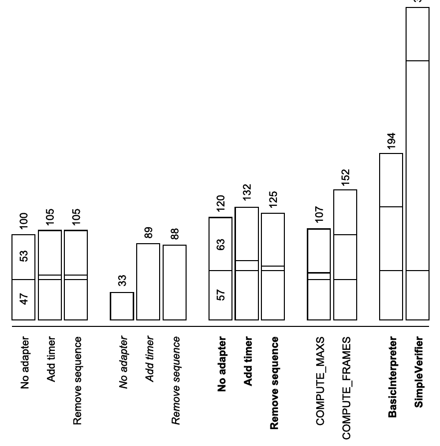

# 附录 A

## A.1 字节码指令

本节简要介绍字节码指令。完整说明请参见《Java 虚拟机规范》。

约定：`a` 和 `b` 表示 int、float、long 或 double 值（例如，对 `IADD` 而言表示 int，但对 `LADD` 而言表示 long），`o` 和 `p` 表示对象引用，`v` 表示任意值（或者，对栈指令而言，表示大小为 1 的值），`w` 表示 long 或 double，`i`、`j` 和 `n` 表示 int 值。

### 局部变量

```text
Instruction                             Stack before     Stack after
ILOAD, LLOAD, FLOAD, DLOAD var          ...              ... , a
ALOAD var                               ...              ... , o
ISTORE, LSTORE, FSTORE, DSTORE var      ... , a          ...
ASTORE var                              ... , o          ...
IINC var incr                           ...              ...
```

### 栈

```text
POP        ... , v                  ...
POP2       ... , v1 , v2            ...
           ... , w                  ...
DUP        ... , v                  ... , v , v
DUP2       ... , v1 , v2            ... , v1 , v2 , v1 , v2
           ... , w                  ... , w , w
SWAP       ... , v1 , v2            ... , v2 , v1
DUP_X1     ... , v1 , v2            ... , v2 , v1 , v2
DUP_X2     ... , v1 , v2 , v3       ... , v3 , v1 , v2 , v3
           ... , w , v              ... , v , w , v
DUP2_X1    ... , v1 , v2 , v3       ... , v2 , v3 , v1 , v2 , v3
           ... , v , w              ... , w , v , w
DUP2_X2    ... , v1 , v2 , v3 , v4  ... , v3 , v4 , v1 , v2 , v3 , v4
           ... , w , v1 , v2        ... , v1 , v2 , w , v1 , v2
           ... , v1 , v2 , w        ... , w , v1 , v2 , w
           ... , w1 , w2            ... , w2 , w1 , w2
```

### 常量

```text
ICONST_n (−1 ≤ n ≤ 5)                                  ...   ... , n
LCONST_n (0 ≤ n ≤ 1)                                   ...   ... , nL
FCONST_n (0 ≤ n ≤ 2)                                   ...   ... , nF
DCONST_n (0 ≤ n ≤ 1)                                   ...   ... , nD
BIPUSH b, −128 ≤ b < 127                               ...   ... , b
SIPUSH s, −32768 ≤ s < 32767                           ...   ... , s
LDC cst (int, float, long, double, String or Type)     ...   ... , cst
ACONST_NULL                                            ...   ... , null
```

### 算术与逻辑

```text
IADD, LADD, FADD, DADD     ... , a , b    ... , a + b
ISUB, LSUB, FSUB, DSUB     ... , a , b    ... , a - b
IMUL, LMUL, FMUL, DMUL     ... , a , b    ... , a * b
IDIV, LDIV, FDIV, DDIV     ... , a , b    ... , a / b
IREM, LREM, FREM, DREM     ... , a , b    ... , a % b
INEG, LNEG, FNEG, DNEG     ... , a        ... , -a
ISHL, LSHL                 ... , a , n    ... , a << n
ISHR, LSHR                 ... , a , n    ... , a >> n
IUSHR, LUSHR               ... , a , n    ... , a >>> n
IAND, LAND                 ... , a , b    ... , a & b
IOR, LOR                   ... , a , b    ... , a | b
IXOR, LXOR                 ... , a , b    ... , a ^ b
LCMP                       ... , a , b    ... , a == b ? 0 : (a < b ? -1 : 1)
FCMPL, FCMPG               ... , a , b    ... , a == b ? 0 : (a < b ? -1 : 1)
DCMPL, DCMPG               ... , a , b    ... , a == b ? 0 : (a < b ? -1 : 1)
```

### 类型转换

```text
I2B                  ... , i     ... , (byte) i
I2C                  ... , i     ... , (char) i
I2S                  ... , i     ... , (short) i
L2I, F2I, D2I        ... , a     ... , (int) a
I2L, F2L, D2L        ... , a     ... , (long) a
I2F, L2F, D2F        ... , a     ... , (float) a
I2D, L2D, F2D        ... , a     ... , (double) a
CHECKCAST class      ... , o     ... , (class) o
```

### 对象、字段和方法

```text
NEW class                   ...                            ... , new class
GETFIELD c f t              ... , o                        ... , o.f
PUTFIELD c f t              ... , o , v                    ...
GETSTATIC c f t             ...                            ... , c.f
PUTSTATIC c f t             ... , v                        ...
INVOKEVIRTUAL c m t         ... , o , v1 , ... , vn        ... , o.m(v1 , ... vn )
INVOKESPECIAL c m t         ... , o , v1 , ... , vn        ... , o.m(v1 , ... vn )
INVOKESTATIC c m t          ... , v1 , ... , vn            ... , c.m(v1 , ... vn )
INVOKEINTERFACE c m t       ... , o , v1 , ... , vn        ... , o.m(v1 , ... vn )
INVOKEDYNAMIC m t bsm       ... , o , v1 , ... , vn        ... , o.m(v1 , ... vn )
INSTANCEOF class            ... , o                        ... , o instanceof class
MONITORENTER                ... , o                        ...
MONITOREXIT                 ... , o                        ...
```

### 数组

```text
NEWARRAY type (for any primitive type)         ... , n               ... , new type[n]
ANEWARRAY class                                ... , n               ... , new class[n]
MULTIANEWARRAY [...[t n                        ... , i1 , ... , in   ... , new t[i1 ]...[in ]...

BALOAD, CALOAD, SALOAD                         ... , o , i           ... , o[i]
IALOAD, LALOAD, FALOAD, DALOAD                 ... , o , i           ... , o[i]
AALOAD                                         ... , o , i           ... , o[i]
BASTORE, CASTORE, SASTORE                      ... , o , i , j       ...
IASTORE, LASTORE, FASTORE, DASTORE             ... , o , i , a       ...
AASTORE                                        ... , o , i , p       ...
ARRAYLENGTH                                    ... , o               ... , o.length
```

### 跳转

```text
IFEQ           ... , i       ...          若 i == 0 则跳转
IFNE           ... , i       ...          若 i != 0 则跳转
IFLT           ... , i       ...          若 i < 0 则跳转
IFGE           ... , i       ...          若 i >= 0 则跳转
IFGT           ... , i       ...          若 i > 0 则跳转
IFLE           ... , i       ...          若 i <= 0 则跳转
IF_ICMPEQ      ... , i , j   ...          若 i == j 则跳转
IF_ICMPNE      ... , i , j   ...          若 i != j 则跳转
IF_ICMPLT      ... , i , j   ...          若 i < j 则跳转
IF_ICMPGE      ... , i , j   ...          若 i >= j 则跳转
IF_ICMPGT      ... , i , j   ...          若 i > j 则跳转
IF_ICMPLE      ... , i , j   ...          若 i <= j 则跳转
IF_ACMPEQ      ... , o , p   ...          若 o == p 则跳转
IF_ACMPNE      ... , o , p   ...          若 o != p 则跳转
IFNULL         ... , o       ...          若 o == null 则跳转
IFNONNULL      ... , o       ...          若 o != null 则跳转
GOTO           ...           ...          总是跳转
TABLESWITCH    ... , i       ...          总是跳转
LOOKUPSWITCH   ... , i       ...          总是跳转
```

### 返回

```text
IRETURN, LRETURN, FRETURN, DRETURN             ... , a
ARETURN                                        ... , o
RETURN                                         ...
ATHROW                                         ... , o
```

## A.2 子例程

除了上一节介绍的字节码指令之外，版本低于或等于 `V1_5` 的类还可以包含用于子例程的 `JSR` 和 `RET` 指令（`JSR` 表示 Jump to SubRoutine，即跳转到子例程，`RET` 表示 RETurn from subroutine，即从子例程返回）。版本高于或等于 `V1_6` 的类不得包含这些指令（为了简化 Java 6 引入的新校验器架构，这些指令已被移除；这样做是可行的，因为它们并非严格必需）。

`JSR` 指令以一个标签作为参数，并无条件跳转到该标签。但在跳转之前，它会在操作数栈上压入一个返回地址，即紧跟在 `JSR` 之后的那条指令的索引。这个返回地址只能由诸如 `POP`、`DUP` 或 `SWAP` 之类的栈指令、`ASTORE` 指令以及 `RET` 指令来操作。

`RET` 指令以一个局部变量索引作为参数。它加载该槽位中存放的返回地址，并无条件跳转到相应的指令。由于返回地址可能有多个不同的取值，一条 `RET` 指令可能返回到若干条不同的指令。

下面用一个例子来说明。考虑以下代码：

```text
JSR sub
JSR sub
RETURN
sub:
ASTORE 1
IINC 0 1
RET 1
```

第一条指令把第二条指令的索引作为返回地址压栈，并跳转到 `ASTORE` 指令。该指令把返回地址存入局部变量 1。随后局部变量 0 自增 1。最后，`RET` 指令加载局部变量 1 中存放的返回地址，并跳转到相应的指令，也就是第二条指令。这第二条指令又是一条 `JSR` 指令：它把第三条指令的索引作为返回地址压栈，并跳转到 `ASTORE` 指令。当再次执行到 `RET` 指令时，返回地址对应的是 `RETURN` 指令，于是执行流跳转到这条 `RETURN` 并停止。

`sub` 标签之后的指令所定义的就是所谓的子例程。它就像一个小型「方法」，可以在一个普通方法内部从不同的位置被「调用」。在 Java 6 之前，子例程被用来编译 Java 中的 finally 块。但事实上子例程并非严格必需：确实可以把每条 `JSR` 指令替换为相应子例程的体。这种内联会产生重复的代码，但消除了 `JSR` 和 `RET` 指令。对于上面的例子，结果非常简单：

```text
IINC 0 1
IINC 0 1
RETURN
```

ASM 在 `org.objectweb.asm.commons` 包中提供了 `JSRInlinerAdapter` 类，可以自动完成这种转换。你可以用它移除 `JSR` 和 `RET` 指令以简化代码分析，或者把版本为 1.5 或更低的类转换为 1.6 或更高版本。

## A.3 属性

如 2.1.1 节所述，可以为类、字段和方法关联任意属性。在引入新特性时，这种可扩展机制对于扩展类文件格式非常有用。例如，它已被用来扩展该格式，以支持注解、泛型、栈映射帧等。与 Sun 相对，用户也可以使用这种机制，但自从 Java 5 引入注解以来，使用注解比使用属性要容易得多。话虽如此，如果你确实需要使用自己的属性，或者必须管理由他人定义的非标准属性，那么在 ASM 中可以用 `Attribute` 类来实现。

默认情况下，`ClassReader` 类会为它发现的每个非标准属性创建一个 `Attribute` 实例，并以该实例为参数调用 `visitAttribute` 方法（根据上下文，是 `ClassVisitor`、`FieldVisitor` 还是 `MethodVisitor` 类的方法）。该实例以私有字节数组的形式保存属性的原始内容。`ClassWriter` 类在访问这类未知属性时，只是把这个原始字节数组复制到它所构造的类中。只有在使用了 2.2.4 节所述的优化时，这种默认行为才是安全的（这给出了使用该优化的另一个理由，除了性能提升之外）。如果不使用该选项，原始内容可能会与类写入器新创建的常量池不一致，从而导致类文件被破坏。

因此，默认情况下非标准属性会被原样复制到变换后的类中，其内容对 ASM 和用户来说都是完全不透明的。如果你需要访问这些内容，必须先定义一个 `Attribute` 子类，使其能够解码原始内容并重新编码。你还必须在 `ClassReader.accept` 方法中传入该类的一个原型实例，这样该类才能解码这种类型的属性。下面用一个例子来说明。以下类可用于支持一个假想的「Comment」属性，其原始内容是一个 short 值，它引用了存储在常量池中的一个 UTF8 字符串：

```java
class CommentAttribute extends Attribute {
    private String comment;
    public CommentAttribute(final String comment) {
        super("Comment");
        this.comment = comment;
    }
    public String getComment() {
        return comment;
    }
    @Override
    public boolean isUnknown() {
        return false;
    }
    @Override
    protected Attribute read(ClassReader cr, int off, int len,
            char[] buf, int codeOff, Label[] labels) {
        return new CommentAttribute(cr.readUTF8(off, buf));
    }
    @Override
    protected ByteVector write(ClassWriter cw, byte[] code, int len,
            int maxStack, int maxLocals) {
        return new ByteVector().putShort(cw.newUTF8(comment));
    }
}
```

最重要的方法是 `read` 和 `write` 方法。`read` 方法解码这种类型属性的原始内容，而 `write` 方法执行相反的操作。注意，`read` 方法必须返回一个新的属性实例。为了在读取类时解码这种类型的属性，你必须使用：

```java
ClassReader cr = ...;
ClassVisitor cv = ...;
cr.accept(cv, new Attribute[] { new CommentAttribute("") }, 0);
```

这样，「Comment」属性就会被识别出来，并为每一个这样的属性创建一个 `CommentAttribute` 实例（而未知属性仍继续用 `Attribute` 实例表示）。

## A.4 指南

这里我们回顾一下必须遵循的指南，以确保你的代码与更早的 ASM 版本保持向后兼容（参见第 5 章和第 10 章）。

- **指南 1**：要为 ASM 版本 X 编写 `ClassVisitor` 子类，请以该确切版本为参数调用 `ClassVisitor` 构造器，并且绝不覆写或调用在该版本 `ClassVisitor` 类中已废弃的方法（或在更高版本中才引入的方法）。
- **指南 2**：不要使用访问者的继承，而应使用委托（即访问者链）。一个好的做法是默认把你的访问者类声明为 `final`，以确保这一点。
- **指南 3**：要用 ASM 版本 X 的 Tree API（树 API）编写类分析器或适配器，请使用以该确切版本为参数的构造器创建 `ClassNode`（而不是不带参数的默认构造器）。
- **指南 4**：要用 ASM 版本 X 的 Tree API（树 API）编写类分析器或适配器，并在使用由他人创建的 `ClassNode` 时，在以任何方式使用该 `ClassNode` 之前，先以该确切版本为参数调用其 `check()` 方法。

指南 1 和指南 2 也适用于 `ClassNode`、`MethodNode` 等的子类，适用于 `asm.tree.analysis` 中 `Interpreter` 及其子类的子类，适用于 `asm.util` 中 `ASMifier`、`Texifier` 或 `CheckXxx` Adapter 类的子类，以及 `asm.commons` 包中任何类的子类。最后，指南 2 有两个例外：

- 如果你自己完全控制继承链，并且同时发布该层次结构中的所有类，那么可以使用访问者的继承。此时必须确保该层次结构中的所有类都是针对同一个 ASM 版本编写的。不过，仍要把层次结构中的叶子类声明为 `final`。
- 如果除叶子类之外没有类覆写任何 visit 方法（例如，如果你在 `ClassVisitor` 与具体访问者类之间使用中间类只是为了引入便捷方法），那么可以使用「访问者」的继承。不过，仍要把层次结构中的叶子类声明为 `final`（除非它们也没有覆写任何 visit 方法；在这种情况下，请提供一个以 ASM 版本为参数的构造器，以便子类可以指明它们是针对哪个版本编写的）。

## A.5 性能

下图给出了 Core API（核心 API）与 Tree API（树 API）、`ClassWriter` 选项以及分析框架的相对性能（越短越快）：



参考时间 100 对应于将 `ClassReader` 直接串联到 `ClassWriter` 的情况。「add timer」和「remove sequence」测试分别对应于 `AddTimerAdapter` 和 `RemoveGetFieldPutFieldAdapter`（斜体表示使用了 2.2.4 节所述的优化，粗体表示使用了 Tree API（树 API））。总的变换时间被分解为三部分：类解析（底部）、类变换或分析（中部）以及类写出（顶部）。对每个测试而言，测量值是解析、变换和写出一个字节数组所需的时间，也就是说，从磁盘加载类并把它们加载到 Java 虚拟机（JVM）中所需的时间不计入在内。这些结果是在 JDK 7 的 `rt.jar` 中的 18600 多个类上、把每个测试运行十次，并取最好一次运行的性能而得到的。

对这些结果做一个简单的分析可以看出：

- 90% 的变换时间用于类解析和类写出。
- 「复制常量池」优化可带来 15-20% 的加速。
- 基于 Tree API（树 API）的变换比基于访问者的变换慢约 25%。
- `COMPUTE_MAXS` 选项的开销不算太大。
- `COMPUTE_FRAMES` 选项的开销很大 ⇒ 请采用增量式帧更新。
- 分析包的开销相当高！
